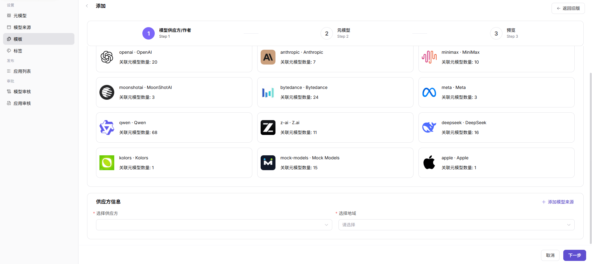
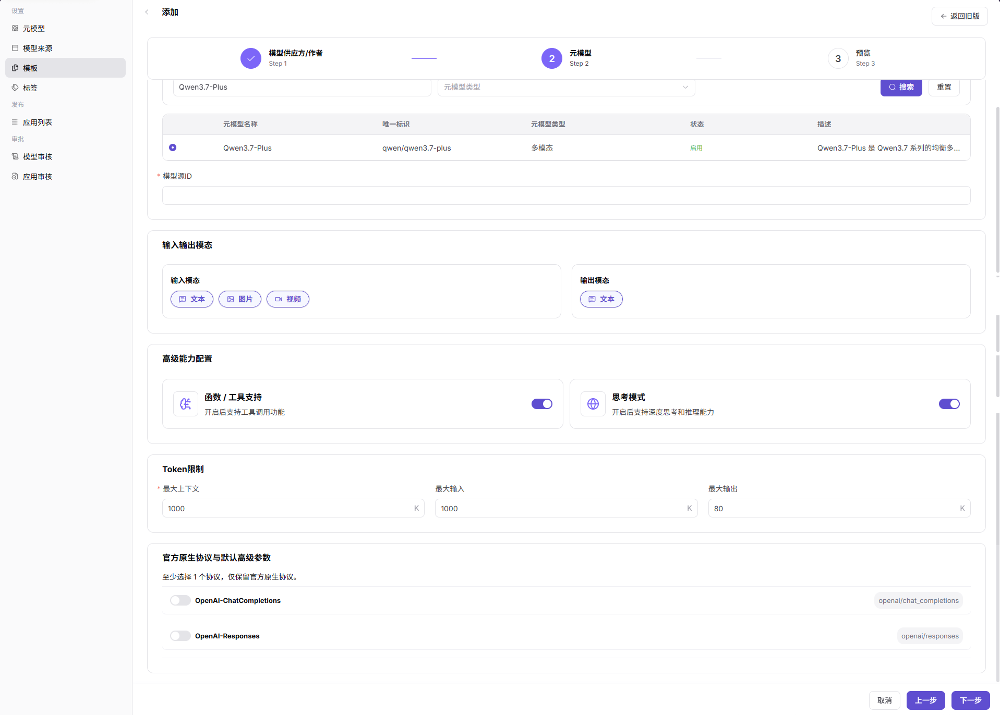
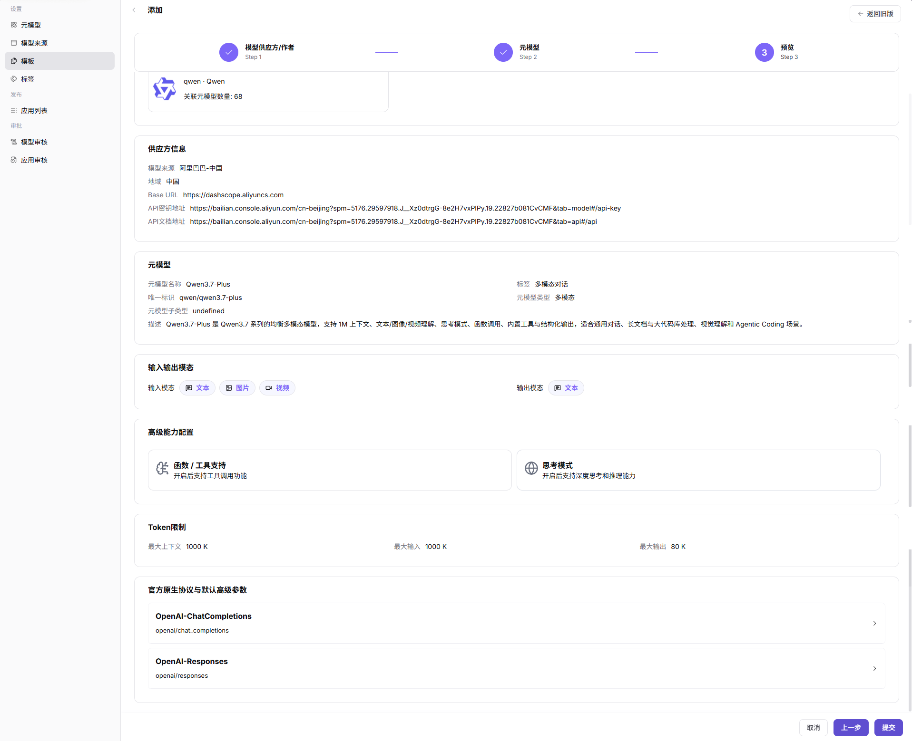

# 模板

::: info 文档信息
版本：v1.0
更新日期：2026-07-08
:::

## 功能概述

`模板` 用于把来源、协议、默认参数和发布表单组合成可复用配置，减少模型发布时的重复填写和口径偏差。

| 项目 | 内容 |
| --- | --- |
| 适用角色 | 运营方 |
| 导航路径 | 模型及AI服务 > 设置 > 模板 |
| 页面路由 | `/modelone/settings/provider-template` |
| 管理对象 | 厂商模板、来源预览、协议、默认参数和发布表单 |
| 典型途径 | 为模型发布提供可复用模板 |

#### 新手理解

模型模板像模型发布表单的预设。模板配置好后，模型提供方可以少填重复字段，但模板中的 Endpoint、请求头和默认参数必须安全可控。

#### 术语速查

| 术语 | 说明 |
| --- | --- |
| 模板 | 可复用的模型发布配置集合。 |
| 厂商配置预览 | 展示 Base URL、文档地址和请求头示例。 |
| 默认高级参数 | 发布模型时预置的温度、最大 Token 等参数。 |
| 协议映射 | 模板与模型调用协议的对应关系。 |

## 前提条件

1. 当前账号具备`模板` 维护权限。
2. 可选供应方、作者、元模型和模型来源已维护。
3. 默认参数、请求头预览和发布表单字段已确认。
4. 模板启用前已用样例模型验证发布流程。

## 页面说明

页面用于维护模型发布模板。模板把供应方、元模型、默认参数、协议和来源预览组合起来，帮助模型提供方减少重复填写。

页面截图：

用于查看模板状态、供应方和关联配置。

## 主要操作

### 添加模板

1. 进入 `模型及AI服务 > 设置 > 模板`。
2. 点击 `添加`，进入 `添加` 页面。
3. 在 `模型供应方/作者` 步骤选择模型作者卡片。
4. 在 `供应方信息` 中选择 `供应方` 和 `地域`；如需维护新的来源配置，可点击 `添加模型来源`。
5. 点击 `下一步` 前确认供应方和地域信息无误。

6. 在 `元模型` 步骤筛选并选择目标元模型，填写 `模型源ID`。
7. 核对 `输入输出模态`、`高级能力配置`、`Token限制` 和 `官方原生协议与默认高级参数`。
8. 点击 `下一步` 前确认元模型和协议参数无误。

9. 在 `预览` 步骤核对 `供应方信息`、`元模型`、`输入输出模态`、`高级能力配置`、`Token限制` 和协议参数。
10. 点击最终 `提交` 前确认配置无误；如仅学习或验证页面，请点击 `取消` 或返回关闭。

## 参数说明

| 字段名称 | 是否必填 | 字段类型 | 示例 | 说明 |
| --- | --- | --- | --- | --- |
| 模型作者 | 必填 | 卡片选择 | `Qwen` | 模板关联的模型作者。 |
| 供应方 | 必填 | 下拉选择 | `Alibaba` | 模板对应的模型来源或供应方。 |
| 地域 | 必填 | 下拉选择 | `China` | 模型来源所在地域。 |
| 元模型名称 | 必填 | 筛选 / 单选 | `Qwen3.7-Plus` | 模板默认关联的元模型。 |
| 模型源ID | 必填 | 文本 | `qwen/qwen3.7-plus` | 上游模型源中的模型标识。 |
| 输入模态 / 输出模态 | 系统带出 | 标签 | `文本` / `图片` / `视频` | 根据所选元模型展示支持的输入输出模态。 |
| 函数 / 工具支持 | 系统带出 | 开关 / 只读信息 | `开启` | 所选元模型的工具调用能力。 |
| 思考模式 | 系统带出 | 开关 / 只读信息 | `开启` | 所选元模型的深度思考或推理能力。 |
| Token限制 | 系统带出 | 数字 | `1000 K` | 所选元模型的上下文、输入和输出 Token 限制。 |
| 官方原生协议与默认高级参数 | 系统带出 | 协议配置 | `OpenAI-ChatCompletions` | 所选元模型支持的协议和默认高级参数。 |

## 踩坑提示

- 模板默认参数会影响所有引用该模板的模型。
- 供应方和元模型能力不匹配会导致发布后调用失败。
- 请求头预览只能放占位符。

## 结果校验

| 检查项 | 成功表现 | 异常时处理 |
| --- | --- | --- |
| 模板在模型发布流程中可被选择 | 模板在模型发布流程中可被选择。 | 未达到时检查模型、来源、模板、审核状态、调用配置和可见范围 |
| 供应方、元模型、来源预览和默认参数能正确带入发布表单 | 供应方、元模型、来源预览和默认参数能正确带入发布表单。 | 未达到时检查模型、来源、模板、审核状态、调用配置和可见范围 |
| 协议、模态和 Token 限制与关联元模型一致 | 协议、模态和 Token 限制与关联元模型一致。 | 未达到时检查模型、来源、模板、审核状态、调用配置和可见范围 |
| 禁用模板后新发布流程不再显示该模板 | 禁用模板后，新发布流程不再显示该模板。 | 未达到时检查模型、来源、模板、审核状态、调用配置和可见范围 |

## 常见问题

#### 发布流程没有目标模板

**问题现象：**

模型提供方创建模型时看不到预期模板。

**可能原因：**

- 模板未启用。
- 模板关联的元模型或来源不可用。
- 模板适用供应方与当前选择不一致。

**处理方式：**

1. 确认模板状态。
2. 检查关联元模型、来源和供应方。
3. 重新进入发布流程验证下拉项。

#### 模板带出的参数不正确

**问题现象：**

发布表单自动填充的参数、请求头或模态与预期不一致。

**可能原因：**

- 模板默认参数未更新。
- 元模型限制发生变化但模板未同步。
- 来源预览仍指向旧配置。

**处理方式：**

1. 更新模板默认参数和请求头预览。
2. 核对元模型限制。
3. 保存后用测试模型走一遍发布流程。

#### 模板可选但发布表单缺字段

**问题现象：**

发布模型时可以选择模板，但表单没有带出预期字段或默认参数。

**可能原因：**

模板未关联正确来源、元模型或协议，默认参数配置不完整，或模板版本未刷新。

**处理方式：**

回到模板页核对来源预览、协议和默认参数；保存后重新进入发布流程验证字段是否带出。

## 后续操作

1. 使用模板创建或更新一个测试模型，确认默认参数、价格和可见范围生效。
2. 到模型详情或体验中心验证模板生成的调用示例和参数说明。
3. 模板变更后通知受影响的供应方，避免发布流程使用旧口径。

## 注意事项

- 模板默认参数会影响模型市场和体验中心的用户体验，发布前应确认口径。
- 模板关联的元模型、来源、价格和可见范围要保持一致。
- 调整模板后应抽样验证模型详情、快速开始示例和调用日志是否仍按新模板展示。
