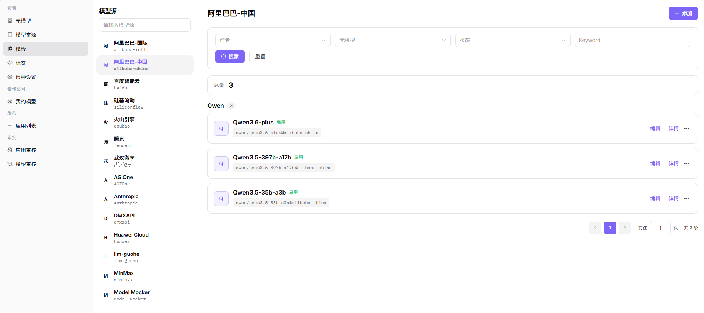
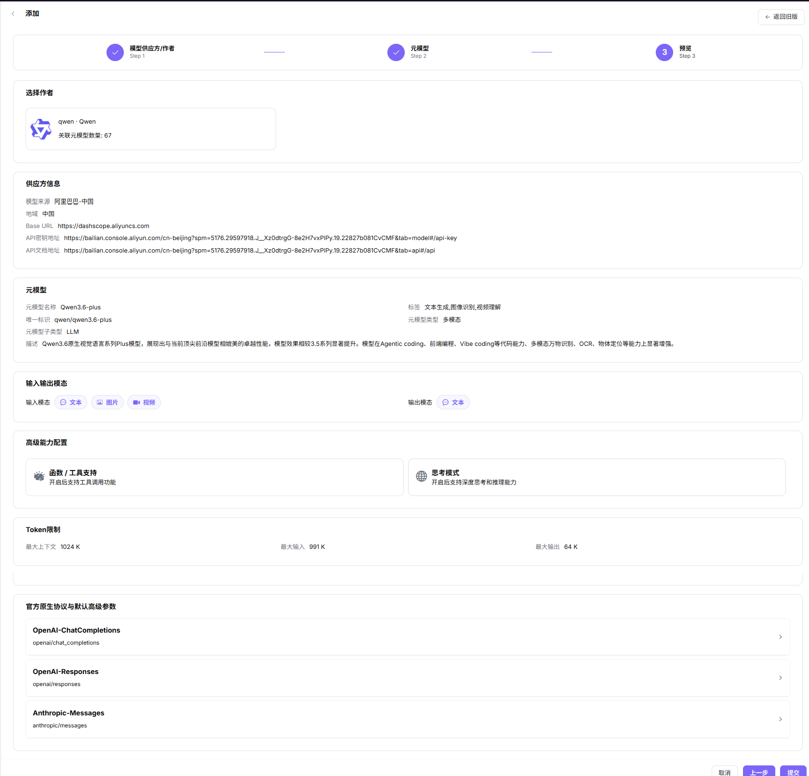

# 模型模板

::: info 文档信息
版本：v1.0
更新日期：2026-07-06
:::

::: warning 安全提示
模型服务文档和截图中不要暴露真实 Endpoint、API Key、请求头认证值、模型源密钥、内部模型 ID、客户调用内容或业务价格策略；示例统一使用占位符。
:::

## 功能概述

`模型模板` 用于维护或查看厂商模板、来源预览、协议、默认参数和发布表单，支撑模型发布、体验、调用、统计和运营治理。

| 项目 | 内容 |
| --- | --- |
| 适用角色 | 运营方 |
| 导航路径 | 系统设置 > 模型模板 |
| 页面路由 | /operator/settings/model-templates |
| 管理对象 | 厂商模板、来源预览、协议、默认参数和发布表单 |
| 典型用途 | 为模型发布提供可复用模板 |

### 新手理解

模型模板像模型发布表单的预设。模板配置好后，模型提供方可以少填重复字段，但模板中的 Endpoint、请求头和默认参数必须安全可控。

### 术语速查

| 术语 | 说明 |
| --- | --- |
| 模板 | 可复用的模型发布配置集合。 |
| 厂商配置预览 | 展示 Base URL、文档地址和请求头示例。 |
| 默认高级参数 | 发布模型时预置的温度、最大 Token 等参数。 |
| 协议映射 | 模板与模型调用协议的对应关系。 |

## 前提条件

1. 当前账号具备模型模板维护权限。
2. 可选供应方、作者、元模型和模型来源已维护。
3. 默认参数、请求头预览和发布表单字段已确认。
4. 模板启用前已用样例模型验证发布流程。
## 页面说明

页面用于维护模型发布模板。模板把供应方、元模型、默认参数、协议和来源预览组合起来，帮助模型提供方减少重复填写。

页面截图：

用于查看模板状态、供应方和关联配置。

## 主要操作

### 操作步骤

1. 进入 `系统设置 > 模型模板`。
2. 选择供应方或厂商配置。
3. 关联适用的元模型和模型来源。
4. 配置协议、默认高级参数和请求头预览。
5. 保存后用测试模型发布流程验证模板。

关键步骤截图：

模板必须关联正确的元模型能力。

模板模态应与元模型和模型来源一致。

发布前预览用户侧看到的字段和默认参数。

### 参数说明

| 字段名称 | 是否必填 | 字段类型 | 示例 | 说明 |
| --- | --- | --- | --- | --- |
| 模板名称 | 是 | 文本 | `OpenAI 兼容模板` | 发布模型时可选择的模板名称。 |
| 供应方 | 是 | 下拉选择 | `OpenAI Compatible` | 模板对应的厂商或来源类型。 |
| 元模型 | 是 | 下拉选择 | `Qwen Text` | 模板默认引用的能力定义。 |
| 默认参数 | 否 | JSON | `{"top_p":0.8}` | 发布模型时带出的参数。 |
| 请求头预览 | 否 | JSON | `{"Authorization":"Bearer <key>"}` | 只展示占位符，不写真实密钥。 |

### 踩坑提示

- 模板默认参数会影响所有引用该模板的模型。
- 供应方和元模型能力不匹配会导致发布后调用失败。
- 请求头预览只能放占位符。

### 结果校验

1. 模板在模型发布流程中可被选择。
2. 供应方、元模型、来源预览和默认参数能正确带入发布表单。
3. 协议、模态和 Token 限制与关联元模型一致。
4. 禁用模板后，新发布流程不再显示该模板。
## 常见问题

### 发布流程没有目标模板

**问题现象：**

模型提供方创建模型时看不到预期模板。

**可能原因：**

- 模板未启用。
- 模板关联的元模型或来源不可用。
- 模板适用供应方与当前选择不一致。

**处理方式：**

1. 确认模板状态。
2. 检查关联元模型、来源和供应方。
3. 重新进入发布流程验证下拉项。

### 模板带出的参数不正确

**问题现象：**

发布表单自动填充的参数、请求头或模态与预期不一致。

**可能原因：**

- 模板默认参数未更新。
- 元模型限制发生变化但模板未同步。
- 来源预览仍指向旧配置。

**处理方式：**

1. 更新模板默认参数和请求头预览。
2. 核对元模型限制。
3. 保存后用测试模型走一遍发布流程。
## 后续操作

1. 使用模板创建或更新一个测试模型，确认默认参数、价格和可见范围生效。
2. 到模型详情或 Playground 验证模板生成的调用示例和参数说明。
3. 模板变更后通知受影响的供应方，避免发布流程使用旧口径。

## 注意事项

- 模板默认参数会影响模型市场和 Playground 的用户体验，发布前应确认口径。
- 模板关联的元模型、来源、价格和可见范围要保持一致。
- 调整模板后应抽样验证模型详情、快速开始示例和调用日志是否仍按新模板展示。
