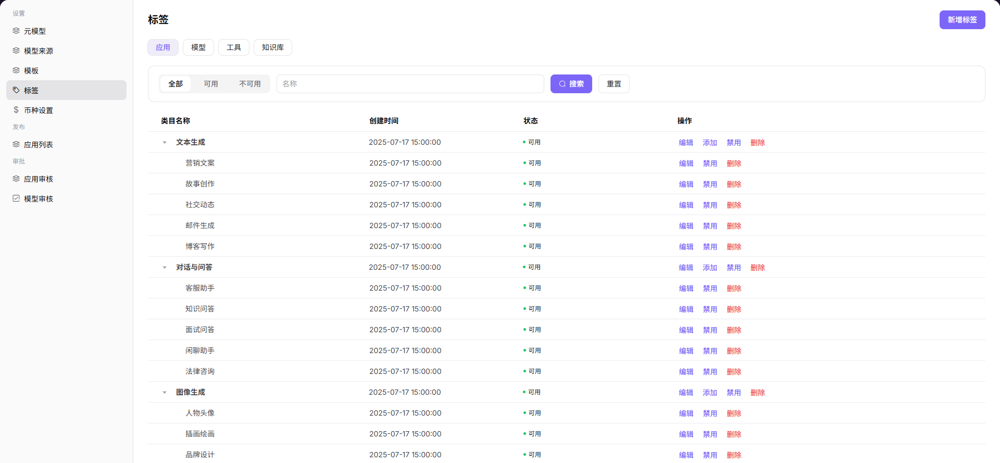
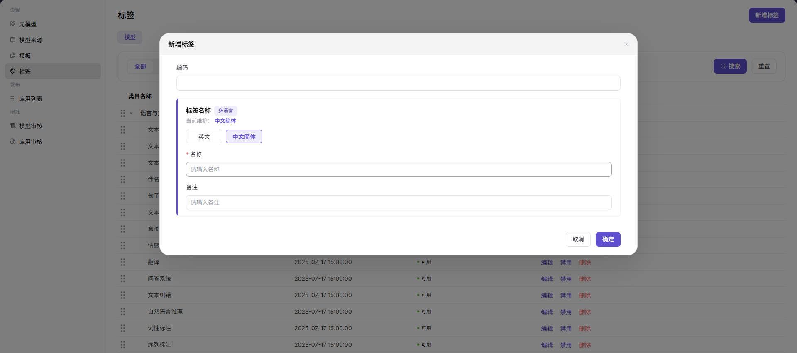

# 标签

::: info 文档信息
版本：v1.0
更新日期：2026-07-08
:::

## 功能概述

`标签` 用于维护模型分类、展示分组和筛选入口，帮助调用方在模型市场按能力、场景和供应方快速定位模型。

| 项目 | 内容 |
| --- | --- |
| 适用角色 | 运营方 |
| 导航路径 | 模型及AI服务 > 设置 > 标签 |
| 页面路由 | /modelone/settings/tags |
| 管理对象 | 模型标签、标签分组、展示顺序和启用状态 |
| 典型用途 | 维护模型市场筛选和展示标签 |

#### 新手理解

标签像模型市场里的货架贴纸，帮助用户按能力、行业、推荐程度或场景筛选模型。标签命名混乱会直接影响发现效率。

#### 术语速查

| 术语 | 说明 |
| --- | --- |
| 标签分组 | 按能力、行业、推荐或场景组织标签。 |
| 适用对象 | 标签可绑定的模型、应用或内容类型。 |
| 排序值 | 控制标签在筛选区或详情页中的展示顺序。 |
| 启停状态 | 控制标签是否可继续被绑定和筛选。 |

## 前提条件

1. 当前账号具备`标签`维护权限。
2. 标签分组、命名规则、排序规则和适用对象已确定。
3. 新增标签前已检查是否存在同义或重复标签。
4. 需要下线标签时已确认绑定模型数量和筛选入口影响。

## 页面说明

页面用于维护模型、应用或内容的标签体系，包括标签名称、分组、排序、启停状态和展示范围。运营方应统一命名规则，避免重复标签和内部缩写。

页面截图：

用于查看标签名称、分类、排序和启用状态。

## 主要操作

### 新增标签

1. 进入 `模型及AI服务 > 设置 > 标签`。
2. 点击 `新增标签`，打开 `新增标签` 弹窗。
3. 填写 `编码`，用于区分不同标签。
4. 在 `标签名称` 中维护 `英文` 和 `中文简体` 的 `名称`。
5. 按需填写 `备注`，说明标签用途或使用边界。
6. 点击 `确定` 前确认字段信息无误；如仅学习或验证页面，请点击 `取消` 关闭。

## 参数说明

| 字段名称 | 是否必填 | 字段类型 | 示例 | 说明 |
| --- | --- | --- | --- | --- |
| 编码 | 必填 | 文本 | `long-context` | 标签的唯一识别编码。 |
| 标签名称 | 必填 | 多语言文本 | `长上下文` | 用户可见的标签内容。 |
| 名称 | 必填 | 文本 | `长上下文` | 当前语言版本下维护的标签名称。 |
| 备注 | 否 | 文本 | `适用于长上下文模型` | 标签用途、适用边界或运营说明。 |
| 状态 | 系统生成 | 枚举 | `可用` | 控制标签是否可被使用。 |

## 踩坑提示

- 不要用内部项目代号作为用户可见标签。
- 停用标签前先检查已绑定模型和筛选入口。
- 能力标签、行业标签和推荐标签不要混在同一分组。

## 结果校验

| 检查项 | 成功表现 | 异常时处理 |
| --- | --- | --- |
| 标签能在模型编辑或应用编辑页被绑定 | 标签能在模型编辑或应用编辑页被绑定。 | 未达到时检查模型、来源、模板、审核状态、调用配置和可见范围 |
| 用户侧发现页能按标签筛选出正确结果 | 用户侧发现页能按标签筛选出正确结果。 | 未达到时检查模型、来源、模板、审核状态、调用配置和可见范围 |
| 停用标签后不再作为新增绑定项出现 | 停用标签后不再作为新增绑定项出现。 | 未达到时检查模型、来源、模板、审核状态、调用配置和可见范围 |

## 常见问题

#### 标签筛选结果为空

**问题现象：**

用户点击标签后没有模型展示。

**可能原因：**

- 没有已上架模型绑定该标签。
- 标签状态为停用。
- 模型可见范围不包含当前用户。

**处理方式：**

1. 检查标签绑定关系。
2. 确认标签启用状态。
3. 核对模型上架和可见范围。

#### 标签含义重复

**问题现象：**

列表中存在多个含义接近的标签。

**可能原因：**

- 缺少统一命名规范。
- 不同运营人员按个人习惯创建。
- 标签分组边界不清。

**处理方式：**

1. 合并重复标签。
2. 迁移模型绑定关系。
3. 补充标签命名和分组规则。

#### 标签保存后市场筛选无变化

**问题现象：**

标签已新增或修改，但模型市场筛选项没有变化。

**可能原因：**

标签未启用，未绑定到模型，或市场索引和缓存尚未刷新。

**处理方式：**

确认标签启用状态和绑定模型；等待索引刷新后复核；仍无变化时检查模型市场筛选配置。

## 后续操作

1. 绑定标签到模型或应用。
2. 在发现页验证筛选效果。
3. 定期清理低使用或重复标签。

## 注意事项

- 不要使用内部项目代号作为用户可见标签。
- 标签合并前先迁移已绑定模型。
- 涉及客户名称或行业专属标签时需确认展示边界。
