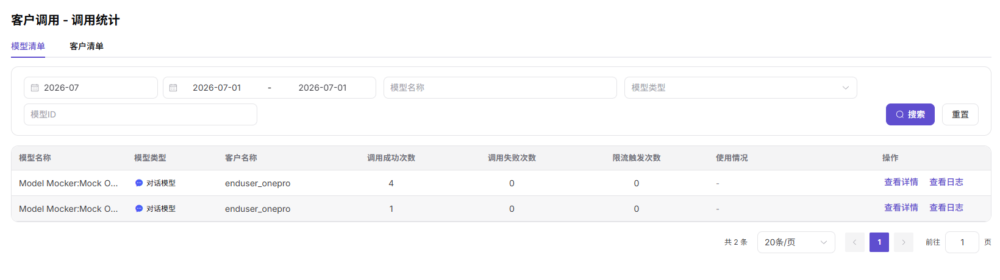

# 客户调用-调用统计

::: info 文档信息
版本：v1.0
更新日期：2026-07-08
:::

## 功能概述

`客户调用-调用统计` 用于分析客户调用趋势、模型分布、Token、费用和成功率，帮助判断客户侧调用变化。

| 项目 | 内容 |
| --- | --- |
| 适用角色 | 模型提供方 |
| 导航路径 | 客户调用 > 调用统计 |
| 页面路由 | /user/customer-calls/call-analytics |
| 管理对象 | 客户趋势、模型分布、调用量、Token、费用和成功率 |
| 典型用途 | 按客户维度做运营分析 |

### 新手理解

客户调用统计像客户运营分析表，用来比较不同客户的调用趋势、模型偏好、失败率和收益贡献。
### 术语速查

| 术语 | 说明 |
| --- | --- |
| 客户趋势 | 按客户聚合的调用变化。 |
| 模型占比 | 不同模型在客户调用中的占比。 |
| 收益贡献 | 客户调用带来的收益或消耗。 |
| 异常波动 | 调用量、费用或失败率明显偏离正常范围。 |

## 前提条件

1. 当前账号具备客户调用分析查看权限。
2. 已确定客户范围、模型范围、统计时间和粒度。
3. 需要导出时已确认客户数据脱敏要求。
## 页面说明

页面只做客户运营分析，关注客户调用趋势、模型偏好、收益贡献、失败率和异常波动。

页面截图：

用于按客户、模型和时间分析调用趋势。

## 主要操作

### 查看客户调用分析

1. 进入 `客户调用 > 调用统计`。
2. 选择客户范围、模型和统计粒度。
3. 查看客户调用趋势、Token 和费用变化。
4. 对比不同客户或模型贡献。
5. 将异常客户下钻到调用日志排查。

## 参数说明

| 字段名称 | 是否必填 | 字段类型 | 示例 | 说明 |
| --- | --- | --- | --- | --- |
| 客户范围 | 必填 | 多选 | `重点客户` | 参与分析的客户集合。 |
| 统计粒度 | 必填 | 枚举 | `天` | 趋势聚合粒度。 |
| 模型 | 否 | 下拉选择 | `qwen-plus` | 按模型拆分。 |
| 收益贡献 | 系统生成 | 数值 | `120 Credits` | 客户贡献收益。 |
| 失败率 | 系统生成 | 百分比 | `1.2%` | 客户请求失败占比。 |

## 踩坑提示

- 客户分析用于运营判断，不直接证明单次请求原因。
- 跨客户对比前要统一时间范围和模型范围。
- 费用和收益数据导出前要脱敏。

## 结果校验

| 检查项 | 成功表现 | 异常时处理 |
| --- | --- | --- |
| 趋势图展示客户调用量、Token | 趋势图展示客户调用量、Token、失败率和费用变化。 | 未达到时回到对应页面核对权限、筛选条件和配置状态 |
| 客户、模型或时间筛选变化后统计口 | 客户、模型或时间筛选变化后统计口径同步变化。 | 未达到时回到对应页面核对权限、筛选条件和配置状态 |
| 分析结论能与客户调用总览和调用日 | 分析结论能与客户调用总览和调用日志互相印证。 | 未达到时回到对应页面核对权限、筛选条件和配置状态 |
## 常见问题

### 客户趋势波动明显

**问题现象：**

某客户调用量或费用在统计周期内大幅波动。

**可能原因：**

- 客户业务活动变化。
- 客户侧重试或批量任务。
- 模型下架、限流或价格口径变化。

**处理方式：**

1. 按模型拆分趋势。
2. 查看异常时间段客户调用日志。
3. 核对发布、限流和计费变更记录。

### 客户贡献排序异常

**问题现象：**

客户贡献排名与预期不一致。

**可能原因：**

- 统计时间范围不同。
- 部分调用免费、抵扣或未结算。
- 客户名称或归属维度发生变化。

**处理方式：**

1. 统一统计时间范围。
2. 结合收益明细核对结算口径。
3. 确认客户归属和名称映射。

### 客户统计和日志数量对不上

**问题现象：**

调用统计中的客户调用量与调用日志筛选出的记录数量不一致。

**可能原因：**

统计粒度、时间边界、成功状态或客户筛选条件不一致，也可能存在统计任务延迟。

**处理方式：**

统一时间范围、客户、模型和状态口径；等待统计刷新后复核；仍不一致时导出脱敏明细交给运营方核对。

## 后续操作

1. 进入客户调用日志抽查异常请求。
2. 查看模型收益核对客户贡献。
3. 基于趋势制定客户运营或限流策略。
## 注意事项

- 客户维度分析涉及商业敏感信息。
- 导出前遮挡客户名称、费用和业务标识。
- 趋势结论应结合业务活动和统计延迟解释。
