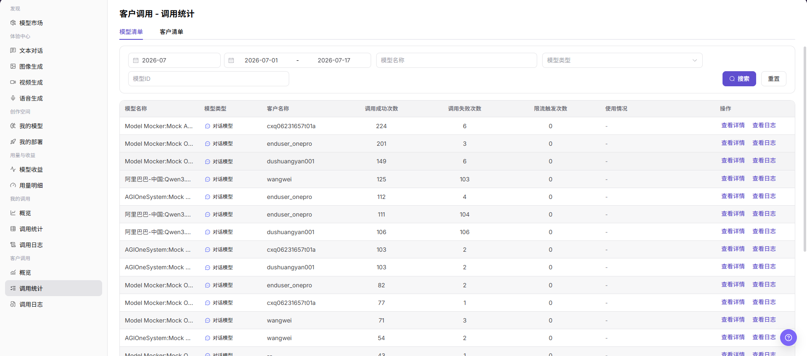
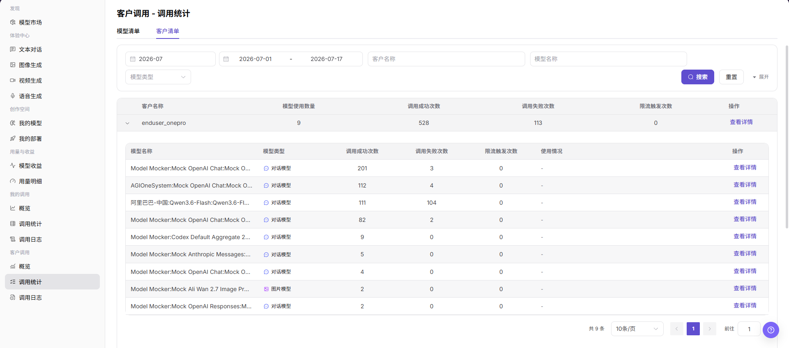

# 客户调用 - 调用统计

::: info 文档信息
版本：v1.0
更新日期：2026-07-08
:::

## 功能概述

`客户调用 - 调用统计` 用于从模型清单和客户清单两个视角查看客户侧调用统计，包括模型名称、模型类型、客户名称、调用成功次数、调用失败次数、限流触发次数、使用情况和查看入口，帮助模型提供方定位高频调用对象和异常调用对象。

| 项目 | 内容 |
| --- | --- |
| 适用角色 | 模型提供方 |
| 导航路径 | 模型及AI服务 > 客户调用 > 调用统计 |
| 页面路由 | `/modelone/monitoring/monitor/list` |
| 管理对象 | 客户调用统计、模型清单、客户清单、调用成功次数、调用失败次数和限流触发次数 |
| 典型途径 | 按模型或客户查看客户侧调用统计 |

#### 新手理解

调用统计像客户调用的排行榜。`模型清单` 适合先看哪些模型被哪些客户调用，`客户清单` 适合先看某个客户调用了多少模型，再展开查看该客户下的模型明细。

#### 术语速查

| 术语 | 说明 |
| --- | --- |
| 模型清单 | 按模型与客户组合展示调用统计。 |
| 客户清单 | 按客户聚合展示调用统计，并可展开查看客户下的模型明细。 |
| 调用成功次数 | 当前筛选范围内成功完成的调用次数。 |
| 调用失败次数 | 当前筛选范围内失败、超时或返回错误的调用次数。 |
| 限流触发次数 | 调用命中限流策略的次数。 |
| 使用情况 | 页面展示的 Token、额度或其他调用使用信息。 |

## 前提条件

1. 当前账号具备 `调用统计` 页面访问权限。
2. 已明确需要查看的月份、日期范围、模型、客户或模型类型。
3. 客户名称、模型名称、调用量和使用情况等敏感字段已按权限展示。

## 页面说明

客户调用统计可能包含客户名称、模型名称、调用量、使用情况、费用、Key、请求内容和业务标识等敏感运营数据。本文只描述查看模型清单和客户清单，不展示真实客户信息、Key、请求内容、费用明细或内部测试参数；如页面存在导出入口，仅说明查看边界，不引导导出敏感数据。

模型清单截图：

客户清单截图：

## 主要操作

### 查看客户调用-模型清单

1. 进入 `模型及AI服务 > 客户调用 > 调用统计`。
2. 点击或确认当前位于 `模型清单` 页签。
3. 按页面筛选项选择月份、日期范围、模型名称、模型类型或模型 ID。
4. 点击 `搜索` 刷新模型清单；如需清空筛选条件，点击 `重置`。
5. 在模型清单中查看模型名称、模型类型、客户名称、调用成功次数、调用失败次数、限流触发次数、使用情况和操作入口。
6. 点击 `查看详情` 查看目标模型与客户组合的统计详情；如需单次请求明细，点击 `查看日志` 或进入 `客户调用 > 调用日志`。

### 查看客户调用-客户清单

1. 进入 `模型及AI服务 > 客户调用 > 调用统计`。
2. 点击 `客户清单` 页签。
3. 按页面筛选项选择月份、日期范围、客户名称、模型名称或模型类型。
4. 点击 `搜索` 查看符合条件的客户清单；如需查看更多筛选项，点击 `展开`。
5. 在客户清单中查看客户名称、模型使用数量、调用成功次数、调用失败次数、限流触发次数和操作入口。
6. 展开目标客户后，查看该客户下各模型的模型名称、模型类型、调用成功次数、调用失败次数、限流触发次数和使用情况；如需明细，点击 `查看详情`。

## 参数说明

| 字段名称 | 是否必填 | 字段类型 | 示例 | 说明 |
| --- | --- | --- | --- | --- |
| 月份 | 是 | 月份选择 | `2026-07` | 控制调用统计的统计月份。 |
| 日期范围 | 是 | 日期范围 | `2026-07-01 至 2026-07-17` | 控制清单数据的查询时间范围。 |
| 维度页签 | 是 | 页签 | `模型清单` / `客户清单` | 切换模型维度列表或客户维度列表。 |
| 模型名称 | 否 | 输入框 | 按页面输入 | 按模型名称筛选模型清单或客户清单。 |
| 模型类型 | 否 | 选择项 | `对话模型` / `图片模型` | 按模型能力类型筛选统计数据。 |
| 模型 ID | 否 | 输入框 | 按页面输入 | 在模型清单下按模型 ID 精确筛选。 |
| 客户名称 | 否 | 输入框 / 文本 | 按页面输入 | 在客户清单下按客户名称筛选统计数据。 |
| 模型使用数量 | 系统生成 | 数值 | 按页面展示 | 在客户清单下展示客户调用过的模型数量。 |
| 调用成功次数 | 系统生成 | 数值 | 按页面展示 | 当前筛选范围内调用成功的次数。 |
| 调用失败次数 | 系统生成 | 数值 | 按页面展示 | 当前筛选范围内调用失败的次数。 |
| 限流触发次数 | 系统生成 | 数值 | 按页面展示 | 当前筛选范围内触发限流的次数。 |
| 使用情况 | 系统生成 | 文本 / 标签 | 按页面展示 | 展示 Token、额度或其他调用使用信息。 |
| 操作 | 否 | 操作入口 | `查看详情` / `查看日志` | 查看统计详情或跳转到调用日志。 |

## 结果校验

| 检查项 | 成功表现 | 异常时处理 |
| --- | --- | --- |
| 页面可进入 | `客户调用 - 调用统计` 页面正常打开，左侧 `客户调用 > 调用统计` 菜单高亮。 | 确认账号权限、导航路径和页面加载状态。 |
| 模型清单正常展示 | `模型清单` 页签下展示模型名称、模型类型、客户名称、成功次数、失败次数、限流触发次数和操作入口。 | 调整月份、日期范围或模型筛选项后重试。 |
| 客户清单正常展示 | `客户清单` 页签下展示客户名称、模型使用数量、成功次数、失败次数、限流触发次数和操作入口。 | 调整日期范围、客户名称或模型名称后重试。 |
| 筛选项可用 | 切换月份、日期范围、模型、客户或模型类型后，清单数据随之变化。 | 检查筛选条件是否过窄，必要时点击 `重置`。 |
| 搜索 / 重置可用 | 点击 `搜索` 后展示匹配数据，点击 `重置` 后清空筛选条件。 | 检查网络状态、页面接口返回和账号权限。 |
| 清单数据一致 | 清单中的成功次数、失败次数、限流触发次数和使用情况与详情或日志入口中的数据一致。 | 进入 `查看详情` 或 `查看日志` 交叉确认。 |

## 常见问题

#### 模型清单为空怎么办？

先确认月份和日期范围覆盖客户调用时间，再检查模型名称、模型类型和模型 ID 是否过窄。必要时点击 `重置` 后重新搜索。

#### 客户清单中的模型数量异常怎么办？

切换到目标客户并展开明细，核对该客户下的模型列表；如果仍不一致，可进入调用日志按客户和时间范围继续排查。

#### 可以导出客户调用统计吗？

客户调用统计可能包含客户名称、模型名称、调用量、使用情况、费用和业务标识。导出前应确认权限、脱敏要求和使用范围；本文只描述查看清单，不引导导出敏感数据。

## 后续操作

1. 点击 `查看详情` 查看目标模型或客户的统计详情。
2. 点击 `查看日志` 或进入 `客户调用 > 调用日志` 定位单次请求。
3. 返回 `客户调用 > 概览` 查看趋势、消耗统计和 TOP 排名。

## 注意事项

- 客户名称、模型名称、调用量、费用、Key、请求内容和业务标识属于敏感运营信息。
- 对外沟通或截图前应脱敏客户名称、Key、请求内容、费用明细和内部测试参数。
- 调用统计是聚合数据，排查单次请求时应以调用日志为准。
