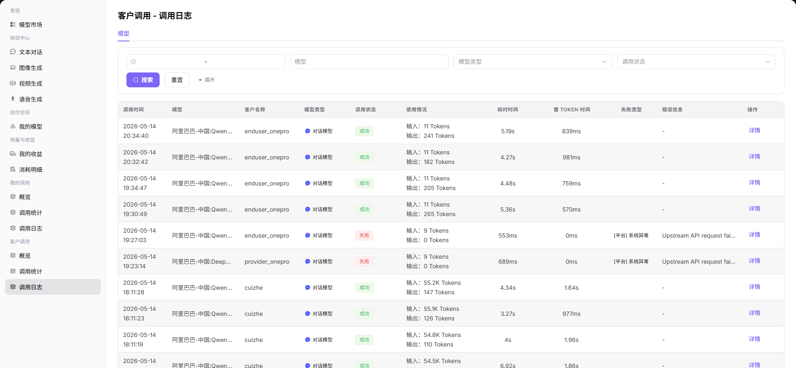

# 客户调用日志

:::: info 文档信息
版本：v1.0
更新日期：2026-07-08
::::

## 功能概述

`客户调用日志` 用于维护或查看客户单次请求日志、请求 ID、错误码、客户标识和模型返回摘要，支撑模型发布、体验、调用、统计和运营治理。

| 项目 | 内容 |
| --- | --- |
| 适用角色 | 模型提供方 |
| 导航路径 | 客户调用 > 调用日志 |
| 页面路由 | /user/customer-calls/call-logs |
| 管理对象 | 客户单次请求日志、请求 ID、错误码、客户标识和模型返回摘要 |
| 典型用途 | 按客户维度排查调用问题 |

### 新手理解

客户调用日志像客户请求工单明细，用于解释客户反馈的失败、超时、限流或计费争议。
### 术语速查

| 术语 | 说明 |
| --- | --- |
| 客户标识 | 调用方客户或应用的脱敏标识。 |
| 请求 ID | 单次请求追踪标识。 |
| 错误码 | 失败请求的类型。 |
| 响应摘要 | 脱敏后的返回状态或错误摘要。 |

## 前提条件

1. 当前账号具备客户调用日志查看权限。
2. 已准备客户名称、请求 ID、时间范围或错误码。
3. 排障材料中不得包含客户完整 Prompt、响应正文或 API Key。
## 页面说明

页面只查看客户侧单次请求日志，用于解释客户反馈的失败、超时或计费争议。

页面截图：

用于定位客户请求失败、超时或计费争议。

## 主要操作

### 操作步骤

1. 进入 `客户调用 > 调用日志`。
2. 选择客户、模型和时间范围。
3. 按请求 ID、状态或错误码筛选。
4. 打开日志查看脱敏错误摘要和耗时。
5. 将请求 ID、错误码和时间范围反馈给相关处理人。

### 参数说明

| 字段名称 | 是否必填 | 字段类型 | 示例 | 说明 |
| --- | --- | --- | --- | --- |
| 客户 | 是 | 下拉选择 | `customer-a` | 调用方客户。 |
| 请求 ID | 条件必填 | 文本 | `req-20260706-001` | 单次请求追踪标识。 |
| 错误码 | 否 | 文本 | `5xx` | 失败类型。 |
| 模型 | 否 | 下拉选择 | `qwen-plus` | 被调用模型。 |
| 响应摘要 | 系统生成 | 文本 | `timeout` | 脱敏后的错误摘要。 |

### 踩坑提示

- 不要把客户 Prompt、响应正文或 API Key 发到公开群。
- 同一客户的多个失败请求要按时间范围聚合分析。
- 客户侧错误可能来自限流、余额、模型状态或上游超时。

### 结果校验

1. 能按客户、请求 ID、模型、状态和时间范围筛选日志。
2. 日志详情展示错误码、延迟、Token 和脱敏响应摘要。
3. 客户反馈的问题能定位到对应请求或时间段。
## 常见问题

### 客户提供的请求查不到

**问题现象：**

按客户提供的时间或请求 ID 无法定位日志。

**可能原因：**

- 请求 ID 不完整或属于其他环境。
- 时间范围、时区或客户筛选不一致。
- 日志超过保留周期。

**处理方式：**

1. 向客户确认完整请求 ID 和时区。
2. 扩大时间范围并清理筛选条件。
3. 确认日志保留周期。

### 同一客户大量失败

**问题现象：**

某客户在短时间内出现大量失败日志。

**可能原因：**

- 客户侧参数批量错误。
- 客户并发触发限流。
- 上游模型或网络异常。

**处理方式：**

1. 按错误码聚合失败原因。
2. 抽查请求摘要和参数。
3. 结合模型状态和客户调用分析判断影响范围。
## 后续操作

1. 将请求 ID、错误码和时间范围反馈给客户或运营方。
2. 进入客户调用分析评估影响范围。
3. 必要时调整客户限流或模型配置。
## 注意事项

- 不要导出或传播客户完整请求内容。
- 截图前遮挡客户名称、请求头、Token 和费用。
- 客户日志用于排障，不替代收益结算明细。
