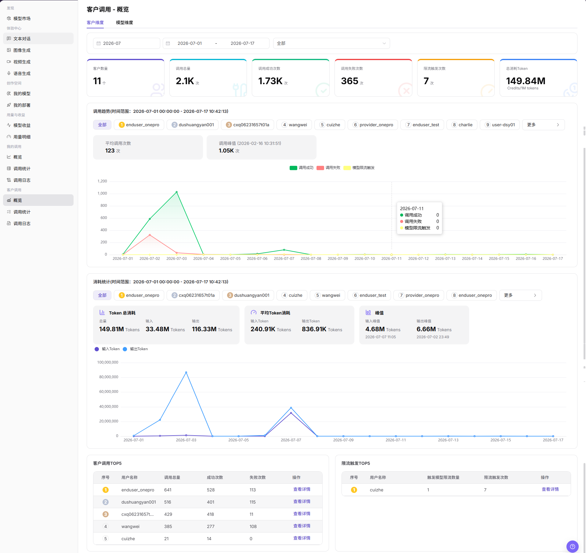
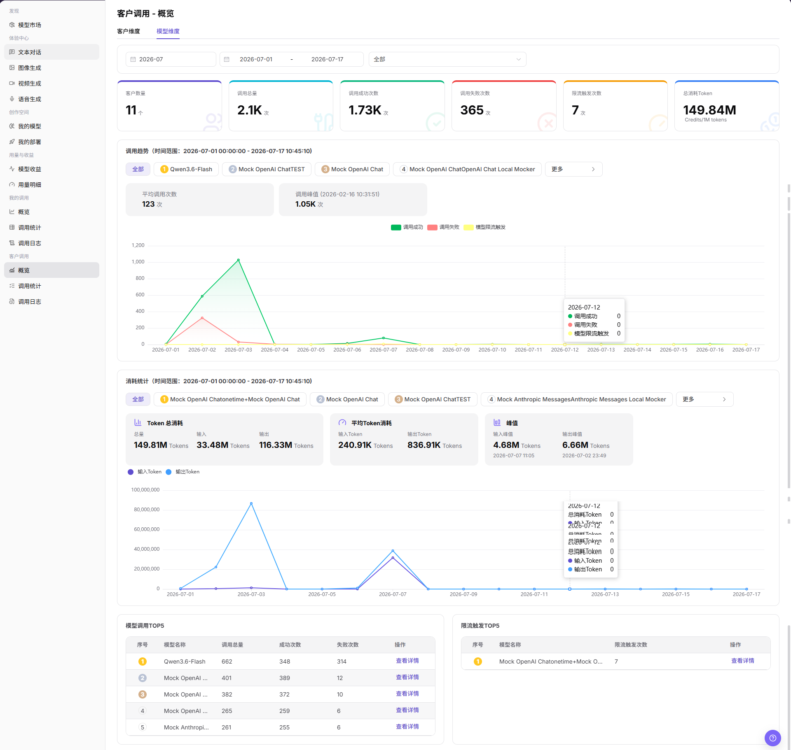

# 客户调用 - 概览

::: info 文档信息
版本：v1.0
更新日期：2026-07-08
:::

## 功能概述

`客户调用 - 概览` 用于从客户维度和模型维度查看调用表现，包括客户数量、调用总量、调用成功次数、调用失败次数、限流触发次数、Token 消耗、调用趋势、消耗统计和 TOP 排名，帮助模型提供方识别重点客户、重点模型和异常调用。

| 项目 | 内容 |
| --- | --- |
| 适用角色 | 模型提供方 |
| 导航路径 | 模型及AI服务 > 客户调用 > 概览 |
| 页面路由 | `/modelone/monitoring/monitor/overview` |
| 管理对象 | 客户维度调用数据、模型维度调用数据、调用趋势、Token 消耗和限流触发情况 |
| 典型途径 | 查看客户侧调用概览并定位重点客户或重点模型 |

#### 新手理解

客户调用概览像客户侧运营看板。`客户维度` 用来观察哪些客户调用较多或异常，`模型维度` 用来观察哪些模型被调用较多、失败较多或触发限流较多。

#### 术语速查

| 术语 | 说明 |
| --- | --- |
| 客户维度 | 按客户或用户名聚合调用数据。 |
| 模型维度 | 按模型名称聚合调用数据。 |
| 调用趋势 | 按时间展示调用成功、调用失败和模型限流触发的变化。 |
| 消耗统计 | 展示总消耗 Token、输入 Token、输出 Token、平均 Token 消耗和峰值。 |
| 限流触发次数 | 调用命中模型限流策略的次数。 |

## 前提条件

1. 当前账号具备 `概览` 页面访问权限。
2. 已明确需要查看的统计月份、日期范围和维度。
3. 客户名称、模型名称、调用量和费用等敏感字段已按权限展示。

## 页面说明

客户调用概览可能包含客户名称、调用量、Token 消耗、费用、模型使用情况和异常调用等敏感运营数据。本文只描述查看概览，不展示真实客户信息、Key、请求内容、费用明细或内部测试参数；如页面存在导出入口，仅说明查看边界，不引导导出敏感数据。

客户维度截图：

模型维度截图：

## 主要操作

### 查看客户调用-客户维度

1. 进入 `模型及AI服务 > 客户调用 > 概览`。
2. 点击或确认当前位于 `客户维度` 页签。
3. 选择统计月份、日期范围和 `全部` 或目标客户筛选项。
4. 查看客户数量、调用总量、调用成功次数、调用失败次数、限流触发次数和总消耗 Token。
5. 查看调用趋势、消耗统计、客户调用 TOP5 和限流触发 TOP5。
6. 如需查看目标客户的明细，点击列表中的 `查看详情`；对外使用截图前需隐藏客户名称、费用和业务标识。

### 查看客户调用-模型维度

1. 进入 `模型及AI服务 > 客户调用 > 概览`。
2. 点击 `模型维度` 页签。
3. 选择统计月份、日期范围和 `全部` 或目标模型筛选项。
4. 查看客户数量、调用总量、调用成功次数、调用失败次数、限流触发次数和总消耗 Token。
5. 查看模型维度的调用趋势、消耗统计、模型调用 TOP5 和限流触发 TOP5。
6. 如需查看目标模型的明细，点击列表中的 `查看详情`；如需单次请求明细，进入 `客户调用 > 调用日志` 查看。

## 参数说明

| 字段名称 | 是否必填 | 字段类型 | 示例 | 说明 |
| --- | --- | --- | --- | --- |
| 统计月份 | 是 | 月份选择 | `2026-07` | 控制概览数据所属月份。 |
| 日期范围 | 是 | 日期范围 | `2026-07-01 至 2026-07-17` | 控制趋势图、消耗统计和 TOP 排名的统计时间范围。 |
| 维度页签 | 是 | 页签 | `客户维度` / `模型维度` | 切换客户聚合视角或模型聚合视角。 |
| 客户 | 否 | 选择项 | `全部` 或目标客户 | 在客户维度下按客户筛选统计结果。 |
| 模型 | 否 | 选择项 | `全部` 或目标模型 | 在模型维度下按模型筛选统计结果。 |
| 客户数量 | 系统生成 | 数值 | 按页面展示 | 当前统计范围内产生调用的客户数量。 |
| 调用总量 | 系统生成 | 数值 | 按页面展示 | 当前统计范围内的调用次数总和。 |
| 调用成功次数 | 系统生成 | 数值 | 按页面展示 | 当前统计范围内调用成功的次数。 |
| 调用失败次数 | 系统生成 | 数值 | 按页面展示 | 当前统计范围内调用失败的次数。 |
| 限流触发次数 | 系统生成 | 数值 | 按页面展示 | 当前统计范围内命中模型限流的次数。 |
| Token 消耗 | 系统生成 | 数值 | 按页面展示 | 展示总消耗 Token、输入 Token、输出 Token、平均 Token 消耗和峰值。 |
| 操作 | 否 | 操作入口 | `查看详情` | 进入客户或模型维度的详情数据。 |

## 踩坑提示

- 客户调用概览用于看客户维度趋势，不适合直接定位单次请求失败；单次失败应进入调用日志。
- 比较客户调用量前先统一时间范围、客户范围、模型版本和统计粒度。
- 收益、调用次数和失败率可能存在同步延迟，不要只用概览数字做最终结算判断。

## 结果校验

| 检查项 | 成功表现 | 异常时处理 |
| --- | --- | --- |
| 页面可进入 | `客户调用 - 概览` 页面正常打开，左侧 `客户调用 > 概览` 菜单高亮。 | 确认账号权限、导航路径和页面加载状态。 |
| 客户维度数据正常展示 | `客户维度` 页签下展示客户数量、调用趋势、消耗统计和客户调用 TOP5。 | 调整日期范围或客户筛选项后重试。 |
| 模型维度数据正常展示 | `模型维度` 页签下展示模型相关趋势、消耗统计和模型调用 TOP5。 | 调整日期范围或模型筛选项后重试。 |
| 筛选项可用 | 切换月份、日期范围、客户或模型后，统计图表和 TOP 表随之变化。 | 检查筛选条件是否过窄，必要时切回 `全部`。 |
| 详情入口可用 | 点击 `查看详情` 后可进入对应客户或模型的明细信息。 | 确认数据权限和统计对象是否仍存在。 |
| 统计数据一致 | 调用趋势、消耗统计和 TOP 表与筛选条件一致。 | 刷新页面或扩大时间范围交叉确认。 |

## 常见问题

#### 某客户数据为空怎么办？

先确认统计月份和日期范围覆盖客户调用时间，再检查是否选择了正确客户或模型。必要时切换到 `全部` 后重新查看。

#### 客户成功率或失败次数异常怎么办？

先查看调用趋势中的失败变化，再进入客户调用统计或调用日志按客户、模型和时间段拆分排查。

#### 模型限流触发次数异常怎么办？

切换到 `模型维度`，查看限流触发 TOP5 和目标模型趋势；需要单次请求信息时进入客户调用日志继续排查。

#### 可以导出客户调用概览吗？

客户调用概览可能包含客户名称、调用量、费用和模型使用情况。导出前应确认权限、脱敏要求和使用范围；本文只描述查看概览，不引导导出敏感数据。

## 后续操作

1. 进入 `客户调用 > 调用统计` 查看更细的统计分布。
2. 进入 `客户调用 > 调用日志` 定位单次失败请求。
3. 根据客户或模型的调用趋势调整运营跟进策略。

## 注意事项

- 客户名称、调用量、费用、模型使用情况和业务标识属于敏感运营信息。
- 对外沟通或截图前应脱敏客户名称、Key、请求内容、费用明细和内部测试参数。
- 概览页展示聚合数据，排查单次请求时应以调用日志为准。
