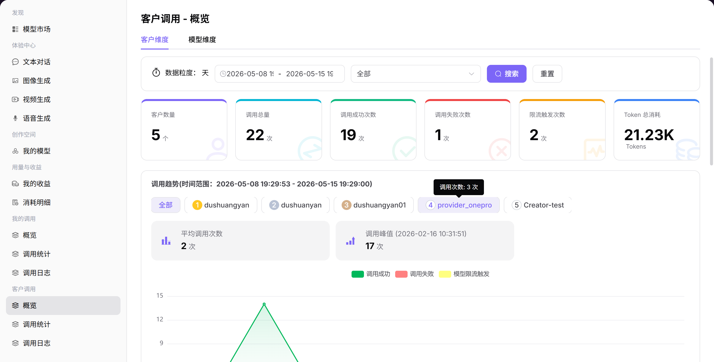

# 客户调用-概览

::: info 文档信息
版本：v1.0
更新日期：2026-07-08
:::

## 功能概述

`客户调用-概览` 用于从客户维度查看调用量、成功率、Token 用量、费用和活跃客户，帮助提供方识别重点客户和异常客户。

| 项目 | 内容 |
| --- | --- |
| 适用角色 | 模型提供方 |
| 导航路径 | 客户调用 > 概览 |
| 页面路由 | /user/customer-calls/overview |
| 管理对象 | 客户维度调用量、成功率、Token 用量、费用和活跃客户 |
| 典型用途 | 查看客户侧整体调用表现 |

### 新手理解

客户调用概览像客户经营看板，用来观察不同客户的调用量、活跃度、成功率、Token 和费用贡献。
### 术语速查

| 术语 | 说明 |
| --- | --- |
| 客户维度 | 按客户、租户或应用聚合调用数据。 |
| 活跃客户 | 统计周期内产生调用的客户。 |
| 客户费用 | 客户调用产生的费用或消耗。 |
| 客户成功率 | 客户请求成功占比。 |

## 前提条件

1. 当前账号具备客户调用总览查看权限。
2. 已明确需要查看的客户范围和时间范围。
3. 客户名称、业务标识和费用字段已按权限展示。
## 页面说明

页面只展示客户维度的调用总览，面向模型提供方观察客户活跃度、调用量、成功率、Token 和费用贡献。

页面截图：

用于查看客户维度调用量、活跃度和收益贡献。

## 主要操作

### 查看客户调用概览

1. 进入 `客户调用 > 概览`。
2. 选择时间范围和客户范围。
3. 查看客户调用量、活跃客户和成功率。
4. 按模型或客户筛选。
5. 发现异常客户后进入客户调用日志或客户调用分析。

## 参数说明

| 字段名称 | 是否必填 | 字段类型 | 示例 | 说明 |
| --- | --- | --- | --- | --- |
| 客户 | 否 | 下拉选择 | `customer-a` | 按客户维度筛选。 |
| 活跃客户 | 系统生成 | 数值 | `18` | 统计周期内有调用的客户数。 |
| 客户调用量 | 系统生成 | 数值 | `5000` | 客户发起请求次数。 |
| 客户成功率 | 系统生成 | 百分比 | `98%` | 客户请求成功占比。 |
| 贡献费用 | 系统生成 | 数值 | `80 Credits` | 客户调用产生的费用。 |

## 踩坑提示

- 客户总览不展示客户请求正文。
- 客户名称和业务标识截图前必须脱敏。
- 总览异常需要结合客户日志和分析页定位。

## 结果校验

| 检查项 | 成功表现 | 异常时处理 |
| --- | --- | --- |
| 客户调用量、活跃客户、成功率、T | 客户调用量、活跃客户、成功率、Token 和费用贡献有数据。 | 未达到时回到对应页面核对权限、筛选条件和配置状态 |
| 切换客户或模型筛选后 | 切换客户或模型筛选后，卡片和趋势同步变化。 | 未达到时回到对应页面核对权限、筛选条件和配置状态 |
| 异常客户可继续下钻到客户调用日志 | 异常客户可继续下钻到客户调用日志。 | 未达到时回到对应页面核对权限、筛选条件和配置状态 |
## 常见问题

### 某客户数据为空

**问题现象：**

选择客户后没有调用量或费用数据。

**可能原因：**

- 客户在该时间范围内没有调用。
- 客户未被授权使用该模型。
- 当前账号无权查看该客户数据。

**处理方式：**

1. 扩大时间范围。
2. 核对客户授权和模型绑定。
3. 确认当前账号的数据查看范围。

### 客户成功率异常

**问题现象：**

某客户成功率明显低于其他客户。

**可能原因：**

- 客户请求参数不符合模型要求。
- 客户侧并发超过限流。
- 客户网络或调用入口异常。

**处理方式：**

1. 进入客户调用日志查看错误码。
2. 按模型和时间段拆分失败请求。
3. 向客户反馈请求 ID、错误码和建议参数。

### 活跃客户数量突然下降

**问题现象：**

客户调用概览中的活跃客户数低于预期。

**可能原因：**

时间范围变窄，客户筛选条件限制了范围，或部分客户调用失败导致未计入成功调用统计。

**处理方式：**

扩大统计时间范围并清空筛选；进入客户调用统计查看客户分布；再用客户调用日志核对失败请求和错误码。

## 后续操作

1. 进入客户调用日志定位单次失败。
2. 进入客户调用分析查看趋势和贡献。
3. 根据客户用量调整运营跟进策略。
## 注意事项

- 客户名称、费用和业务标识属于敏感信息。
- 总览页不展示完整请求正文。
- 对外沟通时只提供脱敏后的统计结论。
