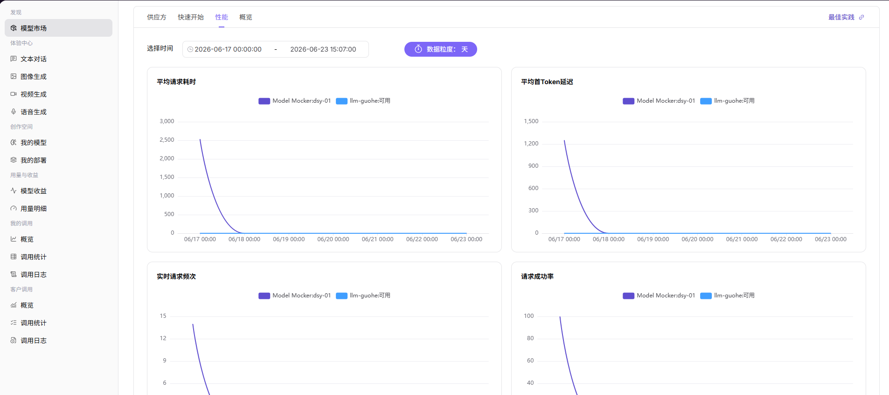

# 模型市场

::: info 文档信息
版本：v1.0
更新日期：2026-07-08
:::

## 功能概述

`模型市场` 用于浏览可用模型、供应方、快速开始、性能指标和模型概览，是调用方发现模型的主要入口。

| 项目 | 内容 |
| --- | --- |
| 适用角色 | 普通用户 |
| 导航路径 | 模型及AI服务 > 发现 > 模型市场 |
| 页面路由 | `/modelone/store/model` |
| 管理对象 | 模型列表、供应方、快速开始、性能指标和模型概览 |
| 典型途径 | 发现模型、查看供应方并获取脱敏调用方式 |

#### 新手理解

模型市场像模型目录。用户先看模型能力和供应方，再进入快速开始获取 Base URL、Path、Full URL 和认证方式。调用示例必须使用占位符，不能带真实 API Key。

#### 术语速查

| 术语 | 说明 |
| --- | --- |
| Base URL | 模型服务基础地址，示例使用 `https://api.example.com/v1`。 |
| Full URL | 完整调用地址，示例使用 `https://api.example.com/v1/chat/completions`。 |
| 供应方 | 提供模型实例的组织或渠道。 |
| Personal Key | 个人调用密钥，属于敏感凭据。 |

## 前提条件

1. 当前账号具备`模型市场` 访问权限。
2. 目标模型已上架并对当前账号或客户可见。
3. 需要调用前已确认配额、价格、上下文限制和使用条款。

::: warning 调用与计费风险
体验模型、提交 Prompt 或调用 API 可能产生调用记录、额度消耗或计费记录。仅学习或验证页面时，只查看模型列表和详情，不提交真实调用请求。
:::

## 页面说明

页面展示模型列表、模型详情、供应方实例、推荐标签、快速开始和性能信息。用户应先确认模型名称、Model ID、供应方、能力标签、输入输出模态、价格和状态，再决定是否进入体验中心或接入调用。

页面截图：

用于搜索模型、查看供应方、筛选模型类型和确认模型卡片信息。

## 主要操作

### 查看模型

1. 进入 `模型及AI服务 > 发现 > 模型市场`。
2. 在模型列表中查看模型名称、作者、模型类型、输入输出能力、计费方式、周调用量、周 Token 量、发布时间等信息。
3. 按模型名称、作者、模型系列、模型来源、模型类型、能力、上下文长度、计费或场景筛选目标模型。
4. 点击目标模型卡片中的 `查看`，进入模型详情页。
5. 在详情页查看模型介绍、作者、Model ID、上下文、输入输出上限、参考价格、输入输出模态、能力支持和支持协议。
6. 切换 `供应方`、`快速开始`、`性能`、`概览` 页签，查看供应方实例、调用方式、性能指标和模型说明。
7. 如需体验模型，可点击详情页中的 `体验` 入口进入体验中心；如仅学习或验证页面，只查看详情，不提交调用请求。

供应方页签用于查看供应方实例、推荐状态、计费、上下文、延迟、吞吐量、成功率和周调用数据。

文档和截图中不得展示真实凭据；实际接入时仅在授权环境中使用个人密钥。

性能页签用于查看时间范围、数据粒度、平均请求耗时、平均首 Token 延迟、实时请求频次、请求成功率和 Token 请求量。

概览中确认模型能力、上下文和价格边界。

## 参数说明

| 字段名称 | 是否必填 | 字段类型 | 示例 | 说明 |
| --- | --- | --- | --- | --- |
| 模型名称 | 必填 | 文本 | `Qwen3.7-Plus` | 模型展示名称，用于在列表和详情页识别模型。 |
| 供应方 | 必填 | 文本 / 筛选项 | `AGIOneSystem` | 提供模型实例的组织或渠道。 |
| 模型类型 | 否 | 筛选项 / 标签 | `对话模型` | 用于区分多模态、对话、图片、语音、视频、嵌入、重排等模型类型。 |
| 能力标签 | 否 | 标签 | `工具调用` | 展示模型支持的能力，例如工具调用、深度思考等。 |
| 输入输出模态 | 否 | 标签 | `文本 / 图片` | 展示模型支持的输入和输出类型。 |
| 计费方式 | 否 | 文本 | `Credit / 1M Tokens` | 展示模型输入、输出或按次计费口径。 |
| 状态 | 否 | 标签 | `已上架` | 展示模型或供应方实例的可用状态。 |
| 操作 | 否 | 按钮 | `查看`、`体验` | 用于进入模型详情或体验中心。 |

## 踩坑提示

- 同一模型可能有多个供应方，调用前确认选中的供应方实例。
- Model ID 要复制供应方实例中的精确值。
- 快速开始示例中的 API Key 必须替换为个人授权密钥。
- 体验模型和提交 Prompt 可能产生调用记录、额度消耗或计费记录，学习页面时不要提交真实调用。

## 结果校验

| 检查项 | 成功表现 | 异常时处理 |
| --- | --- | --- |
| 模型列表可进入 | 页面展示模型卡片或列表，筛选区正常显示。 | 确认账号权限、导航路径和页面加载状态。 |
| 筛选条件可用 | 调整模型类型、能力、供应方或场景后，列表结果同步变化。 | 清空筛选条件后重新查询，必要时刷新页面。 |
| 模型详情可打开 | 点击 `查看` 后进入详情页，并展示模型介绍、供应方、价格、上下文和模态信息。 | 返回列表重新进入，或核对模型是否仍对当前账号可见。 |
| 详情信息一致 | 详情页中的模型名称、作者、状态和计费信息与列表信息一致。 | 以详情页为准，并反馈模型资料同步问题。 |
| 不产生真实调用 | 学习或验证时未提交 Prompt、未调用 API、未消耗额度。 | 如误触体验入口，关闭页面或返回，不提交调用请求。 |
## 常见问题

#### 搜索不到目标模型

**问题现象：**

在模型市场使用模型名称、供应方或标签搜索后，没有找到预期模型。

**可能原因：**

- 模型未发布到当前可见范围。
- 筛选条件限制了供应方、模态、价格或推荐标签。
- 模型处于下架、审核中或来源不可用状态。

**处理方式：**

1. 清空筛选条件后重新搜索模型名称或 Model ID。
2. 进入模型详情或供应方信息确认模型是否已对当前账号开放。
3. 如模型应可见但仍不可见，联系模型提供方或运营方核对发布范围。

#### 模型详情页信息不完整

**问题现象：**

模型详情中缺少价格、上下文长度、输入输出模态、快速开始示例或供应方说明。

**可能原因：**

- 模型提供方未补齐模型资料。
- 模型模板或元模型字段没有维护完整。
- 页面数据同步存在延迟。

**处理方式：**

1. 优先核对模型名称、供应方、Model ID 和协议是否完整。
2. 暂缓正式接入缺少价格、限流或使用边界说明的模型。
3. 将缺失字段反馈给模型提供方补充后再验证。

#### 模型来源显示不可用

**问题现象：**

模型市场中能看到模型，但详情页或快速开始提示来源异常、不可调用或暂不可用。

**可能原因：**

- 上游 Endpoint、认证请求头或 API Key 已失效。
- 模型来源连通性测试失败。
- 供应方临时下架或限流。

**处理方式：**

1. 查看详情页的来源状态、协议和可用区域提示。
2. 换用同类可用模型完成临时验证。
3. 联系供应方核对 Endpoint、认证方式和服务健康状态。

## 后续操作

1. 进入模型详情页查看 Model ID、上下文长度、价格、限流和输入输出模态。
2. 使用快速开始中的脱敏调用示例进行本地验证。
3. 到文本、图像、音频或视频体验页观察输出效果。
4. 正式接入前，确认额度、调用限制和模型来源可用性。

## 注意事项

- 不要把详情页中的调用凭据或客户标识截图外发。
- 模型能力、价格和上下文限制以详情页为准。
- 快速开始示例中的 Endpoint 和 API Key 需要按实际环境替换。
