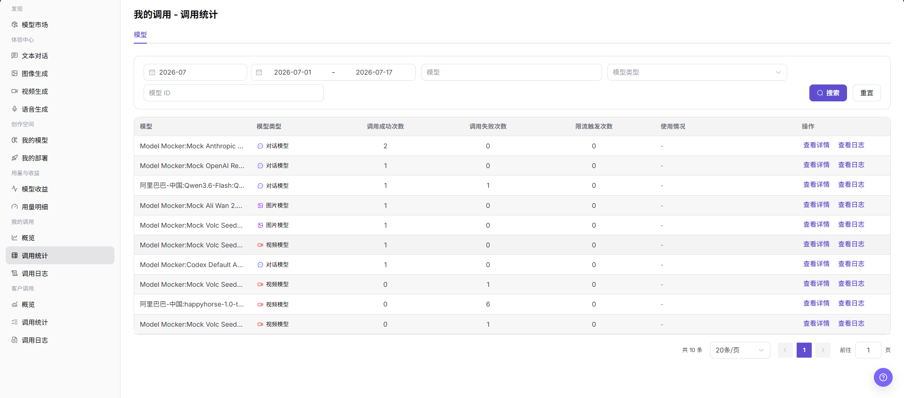

# 我的调用 - 调用统计

::: info 文档信息
版本：v1.0
更新日期：2026-07-08
:::

## 功能概述

`我的调用 - 调用统计` 用于按模型维度查看当前账号的调用统计，包括调用成功次数、调用失败次数、限流触发次数、使用情况和查看入口，帮助快速定位异常模型并跳转到详情或日志。

| 项目 | 内容 |
| --- | --- |
| 适用角色 | 普通用户 |
| 导航路径 | 模型及AI服务 > 我的调用 > 调用统计 |
| 页面路由 | /modelone/monitoring/calls/list/model |
| 管理对象 | 模型、模型类型、调用成功次数、调用失败次数、限流触发次数、使用情况和调用日志入口 |
| 典型用途 | 按模型查看当前账号的调用统计和异常情况 |

#### 新手理解

`调用统计` 像个人调用的模型排行榜。它按模型汇总成功、失败和限流次数，用户可以先用筛选项定位模型，再通过 `查看详情` 或 `查看日志` 继续排查。

#### 术语速查

| 术语 | 说明 |
| --- | --- |
| 调用成功次数 | 当前筛选范围内成功完成的调用次数。 |
| 调用失败次数 | 当前筛选范围内返回错误、超时或失败的调用次数。 |
| 限流触发次数 | 因模型、Key、额度或策略限制触发限流的次数。 |
| 使用情况 | 页面展示的模型使用状态或统计补充信息。 |
| 查看详情 | 进入模型维度的统计详情入口。 |
| 查看日志 | 跳转到调用日志，查看对应模型的请求记录。 |

## 前提条件

1. 当前账号具备 `调用统计` 页面访问权限。
2. 当前账号在统计周期内存在调用记录，或已确认需要查看的账期和日期范围。
3. 查看或截图前确认模型名、Key 名称、费用、业务应用和调用量是否需要脱敏。

::: warning 敏感信息边界
调用统计可能包含费用、调用量、Key 名称、业务应用、模型名称和异常调用等敏感运营数据。本文只描述查看统计，不展示真实账号、Key、请求内容、费用明细或内部测试参数；如页面存在导出入口，仅说明查看边界，不引导导出敏感数据。
:::

## 页面说明

页面顶部提供账期、日期范围、模型、模型类型和模型 ID 筛选项，并提供 `搜索`、`重置` 按钮。表格展示模型、模型类型、调用成功次数、调用失败次数、限流触发次数、使用情况和操作入口。

## 主要操作

### 查看我的调用统计

1. 进入 `模型及AI服务 > 我的调用 > 调用统计`。
2. 按页面筛选项选择账期、日期范围，并按需输入或选择 `模型`、`模型类型`、`模型 ID`。
3. 点击 `搜索` 刷新统计结果；如需清空筛选条件，点击 `重置`。
4. 在统计列表中查看 `模型`、`模型类型`、`调用成功次数`、`调用失败次数`、`限流触发次数` 和 `使用情况`。
5. 如需查看模型维度统计信息，点击 `查看详情`。
6. 如需查看单次请求明细，点击 `查看日志` 或进入 `调用日志` 页面。
7. 截图或对外沟通前，确认模型名、Key 名称、费用、调用量和业务应用等敏感信息已脱敏。

## 参数说明

| 字段名称 | 是否必填 | 字段类型 | 示例 | 说明 |
| --- | --- | --- | --- | --- |
| 时间范围 | 是 | 月份 / 日期范围 | `2026-07` | 控制调用统计的统计周期。 |
| 模型 | 否 | 输入框 / 选择项 | 按页面输入 | 按模型名称筛选统计结果。 |
| 应用 | 否 | 选择项 | 按页面展示 | 如页面提供应用维度，可按业务应用筛选调用统计。 |
| Key | 否 | 选择项 | 按页面展示 | 如页面提供 Key 维度，可按 Key 查看调用来源。 |
| 调用次数 | 系统生成 | 数值 | `2` | 当前筛选范围内的模型调用次数，可由成功、失败等统计项组成。 |
| Token 消耗 | 系统生成 | 数值 | 按页面展示 | 如页面展示 Token 维度，用于查看模型消耗情况。 |
| 费用 | 系统生成 | 数值 | 按页面单位展示 | 如页面展示费用维度，分享前需要脱敏。 |
| 成功率 | 系统生成 | 百分比 / 统计值 | 按页面计算 | 可由调用成功次数与总调用次数计算。 |
| 失败率 | 系统生成 | 百分比 / 统计值 | 按页面计算 | 可由调用失败次数与总调用次数计算。 |
| 平均延迟 | 系统生成 | 数值 | 按页面展示 | 如页面展示延迟维度，用于衡量调用响应速度。 |
| 状态 | 系统生成 | 标签 / 统计项 | `成功` / `失败` / `限流` | 用于区分调用成功、失败或限流触发情况。 |

## 结果校验

| 检查项 | 成功表现 | 异常时处理 |
| --- | --- | --- |
| 页面可进入 | `我的调用 - 调用统计` 页面正常打开，左侧 `我的调用 > 调用统计` 菜单高亮。 | 确认账号权限、导航路径和页面加载状态。 |
| 统计指标正常展示 | 模型、模型类型、调用成功次数、调用失败次数、限流触发次数和操作入口正常显示。 | 扩大时间范围或确认当前账号是否有调用记录。 |
| 图表或统计表正常加载 | 调用统计表正常加载并展示模型维度数据。 | 刷新页面，或切换账期、日期范围后重试。 |
| 筛选项可用 | 账期、日期范围、模型、模型类型、模型 ID 等筛选项可输入或选择。 | 点击 `重置` 后重新输入筛选条件。 |
| 搜索 / 重置可用 | 点击 `搜索` 后列表刷新，点击 `重置` 后筛选条件清空。 | 检查筛选条件格式和网络状态。 |
| 统计数据与筛选一致 | 表格中的模型、模型类型和调用次数随筛选条件同步变化。 | 对比调用日志，确认统计延迟和筛选范围。 |

## 常见问题

#### 调用统计为空怎么办？

先扩大账期或日期范围，再清空模型、模型类型和模型 ID 筛选条件。如仍为空，进入调用日志确认是否存在请求记录。

#### 为什么失败次数或限流次数异常？

可能是模型来源异常、请求参数变化、Key 或额度受限，或触发限流规则。可点击 `查看日志` 查看错误码、请求时间和状态。

#### 可以导出调用统计吗？

调用统计可能包含模型名称、Key、调用量、费用和业务应用信息。导出前应确认权限、脱敏要求和使用范围；本文不引导导出敏感数据。

## 后续操作

1. 点击 `查看详情` 查看模型维度统计信息。
2. 点击 `查看日志` 或进入 `调用日志` 排查单次请求。
3. 根据失败次数、限流触发次数和模型类型调整调用策略。

## 注意事项

- 不在文档中写入真实账号、Key、请求内容、费用明细或内部测试参数。
- 调用统计是聚合数据，排查单次请求时以调用日志为准。
- 对外沟通时只使用脱敏后的统计信息。
