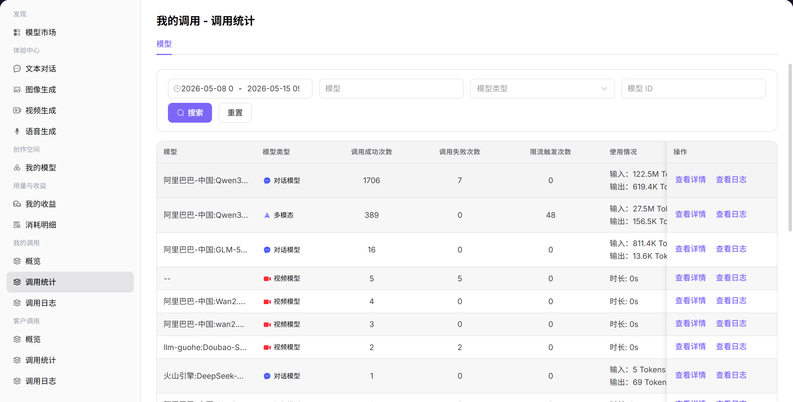

# 我的调用分析

## 功能概述

`我的调用分析` 用于维护或查看调用趋势、模型分布、Token 趋势、成功率和费用分析，支撑模型发布、体验、调用、统计和运营治理。

| 项目 | 内容 |
| --- | --- |
| 适用角色 | 普通用户 |
| 导航路径 | 我的调用 > 调用分析 |
| 页面路由 | /user/my-calls/call-analytics |
| 管理对象 | 调用趋势、模型分布、Token 趋势、成功率和费用分析 |
| 典型用途 | 分析我发起调用的趋势和统计口径 |

### 新手理解

我的调用分析像调用趋势报表，用来观察自己调用量、Token、成功率和费用随时间的变化。
### 术语速查

| 术语 | 说明 |
| --- | --- |
| 趋势 | 按时间聚合后的调用变化。 |
| 统计粒度 | 按小时、天或月汇总数据。 |
| 模型分布 | 不同模型的调用占比。 |
| 费用趋势 | 调用消耗随时间的变化。 |

## 前提条件

1. 当前账号具备调用分析查看权限。
2. 已确定统计时间范围和粒度。
3. 如需定位异常，已准备模型、应用或状态筛选条件。
## 页面说明

页面只分析当前账号调用趋势和统计口径，适合查看调用量、Token、成功率和费用随时间变化。

页面截图：

用于查看调用趋势、Token 趋势和成功率变化。

## 主要操作

### 操作步骤

1. 进入 `我的调用 > 调用分析`。
2. 选择统计时间和粒度。
3. 查看调用量、Token、成功率和费用趋势。
4. 按模型或应用拆分趋势。
5. 发现异常日期后回到调用日志抽样。

### 参数说明

| 字段名称 | 是否必填 | 字段类型 | 示例 | 说明 |
| --- | --- | --- | --- | --- |
| 统计粒度 | 是 | 枚举 | `天` | 小时、天或月等聚合口径。 |
| 时间范围 | 是 | 日期范围 | `近 30 天` | 趋势窗口。 |
| 模型 | 否 | 下拉选择 | `qwen-plus` | 趋势拆分对象。 |
| 调用量趋势 | 系统生成 | 图表 | `折线图` | 请求量变化。 |
| 费用趋势 | 系统生成 | 图表 | `柱状图` | 消耗变化。 |

### 踩坑提示

- 趋势图是聚合数据，不能替代单条日志。
- 跨月统计要注意计费口径和时区。
- 异常峰值需要结合发布、促销或客户调用变化解释。

### 结果校验

1. 趋势图展示调用量、Token、成功率和费用数据。
2. 切换统计粒度后，图表和汇总口径同步变化。
3. 异常峰值能与调用日志中的请求记录互相印证。
## 常见问题

### 趋势图出现异常峰值

**问题现象：**

某小时或某天调用量、Token 或费用明显升高。

**可能原因：**

- 业务流量突增。
- 调用方重试或循环调用。
- 统计补数任务合并入账。

**处理方式：**

1. 按模型和应用拆分查看。
2. 进入调用日志抽样失败和高 Token 请求。
3. 核对是否存在补数或业务活动。

### 趋势与总览数字不一致

**问题现象：**

调用分析图表汇总与总览卡片不完全一致。

**可能原因：**

- 统计粒度或时间范围不同。
- 数据同步存在延迟。
- 总览与趋势使用不同聚合口径。

**处理方式：**

1. 统一时间范围和筛选条件。
2. 等待统计同步。
3. 以导出明细或系统口径说明为准核对。
## 后续操作

1. 进入调用日志抽查异常请求。
2. 按模型或应用调整调用策略。
3. 结合费用数据评估成本变化。
## 注意事项

- 趋势图是聚合数据，不适合定位单次请求原因。
- 跨日或跨月分析时注意时区和统计周期。
- 截图前遮挡费用、客户标识和业务应用名称。
