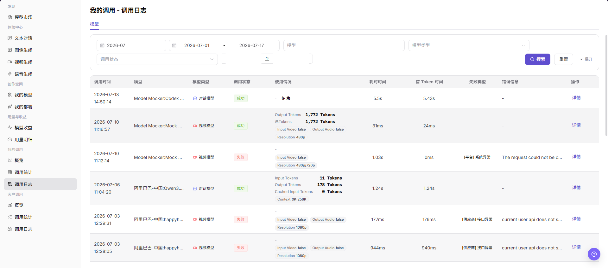

# 我的调用 - 调用日志

::: info 文档信息
版本：v1.0
更新日期：2026-07-08
:::

## 功能概述

`我的调用 - 调用日志` 用于查看当前账号发起的模型调用记录，包括调用时间、模型、模型类型、调用状态、使用情况、耗时时间、首 Token 时间、失败类型、错误信息和详情入口，帮助用户定位单次调用问题。

| 项目 | 内容 |
| --- | --- |
| 适用角色 | 普通用户 |
| 导航路径 | 模型及AI服务 > 我的调用 > 调用日志 |
| 页面路由 | `/modelone/monitoring/calls/log` |
| 管理对象 | 当前账号的模型调用日志、调用状态、耗时、Token 使用和错误信息 |
| 典型途径 | 查看单次调用日志并定位失败或耗时异常 |

#### 新手理解

调用日志像每次模型请求的小票。用户可以按时间、模型、模型类型或调用状态筛选记录，再通过 `详情` 查看单次调用的更多信息。

#### 术语速查

| 术语 | 说明 |
| --- | --- |
| 调用时间 | 单次调用发生的时间。 |
| 调用状态 | 调用处理结果，例如 `成功` 或 `失败`。 |
| 使用情况 | 页面展示的 Token、免费额度或多模态输入输出使用情况。 |
| 耗时时间 | 请求从发起到完成的总耗时。 |
| 首 Token 时间 | 文本类模型返回首个 Token 的耗时。 |
| 失败类型 | 失败请求的归类，例如平台异常或供应商接口异常。 |

## 前提条件

1. 当前账号具备 `调用日志` 页面访问权限。
2. 已明确需要查看的时间范围、模型、模型类型或调用状态。
3. 排查问题时只使用脱敏后的日志信息。

## 页面说明

调用日志可能包含请求内容、响应内容、Key 名称、费用、错误详情和业务排障信息。本文只描述查看日志，不展示真实请求、响应、Key、账号、费用明细或内部测试参数；如页面存在导出入口，仅说明查看边界，不引导导出敏感数据。

页面截图：

## 主要操作

### 查看我的调用日志

1. 进入 `模型及AI服务 > 我的调用 > 调用日志`。
2. 在 `模型` 页签下查看调用时间、模型、模型类型、调用状态、使用情况、耗时时间、首 Token 时间、失败类型、错误信息和操作入口。
3. 按页面筛选项选择月份、日期范围、模型、模型类型或调用状态。
4. 点击 `搜索` 查看符合条件的调用日志。
5. 点击 `重置` 清空筛选条件；如需查看更多筛选项，点击 `展开`。
6. 点击目标日志的 `详情`，查看单次调用的更多信息；查看时注意隐藏请求、响应、Key、费用等敏感内容。

## 参数说明

| 字段名称 | 是否必填 | 字段类型 | 示例 | 说明 |
| --- | --- | --- | --- | --- |
| 月份 | 是 | 月份选择 | `2026-07` | 控制调用日志的统计月份。 |
| 日期范围 | 是 | 日期范围 | `2026-07-01 至 2026-07-17` | 控制调用日志的查询时间范围。 |
| 模型 | 否 | 输入框 | 按页面输入 | 按模型名称筛选调用日志。 |
| 模型类型 | 否 | 选择项 | `对话模型` / `视频模型` | 按模型能力类型筛选调用日志。 |
| 调用状态 | 否 | 选择项 | `成功` / `失败` | 按调用处理结果筛选日志。 |
| 调用时间 | 系统生成 | 时间 | 按页面展示 | 展示单次调用发生时间。 |
| 使用情况 | 系统生成 | 文本 / 标签 | 按页面展示 | 展示 Token、免费额度或多模态输入输出使用情况。 |
| 耗时时间 | 系统生成 | 时间 | 按页面展示 | 展示单次调用总耗时。 |
| 首 Token 时间 | 系统生成 | 时间 | 按页面展示 | 展示首个 Token 返回耗时。 |
| 失败类型 | 系统生成 | 文本 | 按页面展示 | 展示失败请求的问题归类。 |
| 错误信息 | 系统生成 | 文本 | 按页面展示 | 展示失败请求的错误摘要，截图和对外沟通时需脱敏。 |
| 操作 | 否 | 操作入口 | `详情` | 进入单次调用日志详情。 |

## 结果校验

| 检查项 | 成功表现 | 异常时处理 |
| --- | --- | --- |
| 页面可进入 | `我的调用 - 调用日志` 页面正常打开，左侧 `我的调用 > 调用日志` 菜单高亮。 | 确认账号权限、导航路径和页面加载状态。 |
| 调用日志列表正常加载 | 列表展示调用时间、模型、调用状态、使用情况、耗时和错误信息等列。 | 刷新页面，或调整月份、日期范围后重试。 |
| 筛选项可用 | 按月份、日期范围、模型、模型类型或调用状态筛选后，列表刷新。 | 检查筛选条件是否过窄，必要时点击 `重置`。 |
| 搜索 / 重置可用 | 点击 `搜索` 后展示匹配日志，点击 `重置` 后清空筛选条件。 | 检查网络状态、页面接口返回和账号权限。 |
| 日志详情可打开 | 点击 `详情` 后可查看单次调用的更多信息。 | 确认该记录仍在日志保留周期内。 |
| 字段信息一致 | 调用状态、耗时、使用情况、失败类型和错误信息与详情页一致。 | 重新打开详情或扩大时间范围交叉确认。 |

## 常见问题

#### 查不到目标调用日志怎么办？

先确认月份和日期范围覆盖调用发生时间，再检查模型、模型类型和调用状态筛选条件。必要时点击 `重置` 后重新查询。

#### 为什么调用状态显示失败？

失败通常与请求参数、模型服务、供应商接口、平台异常、限流或额度有关。先查看失败类型和错误信息，再进入 `详情` 查看脱敏后的单次调用信息。

#### 可以导出调用日志吗？

调用日志可能包含请求、响应、Key、费用和错误详情。导出前应确认权限、脱敏要求和使用范围；本文只描述查看日志，不引导导出敏感数据。

## 后续操作

1. 根据失败类型和错误信息调整请求参数或调用方式。
2. 需要排查单次请求时，进入 `详情` 查看脱敏后的日志信息。
3. 如果需要判断是否为批量异常，返回 `我的调用 > 调用统计` 查看聚合数据。

## 注意事项

- 不要在文档、截图或工单中展示完整请求、响应正文、Key、账号或费用明细。
- 调用日志数据可能按保留周期清理，排查问题时应优先确认时间范围。
- 错误信息仅用于定位问题，公开沟通前必须脱敏。
