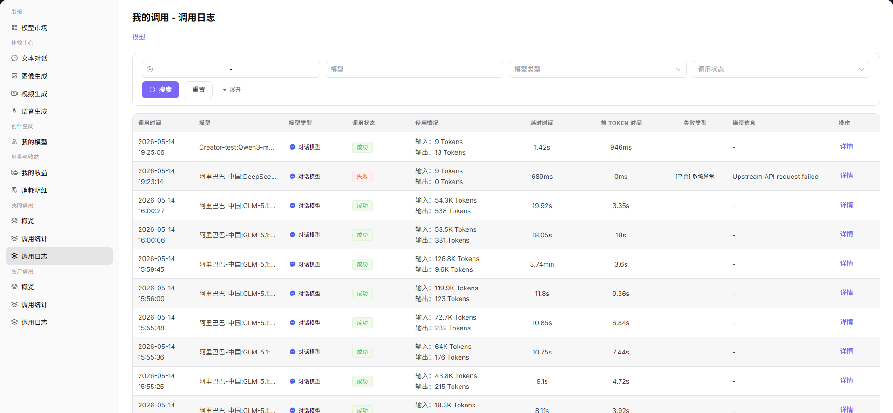

# 我的调用日志

:::: info 文档信息
版本：v1.0
更新日期：2026-07-06
::::

## 功能概述

`我的调用日志` 用于维护或查看单次请求日志、请求 ID、错误码、延迟、Token 和上游返回摘要，支撑模型发布、体验、调用、统计和运营治理。

| 项目 | 内容 |
| --- | --- |
| 适用角色 | 普通用户 |
| 导航路径 | 我的调用 > 调用日志 |
| 页面路由 | /user/my-calls/call-logs |
| 管理对象 | 单次请求日志、请求 ID、错误码、延迟、Token 和上游返回摘要 |
| 典型用途 | 排查我发起的单次调用问题 |

### 新手理解

我的调用日志像每一笔请求的小票，记录请求 ID、错误码、延迟、Token 和脱敏摘要，适合定位单次失败。
### 术语速查

| 术语 | 说明 |
| --- | --- |
| 请求 ID | 单次调用的唯一追踪标识。 |
| 错误码 | 调用失败的错误类型。 |
| 延迟 | 请求从发起到返回的耗时。 |
| 上游返回 | 模型供应方返回的状态或错误摘要。 |

## 前提条件

1. 当前账号具备我的调用日志查看权限。
2. 已准备请求 ID、时间范围、模型名称或错误码等定位条件。
3. 排障时只使用脱敏后的请求摘要。
## 页面说明

页面只用于查看当前账号发起的单次请求日志。排障时围绕请求 ID、错误码、状态、延迟和脱敏响应摘要展开。

页面截图：

用于按请求 ID、错误码和延迟定位单次调用。

## 主要操作

### 操作步骤

1. 进入 `我的调用 > 调用日志`。
2. 输入请求 ID 或选择时间范围。
3. 按模型、状态或错误码筛选。
4. 打开单条日志查看延迟、Token 和错误摘要。
5. 根据错误码回到模型配置或额度页面处理。

### 参数说明

| 字段名称 | 是否必填 | 字段类型 | 示例 | 说明 |
| --- | --- | --- | --- | --- |
| 请求 ID | 条件必填 | 文本 | `req-20260706-001` | 单次请求追踪标识。 |
| 错误码 | 否 | 文本 | `429` | 失败请求类型。 |
| 状态 | 否 | 枚举 | `失败` | 请求处理结果。 |
| 延迟 | 系统生成 | 数值 | `820ms` | 请求耗时。 |
| Token 用量 | 系统生成 | 数值 | `2048` | 该请求消耗。 |

### 踩坑提示

- 不要把完整 Prompt 或响应内容复制到公开工单。
- 请求 ID 是排障关键，截图时保留脱敏后的 ID。
- 429 多数与限流或额度有关，不一定是模型不可用。

### 结果校验

1. 能按请求 ID、状态、模型或时间范围定位记录。
2. 日志详情展示错误码、延迟、Token 和脱敏摘要。
3. 失败请求能关联到可执行的处理建议。
## 常见问题

### 用请求 ID 查不到日志

**问题现象：**

输入请求 ID 后没有匹配记录。

**可能原因：**

- 请求 ID 输入不完整。
- 时间范围没有覆盖请求发生时间。
- 该请求不属于当前账号。

**处理方式：**

1. 核对完整请求 ID。
2. 扩大时间范围。
3. 确认当前账号是否为请求发起方。

### 日志显示 429 或限流

**问题现象：**

请求状态失败，错误码指向限流或频率限制。

**可能原因：**

- 短时间请求量超过模型限流。
- 客户或账号配额不足。
- 重试策略过于激进。

**处理方式：**

1. 降低并发或增加退避重试。
2. 检查配额和限流策略。
3. 必要时申请调整限流。
## 后续操作

1. 根据错误码调整请求参数。
2. 将请求 ID 提供给运营方继续排查。
3. 回到调用分析查看是否为批量异常。
## 注意事项

- 不要复制完整 Prompt、响应正文或 API Key 到工单。
- 请求 ID、时间范围和错误码是排障优先信息。
- 日志数据可能按保留周期清理。
