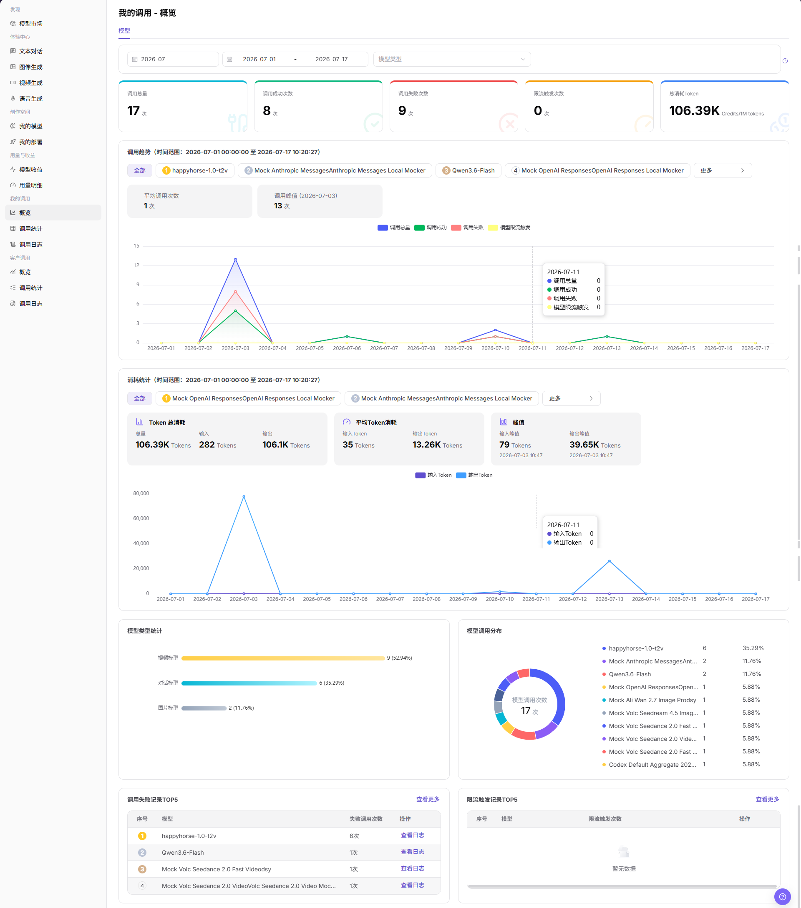

# 我的调用 - 概览

::: info 文档信息
版本：v1.0
更新日期：2026-07-08
:::

## 功能概述

`我的调用 - 概览` 用于查看当前账号发起调用的总体情况，包括调用总量、调用成功次数、调用失败次数、限流触发次数、总消耗 Token、调用趋势、消耗统计、模型类型统计和模型调用分布。

| 项目 | 内容 |
| --- | --- |
| 适用角色 | 普通用户 |
| 导航路径 | 模型及AI服务 > 我的调用 > 概览 |
| 页面路由 | /modelone/monitoring/calls/overview/model |
| 管理对象 | 我的调用次数、成功/失败调用、限流触发、Token 消耗、模型类型和调用分布 |
| 典型用途 | 查看个人调用健康度和消耗趋势 |

#### 新手理解

`我的调用 - 概览` 像个人调用仪表盘。它先展示当前账号的调用总量、成功失败情况和 Token 消耗，再通过趋势图和统计图帮助定位异常模型或异常时间段。

#### 术语速查

| 术语 | 说明 |
| --- | --- |
| 调用总量 | 当前账号在筛选范围内发起的请求总次数。 |
| 调用成功次数 | 成功完成的请求次数。 |
| 调用失败次数 | 返回错误、超时或失败状态的请求次数。 |
| 限流触发次数 | 因模型、Key、额度或策略限制触发限流的次数。 |
| 总消耗 Token | 当前筛选范围内输入和输出 Token 的汇总消耗。 |
| 调用趋势 | 按时间展示调用总量、调用成功、调用失败和模型限流触发变化。 |
| 消耗统计 | 展示总 Token 消耗、平均 Token 消耗、峰值等统计信息。 |

## 前提条件

1. 当前账号具备 `概览` 页面访问权限。
2. 当前账号在统计周期内存在调用记录，或已确认需要查看的时间范围。
3. 查看或截图前确认模型名、Key 名称、费用和业务标识是否需要脱敏。

::: warning 敏感信息边界
调用概览可能展示费用、调用量、模型名称、Key 名称、Token 消耗和异常趋势等运营敏感数据。本文只描述查看概览，不展示真实账号、Key、请求内容、费用明细或内部测试参数；如页面存在导出入口，仅说明查看边界，不引导导出敏感数据。
:::

## 页面说明

页面顶部提供账期、日期范围和模型类型筛选项，下方展示 `调用总量`、`调用成功次数`、`调用失败次数`、`限流触发次数`、`总消耗Token` 等概览卡片，并通过调用趋势、消耗统计、模型类型统计、模型调用分布、调用失败记录 TOP5 和限流触发记录 TOP5 辅助分析调用情况。

## 主要操作

### 查看我的调用概览

1. 进入 `模型及AI服务 > 我的调用 > 概览`。
2. 按页面筛选项选择账期、日期范围和模型类型。
3. 查看 `调用总量`、`调用成功次数`、`调用失败次数`、`限流触发次数`、`总消耗Token` 等概览指标。
4. 查看 `调用趋势` 和 `消耗统计`，核对平均调用次数、调用峰值、Token 总消耗、平均 Token 消耗和峰值。
5. 查看 `模型类型统计`、`模型调用分布`、`调用失败记录TOP5` 和 `限流触发记录TOP5`。
6. 如需进一步排查异常模型或异常时间段，点击页面中的 `查看更多`、`查看日志` 或进入 `调用统计`、`调用日志` 页面查看明细。
7. 截图或对外沟通前，确认模型名、Key 名称、费用、Token 和调用量等敏感信息已脱敏。

## 参数说明

| 字段名称 | 是否必填 | 字段类型 | 示例 | 说明 |
| --- | --- | --- | --- | --- |
| 时间范围 | 是 | 月份 / 日期范围 | `2026-07` | 控制概览统计周期。 |
| 模型 | 否 | 标签 / 选择项 | `全部` | 在趋势或统计区按模型查看数据。 |
| 应用 | 否 | 选择项 | 按页面展示 | 如页面提供应用维度，可按应用筛选调用概览。 |
| Key | 否 | 选择项 | 按页面展示 | 如页面提供 Key 维度，可按 Key 查看调用来源。 |
| 调用次数 | 系统生成 | 数值 | `17` | 当前筛选范围内的调用总量。 |
| Token 消耗 | 系统生成 | 数值 | `106.39K` | 输入和输出 Token 的汇总消耗。 |
| 费用 | 系统生成 | 数值 | 按页面单位展示 | 调用消耗或费用统计，展示时需注意脱敏。 |
| 成功率 | 系统生成 | 百分比 / 统计值 | 按页面计算 | 可由调用成功次数与调用总量计算。 |
| 失败率 | 系统生成 | 百分比 / 统计值 | 按页面计算 | 可由调用失败次数与调用总量计算。 |
| 状态 | 系统生成 | 标签 / 统计项 | `成功` / `失败` / `限流` | 用于区分调用成功、失败或限流触发情况。 |

## 结果校验

| 检查项 | 成功表现 | 异常时处理 |
| --- | --- | --- |
| 页面可进入 | `我的调用 - 概览` 页面正常打开，左侧 `我的调用 > 概览` 菜单高亮。 | 确认账号权限、导航路径和页面加载状态。 |
| 概览指标正常展示 | 调用总量、调用成功次数、调用失败次数、限流触发次数和总消耗 Token 正常显示。 | 扩大时间范围或确认当前账号是否有调用记录。 |
| 趋势图正常加载 | 调用趋势、消耗统计、模型类型统计和模型调用分布正常显示。 | 刷新页面，或切换账期、日期范围后重试。 |
| 筛选项可用 | 账期、日期范围、模型类型等筛选项可选择。 | 清空筛选条件后重新查看。 |
| 搜索 / 重置可用 | 如页面提供 `搜索`、`查询` 或 `重置`，筛选结果可刷新或清空。 | 检查筛选条件格式和网络状态。 |
| 数据与筛选一致 | 指标、趋势图和 TOP5 记录随筛选条件同步变化。 | 对比调用统计或调用日志，确认统计延迟和筛选范围。 |

## 常见问题

#### 概览数据为空怎么办？

先扩大账期或日期范围，再确认当前账号是否在该范围内发起过调用。如仍为空，进入调用日志确认是否有请求记录。

#### 成功率突然下降怎么办？

查看调用失败记录 TOP5 和调用趋势，定位异常模型或时间段；再进入调用日志查看错误码、请求时间、Key、额度、限流和模型来源状态。

#### 可以截图或导出调用概览吗？

可以用于内部排查，但截图或导出前需要遮挡模型名、Key 名称、费用、Token、业务标识和其他敏感信息。本文不引导导出敏感数据。

## 后续操作

1. 进入 `调用统计` 查看更细的趋势和维度分析。
2. 进入 `调用日志` 查看单次请求、错误码和请求状态。
3. 根据失败记录、限流触发和 Token 峰值调整调用策略。

## 注意事项

- 不在文档中写入真实账号、Key、请求内容、费用明细或内部测试参数。
- 概览统计可能存在延迟，排查单次请求时以调用日志为准。
- 对外沟通时只使用脱敏后的聚合信息。
