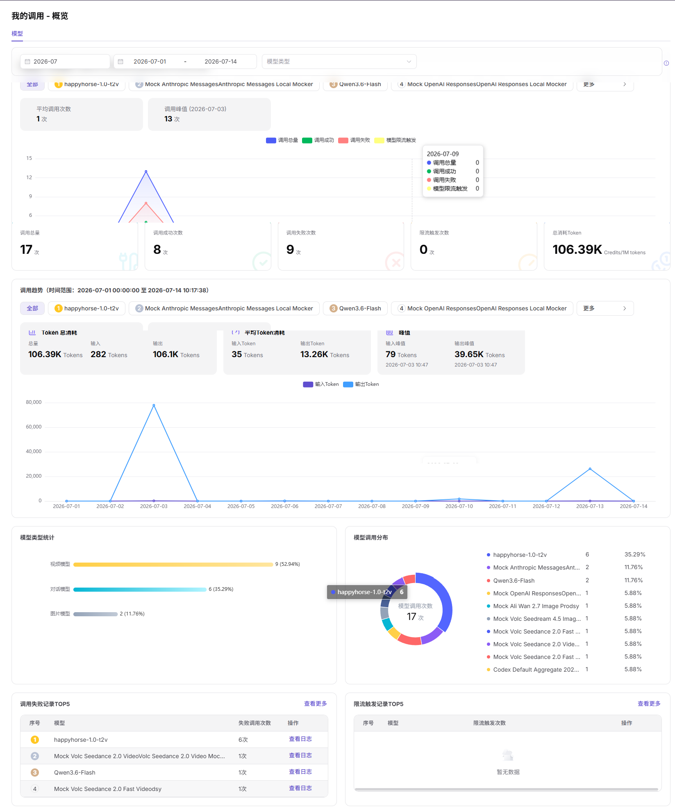

# 我的调用总览

:::: info 文档信息
版本：v1.0
更新日期：2026-07-08
::::

## 功能概述

`我的调用总览` 用于维护或查看我发起的调用量、成功率、Token 用量、费用和核心模型指标，支撑模型发布、体验、调用、统计和运营治理。

| 项目 | 内容 |
| --- | --- |
| 适用角色 | 普通用户 |
| 导航路径 | 我的调用 > 总览 |
| 页面路由 | /user/my-calls/overview |
| 管理对象 | 我发起的调用量、成功率、Token 用量、费用和核心模型指标 |
| 典型用途 | 查看本人调用总体情况 |

### 新手理解

我的调用总览像个人账单首页，用来快速查看自己发起调用的调用量、成功率、Token 和费用概况。
### 术语速查

| 术语 | 说明 |
| --- | --- |
| 调用量 | 当前账号发起的请求次数。 |
| Token 用量 | 输入和输出 Token 消耗。 |
| 成功率 | 成功请求占总请求比例。 |
| 费用 | 按计费规则折算的调用消耗。 |

## 前提条件

1. 当前账号具备我的调用总览查看权限。
2. 已选择需要统计的时间范围。
3. 如需对账，已确认模型、应用或调用方筛选条件。
## 页面说明

页面只展示当前账号发起调用的总览指标，包括调用量、成功率、Token 用量和费用。它不用于查看单次请求详情。

页面截图：

用于查看自己发起调用的调用量、成功率、Token 和费用。

## 主要操作

### 操作步骤

1. 进入 `我的调用 > 总览`。
2. 选择时间范围。
3. 查看调用量、成功率、Token 用量和费用卡片。
4. 按模型或应用筛选总览结果。
5. 发现异常后跳转到调用日志或调用分析。

### 参数说明

| 字段名称 | 是否必填 | 字段类型 | 示例 | 说明 |
| --- | --- | --- | --- | --- |
| 时间范围 | 是 | 日期范围 | `近 7 天` | 总览统计窗口。 |
| 模型 | 否 | 下拉选择 | `qwen-plus` | 按模型筛选总览。 |
| 调用量 | 系统生成 | 数值 | `1024` | 当前账号请求次数。 |
| 成功率 | 系统生成 | 百分比 | `99.5%` | 成功请求占比。 |
| 费用 | 系统生成 | 数值 | `12.3 Credits` | 调用消耗。 |

### 踩坑提示

- 总览不展示请求正文，排查单次错误请进入调用日志。
- 统计数据可能有延迟，不适合秒级排障。
- 费用异常要结合模型用量和计费规则核对。

### 结果校验

1. 调用量、成功率、Token 用量和费用卡片展示数据。
2. 切换时间范围后，趋势和汇总卡片同步变化。
3. 概览中的异常峰值能跳转或关联到调用日志。
## 常见问题

### 总览数据为空

**问题现象：**

当前时间范围内调用量、Token 或费用均为空。

**可能原因：**

- 当前账号在该时间范围内没有发起调用。
- 筛选模型或应用过窄。
- 统计任务尚未完成。

**处理方式：**

1. 扩大时间范围后重新查看。
2. 清空模型或应用筛选条件。
3. 等待统计同步后复核。

### 成功率突然下降

**问题现象：**

总览卡片显示成功率明显低于平时。

**可能原因：**

- 某个模型限流、超时或不可用。
- 请求参数错误集中出现。
- 调用方短时间重试导致失败量增加。

**处理方式：**

1. 按模型拆分查看异常来源。
2. 进入调用日志筛选失败请求。
3. 根据错误码调整调用参数或联系运营方。
## 后续操作

1. 进入我的调用日志查看单次请求。
2. 进入调用分析查看趋势变化。
3. 根据异常模型或时间段调整调用策略。
## 注意事项

- 总览页只展示聚合数据，不展示完整 Prompt 或响应正文。
- 费用和 Token 统计可能存在延迟。
- 导出或截图前遮挡模型名、应用名和费用敏感信息。
