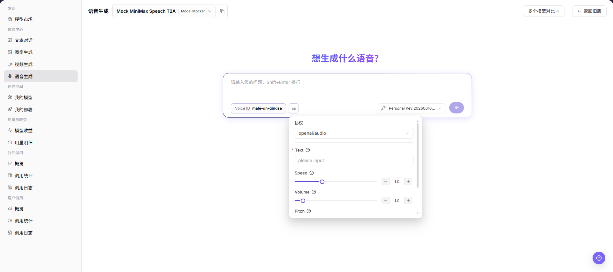
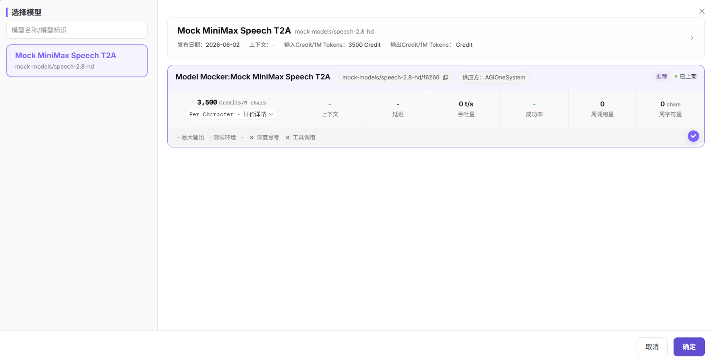

# 语音生成

::: info 文档信息
版本：v1.0
更新日期：2026-07-08
:::

## 功能概述

`语音生成` 用于选择音频模型，输入要转换为语音的文本，并配置 Voice ID、语速、音量、音调等参数，查看音频生成结果或调用状态。

| 项目 | 内容 |
| --- | --- |
| 适用角色 | 普通用户 |
| 导航路径 | 模型及AI服务 > 体验中心 > 语音生成 |
| 页面路由 | /modelone/exploration/audio |
| 管理对象 | 音频模型、Voice ID、文本内容、协议、语速、音量、音调和生成结果 |
| 典型用途 | 在页面内体验文本转语音类音频模型效果 |

#### 新手理解

音频体验区像语音模型的试听间。用户选择音频模型后，输入希望生成语音的文本，选择 Voice ID，并按页面能力调整语速、音量、音调等参数，观察生成结果是否符合预期。

#### 术语速查

| 术语 | 说明 |
| --- | --- |
| Voice ID | 语音音色或发音人标识。 |
| Text | 需要转换为语音的文本内容。 |
| Protocol | 当前模型调用协议，页面示例为 `openai/audio`。 |
| Speed | 语速参数，用于控制生成语音的快慢。 |
| Volume | 音量参数，用于控制生成语音的响度。 |
| Pitch | 音调参数，用于控制生成语音的高低。 |

## 前提条件

1. 当前账号具备`语音生成` 页面访问权限。
2. 目标音频模型已上架并可体验。
3. 已确认文本内容不包含敏感信息、隐私数据或未授权内容。
4. 已了解点击发送或生成类按钮可能产生真实模型调用和费用记录。

::: warning 调用与内容风险
点击页面发送按钮会产生真实模型调用，可能消耗额度、产生账务记录或调用日志。不要输入个人隐私、客户资料、密钥、受版权限制文本或未授权内容；仅学习或验证页面时，只查看字段和参数区，不提交真实调用请求。
:::

## 页面说明

页面用于体验文本转语音类音频模型，重点关注模型选择、Voice ID、文本输入、协议、语速、音量、音调、个人 Key 和结果区。页面右侧参数面板用于维护生成参数，顶部模型选择器用于切换可体验的音频模型。

## 主要操作

### 体验音频模型

1. 进入 `模型及AI服务 > 体验中心 > 语音生成`。
2. 在模型选择区选择要体验的音频模型。
3. 在输入框中填写要生成语音的文本内容。
4. 按页面字段选择 `Voice ID`，并确认 `Protocol`、`Text`、`Speed`、`Volume`、`Pitch` 等参数。
5. 点击 `发送` 或页面真实调用按钮前确认输入内容、参数和 Key 选择无误。
6. 如仅学习或验证页面，请不要提交真实调用请求；可只查看页面字段、参数区和结果区。

选择模型弹窗用于查看模型名称、模型标识、供应方、价格、上下文、延迟、吞吐量、成功率、周调用量、周字符量等信息，并通过 `取消` 或 `确定` 关闭选择。

参数区用于确认 Voice ID、协议、文本、语速、音量、音调和发送入口。

## 参数说明

| 字段名称 | 是否必填 | 字段类型 | 示例 | 说明 |
| --- | --- | --- | --- | --- |
| 模型 | 是 | 下拉选择 | `Mock MiniMax Speech T2A` | 当前体验的音频模型。 |
| Voice ID | 是 | 输入或选择 | `male-qn-qingse` | 指定生成语音的音色或发音人。 |
| Text | 是 | 文本输入 | `please input` | 需要转换为语音的文本内容。 |
| Protocol | 是 | 下拉选择 | `openai/audio` | 当前音频模型调用协议。 |
| Speed | 否 | 滑块 / 数字输入 | `1.0` | 控制生成语音的速度。 |
| Volume | 否 | 滑块 / 数字输入 | `1.0` | 控制生成语音的音量。 |
| Pitch | 否 | 滑块 / 数字输入 | `1.0` | 控制生成语音的音调。 |
| Key | 是 | 下拉选择 | `Personal Key` | 用于发起体验调用的 Key。 |
| 生成结果 | 否 | 结果区 | 音频结果或状态提示 | 展示生成音频、任务状态或错误提示。 |

## 踩坑提示

- 不要输入真实客户资料、身份证号、手机号、密钥或其他敏感文本。
- 语音生成可能涉及声音合成、版权和合规风险，正式使用前需确认文本来源和使用授权。
- Speed、Volume、Pitch 参数过大或过小可能导致听感异常。
- 点击发送按钮会产生真实调用，可能消耗额度并写入调用日志。

## 结果校验

| 检查项 | 成功表现 | 异常时处理 |
| --- | --- | --- |
| 页面可进入 | `语音生成` 页面正常打开，左侧体验中心菜单和顶部模型选择区可见。 | 确认账号权限、导航路径和页面加载状态。 |
| 模型可选择 | 模型选择弹窗正常打开，能看到模型名称、供应方、价格和状态。 | 确认可用模型是否已上架，或切换其他模型。 |
| 输入区可见 | 文本输入框、Voice ID、Key 和发送入口正常显示。 | 刷新页面或检查模型能力配置。 |
| 参数区可见 | `Protocol`、`Text`、`Speed`、`Volume`、`Pitch` 等字段正常显示。 | 检查参数面板是否展开，或重新选择模型。 |
| 结果区可见 | 如执行真实调用，页面能展示音频结果、任务状态或错误提示。 | 记录请求 ID 或错误信息，并核对文本、Key 和参数配置。 |

## 常见问题

#### 点击发送前需要确认什么？

确认模型、Voice ID、Text、Key、Speed、Volume、Pitch 等配置无误，并确认文本内容不包含敏感信息或未授权内容。

#### 为什么生成语音听感异常？

可能是文本内容、Voice ID、Speed、Volume 或 Pitch 配置不合适。可先恢复默认参数，再逐项调整。

#### 仅学习页面时可以点击发送吗？

不建议。点击发送会产生真实模型调用，可能消耗额度、产生账务记录或调用日志。仅学习或验证页面时，只查看字段、参数区和结果区。

## 后续操作

1. 记录适合业务场景的模型、Voice ID 和参数组合。
2. 如调用失败，进入调用日志查看错误信息。
3. 正式集成前，确认文本来源、音频生成合规要求和费用预算。

## 注意事项

- 不写入测试账号、密码、访问参数或内部测试过程。
- 不在文档中展示真实密钥、Token、AK/SK 或私钥。
- 截图或导出前确认页面不包含敏感文本、个人声音信息或真实业务数据。
