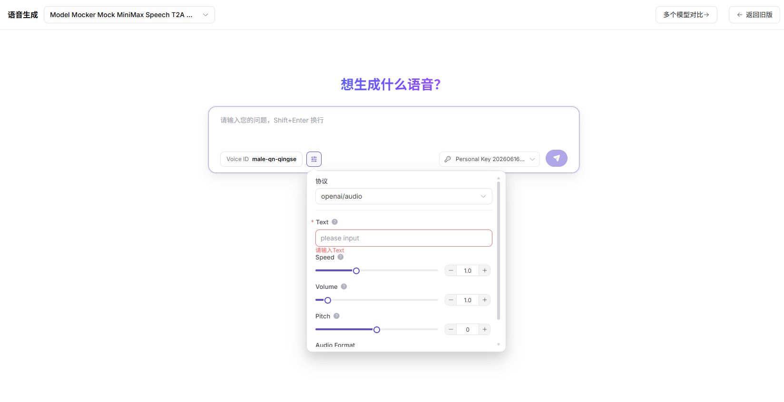

# 音频体验

::: info 文档信息
版本：v1.0
更新日期：2026-07-06
:::

::: warning 安全提示
Model Services 文档和截图中不要暴露真实 API Key、AK/SK、Secret Key、Endpoint、请求头认证值、模型源凭据、内部访问地址、客户名称或业务敏感数据；示例统一使用占位符。
:::

## 功能概述

`音频体验` 用于维护或查看音频模型、输入文件、识别或生成参数和输出结果，支撑模型发布、体验、调用、统计和运营治理。

| 项目 | 内容 |
| --- | --- |
| 适用角色 | 普通用户 |
| 导航路径 | 体验中心 > 音频 |
| 页面路由 | /user/playground/audio |
| 管理对象 | 音频模型、输入文件、识别或生成参数和输出结果 |
| 典型用途 | 测试语音识别、语音生成或音频理解模型 |

### 新手理解

音频体验区像模型的试听间，可以上传或输入音频相关内容，快速验证语音识别、语音生成或音频理解模型的效果。

### 术语速查

| 术语 | 说明 |
| --- | --- |
| 音频输入 | 用于语音识别、语音生成或音频理解的音频样本。 |
| 采样率 | 音频每秒采样次数，影响模型兼容性和识别质量。 |
| 语言 | 音频内容或输出内容的语言设置。 |
| 输出格式 | 文本、音频或结构化结果等返回形式。 |
## 前提条件

1. 当前账号具备音频体验页面访问权限。
2. 目标音频模型已可体验。
3. 音频样本已脱敏并确认授权。
4. 已确认格式、采样率和时长在模型支持范围内。
## 页面说明

页面用于体验音频类模型，关注输入音频格式、采样率、语言、输出文本或音频结果、延迟和错误提示。用户应使用脱敏样本，不上传包含客户隐私的原始录音。

页面截图：

选择语音识别、语音生成或音频理解模型。

## 主要操作

### 操作步骤

1. 进入 `体验中心 > 音频`。
2. 选择音频模型和供应方。
3. 上传脱敏音频或填写音频输入参数。
4. 按需要设置语言、采样率、输出格式和流式返回。
5. 发送请求并根据结果、延迟和错误提示调整参数。

关键步骤截图：

确认音频格式、采样率、语言和输出格式。

### 参数说明

| 字段名称 | 是否必填 | 字段类型 | 示例 | 说明 |
| --- | --- | --- | --- | --- |
| 音频文件 | 条件必填 | 文件 | `sample.wav` | 用于识别、理解或生成的音频样本。 |
| 语言 | 否 | 下拉选择 | `zh-CN` | 帮助模型选择识别或生成语言。 |
| 采样率 | 否 | 数字 | `16000` | 音频采样率。 |
| 输出格式 | 否 | 枚举 | `text` | 返回文本、音频或结构化结果。 |
| Stream | 否 | 开关 | `开启` | 控制是否流式返回结果。 |

### 踩坑提示

- 不要上传真实客户通话、身份证号、手机号等敏感录音。
- 音频格式或采样率不匹配会导致识别失败。
- 长音频可能触发超时、Token 或计费限制。

### 结果校验

1. 页面返回识别文本、生成音频或结构化结果。
2. 语言、采样率和输出格式参数变化后，结果符合预期。
3. 失败时能看到请求 ID、错误码或格式限制提示。
## 常见问题

### 音频上传后识别失败

**问题现象：**

页面返回格式错误或无法识别。

**可能原因：**

- 音频格式不支持。
- 采样率或声道不符合模型要求。
- 文件过大或时长过长。

**处理方式：**

1. 转换为模型支持的格式。
2. 调整采样率和声道。
3. 截取较短脱敏样本重试。

### 返回内容不完整

**问题现象：**

识别文本缺失或生成音频被截断。

**可能原因：**

- 输入音频质量差。
- 输出长度限制过小。
- 请求超时或流式连接中断。

**处理方式：**

1. 更换清晰样本。
2. 调大输出限制。
3. 检查网络和流式设置。

### 音频文件过大或格式不支持

**问题现象：**

上传音频后页面提示格式不支持、文件过大、时长超限或无法解析。

**可能原因：**

- 文件格式、采样率或声道不在模型支持范围。
- 音频时长过长，超过单次体验限制。
- 文件中包含损坏片段或编码不规范。

**处理方式：**

1. 转换为模型支持的格式，例如 WAV 或 MP3。
2. 截取短样本并确认采样率、声道和时长。
3. 使用脱敏样本重试，并在失败时记录请求 ID 和错误码。

## 后续操作

1. 保存有效音频参数组合。
2. 进入调用日志查看失败请求。
3. 评估音频模型是否适合正式集成。
## 注意事项

- 不要上传真实客户通话、身份证号、手机号等敏感录音。
- 长音频可能触发超时、费用或长度限制。
- 导出或截图前确认音频内容已脱敏。
