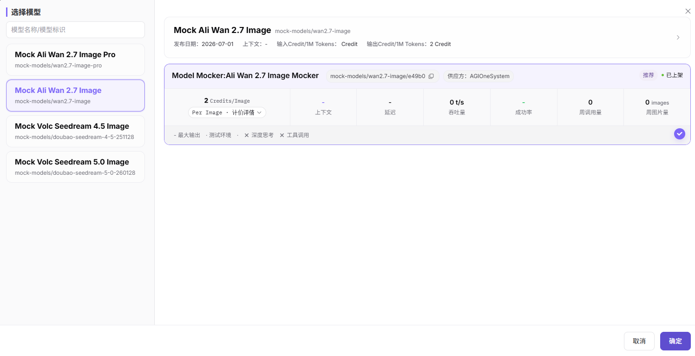
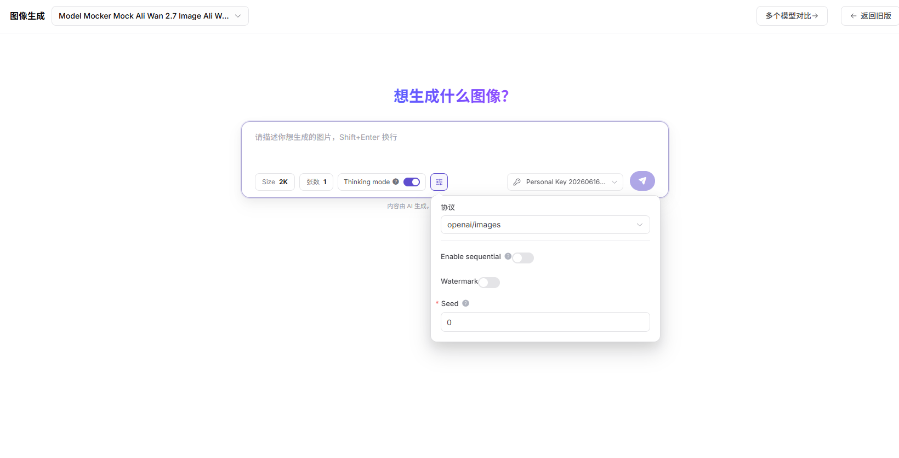

# 图像体验

:::: info 文档信息
版本：v1.0
更新日期：2026-07-08
::::

## 功能概述

`图像体验` 用于维护或查看图像模型、提示词、尺寸、风格和生成结果，支撑模型发布、体验、调用、统计和运营治理。

| 项目 | 内容 |
| --- | --- |
| 适用角色 | 普通用户 |
| 导航路径 | 体验中心 > 图像 |
| 页面路由 | /user/playground/images |
| 管理对象 | 图像模型、提示词、尺寸、风格和生成结果 |
| 典型用途 | 测试图像理解或图像生成模型 |

### 新手理解

图像体验区像模型的试拍台，用来验证图片理解、图像生成或多模态问答效果。重点看输入图片质量、提示词和输出格式是否匹配。

### 术语速查

| 术语 | 说明 |
| --- | --- |
| 图片输入 | 用于图像理解、图生图或多模态问答的图片。 |
| 提示词 | 描述生成目标或理解任务的文本指令。 |
| 尺寸 | 输出图片或处理图片的宽高规格。 |
| 安全策略 | 模型对敏感、违规或未授权内容的拦截规则。 |
## 前提条件

1. 当前账号具备图像体验页面访问权限。
2. 目标图像或多模态模型已可体验。
3. 上传图片已脱敏并具备使用授权。
## 页面说明

页面用于体验图像或多模态模型，支持上传脱敏图片、填写提示词、设置尺寸、数量、质量或安全过滤参数，并查看生成结果、错误码和用量。

页面截图：

选择支持图像生成或图像理解的模型。

## 主要操作

### 操作步骤

1. 进入 `体验中心 > 图像`。
2. 选择图像或多模态模型。
3. 上传脱敏图片或输入生成提示词。
4. 设置尺寸、数量、质量和安全过滤参数。
5. 发送请求并查看图片结果、请求 ID 和用量。

关键步骤截图：

按模型能力设置尺寸、数量、质量和安全过滤参数。

### 参数说明

| 字段名称 | 是否必填 | 字段类型 | 示例 | 说明 |
| --- | --- | --- | --- | --- |
| 图片输入 | 条件必填 | 文件 | `sample.png` | 图像理解或图生图场景使用。 |
| 提示词 | 条件必填 | 文本 | `生成产品海报` | 指导模型理解或生成。 |
| 尺寸 | 否 | 枚举 | `1024x1024` | 输出图片尺寸。 |
| 数量 | 否 | 数字 | `1` | 生成图片张数。 |
| 质量 | 否 | 枚举 | `standard` | 控制生成质量或成本。 |

### 踩坑提示

- 不要上传客户证件、合同、病历或未授权素材。
- 尺寸和数量越大，耗时和费用通常越高。
- 多模态理解失败时先检查图片是否清晰、方向是否正确。

### 结果校验

1. 图像生成或理解结果在页面展示。
2. 尺寸、数量、质量参数变化后，结果符合预期。
3. 失败时页面展示请求 ID、错误码或安全策略提示。
## 常见问题

### 图片生成失败

**问题现象：**

提交提示词后没有生成图片，或页面返回失败。

**可能原因：**

- 提示词触发安全策略。
- 尺寸、数量或质量参数超过模型限制。
- 模型当前被限流或不可用。

**处理方式：**

1. 调整提示词，避免敏感或侵权描述。
2. 降低图片尺寸、数量或质量要求。
3. 查看调用日志中的错误码。

### 图像理解结果不准确

**问题现象：**

模型描述与图片内容不一致，或遗漏关键对象。

**可能原因：**

- 图片模糊、遮挡或分辨率过低。
- 提示词问题过于宽泛。
- 模型不支持该图像任务。

**处理方式：**

1. 更换清晰图片。
2. 把问题拆成具体指令。
3. 切换支持图像理解的模型。

### 图片格式、尺寸或安全策略不通过

**问题现象：**

上传图片后页面提示格式、大小、尺寸或安全检查失败。

**可能原因：**

- 图片格式不在支持范围。
- 文件过大或分辨率超限。
- 图片包含敏感、未授权或违规内容。

**处理方式：**

1. 转换为支持格式。
2. 压缩图片或降低分辨率。
3. 更换已授权且脱敏的图片素材。
## 后续操作

1. 保存可复用的提示词和参数。
2. 查看调用日志定位失败请求。
3. 评估结果是否适合进入应用或集成流程。
## 注意事项

- 不要上传证件、合同、病历、人脸等敏感图片。
- 生成图片可能涉及版权和合规边界。
- 截图前确认图片和输出内容可公开。
