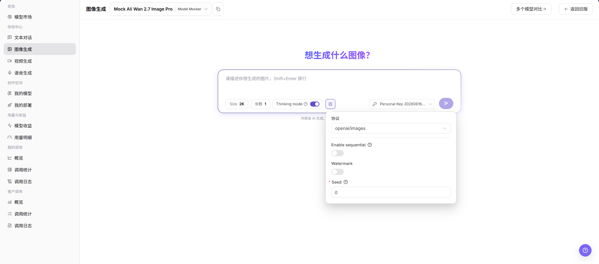

# 图像生成

::: info 文档信息
版本：v1.0
更新日期：2026-07-08
:::

## 功能概述

`图像生成` 用于选择图像模型、填写提示词、调整图片尺寸、生成数量和高级参数，并查看图像生成结果。

| 项目 | 内容 |
| --- | --- |
| 适用角色 | 普通用户 |
| 导航路径 | 模型及AI服务 > 体验中心 > 图像生成 |
| 页面路由 | `/modelone/exploration/image` |
| 管理对象 | 图像模型、提示词、图片尺寸、生成数量、生成参数和生成结果 |
| 典型途径 | 在页面内体验图像生成模型效果 |

#### 新手理解

图像体验区像模型的试拍台。用户选择图像模型后，输入想生成的图像描述，再按需要调整尺寸、张数、思考模式、水印、随机种子等参数，观察生成结果是否符合预期。

#### 术语速查

| 术语 | 说明 |
| --- | --- |
| 提示词 | 描述生成目标、画面内容、风格和约束的文本指令。 |
| Size | 输出图片尺寸或档位。 |
| 张数 | 单次生成的图片数量。 |
| Thinking mode | 是否启用模型的思考模式。 |
| Protocol | 当前图像生成调用协议，例如 `openai/images`。 |
| Seed | 随机种子，用于影响或复现生成结果。 |
| Watermark | 是否为生成图片添加水印。 |

## 前提条件

1. 当前账号具备`图像生成`页面访问权限。
2. 目标图像模型已授权给当前账号体验。
3. 提示词和参考素材不包含真实密钥、客户隐私、未授权素材或敏感内容。

::: warning 调用、计费与内容风险
点击生成按钮会产生真实模型调用，可能消耗 credits、生成调用日志或账务记录。图像生成结果也可能涉及版权、合规或敏感内容风险。仅学习或验证页面时，只查看模型选择、输入框、参数区和结果区，不提交真实生成请求。
:::

## 页面说明

页面用于体验图像生成模型，重点选择模型与供应方，填写图像提示词，并调整 `Size`、`张数`、`Thinking mode`、`Protocol`、`Enable sequential`、`Watermark`、`Seed` 等参数。

页面截图：

图像生成页面包含模型选择器、提示词输入框、尺寸、张数、思考模式、参数入口、密钥选择和生成入口。

## 主要操作

### 体验图像模型

1. 进入 `模型及AI服务 > 体验中心 > 图像生成`。
2. 在页面顶部的模型选择区选择要体验的图像模型和供应方。
3. 在提示词输入框中填写希望生成的图像内容、风格、比例、构图或其他约束。
4. 按需调整 `Size`、`张数`、`Thinking mode` 等页面快捷参数。
5. 点击参数按钮，按需查看或调整 `Protocol`、`Enable sequential`、`Watermark`、`Seed` 等高级参数。
6. 点击生成按钮前确认输入内容、模型、供应方、密钥和参数无误。
7. 如仅学习或验证页面，请不要提交真实生成请求；可只查看页面字段、参数区和结果区。

选择模型弹窗用于搜索模型、选择供应方实例，并确认模型价格、上下文、延迟、吞吐量、成功率、周调用量和上架状态。

在参数区查看或调整 `Protocol`、`Enable sequential`、`Watermark`、`Seed` 等配置；学习页面时不要点击生成按钮提交真实请求。

## 参数说明

| 字段名称 | 是否必填 | 字段类型 | 示例 | 说明 |
| --- | --- | --- | --- | --- |
| 模型 | 必填 | 下拉选择 | `Mock Ali Wan 2.7 Image Pro` | 当前体验的图像模型。 |
| 供应方 | 必填 | 下拉选择 | `Model Mocker` | 当前模型的供应方实例。 |
| 提示词 | 必填 | 多行文本 | `生成一张产品海报` | 描述希望生成的图像内容和风格。 |
| Size | 否 | 选择项 | `2K` | 控制生成图片尺寸或清晰度档位。 |
| 张数 | 否 | 数字 | `1` | 控制单次生成的图片数量。 |
| Thinking mode | 否 | 开关 | `开启` | 控制是否启用思考模式。 |
| Protocol | 否 | 下拉选择 | `openai/images` | 当前图像生成使用的调用协议。 |
| Enable sequential | 否 | 开关 | `关闭` | 控制是否启用顺序生成相关能力。 |
| Watermark | 否 | 开关 | `关闭` | 控制是否添加水印。 |
| Seed | 否 | 数字 | `0` | 随机种子，用于影响或复现生成结果。 |
| 生成结果 | 否 | 图片区域 | 生成图片 | 展示生成图片、错误提示或空状态。 |

## 踩坑提示

- 不要在提示词中输入真实密钥、客户隐私或未授权素材描述。
- 图片尺寸和生成数量越大，耗时和费用通常越高。
- 生成图片可能涉及版权、肖像权、商标或合规边界，正式使用前需确认授权。
- 学习页面或截图时不要点击生成按钮提交真实请求。

## 结果校验

| 检查项 | 成功表现 | 异常时处理 |
| --- | --- | --- |
| 页面可进入 | `图像生成` 页面正常打开，左侧体验中心菜单和顶部模型选择区可见。 | 确认账号权限、导航路径和页面加载状态。 |
| 模型选择器可加载 | 模型选择区可展开，能看到模型列表、供应方实例和状态信息。 | 刷新页面后重试，或确认目标模型是否对当前账号可见。 |
| 输入区和参数区可见 | 提示词输入框、Size、张数、Thinking mode、Protocol、Watermark、Seed 等字段可见。 | 检查页面是否加载完成，必要时切换模型后重新查看。 |
| 结果区可查看 | 页面可展示生成结果、错误提示或空状态。 | 如无生成记录，输入区和参数区仍应可正常显示。 |
| 不产生真实生成 | 学习或截图时未点击生成按钮，未提交提示词，未消耗额度。 | 如误触生成，记录时间和模型名称，后续到调用日志核对。 |
| 真实生成有结果 | 明确允许执行生成时，页面返回生成图片或明确错误提示。 | 调整提示词、降低尺寸或张数后重试，并查看错误提示或调用日志。 |

## 常见问题

#### 图像生成失败

**问题现象：**

提交提示词后没有生成图片，或页面返回失败。

**可能原因：**

- 提示词触发安全策略。
- Size、张数、Seed 或其他参数超出模型限制。
- 模型当前被限流、下架或不可用。

**处理方式：**

1. 调整提示词，避免敏感、侵权或违规描述。
2. 降低图片尺寸或生成数量后重试。
3. 查看错误提示或调用日志中的错误码。

#### 生成结果不符合预期

**问题现象：**

生成图片与提示词描述不一致，或画面风格、构图、主体不符合预期。

**可能原因：**

- 提示词过于宽泛，缺少主体、风格、场景或限制条件。
- Seed、尺寸或模型能力影响生成效果。
- 当前模型不适合目标图像类型。

**处理方式：**

1. 将提示词拆成更明确的主体、背景、风格、色彩和构图要求。
2. 调整 Seed、Size 或张数后重新验证。
3. 切换支持目标场景的图像模型。

#### 内容或安全策略不通过

**问题现象：**

页面提示内容不合规、安全检查失败或无法生成。

**可能原因：**

- 提示词包含敏感、侵权、未授权或违规内容。
- 生成目标涉及受限人物、品牌、隐私或不适合公开传播的内容。
- 模型或平台启用了安全过滤策略。

**处理方式：**

1. 删除敏感、侵权或未授权描述。
2. 使用已授权且可公开的素材和场景描述。
3. 如业务确需生成，先确认合规要求和授权范围。

## 后续操作

1. 保存可复用的提示词和参数组合。
2. 需要排障时带模型名称、时间和错误提示查看调用日志。
3. 正式使用生成图片前确认版权、合规和公开传播范围。

## 注意事项

- 不要上传或描述证件、合同、病历、人脸等敏感内容。
- 生成图片可能涉及版权、肖像权、商标和合规边界。
- 截图前确认提示词、图片和输出内容可以公开。
