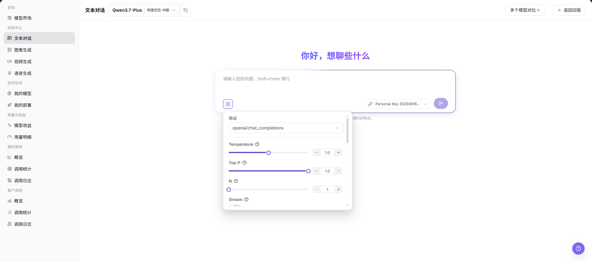
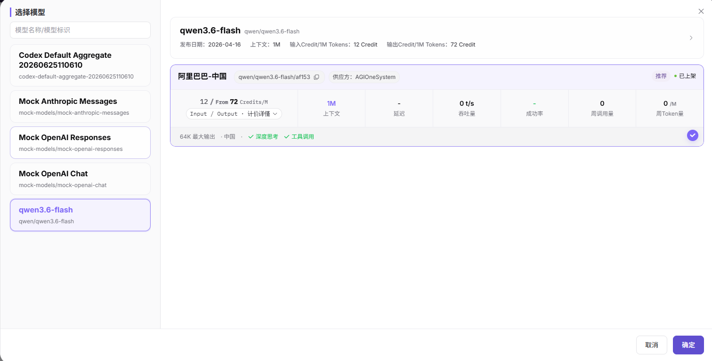

# 文本对话

::: info 文档信息
版本：v1.0
更新日期：2026-07-08
:::

## 功能概述

`文本对话` 用于在页面内选择文本模型、编写 Prompt、调整生成参数，并观察模型回答质量、延迟和错误提示。

| 项目 | 内容 |
| --- | --- |
| 适用角色 | 普通用户 |
| 导航路径 | 模型及AI服务 > 体验中心 > 文本对话 |
| 页面路由 | /modelone/exploration/chat |
| 管理对象 | 文本模型、Prompt、生成参数、输出结果和调试记录 |
| 典型用途 | 在页面内测试文本模型效果 |

#### 新手理解

文本体验区像模型的草稿纸，用来快速试写 Prompt、调整 Temperature、Top-P、Max Tokens 和 Stream，观察模型回答是否稳定、完整、符合预期。

#### 术语速查

| 术语 | 说明 |
| --- | --- |
| Prompt | 输入给模型的提示词、问题或上下文。 |
| Temperature | 控制回答随机性和发散程度的参数。 |
| Top-P | 控制候选词采样范围的参数。 |
| Max Tokens | 限制模型最大输出长度。 |
| Stream | 控制是否边生成边返回内容。 |
| Protocol | 选择文本模型调用协议，例如 `openai/chat_completions`。 |
## 前提条件

1. 当前账号具备`文本对话` 体验页面访问权限。
2. 目标模型已授权给当前账号体验。
3. Prompt 不包含真实密钥、客户隐私或生产业务数据。

::: warning 调用与计费风险
点击发送按钮会产生真实模型调用，可能消耗 credits、生成调用日志或账务记录。仅学习或验证页面时，只查看模型选择、输入框和参数区域，不提交真实 Prompt。
:::

## 页面说明

页面用于体验文本模型，重点选择模型与供应方，填写 Prompt，并调整 Protocol、Temperature、Top-P、N、Stream 等参数，观察输入区、返回区、历史记录和错误提示。

页面截图：

文本对话页面包含模型选择器、Prompt 输入框、参数入口、密钥选择和发送入口。

## 主要操作

### 体验文本模型

1. 进入 `模型及AI服务 > 体验中心 > 文本对话`。
2. 在页面顶部的模型选择区选择要体验的文本模型和供应方。
3. 在 Prompt 输入框中填写问题、上下文或其他输入内容。
4. 点击参数按钮，按需查看或调整 `Protocol`、`Temperature`、`Top-P`、`N`、`Stream` 等参数。
5. 点击发送按钮前确认输入内容、模型、供应方、密钥和参数无误。
6. 如仅学习或验证页面，请不要提交真实调用请求；可只查看页面字段、参数区域和历史/返回区域。

选择模型弹窗用于搜索模型、选择供应方实例，并确认模型上下文、价格、延迟、吞吐量、成功率和上架状态。

在参数区查看或调整 `Protocol`、`Temperature`、`Top-P`、`N`、`Stream` 等配置；学习页面时不要点击发送按钮提交真实 Prompt。

## 参数说明

| 字段名称 | 是否必填 | 字段类型 | 示例 | 说明 |
| --- | --- | --- | --- | --- |
| 模型 | 必填 | 下拉选择 | `Qwen3.7-Plus` | 当前体验的文本模型。 |
| 供应方 | 必填 | 下拉选择 | `阿里巴巴-中国` | 当前模型的供应方实例。 |
| Prompt | 必填 | 多行文本 | `请总结这段文本` | 输入给模型的提示词、问题或上下文。 |
| Protocol | 否 | 下拉选择 | `openai/chat_completions` | 当前调用使用的协议。 |
| Temperature | 否 | 数字 / 滑块 | `0.7` | 控制输出随机性，越高越发散。 |
| Top-P | 否 | 数字 / 滑块 | `0.8` | 控制候选词采样范围。 |
| N | 否 | 数字 / 步进器 | `1` | 控制单次请求返回的候选结果数量。 |
| Stream | 否 | 开关 | `开启` | 控制是否流式返回输出。 |
| 返回结果 | 否 | 文本区域 | 模型回答内容 | 展示模型生成结果、错误提示或状态信息。 |

## 踩坑提示

- Temperature 和 Top-P 不建议同时调得过高。
- Max Tokens 过小会截断回答，过大可能增加费用。
- 不要在 Prompt 中输入真实密钥或客户隐私。
- 发送 Prompt 可能产生调用记录、额度消耗或计费记录，文档学习时不要提交真实请求。

## 结果校验

| 检查项 | 成功表现 | 异常时处理 |
| --- | --- | --- |
| 页面可进入 | `文本对话` 页面正常打开，左侧体验中心菜单和顶部模型选择区可见。 | 确认账号权限、导航路径和页面加载状态。 |
| 模型选择器可加载 | 模型选择区可展开，能看到模型列表、供应方实例和状态信息。 | 刷新页面后重试，或确认目标模型是否对当前账号可见。 |
| 输入区和参数区可见 | Prompt 输入框、参数按钮、Protocol、Temperature、Top-P、N、Stream 等字段可见。 | 检查页面是否加载完成，必要时切换模型后重新查看。 |
| 历史或返回区域可查看 | 页面可展示历史对话、返回内容、错误提示或空状态。 | 如无历史记录，输入区仍应可正常显示。 |
| 不产生真实调用 | 学习或截图时未点击发送按钮，未提交 Prompt，未消耗额度。 | 如误触发送，记录时间和模型名称，后续到调用日志核对。 |
| 真实调用有响应 | 明确允许执行调用时，页面返回与 Prompt 相关的文本回答。 | 缩短 Prompt、降低参数后重试，并查看错误提示或调用日志。 |
## 常见问题

#### 输出为空或超时

**问题现象：**

发送 Prompt 后没有返回内容，或页面长时间停留在生成中。

**可能原因：**

- Prompt 过长、上下文过大或 Max Tokens 设置过高。
- 模型服务繁忙、排队或被限流。
- 网络连接中断，或浏览器会话已过期。

**处理方式：**

1. 缩短 Prompt 或降低 Max Tokens 后重试。
2. 稍后重新发送，观察是否仍然超时。
3. 记录请求时间、模型名称和错误提示，进入调用日志或联系运营方排查。

#### Temperature 调太高导致结果发散

**问题现象：**

模型回答出现明显跑题、重复、格式混乱或不符合业务预期。

**可能原因：**

- Temperature 设置过高，输出随机性过强。
- Top-P 同时设置较高，采样范围过宽。
- Prompt 缺少明确格式、边界或示例。

**处理方式：**

1. 将 Temperature 调低到 `0.2` 到 `0.7` 区间后重试。
2. 不要同时把 Temperature 和 Top-P 都调得很高。
3. 在 Prompt 中补充输出格式、禁止事项和示例。

#### 流式输出中断

**问题现象：**

开启 Stream 后，页面开始返回内容，但中途停止或缺少结尾。

**可能原因：**

- 网络连接不稳定或浏览器标签页被刷新。
- 模型服务端连接超时。
- Max Tokens 或输出长度限制导致内容提前截断。

**处理方式：**

1. 关闭 Stream 后重新发送，确认是否能返回完整内容。
2. 降低 Max Tokens 或缩短 Prompt，减少单次生成压力。
3. 记录请求 ID、模型名称和发生时间，到调用日志中查看错误码。

## 后续操作

1. 保存有效 Prompt 和参数组合。
2. 需要排障时带请求 ID 查看调用日志。
3. 正式接入前整理 API 参数和输出格式要求。
## 注意事项

- 不要在 Prompt 中输入密钥、访问令牌或客户隐私。
- 截图前遮挡请求 ID 和输出中的敏感内容。
- 参数对比时一次只调整少量变量。
