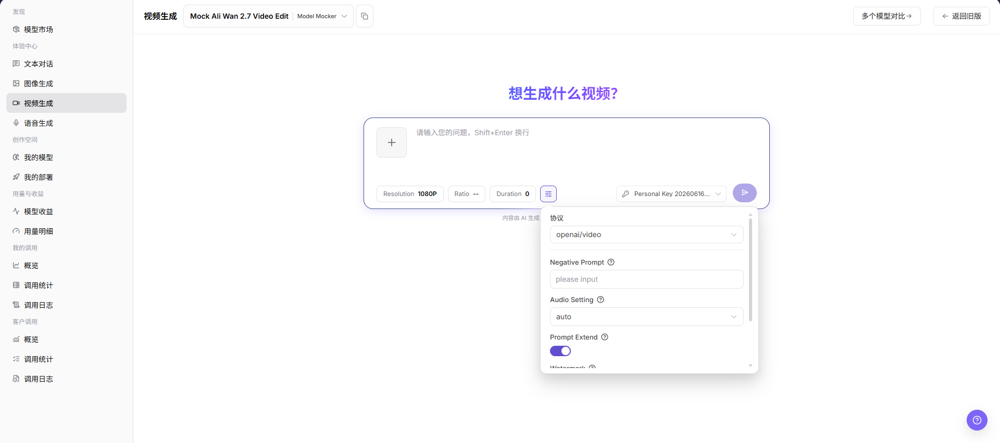

# 视频生成

::: info 文档信息
版本：v1.0
更新日期：2026-07-08
:::

## 功能概述

`视频生成` 用于选择视频模型、填写提示词、上传或选择参考图，并调整分辨率、比例、时长和高级参数，查看视频生成结果或任务状态。

| 项目 | 内容 |
| --- | --- |
| 适用角色 | 普通用户 |
| 导航路径 | 模型及AI服务 > 体验中心 > 视频生成 |
| 页面路由 | /modelone/exploration/video |
| 管理对象 | 视频模型、提示词、参考图、分辨率、比例、时长、生成参数和生成结果 |
| 典型用途 | 在页面内体验视频生成模型效果 |

#### 新手理解

视频体验区像视频模型的试映室。用户选择视频模型后，输入想生成的视频描述，也可以按页面能力添加参考图，再调整分辨率、比例、时长、负向提示词、音频、水印等参数，观察生成结果或任务进度是否符合预期。

#### 术语速查

| 术语 | 说明 |
| --- | --- |
| 提示词 | 描述视频主体、镜头、动作、风格和约束的文本指令。 |
| 参考图 | 用作视频生成参考的图片素材。 |
| Resolution | 输出视频分辨率。 |
| Ratio | 输出视频画面比例。 |
| Duration | 输出视频时长。 |
| Negative Prompt | 负向提示词，用于描述不希望出现在视频中的内容。 |
| Audio Setting | 音频相关配置。 |
| Prompt Extend | 是否启用提示词扩展。 |
| Watermark | 是否为生成视频添加水印。 |

## 前提条件

1. 当前账号具备`视频生成`页面访问权限。
2. 目标视频模型已授权给当前账号体验。
3. 提示词、参考图和视频素材不包含真实密钥、客户隐私、未授权素材或敏感内容。
4. 已确认分辨率、比例、时长和高级参数在目标模型支持范围内。

::: warning 调用、计费、异步任务与内容风险
点击生成按钮会产生真实模型调用，可能消耗 credits、生成调用日志、账务记录或异步任务/排队记录。视频生成耗时通常更长，生成结果也可能涉及版权、肖像权、合规或敏感内容风险。仅学习或验证页面时，只查看模型选择、输入框、参数区和结果区，不提交真实生成请求。
:::

## 页面说明

页面用于体验视频生成模型，重点选择模型与供应方，填写视频提示词或添加参考图，并调整 `Resolution`、`Ratio`、`Duration`、`Protocol`、`Negative Prompt`、`Audio Setting`、`Prompt Extend`、`Watermark` 等参数。

页面截图：

视频生成页面包含模型选择器、参考图入口、提示词输入框、分辨率、比例、时长、参数入口、密钥选择和生成入口。

## 主要操作

### 体验视频模型

1. 进入 `模型及AI服务 > 体验中心 > 视频生成`。
2. 在页面顶部的模型选择区选择要体验的视频模型和供应方。
3. 在提示词输入框中填写希望生成的视频内容、镜头、动作、风格、比例或其他约束。
4. 如页面需要或模型支持，添加已授权、可公开的参考图。
5. 按需调整 `Resolution`、`Ratio`、`Duration` 等页面快捷参数。
6. 点击参数按钮，按需查看或调整 `Protocol`、`Negative Prompt`、`Audio Setting`、`Prompt Extend`、`Watermark` 等高级参数。
7. 点击生成按钮前确认输入内容、模型、供应方、密钥和参数无误。
8. 如仅学习或验证页面，请不要提交真实生成请求；可只查看页面字段、参数区和结果区。

选择模型弹窗用于搜索模型、选择供应方实例，并确认模型价格、吞吐量、成功率、周调用量、周生成秒数和上架状态。

在参数区查看或调整 `Protocol`、`Negative Prompt`、`Audio Setting`、`Prompt Extend`、`Watermark` 等配置；学习页面时不要点击生成按钮提交真实请求。

## 参数说明

| 字段名称 | 是否必填 | 字段类型 | 示例 | 说明 |
| --- | --- | --- | --- | --- |
| 模型 | 必填 | 下拉选择 | `Mock Ali Wan 2.7 Video Edit` | 当前体验的视频模型。 |
| 供应方 | 必填 | 下拉选择 | `Model Mocker` | 当前模型的供应方实例。 |
| 提示词 | 必填 | 多行文本 | `生成一段产品展示视频` | 描述希望生成的视频内容、动作和风格。 |
| 参考图 | 条件必填 | 图片上传 | `reference.png` | 用于图生视频、参考图生成或视频编辑场景。 |
| Resolution | 否 | 选择项 | `1080P` | 控制生成视频分辨率。 |
| Ratio | 否 | 选择项 | `--` | 控制生成视频画面比例。 |
| Duration | 否 | 数字 / 选择项 | `0` | 控制生成视频时长。 |
| Protocol | 否 | 下拉选择 | `openai/video` | 当前视频生成使用的调用协议。 |
| Negative Prompt | 否 | 文本 | `低清、抖动` | 描述不希望出现在视频中的内容。 |
| Audio Setting | 否 | 下拉选择 | `auto` | 控制音频生成或保留策略。 |
| Prompt Extend | 否 | 开关 | `开启` | 控制是否启用提示词扩展。 |
| Watermark | 否 | 开关 | `关闭` | 控制是否添加水印。 |
| 生成结果 | 否 | 视频 / 任务区域 | 生成视频或任务进度 | 展示生成视频、任务进度、错误提示或空状态。 |

## 踩坑提示

- 不要上传或描述包含客户隐私、人脸、车牌、合同、病历或未授权素材的视频或参考图。
- 视频生成通常耗时更长，分辨率、时长和参考素材越复杂，费用和失败概率越高。
- 生成视频可能涉及版权、肖像权、商标和合规边界，正式使用前需确认授权。
- 视频生成可能创建异步任务或排队记录，学习页面或截图时不要点击生成按钮。

## 结果校验

| 检查项 | 成功表现 | 异常时处理 |
| --- | --- | --- |
| 页面可进入 | `视频生成` 页面正常打开，左侧体验中心菜单和顶部模型选择区可见。 | 确认账号权限、导航路径和页面加载状态。 |
| 模型选择器可加载 | 模型选择区可展开，能看到模型列表、供应方实例和状态信息。 | 刷新页面后重试，或确认目标模型是否对当前账号可见。 |
| 输入区和参数区可见 | 参考图入口、提示词输入框、Resolution、Ratio、Duration、Negative Prompt、Audio Setting、Prompt Extend 等字段可见。 | 检查页面是否加载完成，必要时切换模型后重新查看。 |
| 结果区可查看 | 页面可展示生成结果、任务进度、错误提示或空状态。 | 如无生成记录，输入区和参数区仍应可正常显示。 |
| 不产生真实生成 | 学习或截图时未点击生成按钮，未提交提示词，未创建任务，未消耗额度。 | 如误触生成，记录时间和模型名称，后续到调用日志核对。 |
| 真实生成有结果 | 明确允许执行生成时，页面返回生成视频、任务进度或明确错误提示。 | 调整提示词、降低分辨率或缩短时长后重试，并查看错误提示或调用日志。 |

## 常见问题

#### 视频生成超时或排队

**问题现象：**

提交提示词后长时间没有结果，或页面显示排队、生成中、超时。

**可能原因：**

- 视频分辨率过高或时长过长。
- 模型队列繁忙或上游服务拥塞。
- 参考图、提示词或高级参数导致生成任务复杂度较高。

**处理方式：**

1. 降低分辨率或缩短视频时长后重试。
2. 稍后重新生成，或切换同类可用模型。
3. 记录模型名称、提交时间和错误提示，到调用日志中排查。

#### 生成结果不符合预期

**问题现象：**

生成视频与提示词描述不一致，或动作、镜头、风格、主体不符合预期。

**可能原因：**

- 提示词过于宽泛，缺少主体、动作、镜头、风格或限制条件。
- 参考图质量、比例或内容与目标视频不匹配。
- 当前模型不适合目标视频类型。

**处理方式：**

1. 将提示词拆成更明确的主体、动作、镜头、场景、风格和时长要求。
2. 更换清晰、已授权、可公开的参考图。
3. 调整分辨率、比例、时长或切换支持目标场景的视频模型。

#### 内容或安全策略不通过

**问题现象：**

页面提示内容不合规、安全检查失败或无法生成。

**可能原因：**

- 提示词或参考图包含敏感、侵权、未授权或违规内容。
- 生成目标涉及受限人物、品牌、隐私或不适合公开传播的内容。
- 模型或平台启用了安全过滤策略。

**处理方式：**

1. 删除敏感、侵权或未授权描述。
2. 使用已授权且可公开的素材和场景描述。
3. 如业务确需生成，先确认合规要求和授权范围。

#### 参考图或视频素材不符合要求

**问题现象：**

添加参考图或素材后，页面提示格式、大小、尺寸或安全检查失败。

**可能原因：**

- 素材格式不在支持范围。
- 文件过大或分辨率超限。
- 素材包含敏感、未授权或违规内容。

**处理方式：**

1. 转换为页面支持的格式。
2. 压缩素材或降低分辨率。
3. 更换已授权且可公开的素材。

## 后续操作

1. 保存可复用的提示词和参数组合。
2. 需要排障时带模型名称、时间和错误提示查看调用日志。
3. 正式使用生成视频前确认版权、肖像权、合规和公开传播范围。

## 注意事项

- 不要上传或描述包含客户隐私、人脸、车牌、合同、病历或未授权素材的视频。
- 长视频和高分辨率生成会显著增加耗时、费用和失败概率。
- 截图前确认提示词、素材和生成内容可以公开。
