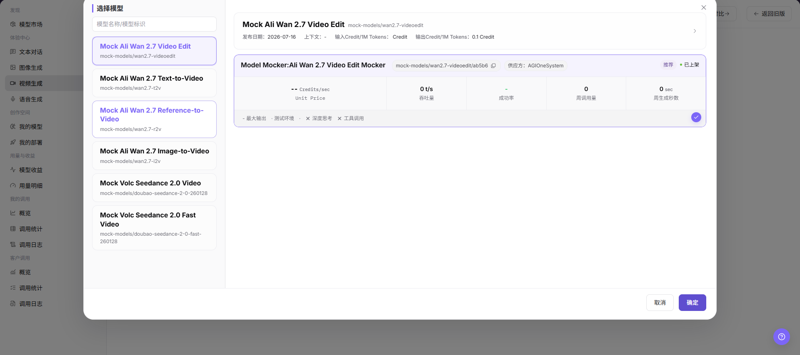
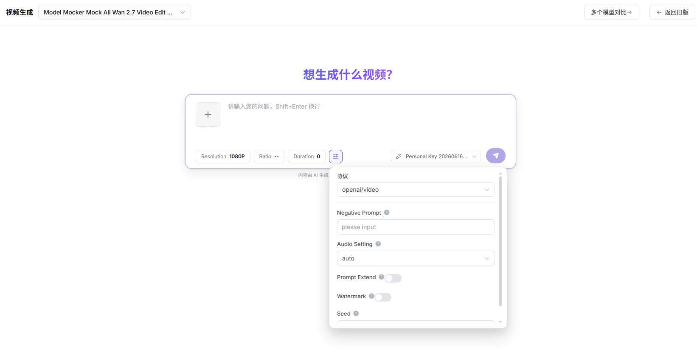

# 视频体验

:::: info 文档信息
版本：v1.0
更新日期：2026-07-06
::::

## 功能概述

`视频体验` 用于维护或查看视频模型、输入素材、抽帧参数、生成参数和结果，支撑模型发布、体验、调用、统计和运营治理。

| 项目 | 内容 |
| --- | --- |
| 适用角色 | 普通用户 |
| 导航路径 | 体验中心 > 视频 |
| 页面路由 | /user/playground/video |
| 管理对象 | 视频模型、输入素材、抽帧参数、生成参数和结果 |
| 典型用途 | 测试视频理解或视频生成模型 |

### 新手理解

视频体验区像视频模型的试映室，用来验证视频理解、摘要、问答或生成能力。视频时长、帧率和内容合规会直接影响结果。

### 术语速查

| 术语 | 说明 |
| --- | --- |
| 视频输入 | 用于视频理解、摘要、问答或生成的视频素材。 |
| 抽帧间隔 | 模型分析视频时采样画面的时间间隔。 |
| 最大时长 | 单次请求允许处理的视频长度。 |
| 输出格式 | 摘要、问答或结构化结果等返回形式。 |
## 前提条件

1. 当前账号具备视频体验页面访问权限。
2. 目标视频模型已可体验。
3. 视频素材已脱敏并确认授权。
4. 已确认格式、时长和抽帧参数在模型支持范围内。
## 页面说明

页面用于体验视频类模型，支持上传脱敏视频或填写视频输入地址，设置抽帧、时长、输出格式和提示词，并查看返回结果、耗时、错误码和用量。

页面截图：

选择视频理解、摘要、问答或生成模型。

## 主要操作

### 操作步骤

1. 进入 `体验中心 > 视频`。
2. 选择视频模型和供应方。
3. 上传脱敏视频或填写占位视频地址。
4. 设置时长、抽帧、输出格式和提示词。
5. 发送请求并查看结果、请求 ID 和用量。

关键步骤截图：

确认视频时长、抽帧间隔和输出格式。

### 参数说明

| 字段名称 | 是否必填 | 字段类型 | 示例 | 说明 |
| --- | --- | --- | --- | --- |
| 视频输入 | 条件必填 | 文件 / URL | `sample.mp4` | 用于视频理解或生成的输入。 |
| 提示词 | 条件必填 | 文本 | `总结视频内容` | 指导模型分析或生成。 |
| 最大时长 | 否 | 数字 | `60s` | 限制处理的视频长度。 |
| 抽帧间隔 | 否 | 数字 | `2s` | 控制视频理解采样粒度。 |
| 输出格式 | 否 | 枚举 | `summary` | 摘要、问答或结构化结果。 |

### 踩坑提示

- 不要上传包含客户隐私、车牌、人脸或未授权素材的视频。
- 长视频会增加耗时、费用和失败概率。
- 视频 URL 必须使用可访问的占位或安全地址，文档中不要写内部地址。

### 结果校验

1. 页面返回视频摘要、问答或生成结果。
2. 抽帧、时长和输出格式参数变化后，结果符合预期。
3. 失败时能看到请求 ID、错误码或参数限制提示。
## 常见问题

### 视频处理超时

**问题现象：**

提交视频后长时间无结果或返回超时。

**可能原因：**

- 视频时长过长。
- 抽帧间隔过密。
- 模型队列或上游服务拥塞。

**处理方式：**

1. 截取较短样本。
2. 增大抽帧间隔。
3. 稍后重试或切换模型。

### 视频结果与预期不符

**问题现象：**

摘要遗漏重点，或视频问答回答错误。

**可能原因：**

- 提示词不够具体。
- 关键画面未被抽帧覆盖。
- 视频清晰度或字幕质量较差。

**处理方式：**

1. 补充更明确的问题。
2. 调整抽帧策略。
3. 使用更清晰的视频素材。

### 视频格式、时长或抽帧参数不支持

**问题现象：**

页面提示视频格式不支持、时长超限或抽帧参数非法。

**可能原因：**

- 视频格式不在支持范围。
- 文件过大或时长过长。
- 抽帧间隔、输出格式与模型能力不匹配。

**处理方式：**

1. 转换为支持格式。
2. 截取短视频样本。
3. 按页面提示调整抽帧和输出格式。

### 视频 URL 不可访问或解析失败

**问题现象：**

填写视频 URL 后，页面提示无法下载、解析失败、访问超时或权限不足。

**可能原因：**

- 视频 URL 不是平台可访问地址。
- URL 需要登录、签名已过期或被网络策略拦截。
- 视频编码、格式或文件大小不符合模型限制。

**处理方式：**

1. 使用可公开访问或平台允许访问的脱敏测试地址。
2. 确认签名有效期、访问权限和网络连通性。
3. 必要时改为上传短视频样本，并记录请求 ID 和错误码。

## 后续操作

1. 记录有效参数组合。
2. 查看调用日志定位失败请求。
3. 评估视频模型是否适合集成到应用流程。
## 注意事项

- 不要上传包含客户隐私、人脸、车牌或未授权素材的视频。
- 长视频会显著增加耗时和费用。
- 视频 URL 示例必须使用占位地址。
