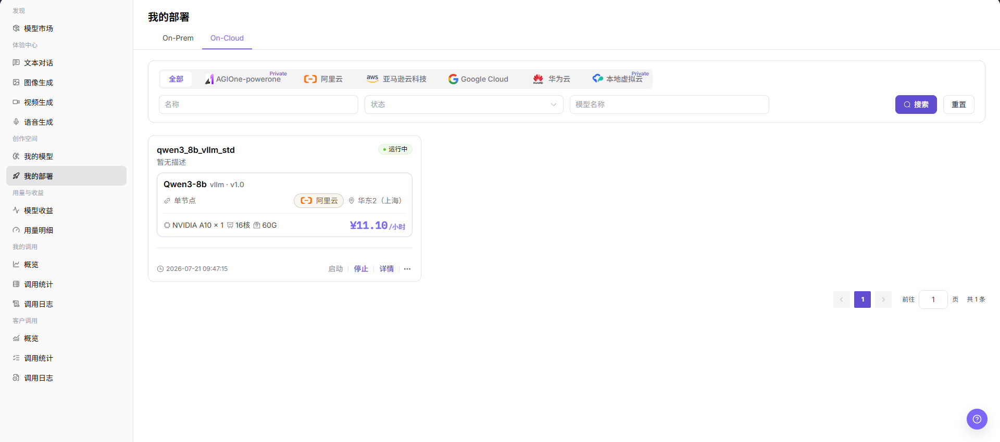
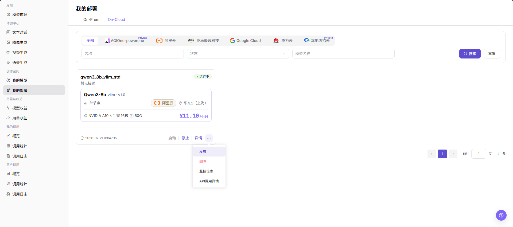
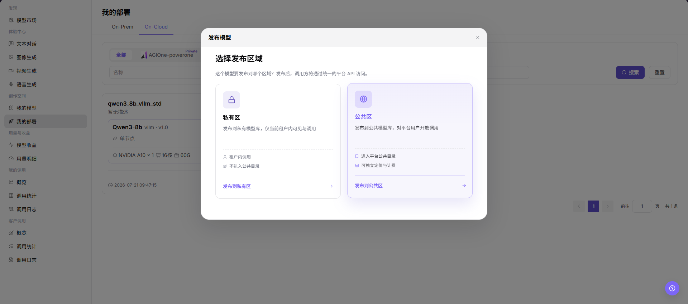
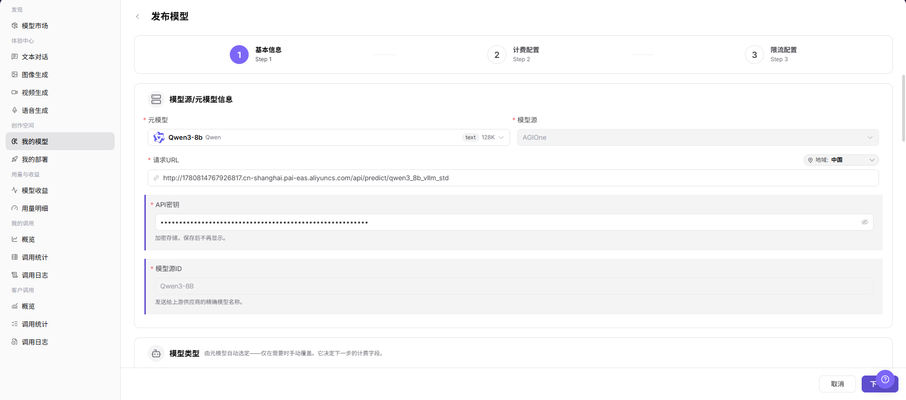

# 我的部署

::: info 文档信息
版本：v1.0
更新日期：2026-07-21
:::

## 功能概述

`我的部署` 用于查看当前账号在创作空间中的模型部署记录，并从符合条件的部署进入模型发布流程。用户可以在部署列表中确认部署状态、模型名称、地域、资源规格和操作入口，再选择发布区域并跳转到 `我的模型` 的发布模型页面。

| 项目 | 内容 |
| --- | --- |
| 适用角色 | 模型提供方、具备部署发布权限的用户 |
| 导航路径 | 模型及AI服务 > 创作空间 > 我的部署 |
| 页面路由 | `/modelone/my-deployments/models` |
| 管理对象 | 自部署模型、云上部署记录、部署状态、资源规格和发布入口 |
| 典型途径 | 查看部署信息、进入发布模型流程、选择发布区域 |

#### 新手理解

`我的部署` 像模型提供方的部署记录入口。用户先在这里确认某个模型服务已经部署并处于可发布状态，再通过 `发布` 入口选择 `私有区` 或 `公共区`，进入 `我的模型` 的发布模型配置流程。

#### 术语速查

| 术语 | 说明 |
| --- | --- |
| 我的部署 | 展示当前账号可查看的模型部署记录，包括 On-Prem 和 On-Cloud 部署。 |
| 发布模型 | 将目标部署带入模型发布流程，并在 `我的模型` 中继续配置模型信息、计费和限流。 |
| 发布区域 | 模型发布到 `私有区` 或 `公共区`。 |
| 发布入口 | 部署卡片更多操作中的 `发布`，用于打开发布区域选择弹窗。 |
| 跳转目标 | 选择发布区域后进入的 `我的模型 > 发布模型` 页面。 |

## 前提条件

1. 当前账号具备 `创作空间 > 我的部署` 查看权限。
2. 页面中存在可查看的部署记录。
3. 目标部署满足发布入口展示条件，且更多操作中可见 `发布`。
4. 发布前已确认发布区域、可见范围、计费配置和调用配置的风险。
5. 如仅学习或验证页面，只查看字段、弹窗和跳转结果，不执行最终发布、提交或保存。

::: warning 高风险操作边界
发布模型可能影响模型对外可见范围、调用方式、计费配置和用户访问。选择错误发布区域可能导致模型发布到错误站点、区域或业务范围。跳转后的 `发布`、`提交`、`保存` 属于高风险最终动作；如仅学习或验证页面，只确认跳转和字段展示，不执行最终确认。
:::

## 页面说明

页面标题为 `我的部署`，包含 `On-Prem` 和 `On-Cloud` 页签。页面支持按 `名称`、`状态`、`模型名称` 筛选，并通过 `搜索`、`重置` 刷新列表。部署卡片展示部署名称、模型、推理引擎、版本、部署形态、云平台、地域、资源规格、费用、部署状态以及 `启动`、`停止`、`详情` 和更多操作入口。

在目标部署的更多操作中，可以看到 `发布`、`删除`、`监控信息`、`API调用详情` 等入口。本文只描述 `发布` 入口的查看和跳转流程。

点击发布入口后，页面显示 `发布模型` 弹窗，要求选择发布区域。可选区域包括 `私有区` 和 `公共区`，对应按钮为 `发布到私有区` 和 `发布到公共区`。

选择发布区域后，页面跳转到 `模型及AI服务 > 创作空间 > 我的模型` 的 `发布模型` 页面。该页面包含 `基础信息`、`计费配置`、`限流配置` 步骤，并展示 `元模型`、`模型源`、`请求URL`、`API密钥`、`模型源ID`、`地域` 等字段。

## 主要操作

### 发布模型

1. 进入 `模型及AI服务 > 创作空间 > 我的部署`。
2. 在 `On-Cloud` 页签的部署列表中找到目标部署，确认部署名称、模型名称、部署状态、地域和资源规格。
3. 点击目标部署卡片右侧的更多操作 `...`，选择 `发布`。
4. 在 `发布模型` 弹窗中查看 `选择发布区域`。
5. 根据发布目标选择 `私有区` 或 `公共区`。
6. 点击 `发布到私有区` 或 `发布到公共区` 后，页面跳转到 `模型及AI服务 > 创作空间 > 我的模型` 的 `发布模型` 页面。
7. 在发布模型页面继续核对 `基础信息`、`计费配置`、`限流配置`，以及 `元模型`、`模型源`、`请求URL`、`API密钥`、`模型源ID`、`地域` 等字段。
8. 如仅学习或验证页面，只确认跳转和字段展示，不执行最终 `发布`、`提交` 或 `保存`。

## 参数说明

| 字段名称 | 是否必填 | 字段类型 | 示例 | 说明 |
| --- | --- | --- | --- | --- |
| 部署名称 | 是 | 文本 | 按页面显示为准 | 用于识别目标部署记录。 |
| 模型名称 | 是 | 文本 | `Qwen3-8b` | 目标部署关联的模型。 |
| 部署状态 | 是 | 状态标签 | `运行中` | 判断部署是否满足发布入口展示或后续发布条件。 |
| 地域 | 是 | 文本 | `华东2（上海）` | 目标部署所在地域，发布前需要与发布区域和业务范围核对。 |
| 资源规格 | 是 | 文本 | `NVIDIA A10 x 1` | 展示部署使用的加速卡、CPU、内存等资源规格。 |
| 发布入口 | 是 | 更多操作 | `发布` | 从目标部署进入发布区域选择流程。 |
| 发布区域 | 是 | 卡片选择 | `私有区` / `公共区` | 决定跳转后的发布目标和可见范围。 |
| 跳转目标 | 是 | 页面跳转 | `我的模型 > 发布模型` | 选择发布区域后的目标页面。 |
| 发布范围 | 条件必填 | 页面配置 | 按发布模型页面显示为准 | 在发布模型页面继续确认模型对外可见范围。 |
| 计费配置 | 条件必填 | 分步配置 | 按发布模型页面显示为准 | 在发布模型页面继续确认价格、免费额度或计费方式。 |
| 调用配置 | 条件必填 | 分步配置 | 按发布模型页面显示为准 | 在发布模型页面继续确认请求地址、密钥、模型源 ID、限流等调用相关配置。 |
| 操作 | 否 | 行内按钮 / 更多菜单 | `启动` / `停止` / `详情` / `发布` | 查看、控制或进入发布流程的页面入口。 |

## 踩坑提示

- 我的部署记录展示部署状态，不等同于模型已经完成市场发布。
- 部署异常时先看资源池、Runtime Image、模型资产和启动日志，不要直接重复提交。
- 删除、下线或重启部署可能影响调用方，操作前确认流量和回滚路径。

## 结果校验

| 检查项 | 成功表现 | 异常时处理 |
| --- | --- | --- |
| 页面可进入 | `我的部署` 页面正常打开，`On-Prem` 和 `On-Cloud` 页签可见。 | 检查账号权限、导航路径和页面加载状态。 |
| 部署列表正常加载 | 目标部署卡片展示部署名称、模型名称、状态、地域和资源规格。 | 点击 `搜索` 或 `重置` 后重试，必要时检查筛选条件和部署权限。 |
| 目标部署状态可见 | 目标部署状态展示为页面真实状态，例如 `运行中`。 | 确认部署任务是否完成，或进入 `详情` 查看部署状态。 |
| 发布入口可见 | 符合条件的部署在更多操作中展示 `发布`。 | 检查部署状态、账号权限和页面操作范围。 |
| 发布区域可选择 | `发布模型` 弹窗打开，并展示 `私有区`、`公共区` 及对应发布按钮。 | 关闭弹窗后重试，或检查是否具备对应区域发布权限。 |
| 跳转目标正确 | 选择发布区域后，进入 `模型及AI服务 > 创作空间 > 我的模型` 的 `发布模型` 页面。 | 检查发布区域权限、页面路由和浏览器跳转状态。 |
| 发布字段正常显示 | `基础信息`、`计费配置`、`限流配置` 步骤和关键字段正常展示。 | 返回上一步重新选择发布区域，或刷新发布模型页面。 |
| 高风险动作未误触 | 学习或验证页面时未点击最终 `发布`、`提交`、`保存`。 | 若误触真实发布，立即记录时间、部署名称和发布区域，并通知负责人复核或回滚。 |

## 常见问题

#### 为什么部署列表中看不到发布入口？

常见原因是部署状态不满足发布条件、当前账号缺少发布权限，或该部署类型暂不支持从 `我的部署` 直接发布。先确认部署状态和账号权限，再检查更多操作中的真实入口。

#### 选择发布区域后为什么没有跳转到发布模型页面？

可能是发布区域权限不足、页面路由加载失败，或目标部署信息不完整。可关闭弹窗后重新进入发布流程，并确认浏览器没有拦截跳转。

#### 发布到私有区和公共区有什么风险差异？

`私有区` 通常影响受控范围内的可见性和调用，`公共区` 可能扩大模型对外可见范围。选择前应确认目标站点、区域、业务范围、计费配置和调用配置，避免模型发布到错误范围。

#### 文档中可以记录真实请求 URL 或 API Key 吗？

不可以。文档不得写入真实账号、密钥、Token、AK/SK、Endpoint、API Key、客户名称、价格策略、云资源 ID 或内部测试参数。截图或导出前也应确认敏感字段已脱敏。

## 后续操作

1. 返回 `我的模型` 查看发布模型配置进度。
2. 根据发布区域核对模型可见范围、计费配置和调用配置。
3. 如已执行真实发布，进入模型详情或调用页面确认状态和访问控制。

## 注意事项

- 发布模型会影响模型对外可见范围、调用方式、计费配置和用户访问。
- 选择错误发布区域可能导致模型进入错误站点、区域或业务范围。
- `发布 / Publish`、`提交 / Submit`、`保存 / Save` 是高风险最终动作。
- 不写真实账号、密钥、Token、AK/SK、Endpoint、API Key、客户名称、价格策略、云资源 ID 或内部测试参数。
