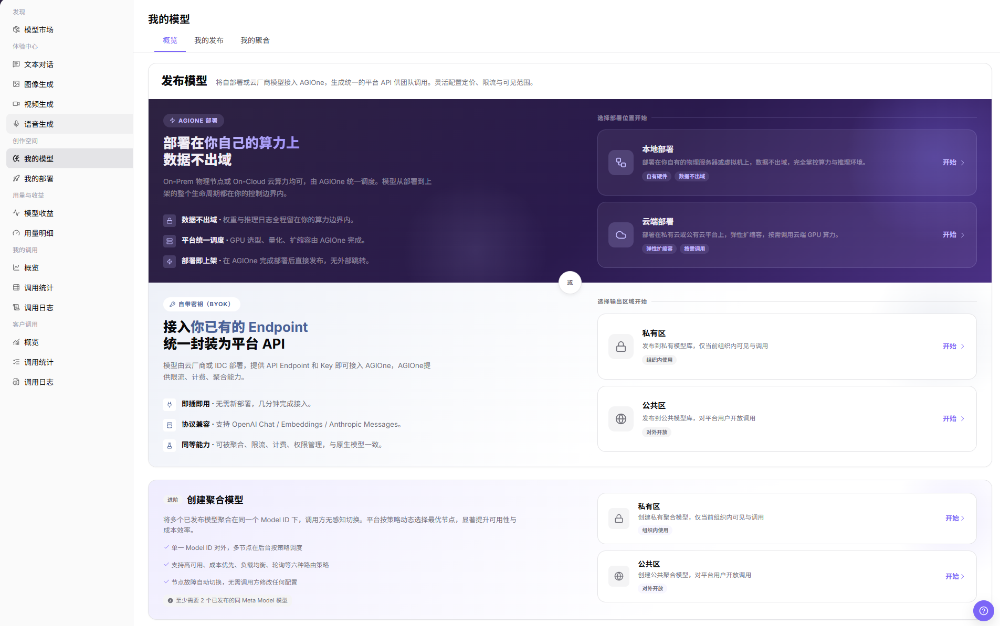
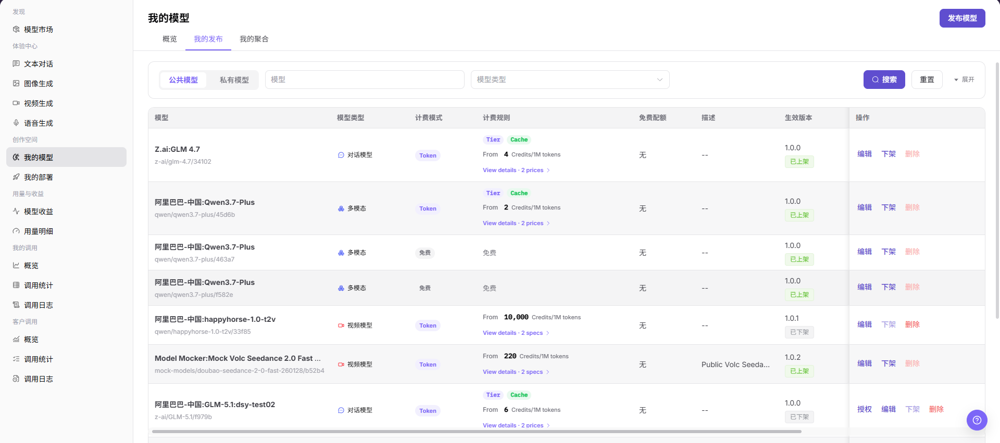
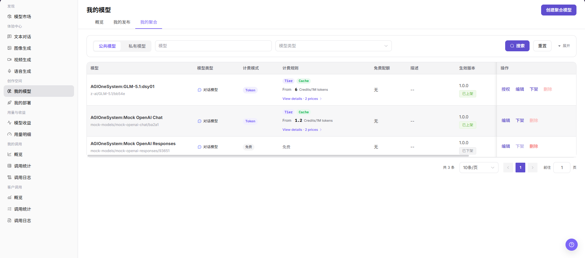
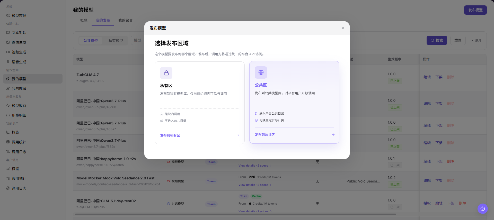
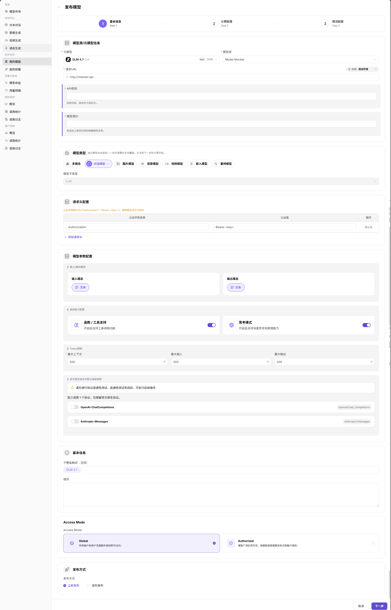
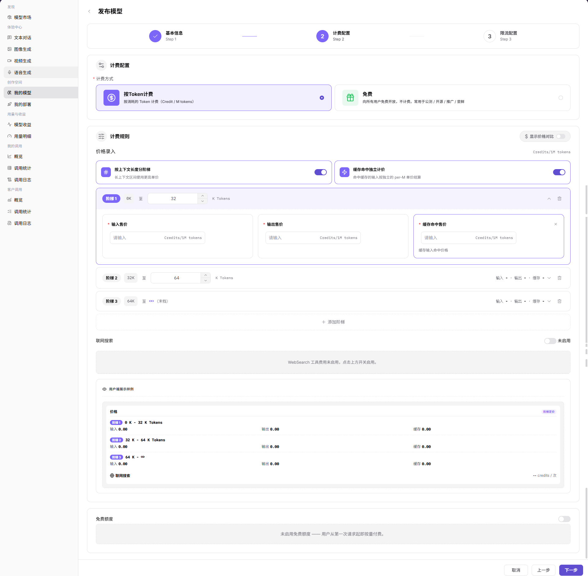
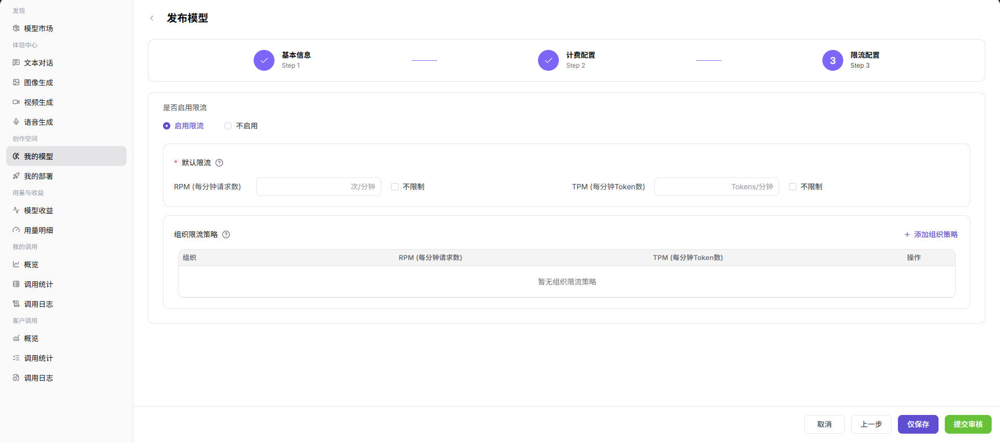
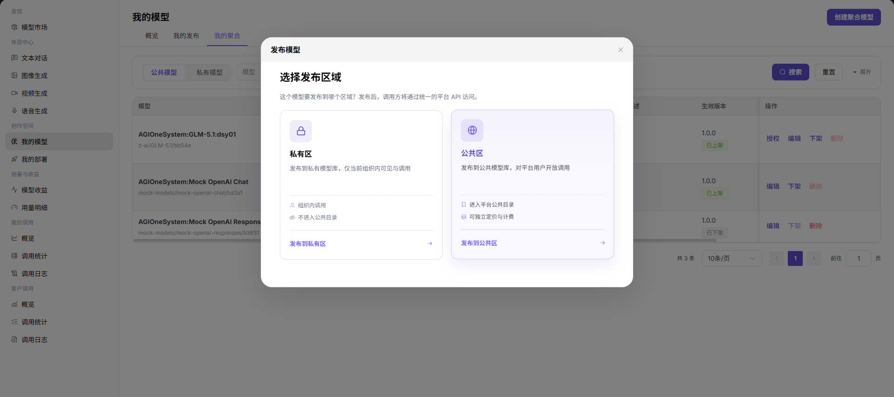
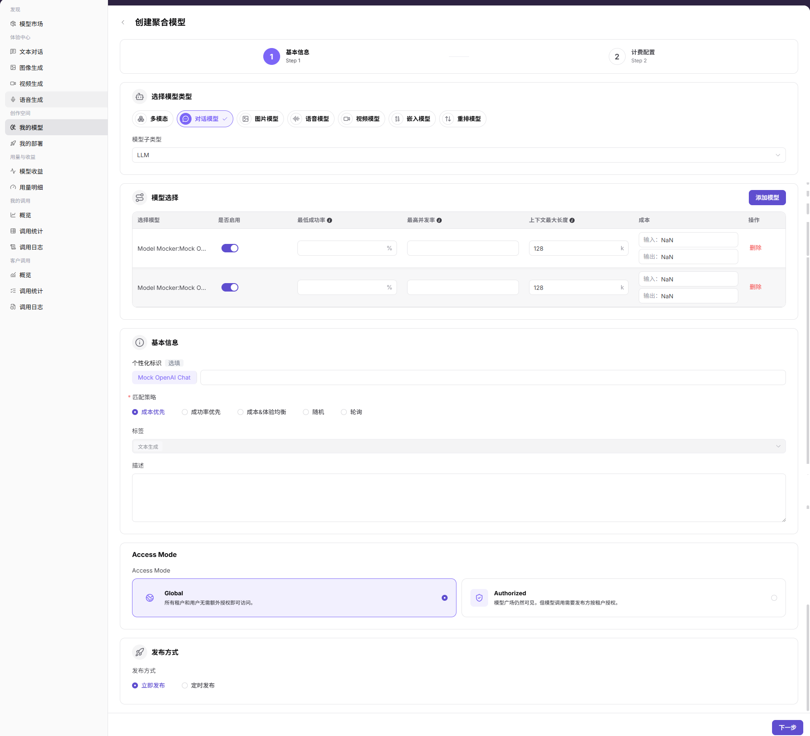
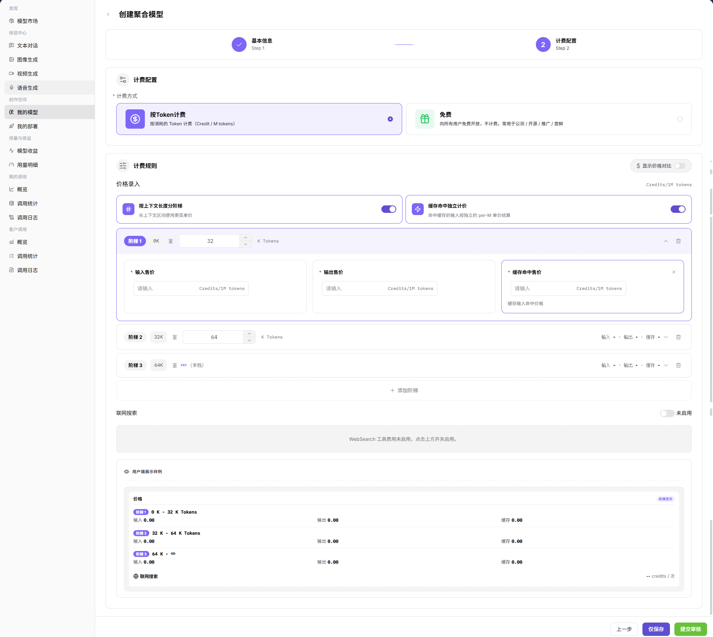

# 我的模型

::: info 文档信息
版本：v1.0
更新日期：2026-07-08
:::

## 功能概述

`我的模型` 是模型提供方维护和发布模型的工作台，支持发布模型、管理已发布模型，以及创建聚合模型。用户可以在页面中选择发布区域、配置模型基础信息、计费规则、限流策略和可见范围。

| 项目 | 内容 |
| --- | --- |
| 适用角色 | 模型提供方 |
| 导航路径 | 模型及AI服务 > 创作空间 > 我的模型 |
| 页面路由 | `/modelone/model` |
| 管理对象 | 已发布模型、聚合模型、模型来源、元模型、协议、计费、限流和可见范围 |
| 典型途径 | 发布模型、下架模型、编辑模型、创建聚合模型 |

#### 新手理解

`我的模型` 像模型提供方的发布控制台。`我的发布` 用于管理已发布或待发布的单模型，`我的聚合` 用于把多个已发布模型组合成一个对外模型，并通过路由策略提升可用性、成本控制或调用稳定性。

#### 术语速查

| 术语 | 说明 |
| --- | --- |
| 发布模型 | 将自部署或云厂商模型接入 AGIOne，并发布到私有区或公共区供调用。 |
| 聚合模型 | 将多个同类模型组合成一个 Model ID，由平台按策略选择具体节点。 |
| 发布区域 | 模型发布到 `私有区` 或 `公共区`。 |
| Access Mode | 控制模型是否对所有租户可访问，或调用前需要授权。 |
| 匹配策略 | 聚合模型的路由策略，例如成本优先、成功率优先、成本&体验均衡、随机、轮询。 |
| 计费配置 | 设置 Token、免费、分层价格、缓存价格、免费额度等费用规则。 |
| 限流配置 | 设置请求频率、并发、配额等调用控制策略。 |

## 前提条件

1. 当前账号具备 `我的模型` 页面访问权限。
2. 发布模型前已准备元模型、模型来源、请求 URL、认证信息、协议和计费方案。
3. 创建聚合模型前，至少已有可用于聚合的同类已发布模型。
4. 发布、保存、提交、创建、下架、删除等动作会影响真实模型服务，学习或验证页面时不要执行最终确认。

::: warning 高风险操作边界
`发布`、`提交`、`保存`、`创建`、`下架`、`删除`、修改计费类型、价格、联网搜索、免费额度、可见范围、调用配置和路由策略都可能影响真实模型服务、客户调用、账务结果或用户可用额度。仅学习或截图时，只打开页面、弹窗或配置步骤查看字段，最后点击 `取消`、返回或关闭页面，不点击最终确认。
:::

## 页面说明

页面包含 `概览`、`我的发布`、`我的聚合` 三个页签。`概览` 展示发布模型和创建聚合模型的入口；`我的发布` 展示已发布模型列表和操作入口；`我的聚合` 展示聚合模型列表和操作入口。

## 主要操作

### 发布模型

1. 进入 `模型及AI服务 > 创作空间 > 我的模型`。
2. 在 `概览` 页选择发布入口，或进入 `我的发布` 页点击 `发布模型`。
3. 在 `发布模型` 弹窗中选择发布区域，例如 `私有区` 或 `公共区`。
4. 进入 `发布模型` 页面，在 `基础信息` 步骤中按页面要求维护元模型、模型源、请求 URL、API 密钥、模型源 ID、模型类型、请求头配置、输入/输出模态、高级能力、Token 限制、协议、个性化标识、描述、Access Mode 和发布方式。
5. 点击 `下一步` 进入 `计费配置`，按页面要求配置计费类型（Billing type）、价格入口（Price Entry）、输入价格（Input Price）、输出价格（Output Price）、缓存价格（Cache Price）、联网搜索（Web Search）、免费额度（Free Quota）等价格或免费额度信息。
6. 确认模型信息、计费类型、价格配置、联网搜索、免费额度和可见范围无误。
7. 继续进入 `限流配置`，按页面要求配置限流策略。
8. 点击最终 `发布`、`保存` 或 `提交` 前再次核对模型来源、协议、价格、可见范围和限流配置；如仅学习或验证页面，请返回或关闭页面，不执行最终提交。

### 创建聚合模型

1. 进入 `模型及AI服务 > 创作空间 > 我的模型`。
2. 在 `概览` 页选择创建聚合模型入口，或进入 `我的聚合` 页点击 `创建聚合模型`。
3. 在 `发布模型` 弹窗中选择发布区域，例如 `私有区` 或 `公共区`。
4. 进入 `创建聚合模型` 页面，在 `基础信息` 步骤中选择模型类型、模型子类型和参与聚合的模型。
5. 在 `模型选择` 区域确认模型是否启用、最低成功率、最高并发率、上下文最大长度和成本。
6. 在 `基本信息` 区域配置个性化标识、匹配策略、标签和描述；匹配策略可按页面提供的成本优先、成功率优先、成本&体验均衡、随机或轮询选择。
7. 配置 Access Mode、发布方式和计费配置。
8. 点击最终 `创建`、`保存` 或 `提交` 前再次核对参与模型、路由策略、价格和可见范围；如仅学习或验证页面，请返回或关闭页面，不执行最终提交。

## 参数说明

| 字段名称 | 是否必填 | 字段类型 | 示例 | 说明 |
| --- | --- | --- | --- | --- |
| 发布区域 | 是 | 卡片选择 | `私有区` / `公共区` | 决定模型发布后的可见目录和调用范围。 |
| 元模型 | 发布模型必填 | 下拉选择 | `GLM 4.7` | 定义模型能力、协议和基础类型。 |
| 模型源 | 发布模型必填 | 下拉选择 | `Model Mocker` | 模型请求来源或供应方接入来源。 |
| 请求 URL | 发布模型必填 | 输入框 | `https://example.com` | 模型服务访问地址，文档中不得写入真实内部地址。 |
| API 密钥 | 条件必填 | 密文输入 | `Bearer <key>` | 用于认证模型源请求，保存后不再显示。 |
| 模型源 ID | 条件必填 | 输入框 | `model-id` | 发送给上游供应方的模型标识。 |
| 模型类型 | 是 | 单选 / 标签 | `对话模型` | 模型能力类型，例如对话、图片、语音、视频、嵌入、重排等。 |
| 协议 | 是 | 开关 / 标签 | `OpenAI-ChatCompletions` | 当前模型兼容的调用协议。 |
| Access Mode | 是 | 单选卡片 | `Global` / `Authorized` | 控制模型调用是否需要授权。 |
| 发布方式 | 是 | 单选 | `立即发布` / `定时发布` | 控制发布生效时机。 |
| 计费类型 | 是 | 选择项 | 按页面选项为准 | 设置模型调用的计费方式，对应英文 UI 字段 `Billing type`。 |
| 价格入口 | 否 | 选择项 / 开关 | 按页面选项为准 | 设置价格配置入口或价格生效方式，对应英文 UI 字段 `Price Entry`。 |
| 输入价格 | 条件必填 | 数字 | 按页面单位填写 | 设置输入 Token、字符或请求的计费价格，对应英文 UI 字段 `Input Price`。 |
| 输出价格 | 条件必填 | 数字 | 按页面单位填写 | 设置输出 Token、字符或结果的计费价格，对应英文 UI 字段 `Output Price`。 |
| 缓存价格 | 否 | 数字 | 按页面单位填写 | 设置缓存命中或缓存相关调用价格，对应英文 UI 字段 `Cache Price`。 |
| 联网搜索 | 否 | 开关 / 选择项 | `开启` / `关闭` | 设置模型是否支持联网搜索及相关计费能力，对应英文 UI 字段 `Web Search`。 |
| 免费额度 | 否 | 数字 | 按页面单位填写 | 设置用户可免费使用的额度，对应英文 UI 字段 `Free Quota`。 |
| 聚合模型 | 创建聚合模型必填 | 模型选择 | `Model Mocker:Mock ...` | 参与聚合的已发布模型。 |
| 匹配策略 | 创建聚合模型必填 | 单选 | `成本优先` | 平台选择聚合节点的策略。 |
| 权重 / 成功率 / 并发 | 条件必填 | 数字输入 | `50%` | 用于控制聚合路由和节点可用性。 |
| 状态 | 否 | 标签 | `已上架` / `已下架` | 模型当前发布状态。 |
| 操作 | 否 | 行内按钮 | `授权` / `编辑` / `下架` / `删除` | 对模型记录执行查看或管理操作。 |

## 结果校验

| 检查项 | 成功表现 | 异常时处理 |
| --- | --- | --- |
| 页面可进入 | `我的模型` 页面正常打开，`概览`、`我的发布`、`我的聚合` 页签可见。 | 确认账号权限、导航路径和页面加载状态。 |
| 模型列表可加载 | `我的发布` 或 `我的聚合` 列表展示模型、状态、版本和操作入口。 | 点击 `搜索` 或 `重置` 后重试，必要时检查权限和筛选条件。 |
| 发布模型入口可见 | `发布模型` 按钮或发布入口可见，并可打开发布区域弹窗。 | 检查账号是否具备模型发布权限。 |
| 创建聚合模型入口可见 | `创建聚合模型` 按钮或入口可见，并可打开发布区域弹窗。 | 确认是否已有满足条件的已发布模型。 |
| 发布字段正常显示 | 基础信息、计费配置和限流配置步骤正常显示。 | 返回上一步重新选择发布区域或刷新页面。 |
| 聚合字段正常显示 | 模型选择、匹配策略、Access Mode、发布方式和计费配置正常显示。 | 检查参与聚合模型是否满足同类元模型要求。 |
| 高风险动作未误触 | 学习或截图时未点击最终 `发布`、`提交`、`保存`、`创建`、`下架`、`删除`。 | 若误触真实变更，立即记录时间和模型信息并通知相关负责人回滚或复核。 |

## 常见问题

#### 发布模型后为什么不可见？

可能模型仍处于审核中、发布任务未完成、可见范围设置为私有或模型版本未关联有效模板、来源、元模型。先查看状态和审核记录，再核对可见范围、供应方信息和版本配置。

#### 创建聚合模型时为什么无法选择模型？

常见原因是可聚合模型数量不足、模型类型或元模型不一致，或目标模型未上架。先确认至少有两个满足条件的已发布同类模型，再进入创建流程。

#### 价格或路由策略可以随意修改吗？

不建议。计费类型、输入价格、输出价格、缓存价格、联网搜索、免费额度、可见范围、限流、调用配置和路由策略都会影响客户调用、账务结果、用户可用额度和模型质量。修改前应确认影响范围，并在最终保存前复核。

## 后续操作

1. 发布后查看模型状态、审核记录和生效版本。
2. 到模型市场或体验中心验证模型名称、能力、价格和可见范围。
3. 通过调用日志、用量明细和模型收益跟踪调用质量与账务结果。
4. 聚合模型上线后持续观察成功率、延迟、成本和路由命中情况。

## 注意事项

- 不在文档中写入真实账号、密码、访问参数、API Key、Token、AK/SK、私钥或内部测试过程。
- 截图或导出前确认页面不包含真实密钥、未脱敏请求头、内部 Endpoint 或敏感业务数据。
- 发布模型和创建聚合模型均可能影响真实服务，学习时只查看字段，不执行最终确认。
- 价格、计费类型、联网搜索和免费额度会影响真实调用成本、账务统计和用户可用额度，文档只描述配置流程，不记录真实价格策略。
