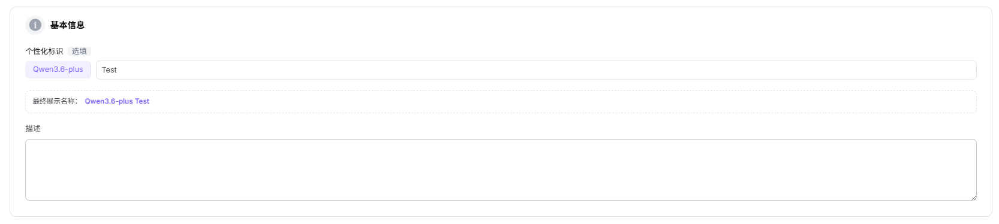
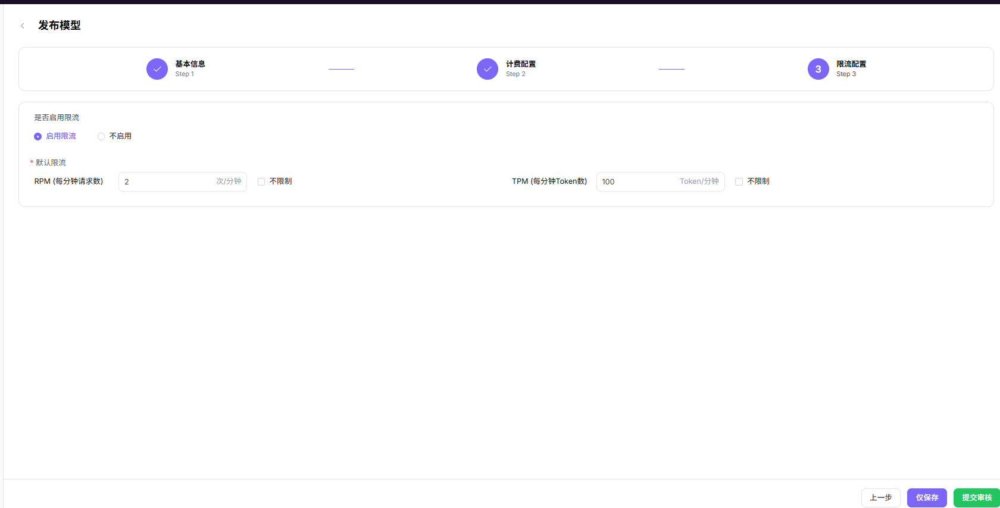

# 我的模型

:::: info 文档信息
版本：v1.0
更新日期：2026-07-06
::::

## 功能概述

`我的模型` 用于维护或查看自有模型、模型来源、请求头、Endpoint、发布方式、计费和限流配置，支撑模型发布、体验、调用、统计和运营治理。

| 项目 | 内容 |
| --- | --- |
| 适用角色 | 模型提供方 |
| 导航路径 | 工作室 > 我的模型 |
| 页面路由 | /user/studio/my-models |
| 管理对象 | 自有模型、模型来源、请求头、Endpoint、发布方式、计费和限流配置 |
| 典型用途 | 发布单模型、BYOK 模型或聚合模型 |

### 新手理解

我的模型像模型提供方的发布工作台。你可以在这里整理单模型、BYOK 模型或聚合模型的资料、来源、价格和限流规则，再提交审核或发布。

如果把模型市场看作对外货架，这一页就是上架前的后台；Endpoint、请求头、协议和计费配置写错，后续体验、调用和收益统计都会受到影响。

### 术语速查

| 术语 | 说明 |
| --- | --- |
| BYOK | 使用自有 Endpoint 或 API Key 接入模型服务。 |
| 聚合模型 | 把多个供应方实例组合成一个对外模型。 |
| 发布方式 | 决定模型是单模型、BYOK 还是聚合发布。 |
| 计费配置 | 定义输入、输出或调用量的计费口径。 |

## 前提条件

1. 当前账号具备模型发布或模型管理权限。
2. 单模型、BYOK 或聚合模型的发布方式已确定。
3. Endpoint、请求头、元模型、计费和限流参数已准备并脱敏。
## 页面说明

页面用于模型提供方发布和维护自有模型，支持单模型、BYOK 接入和聚合模型。不同发布方式对应不同的来源、计费、限流和审核要求。

页面截图：

用于查看模型状态、发布方式和审核入口。

## 主要操作

### 操作步骤

1. 进入 `工作室 > 我的模型`。
2. 选择发布单模型、BYOK 模型或聚合模型。
3. 填写基础信息、元模型、模型来源和请求头。
4. 配置计费、限流、协议和默认参数。
5. 提交后进入审核或发布流程。

关键步骤截图：

填写模型名称、说明和发布信息。

模型来源、元模型和协议必须一致。

提交前确认计费口径和供应方成本。

限流会影响客户调用体验和成本控制。

### 参数说明

| 字段名称 | 是否必填 | 字段类型 | 示例 | 说明 |
| --- | --- | --- | --- | --- |
| 发布方式 | 是 | 枚举 | `BYOK` | 单模型、BYOK 或聚合模型。 |
| 元模型 | 是 | 下拉选择 | `Qwen Text` | 定义能力和协议。 |
| 模型来源 | 条件必填 | 下拉选择 | `dashscope-cn` | BYOK 或单模型调用来源。 |
| 聚合策略 | 条件必填 | 枚举 | `按权重` | 聚合模型的供应方选择策略。 |
| 限流配置 | 否 | 数字 | `100 QPM` | 控制模型调用速率。 |

### 踩坑提示

- BYOK 模型必须先验证 Endpoint 和请求头。
- 聚合模型中任一供应方不可用都会影响整体质量。
- 计费配置提交前要和供应方成本核对。

### 结果校验

1. 模型草稿、审核状态或发布状态与操作结果一致。
2. BYOK 模型能通过连通性或协议测试。
3. 聚合模型的候选模型和路由策略保存正确。
## 常见问题

### 发布后模型不可见

**问题现象：**

模型提交发布后，在我的模型或模型市场中看不到对应记录。

**可能原因：**

- 模型仍处于审核中或发布任务未完成。
- 可见范围设置为私有、指定客户或指定租户。
- 模型版本未关联有效模板、来源或元模型。

**处理方式：**

1. 先查看模型状态、审核记录和发布时间。
2. 核对可见范围、供应方信息和版本配置。
3. 如审核已通过但市场不可见，联系运营方核对发布索引和可见范围。

### 模型版本审核被拒

**问题现象：**

提交的新模型或新版本被审核驳回，无法进入发布流程。

**可能原因：**

- 模型资料、样例、价格或使用边界缺失。
- Endpoint、API Key 或请求头连通性验证失败。
- 模型输出存在安全、隐私或合规风险。

**处理方式：**

1. 阅读审核意见，补齐模型说明、调用示例和授权材料。
2. 重新验证来源连通性、认证方式和返回格式。
3. 涉及敏感内容时，补充安全策略或调整模型可见范围后再提交。

### 模型状态卡在发布中

**问题现象：**

模型长时间显示发布中，市场页不可用或调用示例无法生成。

**可能原因：**

- 发布任务正在同步模型索引、模板或价格信息。
- 模型来源健康检查未通过。
- 发布流程依赖的审核、计费或可见范围配置未完成。

**处理方式：**

1. 等待发布任务完成并查看最近更新时间。
2. 核对模型来源、模板、元模型和价格配置是否完整。
3. 超过预期时间仍未完成时，提供模型 ID、版本号和发布时间给运营方排查。

## 后续操作

1. 查看审核记录和发布结果，确认模型版本是否进入可用状态。
2. 到模型市场搜索模型，验证名称、标签、价格和可见范围是否符合预期。
3. 使用 Playground 或调用日志验证模型输出质量、延迟和错误率。
4. 上线后持续跟踪用量、收益和客户反馈，必要时发布新版本。

## 注意事项

- 请求头、Endpoint、API Key 和模型源 ID 不要出现在截图或工单正文中。
- 发布前确认计费、限流和可见范围。
- 聚合模型变更会影响客户调用质量，需要记录变更原因。
