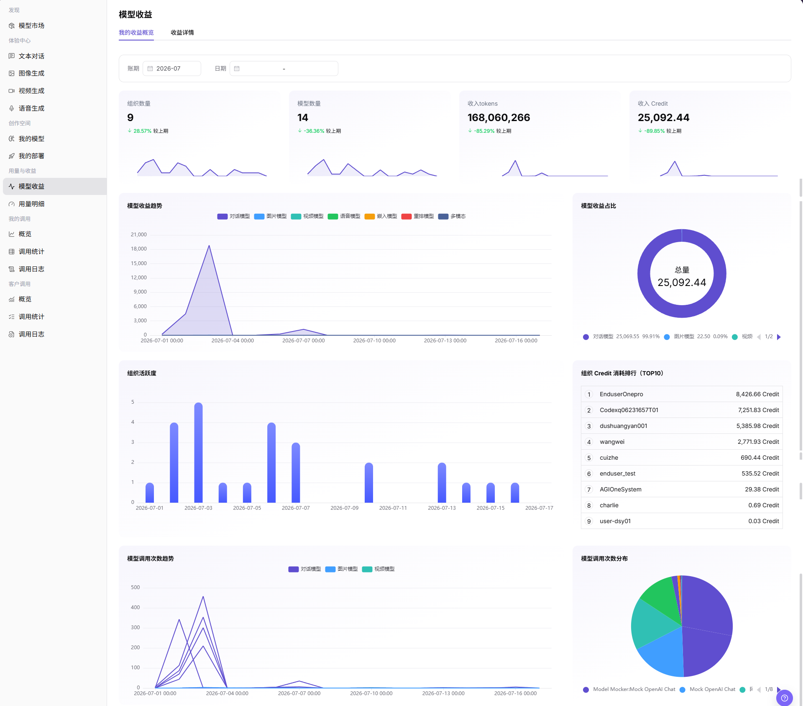
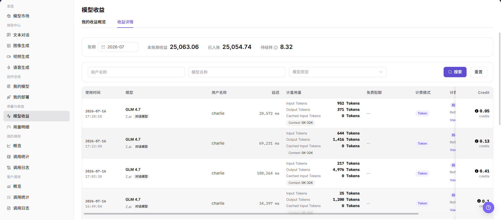

# 模型收益

::: info 文档信息
版本：v1.0
更新日期：2026-07-08
:::

## 功能概述

`模型收益` 用于模型提供方查看模型调用产生的收益概览和收益明细，支持按账期、日期、用户、模型和模型类型筛选，帮助核对收益、入账、待结转和调用消耗情况。

| 项目 | 内容 |
| --- | --- |
| 适用角色 | 模型提供方 |
| 导航路径 | 模型及AI服务 > 用量与收益 > 模型收益 |
| 页面路由 | `/modelone/accounting/useage` |
| 管理对象 | 模型收益概览、收益详情、账期、日期、计量用量、Credit、入账和待结转 |
| 典型途径 | 查看模型收益趋势、收益占比、组织消耗排行和收益明细 |

#### 新手理解

`模型收益` 像模型提供方的收入看板。`我的收益概览` 用于查看整体收益趋势和分布，`收益详情` 用于按用户、模型和调用记录核对每笔收益。

#### 术语速查

| 术语 | 说明 |
| --- | --- |
| 我的收益概览 | 展示组织数量、模型数量、收入 tokens、收入 Credit、收益趋势和收益占比。 |
| 收益详情 | 展示本账期收益、已入账、待结转，以及按调用记录展开的收益明细。 |
| 账期 | 收益统计和结算所属月份。 |
| 计量用量 | 输入 Token、输出 Token、缓存输入 Token 等计费口径下的用量。 |
| 免费配额 | 本次调用抵扣或可免费使用的额度。 |
| 计费模式 | 当前收益记录使用的计费方式，例如 Token。 |
| Credit | 页面展示的收益或消耗单位。 |

## 前提条件

1. 当前账号具备 `模型收益` 页面访问权限。
2. 目标模型已产生可统计的调用或收益记录。
3. 已确认要查看的账期、日期范围、用户、模型或模型类型。
4. 收益金额、用户名称、组织排行和结算状态属于敏感信息，截图或导出前需要脱敏。

::: warning 高风险操作边界
结算、调账、导出敏感数据、对外发送收益明细等操作可能影响账务核对或泄露商业敏感信息。本文只描述查看收益概览和查看收益详情，不引导执行结算、调账或导出敏感数据，也不写入真实账号、金额策略、内部测试参数或敏感数据。
:::

## 页面说明

页面包含 `我的收益概览` 和 `收益详情` 两个页签。`我的收益概览` 展示账期、日期、组织数量、模型数量、收入 tokens、收入 Credit、模型收益趋势、模型收益占比、组织活跃度、组织 Credit 消耗排行、模型调用次数趋势和模型调用次数分布。`收益详情` 展示账期汇总、筛选条件和收益明细列表。

## 主要操作

### 查看我的收益概览

1. 进入 `模型及AI服务 > 用量与收益 > 模型收益`。
2. 打开 `我的收益概览` 页签。
3. 按页面筛选项选择 `账期` 和 `日期`。
4. 查看 `组织数量`、`模型数量`、`收入 tokens`、`收入 Credit` 等概览指标。
5. 查看 `模型收益趋势`、`模型收益占比`、`组织活跃度`、`组织 Credit 消耗排行（TOP10）`、`模型调用次数趋势` 和 `模型调用次数分布`。
6. 核对图表和排行数据时，不截取或对外发送未脱敏的用户、组织、金额或 Credit 明细。

### 查看收益详情

1. 在 `模型收益` 页面切换到 `收益详情` 页签。
2. 查看顶部账期汇总，包括 `账期`、`本账期收益`、`已入账` 和 `待结转`。
3. 按页面筛选项输入或选择 `用户名称`、`模型名称`、`模型类型`。
4. 点击 `搜索` 查看符合条件的收益明细；如需清空筛选条件，点击 `重置`。
5. 在收益明细列表中查看 `使用时间`、`模型`、`用户名称`、`延迟`、`计量用量`、`免费配额`、`计费模式`、`Credit` 等信息。
6. 如页面存在查看、导出、结算或调整类入口，仅查看字段和状态，不执行结算、调账或导出敏感数据。

## 参数说明

| 字段名称 | 是否必填 | 字段类型 | 示例 | 说明 |
| --- | --- | --- | --- | --- |
| 账期 | 是 | 月份选择 | `2026-07` | 收益统计和结算所属月份。 |
| 日期 | 否 | 日期范围 | 按页面选择 | 用于限定概览图表的统计时间范围。 |
| 用户名称 | 否 | 输入框 | 按页面输入 | 在收益详情中按调用用户筛选明细。 |
| 模型名称 | 否 | 输入框 | 按页面输入 | 在收益详情中按模型筛选明细。 |
| 模型类型 | 否 | 下拉选择 | `对话模型` | 在收益详情中按模型能力类型筛选。 |
| 收益金额 | 系统生成 | 数字 | `Credit` | 页面展示的收益金额或 Credit 数值。 |
| 调用量 | 系统生成 | 数字 | `Tokens` | 输入 Token、输出 Token 或缓存输入 Token 等计量用量。 |
| 计费类型 | 系统生成 | 标签 | `Token` | 当前收益记录使用的计费方式。 |
| 结算状态 | 系统生成 | 状态 | `已入账` / `待结转` | 收益是否已入账或仍待结转。 |
| 时间范围 | 否 | 日期 / 月份 | 按页面选择 | 用于控制概览或详情统计周期。 |
| 调用方 | 系统生成 | 文本 | 用户或组织名称 | 产生收益的用户或组织。 |
| 操作 | 否 | 行内入口 | `查看` | 查看收益记录或相关计费信息。 |

## 结果校验

| 检查项 | 成功表现 | 异常时处理 |
| --- | --- | --- |
| 页面可进入 | `模型收益` 页面正常打开，`我的收益概览` 和 `收益详情` 页签可见。 | 确认账号权限、导航路径和页面加载状态。 |
| 收益概览正常展示 | 组织数量、模型数量、收入 tokens、收入 Credit 和图表正常显示。 | 切换账期或日期后重试，确认当前周期是否有收益数据。 |
| 筛选项可用 | 账期、日期、用户名称、模型名称、模型类型等筛选项可输入或选择。 | 检查筛选条件格式，必要时点击 `重置` 后重新查询。 |
| 收益列表正常加载 | 收益详情列表展示使用时间、模型、用户名称、计量用量、计费模式和 Credit。 | 确认账期内是否有收益记录，或放宽筛选条件。 |
| 收益详情可查看 | 明细中的金额、状态、时间和计量用量与筛选条件一致。 | 对比模型用量和调用日志，确认统计延迟或计费规则差异。 |
| 高风险操作未误触 | 学习或截图时未执行结算、调账或导出敏感数据。 | 若误触真实账务操作，立即记录时间和记录范围并通知负责人复核。 |

## 常见问题

#### 收益数据为空怎么办？

先确认账期和日期范围是否正确，再检查模型是否有成功调用和计费配置。收益数据可能存在统计或结算延迟。

#### 收益详情和概览金额不一致怎么办？

先确认筛选条件是否一致，再核对账期、时间范围和统计口径。概览和详情可能因入账、待结转或统计延迟产生短时间差异。

#### 可以导出收益明细对账吗？

收益明细包含用户、金额和调用信息，属于敏感数据。导出前应确认权限、脱敏要求和使用范围；仅学习页面时不要导出。

## 后续操作

1. 与模型用量、调用统计和调用日志交叉核对。
2. 对账时使用脱敏后的收益明细。
3. 根据收益趋势、模型类型占比和组织消耗排行优化模型运营策略。

## 注意事项

- 不在文档中写入真实账号、金额策略、内部测试参数或敏感数据。
- 截图或导出前确认用户名称、组织名称、收益金额和 Credit 明细已脱敏。
- 结算、调账和导出敏感数据不属于本文操作范围。
