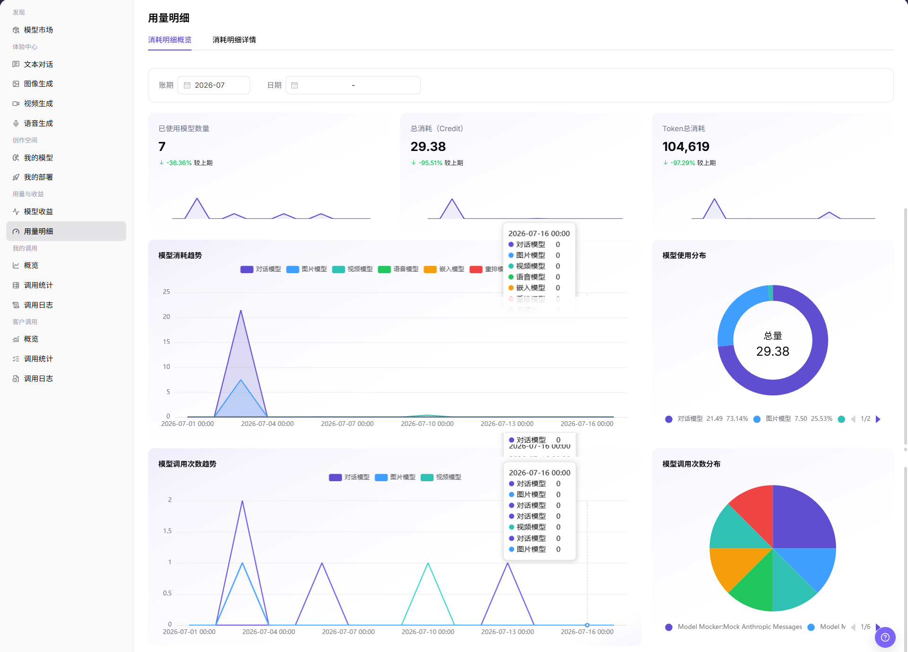
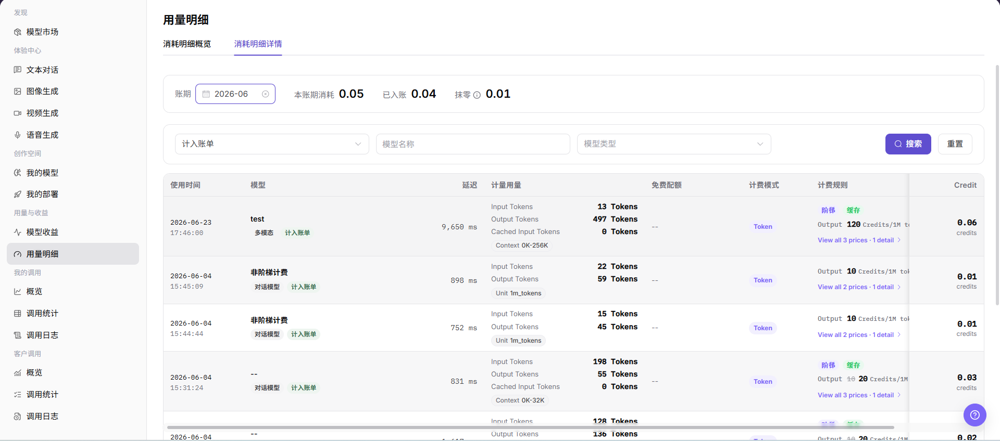

# 用量明细

::: info 文档信息
版本：v1.0
更新日期：2026-07-08
:::

## 功能概述

`用量明细` 用于模型提供方查看模型调用消耗概览和消耗明细详情，支持按账期、日期、账单状态、模型名称和模型类型筛选，帮助核对模型使用量、Credit 消耗、Token 消耗和计费规则。

| 项目 | 内容 |
| --- | --- |
| 适用角色 | 模型提供方 |
| 导航路径 | 模型及AI服务 > 用量与收益 > 用量明细 |
| 页面路由 | `/modelone/accounting/deduction` |
| 管理对象 | 消耗明细概览、消耗明细详情、账期、日期、计量用量、免费配额、计费模式、计费规则和 Credit |
| 典型途径 | 查看模型调用消耗、Token 消耗趋势、模型使用分布和消耗明细 |

#### 新手理解

`用量明细` 像模型调用的消耗账单。`消耗明细概览` 用于查看总体消耗和趋势，`消耗明细详情` 用于按调用记录核对每次请求的 Token、费用、计费规则和入账情况。

#### 术语速查

| 术语 | 说明 |
| --- | --- |
| 消耗明细概览 | 展示已使用模型数量、总消耗、Token 总消耗、模型消耗趋势和模型使用分布。 |
| 消耗明细详情 | 展示本账期消耗、已入账、抹零，以及按调用记录展开的消耗明细。 |
| 计量用量 | 输入 Token、输出 Token、缓存输入 Token 等参与计费的用量。 |
| 免费配额 | 本次调用抵扣或可免费使用的额度。 |
| 计费模式 | 当前消耗记录使用的计费方式，例如 Token。 |
| 计费规则 | 当前消耗记录匹配的价格规则，例如阶梯、缓存或输出价格。 |
| Credit | 页面展示的消耗单位。 |

## 前提条件

1. 当前账号具备 `用量明细` 页面访问权限。
2. 目标模型在统计周期内存在调用记录。
3. 已确认要查看的账期、日期范围、账单状态、模型名称或模型类型。
4. 消耗金额、模型调用记录、请求内容和请求 ID 属于敏感信息，截图或导出前需要脱敏。

::: warning 高风险操作边界
导出敏感数据、扣费、调账、结算和对外发送消耗明细都属于高风险操作，可能影响账务核对或泄露调用信息。本文只描述查看消耗明细概览和查看消耗明细详情，不引导执行导出、扣费、调账或结算，也不写入真实账号、请求内容、金额、密钥、请求 ID 或内部测试参数。
:::

## 页面说明

页面包含 `消耗明细概览` 和 `消耗明细详情` 两个页签。`消耗明细概览` 展示账期、日期、已使用模型数量、总消耗（Credit）、Token 总消耗、模型消耗趋势、模型使用分布、模型调用次数趋势和模型调用次数分布。`消耗明细详情` 展示账期汇总、筛选条件和消耗明细列表。

## 主要操作

### 查看消耗明细概览

1. 进入 `模型及AI服务 > 用量与收益 > 用量明细`。
2. 打开 `消耗明细概览` 页签。
3. 按页面筛选项选择 `账期` 和 `日期`。
4. 查看 `已使用模型数量`、`总消耗（Credit）`、`Token 总消耗` 等概览指标。
5. 查看 `模型消耗趋势`、`模型使用分布`、`模型调用次数趋势` 和 `模型调用次数分布`。
6. 核对趋势或分布数据时，不截取或对外发送未脱敏的模型、金额、Credit、请求或业务标识信息。

### 查看消耗明细详情

1. 在 `用量明细` 页面切换到 `消耗明细详情` 页签。
2. 查看顶部账期汇总，包括 `账期`、`本账期消耗`、`已入账` 和 `抹零`。
3. 按页面筛选项选择 `计入账单`，并输入或选择 `模型名称`、`模型类型`。
4. 点击 `搜索` 查看符合条件的消耗明细；如需清空筛选条件，点击 `重置`。
5. 在消耗明细列表中查看 `使用时间`、`模型`、`延迟`、`计量用量`、`免费配额`、`计费模式`、`计费规则`、`Credit` 等信息。
6. 如页面存在查看、导出、扣费、调账或结算类入口，仅查看字段和状态，不执行真实扣费、调账、结算或导出敏感数据。

## 参数说明

| 字段名称 | 是否必填 | 字段类型 | 示例 | 说明 |
| --- | --- | --- | --- | --- |
| 账期 | 是 | 月份选择 | `2026-07` | 消耗统计和入账所属月份。 |
| 日期 | 否 | 日期范围 | 按页面选择 | 用于限定概览图表的统计时间范围。 |
| 计入账单 | 否 | 下拉选择 | 按页面选项为准 | 在消耗明细详情中按是否计入账单筛选。 |
| 模型名称 | 否 | 输入框 | 按页面输入 | 在消耗明细详情中按模型筛选记录。 |
| 模型类型 | 否 | 下拉选择 | `对话模型` | 在消耗明细详情中按模型能力类型筛选。 |
| 输入消耗 | 系统生成 | 数字 | `Input Tokens` | 请求输入 Token 或输入侧用量。 |
| 输出消耗 | 系统生成 | 数字 | `Output Tokens` | 模型输出 Token 或输出侧用量。 |
| 缓存消耗 | 系统生成 | 数字 | `Cached Input Tokens` | 缓存输入命中或缓存相关用量。 |
| 联网搜索消耗 | 系统生成 | 数字 | 按页面展示 | 联网搜索工具或相关能力产生的消耗。 |
| 费用 | 系统生成 | 数字 | `Credit` | 本次调用产生的 Credit 消耗。 |
| 状态 | 系统生成 | 标签 | `计入账单` | 当前消耗记录的账单状态或入账状态。 |
| 操作 | 否 | 行内入口 | `查看` | 查看消耗记录、价格规则或相关计费信息。 |

## 踩坑提示

- 用量明细用于核对消耗，不直接代表最终收益，收益还要结合计费规则和结算口径。
- 比较用量前先统一模型、客户、时间范围和调用类型。
- 统计延迟可能导致近期调用暂未入表，排查时同时查看调用日志。

## 结果校验

| 检查项 | 成功表现 | 异常时处理 |
| --- | --- | --- |
| 页面可进入 | `用量明细` 页面正常打开，`消耗明细概览` 和 `消耗明细详情` 页签可见。 | 确认账号权限、导航路径和页面加载状态。 |
| 消耗明细概览正常展示 | 已使用模型数量、总消耗、Token 总消耗和图表正常显示。 | 切换账期或日期后重试，确认当前周期是否有用量数据。 |
| 筛选项可用 | 账期、日期、计入账单、模型名称、模型类型等筛选项可输入或选择。 | 检查筛选条件格式，必要时点击 `重置` 后重新查询。 |
| 列表数据正常加载 | 消耗明细列表展示使用时间、模型、计量用量、计费模式、计费规则和 Credit。 | 确认账期内是否有消耗记录，或放宽筛选条件。 |
| 详情入口可打开 | 价格规则、详情或查看入口可正常展示相关信息。 | 检查记录是否完整，或刷新页面后重试。 |
| 字段与筛选一致 | 消耗、费用、状态、时间等字段与筛选条件一致。 | 对比调用日志和模型收益，确认统计延迟或计费规则差异。 |
| 高风险操作未误触 | 学习或截图时未执行导出、扣费、调账或结算。 | 若误触真实账务操作，立即记录时间和记录范围并通知负责人复核。 |

## 常见问题

#### 消耗数据为空怎么办？

先确认账期、日期范围、计入账单状态和模型筛选是否正确，再检查模型是否有成功调用。用量统计可能存在延迟。

#### 消耗和收益为什么不一致？

先统一账期、日期范围和模型筛选，再核对免费配额、抹零、缓存价格、结算延迟和计费规则。消耗明细和模型收益可能因入账或统计时机产生差异。

#### 可以导出消耗明细吗？

消耗明细可能包含模型、金额、请求和账单信息，属于敏感数据。导出前应确认权限、脱敏要求和使用范围；仅学习页面时不要导出。

## 后续操作

1. 与模型收益、调用统计和调用日志交叉核对。
2. 对账时使用脱敏后的消耗明细。
3. 根据消耗趋势、模型使用分布和调用次数分布调整限流、价格或模型运营策略。

## 注意事项

- 不在文档中写入真实账号、请求内容、金额、密钥、请求 ID 或内部测试参数。
- 截图或导出前确认模型名称、业务标识、Credit 和计费明细已脱敏。
- 导出敏感数据、扣费、调账和结算不属于本文操作范围。
