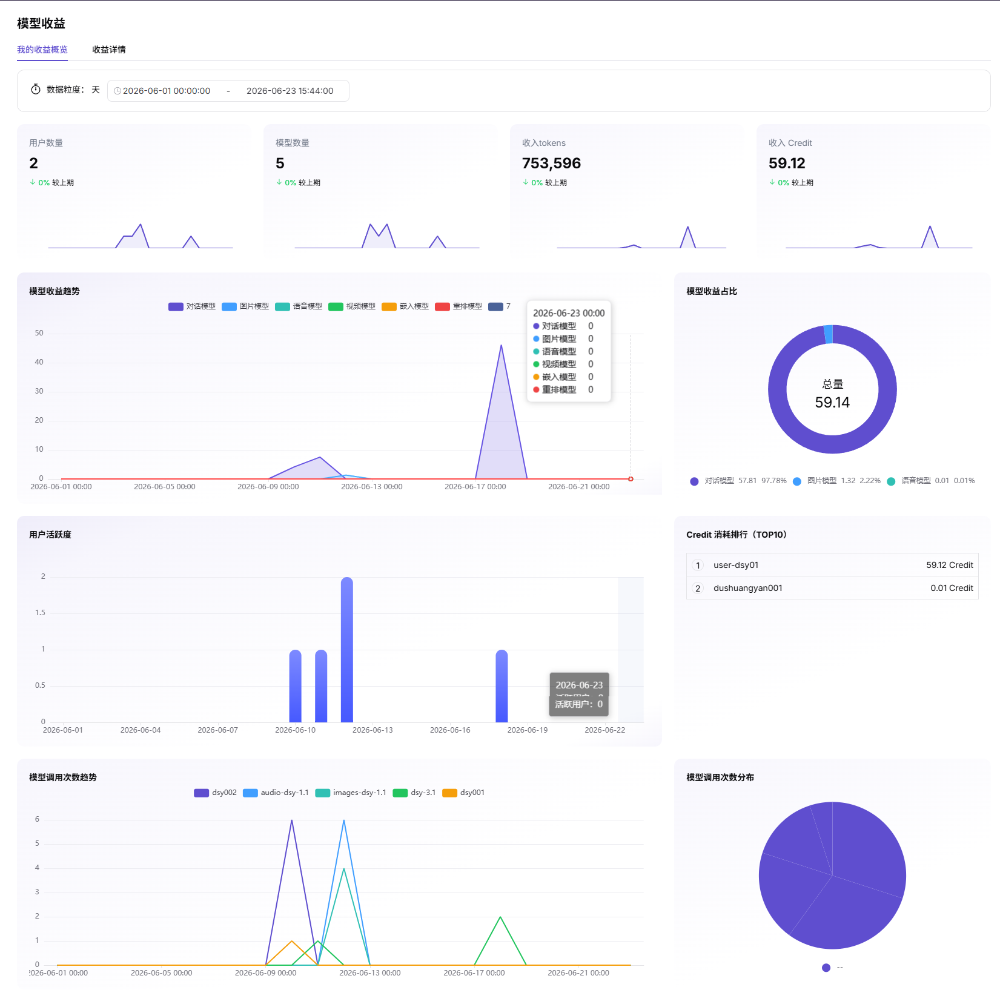

# 模型收益

::: info 文档信息
版本：v1.0
更新日期：2026-07-06
:::

::: warning 安全提示
调用与收益页面可能包含请求 ID、错误码、客户名称、Token 用量、费用、调用内容和 API Key 信息。截图和工单中应脱敏模型 ID、客户标识、请求头、调用参数和金额敏感信息。
:::

## 功能概述

`模型收益` 用于维护或查看模型收入、收益明细、结算周期、币种和客户贡献，支撑模型发布、体验、调用、统计和运营治理。

| 项目 | 内容 |
| --- | --- |
| 适用角色 | 模型提供方 |
| 导航路径 | 用量与收益 > 模型收益 |
| 页面路由 | /user/usage-revenue/model-revenue |
| 管理对象 | 模型收入、收益明细、结算周期、币种和客户贡献 |
| 典型用途 | 查看模型调用产生的收益 |

### 新手理解

模型收益像模型提供方的收入看板，用来查看哪些模型、客户和时间段贡献了收益，以及收益是否与调用量匹配。

### 术语速查

| 术语 | 说明 |
| --- | --- |
| 收益概览 | 按时间、模型或客户聚合后的收益总览。 |
| 收益明细 | 可用于对账的模型、客户、时间和金额明细。 |
| 结算状态 | 收益是否已完成统计、确认或结算。 |
| 客户贡献 | 客户在统计周期内产生的收益占比或金额。 |
## 前提条件

1. 当前账号具备模型收益查看权限。
2. 目标模型已产生可统计调用或收益记录。
3. 已确认统计时间范围、币种单位和结算状态。
4. 导出收益数据前已确认客户与金额字段脱敏要求。
## 页面说明

页面用于查看模型收益、客户贡献、结算状态、收益趋势和导出明细。用户应按模型、客户和时间范围筛选，并与模型用量页面核对统计口径。

页面截图：

用于查看收益总览、客户贡献和时间趋势。

## 主要操作

### 操作步骤

1. 进入 `用量与收益 > 模型收益`。
2. 选择时间范围、模型和客户维度。
3. 查看收益总额、客户贡献和趋势图。
4. 按模型或客户下钻查看收益明细。
5. 需要对账时导出脱敏统计数据。

关键步骤截图：

用于核对模型、客户、周期和收益明细。

### 参数说明

| 字段名称 | 是否必填 | 字段类型 | 示例 | 说明 |
| --- | --- | --- | --- | --- |
| 时间范围 | 是 | 日期范围 | `2026-07` | 收益统计周期。 |
| 模型 | 否 | 下拉选择 | `qwen-plus` | 按模型筛选收益。 |
| 客户 | 否 | 下拉选择 | `customer-a` | 按客户查看收益贡献。 |
| 收益金额 | 系统生成 | 数字 | `120 Credits` | 按货币设置折算后的收益。 |
| 结算状态 | 系统生成 | 枚举 | `已结算` | 收益是否完成结算。 |

### 踩坑提示

- 收益数据涉及商业敏感信息，截图和导出前必须脱敏客户名称和金额。
- 收益通常有结算延迟，不要用实时调用量直接推导已结算金额。
- 不同模型可能使用不同计费口径，必须统一时间范围再对比。

### 结果校验

1. 收益概览与收益明细汇总一致。
2. 切换模型、客户或时间范围后，趋势图和明细同步变化。
3. 结算状态、币种单位和展示精度符合货币设置。
## 常见问题

### 收益数据为空

**问题现象：**

模型有调用量，但收益页面没有金额。

**可能原因：**

- 结算任务尚未完成。
- 模型未配置计费或收益规则。
- 筛选时间范围不包含已结算数据。

**处理方式：**

1. 确认时间范围和结算状态。
2. 核对模型计费配置。
3. 等待结算任务完成后重新查看。

### 客户贡献金额异常

**问题现象：**

某客户收益明显高于或低于预期。

**可能原因：**

- 客户调用量突增或下降。
- 存在免费额度、折扣或抵扣。
- 统计口径或货币设置发生变化。

**处理方式：**

1. 对比模型用量趋势。
2. 查看客户调用分析。
3. 核对货币设置和收益规则。

## 后续操作

1. 与模型用量页面交叉核对。
2. 导出脱敏明细进行对账。
3. 根据客户贡献调整模型运营策略。
## 注意事项

- 收益金额、客户名称和结算状态属于敏感信息。
- 收益数据可能晚于调用用量入账。
- 对外沟通时只提供脱敏汇总，不提供客户原始明细。
