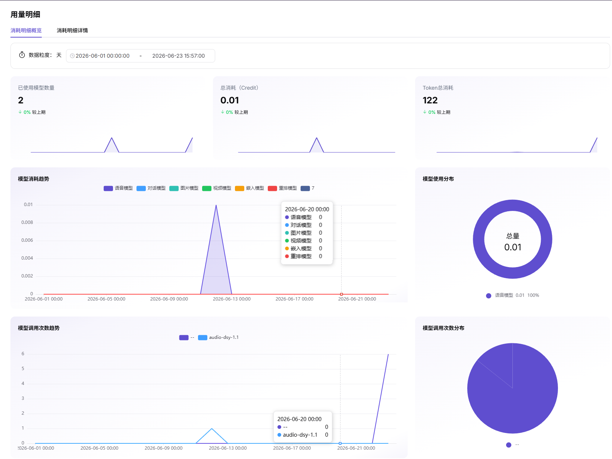
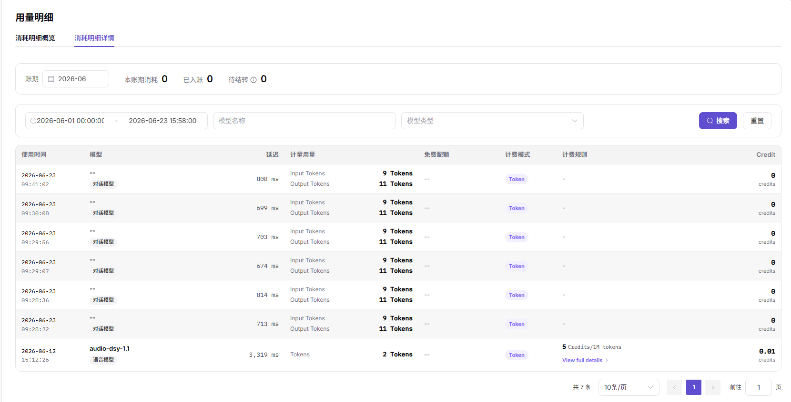

# 模型用量

::: info 文档信息
版本：v1.0
更新日期：2026-07-06
:::

::: warning 安全提示
调用与收益页面可能包含请求 ID、错误码、客户名称、Token 用量、费用、调用内容和 API Key 信息。截图和工单中应脱敏模型 ID、客户标识、请求头、调用参数和金额敏感信息。
:::

## 功能概述

`模型用量` 用于维护或查看模型调用量、Token 用量、客户分布、时间趋势和用量明细，支撑模型发布、体验、调用、统计和运营治理。

| 项目 | 内容 |
| --- | --- |
| 适用角色 | 模型提供方 |
| 导航路径 | 用量与收益 > 模型用量 |
| 页面路由 | /user/usage-revenue/model-usage |
| 管理对象 | 模型调用量、Token 用量、客户分布、时间趋势和用量明细 |
| 典型用途 | 查看模型被调用和消耗情况 |

### 新手理解

模型用量用于查看模型调用量、Token 消耗和客户使用趋势。它更像用水用电表，帮助模型提供方判断哪些模型被频繁使用、什么时候出现异常峰值。

### 术语速查

| 术语 | 说明 |
| --- | --- |
| 调用量 | 模型被请求的次数。 |
| Token 用量 | 输入和输出 Token 消耗。 |
| 用量明细 | 按时间、客户或模型拆分的记录。 |
| 统计口径 | 用量聚合和归属的规则。 |

## 前提条件

1. 当前账号具备模型用量查看权限。
2. 目标模型在统计周期内存在调用记录。
3. 已确认统计时间范围、模型、客户和 Token 口径。
## 页面说明

页面用于查看模型调用量、Token 消耗、成功率、失败率和客户使用趋势。用户应按模型、客户和时间范围筛选，结合调用日志判断异常峰值或用量下降原因。

页面截图：

用于查看调用量、Token 消耗和客户使用趋势。

## 主要操作

### 操作步骤

1. 进入 `用量与收益 > 模型用量`。
2. 选择时间范围、模型和客户维度。
3. 查看调用量、Token、成功率和失败率趋势。
4. 对异常日期下钻到调用日志或客户调用分析。
5. 按需导出脱敏后的统计数据。

关键步骤截图：

用于核对模型、客户、时间和消耗明细。

### 参数说明

| 字段名称 | 是否必填 | 字段类型 | 示例 | 说明 |
| --- | --- | --- | --- | --- |
| 时间范围 | 是 | 日期范围 | `最近 30 天` | 用量统计窗口。 |
| 模型 | 否 | 下拉选择 | `qwen-plus` | 按模型筛选用量。 |
| 客户 | 否 | 下拉选择 | `customer-a` | 按客户维度查看趋势。 |
| Token 用量 | 系统生成 | 数字 | `120000` | 统计周期内消耗 Token。 |
| 成功率 | 系统生成 | 百分比 | `99.2%` | 成功请求占比。 |

### 踩坑提示

- 用量统计通常存在延迟，不适合替代实时调用日志。
- 导出数据前遮挡客户名称、业务标识和费用字段。
- Token 口径要与模型协议和计费设置一起核对。

### 结果校验

1. 调用量、Token、成功率和失败率趋势有数据。
2. 模型、客户或时间范围变化后统计口径同步变化。
3. 用量异常能下钻到调用日志或客户调用分析验证。
## 常见问题

### 用量突然升高

**问题现象：**

某天或某小时调用量、Token 明显高于平时。

**可能原因：**

- 客户业务流量增长。
- 应用重试或循环调用。
- 统计口径切换或补数任务完成。

**处理方式：**

1. 按客户和模型拆分趋势。
2. 查看异常时间段调用日志。
3. 核对是否存在补数或口径变更。

### 用量与收益不一致

**问题现象：**

模型用量很高，但收益页面没有同步增长。

**可能原因：**

- 收益结算延迟。
- 部分调用免费、抵扣或未计费。
- 统计时间范围不同。

**处理方式：**

1. 统一时间范围和模型筛选。
2. 查看货币和计费设置。
3. 等待结算任务完成后复核。

## 后续操作

1. 查看模型收益核对收入变化。
2. 进入调用日志排查异常请求。
3. 根据用量趋势调整限流、价格或客户运营策略。
## 注意事项

- 用量统计可能存在延迟。
- Token 口径需与模型协议和计费设置一起核对。
- 截图或导出前遮挡客户名称和业务标识。
