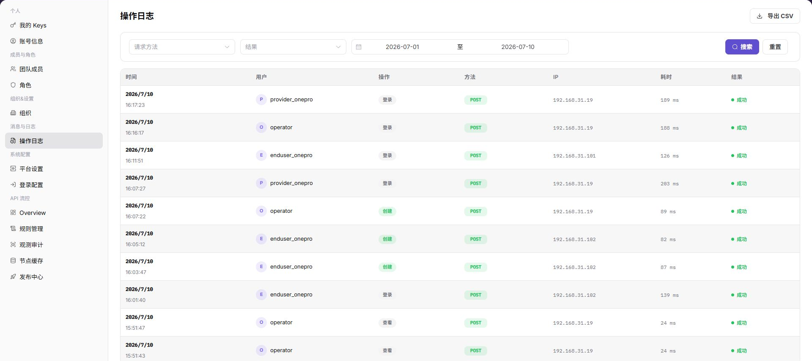

# 操作日志

::: info 文档信息
版本：v1.0
更新日期：2026-07-10
:::

## 功能概述

`操作日志` 用于查询平台操作记录，支持按时间范围筛选，查看用户、操作、方法、IP、耗时和结果，并提供 CSV 导出入口。

| 项目 | 内容 |
| --- | --- |
| 适用角色 | 运营方管理员 |
| 导航路径 | 消息与日志 > 操作日志 |
| 页面路由 | /operator/activity-notifications/operation-logs |
| 管理对象 | 平台操作记录、用户、操作、方法、IP、耗时和结果 |
| 典型用途 | 查询平台操作日志、排查异常操作和审计关键行为 |

### 新手理解

运营操作日志像平台后台的审计流水，用来追踪管理员对账号、组织、权限、频控和系统配置做过什么。它用于排障和追责，不是业务调用日志。
### 术语速查

| 术语 | 含义 | 处理建议 |
| --- | --- | --- |
| 操作人 | 执行平台管理动作的账号。 | 排查时先确认身份。 |
| 操作对象 | 被修改或查看的配置、成员或组织。 | 与页面记录对照。 |
| 操作结果 | 成功、失败或部分成功状态。 | 失败时查看错误信息。 |
| 审计范围 | 当前账号可查看的日志边界。 | 缺记录时先查权限。 |
## 前提条件

1. 当前账号具备查看操作日志的权限。
2. 已进入 `消息与日志 > 操作日志`。
3. 导出日志前已确认导出范围和接收对象。

## 页面说明

下图展示操作日志页面，用户、IP 和日志明细已做脱敏处理。

| 区域 | 说明 |
| --- | --- |
| 开始时间 / 结束时间 | 设置查询时间范围。 |
| 搜索 / 重置 | 查询或清空筛选条件。 |
| 导出 CSV | 导出当前范围内日志。 |
| 日志表格 | 展示时间、用户、操作、方法、IP、耗时和结果。 |

## 主要操作

### 查看操作日志

1. 进入 `消息与日志 > 操作日志`。
2. 选择 `开始时间` 和 `结束时间`。
3. 点击 `搜索` 查询日志。
4. 根据时间、用户、操作和结果定位目标记录。
5. 需要导出时，先确认日志范围，再点击 `导出 CSV`。

## 参数说明

| 字段名称 | 是否必填 | 字段类型 | 示例 | 说明 |
| --- | --- | --- | --- | --- |
| 操作人 | 否 | 文本 | ops@example.com | 按管理员账号筛选日志。 |
| 操作对象 | 否 | 文本 | 示例组织 A | 按组织、成员或配置对象筛选。 |
| 操作类型 | 否 | 枚举 | 修改权限 | 区分登录、配置、授权、审批等动作。 |
| 操作时间 | 否 | 时间范围 | 2026-07-13 09:00 至 10:00 | 定位操作发生时间。 |
| 操作结果 | 否 | 枚举 | 成功 | 区分成功、失败或异常操作。 |
## 踩坑提示

- 运营日志只记录平台管理动作，不用于排查模型调用耗时或业务请求内容。
- 搜索不到日志时先扩大时间范围，再确认操作入口是运营侧还是用户侧。
- 导出日志前要脱敏管理员账号、组织名称、IP、内部地址和错误详情。
## 结果校验

| 检查项 | 成功表现 | 异常处理 |
| --- | --- | --- |
| 时间筛选 | 日志按时间范围刷新。 | 检查时间范围是否过窄。 |
| 结果字段 | 操作结果正常显示。 | 结合用户和操作字段继续排查。 |
| 导出入口 | 导出按钮按权限展示。 | 导出前确认是否允许传递日志数据。 |

## 常见问题

### 查不到预期日志

**问题现象：**

按时间筛选后没有看到目标操作。

**可能原因：**

时间范围不覆盖操作发生时间，或当前账号没有查看对应日志的权限。

**处理方式：**

扩大时间范围后重新搜索；仍无结果时核对日志权限。

### 日志是否可以直接导出

**问题现象：**

页面存在 `导出 CSV` 入口。

**可能原因：**

日志可能包含用户、IP、接口路径和操作结果。

**处理方式：**

导出前确认用途、范围和接收人，必要时先脱敏。

### 运营日志为什么查不到目标记录？

**问题现象：**

运营操作日志中没有目标管理员、组织或配置变更记录。

**可能原因：**

日志时间范围不正确，操作发生在用户侧组织，或当前账号无权查看该类审计记录。

**处理方式：**

扩大时间范围并确认操作入口；按组织、操作人和对象重新筛选；仍为空时检查审计采集和保留策略。
## 后续操作

1. 需要核对成员变更，进入 [团队成员](../../members-roles/team-members/)。
2. 需要核对角色变更，进入 [角色](../../members-roles/roles/)。

## 注意事项

- 操作日志可能包含用户身份、IP 和接口路径，不要随意外发。
- 导出日志前应缩小时间范围，避免导出过多无关数据。
