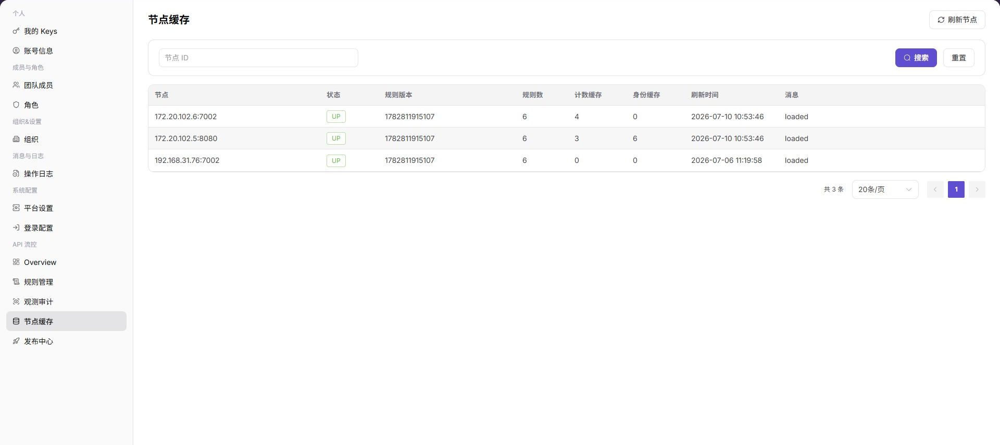

# 节点缓存

::: info 文档信息
版本：v1.0
更新日期：2026-07-10
:::

## 功能概述

`节点缓存` 用于查看 API 流控节点的缓存状态，包括节点状态、规则版本、规则数、计数缓存、身份缓存、刷新时间和消息。

| 项目 | 内容 |
| --- | --- |
| 适用角色 | 运营方管理员 |
| 导航路径 | API 流控 > 节点缓存 |
| 页面路由 | /operator/api-rate-control/node-cache |
| 管理对象 | API 流控节点、规则版本、规则数和缓存状态 |
| 典型用途 | 查看节点缓存状态、刷新时间、计数缓存和身份缓存 |

### 新手理解

节点缓存页像流控规则在各节点上的同步状态表，用来确认规则是否已经下发到节点，以及节点版本是否一致。

### 术语速查

| 术语 | 含义 | 处理建议 |
| --- | --- | --- |
| 节点缓存 | 节点本地保存的流控规则状态。 | 发布后核对版本。 |
| 规则版本 | 节点当前加载的规则版本。 | 不一致时排查发布。 |
| 同步状态 | 节点是否完成规则同步。 | 异常时查看发布中心。 |
| 刷新 | 重新加载节点缓存状态。 | 发布后用于确认。 |

## 前提条件

1. 当前账号具备 API 流控节点查看权限。
2. 已进入 `API 流控 > 节点缓存`。
3. 排查规则生效问题时，已记录目标规则版本和发布时间。

## 页面说明

下图展示节点缓存页面，节点地址和缓存明细已做脱敏处理。

| 区域 | 说明 |
| --- | --- |
| 刷新节点 | 重新获取节点缓存状态。 |
| 节点 ID | 按节点筛选。 |
| 节点表格 | 展示节点、状态、规则版本、规则数、计数缓存、身份缓存、刷新时间和消息。 |

## 主要操作

### 查看节点缓存

1. 进入 `API 流控 > 节点缓存`。
2. 输入节点 ID 后点击 `搜索`。
3. 查看节点状态和规则版本。
4. 点击 `刷新节点` 重新获取节点状态。
5. 如规则不生效，结合发布中心和观测审计继续核对。

## 参数说明

| 字段名称 | 是否必填 | 字段类型 | 示例 | 说明 |
| --- | --- | --- | --- | --- |
| 节点名称 | 否 | 文本 | node-01 | 用于识别节点。 |
| 规则版本 | 否 | 版本 | v20260713 | 节点当前规则版本。 |
| 同步状态 | 否 | 枚举 | 已同步 | 判断节点是否完成更新。 |
| 更新时间 | 否 | 时间 | 2026-07-13 10:00 | 节点缓存更新时间。 |
| 操作 | 否 | 按钮 | 刷新 | 重新加载节点状态。 |

## 踩坑提示

- 规则管理显示已发布后，仍要检查节点缓存是否同步。
- 单个节点版本落后可能导致部分请求表现不一致。
- 刷新无变化时，进入发布中心查看发布任务状态。

## 结果校验

| 检查项 | 成功表现 | 异常处理 |
| --- | --- | --- |
| 节点可见 | 节点列表正常展示。 | 检查节点 ID 筛选条件。 |
| 版本一致 | 节点规则版本与发布版本一致。 | 进入发布中心核对发布记录。 |
| 状态正常 | 节点状态正常且消息无异常。 | 结合观测审计排查节点问题。 |

## 常见问题

### 规则发布后节点版本未更新

**问题现象：**

规则管理已发布，但节点缓存中的规则版本仍旧。

**可能原因：**

节点尚未刷新，或发布记录未成功同步到节点。

**处理方式：**

点击 `刷新节点`，再进入发布中心查看对应发布状态。

### 节点缓存列表为什么没有目标节点？

**问题现象：**

节点缓存页面没有展示目标节点或缓存状态。

**可能原因：**

目标节点未接入 API 频控组件，节点缓存尚未上报，或地域、节点状态筛选限制了范围。

**处理方式：**

清空筛选并确认节点接入状态；检查缓存上报时间和节点健康状态；仍为空时查看频控服务日志。
### 为什么节点缓存刷新或清理按钮不可用？

**问题现象：**

节点缓存记录可见，但刷新、清理或重建缓存按钮不可点击。

**可能原因：**

当前账号只有查看权限，目标节点离线，或缓存清理属于高风险操作需要审批。

**处理方式：**

确认频控运维权限和节点在线状态；清理缓存前记录影响范围，并由具备权限的管理员执行。
## 后续操作

1. 查看发布记录，进入 [发布中心](../publish-center/)。
2. 查看规则命中情况，进入 [观测审计](../observability-audit/)。

## 注意事项

- 节点缓存页面用于排查规则同步，不直接替代规则发布操作。
- 节点地址和状态信息属于内部运行信息，截图应脱敏。
