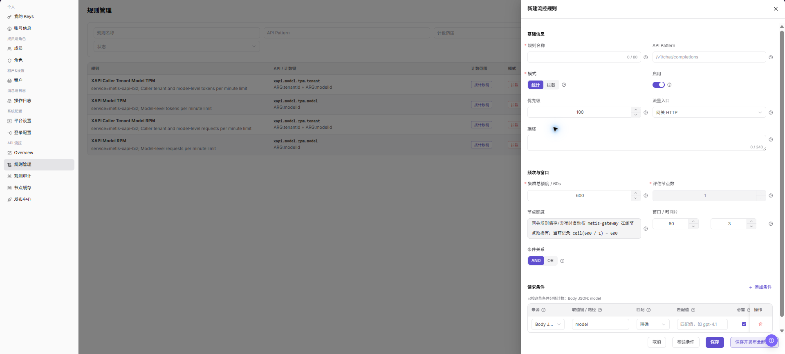

# 规则管理

::: info 文档信息
版本：v1.0
更新日期：2026-07-10
:::

## 功能概述

`规则管理` 用于维护 API 流控规则，包括按规则名称和 API Pattern 筛选，查看规则、计数键、计数范围、模式、额度、窗口、优先级、发布状态、启用状态和操作入口。

| 项目 | 内容 |
| --- | --- |
| 适用角色 | 运营方管理员 |
| 导航路径 | 设置 > API 流控 > 规则管理 |
| 页面路由 | `/user/system/rate-control/rules` |
| 管理对象 | API 流控规则、API Pattern、规则状态和发布状态 |
| 典型途径 | 查询、创建、编辑、启停和发布 API 流控规则 |

#### 新手理解

规则管理页像 API 流控规则库，用来配置哪些接口在什么条件下统计或拦截。规则发布前应先确认匹配范围、阈值和灰度影响。

#### 术语速查

| 术语 | 含义 | 处理建议 |
| --- | --- | --- |
| 流控规则 | 限制或统计 API 请求的规则。 | 发布前确认匹配范围。 |
| 阈值 | 触发统计或拦截的请求上限。 | 过低可能误伤业务。 |
| 统计模式 | 只记录超限但不拦截的模式。 | 上线前可先观察。 |
| 发布 | 将规则同步到节点的动作。 | 发布后查看节点缓存。 |

## 前提条件

1. 当前账号具备 API 流控规则管理权限。
2. 已进入 `API 流控 > 规则管理`。
3. 发布规则前已完成规则范围和影响评估。

## 页面说明

下图展示规则管理页面，规则明细已做脱敏处理。

| 区域 | 说明 |
| --- | --- |
| 刷新 | 刷新规则列表。 |
| 新建规则 | 新增流控规则入口。 |
| 发布全部规则版本 | 发布当前规则版本到节点。 |
| 规则名称 | 按规则名称筛选。 |
| API Pattern | 按 API 匹配模式筛选。 |
| 规则表格 | 展示规则、计数范围、模式、额度、窗口、优先级、发布、启用和操作。 |

## 主要操作

### 新建流控规则

1. 进入 `设置 > API 流控 > 规则管理`。
2. 点击 `新建规则`、`新建流控规则` 或页面真实新增入口。
3. 在新建规则页面或弹窗中查看规则配置字段。

4. 填写规则名称、接口路径、请求方法、匹配条件、限流阈值和时间窗口。
5. 根据页面字段选择生效范围、结果处理方式、启用状态或优先级。
6. 点击最终 `保存`、`提交` 或 `发布` 前，确认规则不会误拦截正常业务请求。
7. 如仅学习或截图，只查看字段并点击 `取消` 或返回，不提交真实规则配置。

## 参数说明

| 字段名称 | 是否必填 | 字段类型 | 示例 | 说明 |
| --- | --- | --- | --- | --- |
| 规则名称 | 是 | 文本 | 示例规则 A | 用于识别流控规则。 |
| 接口路径 | 是 | 文本 | /api/example | 规则匹配的接口路径，文档中必须脱敏。 |
| 请求方法 | 否 | 枚举 | GET | 规则匹配的 HTTP 请求方法。 |
| 匹配条件 | 是 | 条件表达式 | tenant = example | 规则命中的条件组合。 |
| 限流阈值 | 是 | 数值 | 100 次/分钟 | 触发统计或拦截的请求上限。 |
| 时间窗口 | 是 | 时间 | 1 分钟 | 统计请求次数的时间窗口。 |
| 生效范围 | 是 | 枚举 / 多选 | 全局 | 规则适用的接口、租户、用户或服务范围。 |
| 处理方式 | 是 | 枚举 | 拦截 | 规则命中后的处理策略。 |
| 启用状态 | 是 | 枚举 | 启用 | 判断规则是否参与流控。 |
| 优先级 | 否 | 数字 | 10 | 多条规则同时匹配时的处理顺序。 |
| 操作 | 系统生成 | 按钮 | 编辑 / 复制 / 发布 / 删除 | 提供规则后续维护入口。 |

## 踩坑提示

- 不要直接把新规则全量发布，先确认匹配路径和阈值。
- 规则发布成功不代表所有节点立即同步，应查看节点缓存和发布中心。
- 拦截异常升高时，先看观测审计再调整规则。
- 新建或发布流控规则会影响真实 API 访问、用户请求成功率和业务可用性。
- 错误接口路径、匹配条件、阈值或时间窗口可能导致正常请求被误拦截。
- `保存`、`提交`、`发布`、`发布全部`、`禁用`、`删除` 属于高风险动作。
- 不在文档中写真实接口路径、Token、账号、租户 ID、客户名、内部错误详情或压测参数。

## 结果校验

| 检查项 | 成功表现 | 异常时处理 |
| --- | --- | --- |
| 规则筛选 | 列表按名称或 API Pattern 刷新。 | 检查筛选条件。 |
| 状态可见 | 发布状态和启用状态正常展示。 | 刷新规则列表。 |
| 发布记录 | 发布后可在发布中心查看记录。 | 进入发布中心核对。 |
| 新建入口 | 点击 `新建规则` 后可打开新建规则页面或弹窗。 | 检查当前账号是否具备规则创建权限。 |

## 常见问题

#### 新规则发布后不生效

**问题现象：**

规则已配置，但请求没有被统计或拦截。

**可能原因：**

规则未发布到节点、启用状态不正确，或 API Pattern 未匹配目标请求。

**处理方式：**

确认规则启用和发布状态，再进入节点缓存和观测审计核对。

#### 发布全部规则前要检查什么

**问题现象：**

页面提供 `发布全部规则版本` 入口。

**可能原因：**

发布会影响 API 流控策略在节点上的生效版本。

**处理方式：**

先确认规则差异、影响 API 和回退方案，再由具备权限的人员发布。

#### 为什么看不到限流规则？

**问题现象：**

规则管理页没有展示预期的租户、模型或 API 限流规则。

**可能原因：**

规则创建在其他范围，规则已停用，或当前账号缺少 API 频控规则查看权限。

**处理方式：**

清空规则类型、状态和租户筛选；确认规则生效范围；仍不可见时由频控管理员检查规则配置和发布状态。
## 后续操作

1. 查看流控趋势，进入 [Overview](../overview/)。
2. 查看节点缓存，进入 [节点缓存](../node-cache/)。
3. 查看发布结果，进入 [发布中心](../publish-center/)。

## 注意事项

- API Pattern 配置过宽可能误伤正常请求。
- 发布和启用规则前应确认影响范围和回退方式。
- `保存`、`提交`、`发布`、`发布全部`、`禁用`、`删除` 属于高风险动作。
- 不在文档中写真实接口路径、Token、账号、租户 ID、客户名、内部错误详情或压测参数。
