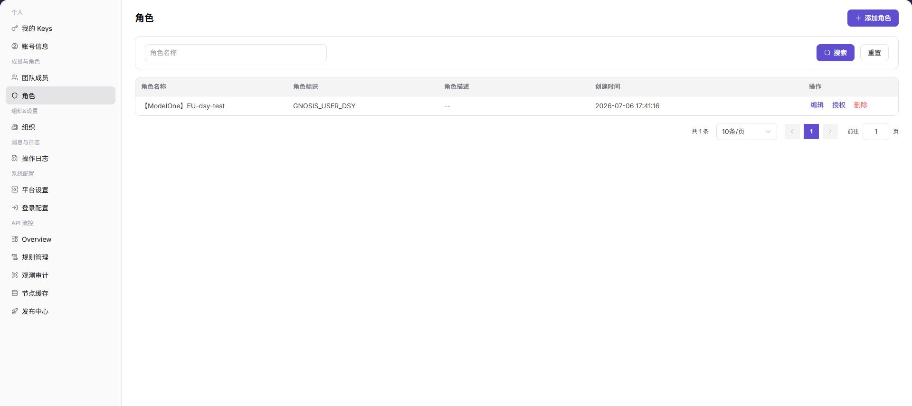

# 角色

::: info 文档信息
版本：v1.0
更新日期：2026-07-10
:::

## 功能概述

`角色` 用于查看和管理平台角色，包括按角色名称筛选，查看角色标识、角色描述、创建时间，以及执行添加、编辑、授权和删除操作。

| 项目 | 内容 |
| --- | --- |
| 适用角色 | 运营方管理员 |
| 导航路径 | 成员与角色 > 角色 |
| 页面路由 | /operator/members-roles/roles |
| 管理对象 | 角色名称、角色标识、权限范围和创建时间 |
| 典型用途 | 查询角色、查看角色权限和维护角色配置 |

### 新手理解

运营侧角色像平台后台的权限模板，用来定义管理员能看哪些系统模块、能改哪些配置、能处理哪些审批。它关注平台治理边界，不是项目内协作角色。
### 术语速查

| 术语 | 含义 | 处理建议 |
| --- | --- | --- |
| 平台角色 | 运营管理员权限集合。 | 按职责拆分。 |
| 权限点 | 菜单、按钮或接口级控制项。 | 修改前确认影响范围。 |
| 内置角色 | 系统预置且通常不可删除的角色。 | 只做查看或复制参考。 |
| 成员绑定 | 角色已分配给哪些运营成员。 | 删除前先解绑。 |
## 前提条件

1. 当前账号具备角色管理权限。
2. 已进入 `成员与角色 > 角色`。
3. 授权或删除角色前已确认影响成员范围。

## 页面说明

下图展示角色页面，角色明细已做脱敏处理。

| 区域 | 说明 |
| --- | --- |
| 角色名称 | 按角色名称筛选角色。 |
| 添加角色 | 新增角色入口。 |
| 角色表格 | 展示角色名称、角色标识、角色描述、创建时间和操作。 |

## 主要操作

### 管理角色

1. 进入 `成员与角色 > 角色`。
2. 输入 `角色名称` 后点击 `搜索`。
3. 查看目标角色的标识、描述和创建时间。
4. 点击 `授权` 查看角色权限配置入口。
5. 对 `添加角色`、`编辑`、`授权`、`删除` 等操作，确认影响范围后继续。

## 参数说明

| 字段名称 | 是否必填 | 字段类型 | 示例 | 说明 |
| --- | --- | --- | --- | --- |
| 角色名称 | 是 | 文本 | 审计管理员 | 运营角色展示名称。 |
| 角色标识 | 是 | 文本 | audit_admin | 角色唯一标识。 |
| 权限点 | 是 | 多选 | 操作日志查看 | 控制角色可访问的菜单和操作。 |
| 成员数量 | 否 | 数字 | 3 | 展示当前绑定该角色的成员数。 |
| 角色状态 | 否 | 枚举 | 启用 | 控制角色是否可继续分配。 |
## 踩坑提示

- 不要直接修改高权限角色，先复制或新增低风险角色验证权限范围。
- 删除角色前必须确认没有运营成员仍绑定该角色。
- 权限点变更会影响平台级操作入口，建议记录变更原因和审批依据。
## 结果校验

| 检查项 | 成功表现 | 异常处理 |
| --- | --- | --- |
| 角色筛选 | 列表按角色名称刷新。 | 检查名称是否准确。 |
| 授权入口 | 目标角色可进入授权入口。 | 检查当前账号角色管理权限。 |
| 删除入口 | 删除入口按权限展示。 | 删除前确认角色未被关键成员依赖。 |

## 常见问题

### 成员看不到菜单

**问题现象：**

成员登录后看不到某个菜单或按钮。

**可能原因：**

成员绑定的角色未授予对应菜单或操作权限。

**处理方式：**

进入角色授权入口核对权限范围，再确认成员是否绑定正确角色。

### 角色是否可以直接删除

**问题现象：**

角色列表中存在删除入口。

**可能原因：**

角色可能仍被成员使用，直接删除会影响访问能力。

**处理方式：**

先确认角色绑定成员，再按组织权限变更流程处理。

### 运营侧角色列表为什么为空？

**问题现象：**

运营侧角色页没有平台管理员、审计员或配置管理员角色。

**可能原因：**

当前账号没有运营角色管理权限，角色归属其他管理组织，或系统角色不允许在列表中编辑。

**处理方式：**

确认当前入口为运营侧设置；检查角色管理权限；系统内置角色异常时联系超级管理员核查。
## 后续操作

1. 需要查看角色绑定成员，进入 [团队成员](../team-members/)。
2. 需要追踪权限变更，进入 [操作日志](../../activity-notifications/operation-logs/)。

## 注意事项

- 授权变更会影响菜单可见性和按钮可用性。
- 删除角色前应确认没有关键成员依赖该角色。
