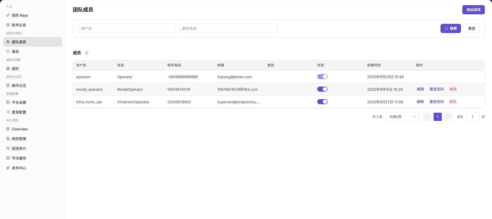

# 团队成员

::: info 文档信息
版本：v1.0
更新日期：2026-07-10
:::

## 功能概述

`团队成员` 用于查看和管理团队成员，包括按用户名、联系电话筛选成员，查看成员角色与状态，以及执行添加、编辑、重置密码、删除等管理操作。

| 项目 | 内容 |
| --- | --- |
| 适用角色 | 运营方管理员 |
| 导航路径 | 成员与角色 > 团队成员 |
| 页面路由 | /operator/members-roles/team-members |
| 管理对象 | 团队成员、角色、状态和联系方式 |
| 典型用途 | 查询成员、添加成员、查看成员状态和角色 |

### 新手理解

运营侧团队成员像平台后台的值班名单，用来管理谁可以进入运营控制台、处理配置、审批、审计和平台级任务。它不等同于用户组织里的团队成员。
### 术语速查

| 术语 | 含义 | 处理建议 |
| --- | --- | --- |
| 运营成员 | 具备平台管理入口的成员。 | 按职责授予角色。 |
| 平台角色 | 控制成员可管理的运营模块。 | 避免授予过大权限。 |
| 成员状态 | 成员是否启用、停用或待激活。 | 登录失败先看状态。 |
| 管理范围 | 成员可查看的租户、组织或系统配置范围。 | 排障时确认范围。 |
## 前提条件

1. 当前账号具备成员管理权限。
2. 已进入 `成员与角色 > 团队成员`。
3. 操作成员前已确认人员身份、角色范围和变更原因。

## 页面说明

下图展示团队成员页面，成员联系方式和邮箱已做脱敏处理。

| 区域 | 说明 |
| --- | --- |
| 用户名 | 按用户名筛选成员。 |
| 联系电话 | 按联系电话筛选成员。 |
| 添加成员 | 新增团队成员入口。 |
| 成员表格 | 展示用户名、姓名、联系电话、邮箱、角色、状态、创建时间和操作。 |

## 主要操作

### 管理团队成员

1. 进入 `成员与角色 > 团队成员`。
2. 输入 `用户名` 或 `联系电话` 后点击 `搜索`。
3. 查看成员的角色、状态和创建时间。
4. 点击 `编辑` 查看成员编辑入口。
5. 对 `添加成员`、`重置密码`、`删除` 和状态切换，仅在确认影响范围后继续。

## 参数说明

| 字段名称 | 是否必填 | 字段类型 | 示例 | 说明 |
| --- | --- | --- | --- | --- |
| 成员账号 | 是 | 文本 | ops@example.com | 运营成员登录账号。 |
| 平台角色 | 是 | 枚举 | 审计管理员 | 控制成员的运营侧权限。 |
| 管理范围 | 否 | 多选 | 全平台 | 限定成员可管理的对象范围。 |
| 成员状态 | 否 | 枚举 | 启用 | 判断成员是否可登录和操作。 |
| 最近登录 | 否 | 时间 | 2026-07-13 10:00 | 用于审计成员活跃情况。 |
## 踩坑提示

- 运营成员权限影响平台级配置，不要按用户侧组织角色来判断。
- 停用成员前确认是否有待处理审批、巡检任务或自动化交接。
- 新增成员后应到角色和操作日志中核对权限是否按预期生效。
## 结果校验

| 检查项 | 成功表现 | 异常处理 |
| --- | --- | --- |
| 筛选生效 | 列表按用户名或联系电话刷新。 | 清空条件后重新搜索。 |
| 状态可见 | 成员状态开关正常展示。 | 检查当前账号权限。 |
| 操作入口 | 编辑、重置密码、删除入口按权限展示。 | 联系管理员核对角色授权。 |

## 常见问题

### 成员无法登录

**问题现象：**

成员反馈无法进入平台。

**可能原因：**

成员状态被停用、密码已被重置但未同步，或角色授权不足。

**处理方式：**

核对成员状态、角色和密码重置记录，再按组织流程恢复访问。

### 删除成员前需要检查什么

**问题现象：**

列表中存在 `删除` 操作入口。

**可能原因：**

该成员可能仍关联业务操作、Key 或审批记录。

**处理方式：**

先确认成员是否仍承担业务职责，再按页面提示继续处理。

### 运营侧团队成员为什么为空？

**问题现象：**

运营侧团队成员页没有显示管理员或运营成员。

**可能原因：**

当前账号不在平台管理组织，成员属于用户侧组织，或角色范围限制了成员列表。

**处理方式：**

确认当前为运营侧入口；检查平台组织和管理员角色；必要时由超级管理员补充运营成员授权。
## 后续操作

1. 需要调整角色权限，进入 [角色](../roles/)。
2. 需要查看成员操作记录，进入 [操作日志](../../activity-notifications/operation-logs/)。

## 注意事项

- 不要在文档和截图中暴露成员手机号、邮箱或账号标识。
- 重置密码、删除成员和状态切换会影响成员访问，应先完成复核。
