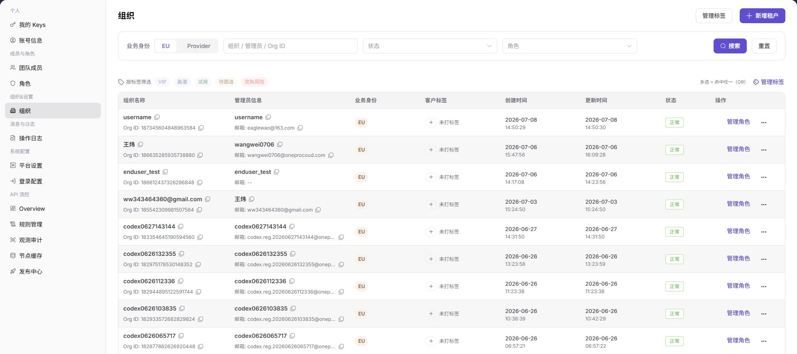

# 组织

::: info 文档信息
版本：v1.0
更新日期：2026-07-10
:::

## 功能概述

`组织` 用于管理平台中的组织主体，包括按业务身份、组织关键字、状态、角色和标签筛选组织，查看管理员信息、客户标签、创建时间、更新时间、状态和操作入口。

| 项目 | 内容 |
| --- | --- |
| 适用角色 | 运营方管理员 |
| 导航路径 | 组织&设置 > 组织 |
| 页面路由 | /operator/organizations/organizations |
| 管理对象 | 组织主体、业务身份、状态、角色和标签 |
| 典型用途 | 查询组织、查看组织信息、管理组织状态和标签 |

### 新手理解

组织页像平台业务主体名册，用来维护组织、管理员、角色、标签和业务归属。新增租户、调整角色或处理账务问题前，应先确认组织身份。

### 术语速查

| 术语 | 含义 | 处理建议 |
| --- | --- | --- |
| 组织 | 平台中的业务主体。 | 操作前确认唯一身份。 |
| 组织管理员 | 负责组织管理的账号。 | 联系和授权时核对。 |
| 组织角色 | 组织可拥有的权限集合。 | 变更前确认影响。 |
| 组织标签 | 用于分类组织的标记。 | 筛选和运营时使用。 |

## 前提条件

1. 当前账号具备组织管理权限。
2. 已进入 `组织&设置 > 组织`。
3. 对组织执行新增、角色管理或标签管理前，已确认业务身份和授权边界。

## 页面说明

下图展示组织页面，组织名称、管理员信息和邮箱已做脱敏处理。

| 区域 | 说明 |
| --- | --- |
| 业务身份 | 按 EU、Provider 等身份筛选组织。 |
| 组织 / 管理员 / Org ID | 按组织、管理员或组织 ID 搜索。 |
| 状态 | 按组织状态筛选。 |
| 角色 | 按组织角色筛选。 |
| 标签筛选 | 通过 VIP、高潜、试用、待跟进、流失风险等标签筛选。 |
| 管理标签 | 维护组织标签。 |
| 新增租户 | 创建新的组织或租户入口。 |

## 主要操作

### 管理组织

1. 进入 `组织&设置 > 组织`。
2. 选择业务身份、状态或角色。
3. 输入组织、管理员或 Org ID 后点击 `搜索`。
4. 使用标签筛选进一步缩小范围。
5. 查看组织状态、标签和操作入口。
6. 对 `新增租户`、`管理标签`、`管理角色` 等操作，确认影响范围后继续。

## 参数说明

| 字段名称 | 是否必填 | 字段类型 | 示例 | 说明 |
| --- | --- | --- | --- | --- |
| 组织名称 | 否 | 文本 | 示例组织 A | 用于识别组织。 |
| 组织 ID | 否 | 文本 | ORG-001 | 用于精确定位组织。 |
| 管理员 | 否 | 账号 | 示例管理员 | 组织管理员信息。 |
| 标签 | 否 | 标签 | VIP | 组织分类标记。 |
| 状态 | 否 | 枚举 | 启用 | 判断组织是否可用。 |

## 踩坑提示

- 组织名称相似时不要只凭名称操作，应结合组织 ID 和管理员确认。
- 调整组织角色可能影响成员权限和业务访问。
- 组织标签用于分类，不应替代真实组织身份核验。

## 结果校验

| 检查项 | 成功表现 | 异常处理 |
| --- | --- | --- |
| 筛选生效 | 组织列表按条件刷新。 | 点击重置后重新查询。 |
| 标签可用 | 标签筛选后列表范围变化。 | 检查是否存在对应标签组织。 |
| 组织操作 | 管理角色、标签等入口按权限展示。 | 检查当前账号组织管理权限。 |

## 常见问题

### 查询不到目标组织

**问题现象：**

输入组织名称或 Org ID 后列表为空。

**可能原因：**

筛选条件过窄，或业务身份、状态、角色条件不匹配。

**处理方式：**

先点击 `重置`，再使用更少筛选条件查询。

### 组织角色变更前需要检查什么

**问题现象：**

页面提供 `管理角色` 入口。

**可能原因：**

组织角色会影响组织可使用的功能范围。

**处理方式：**

先确认组织身份、管理员和业务范围，再按权限变更流程处理。

### 组织列表为什么没有目标组织？

**问题现象：**

运营侧组织管理页没有显示目标组织或租户。

**可能原因：**

组织尚未创建，组织状态被停用，或当前运营账号只被授权查看部分组织。

**处理方式：**

清空组织名称、状态和地域筛选；确认组织创建记录和状态；仍不可见时由平台管理员检查组织授权范围。
## 后续操作

1. 需要管理成员权限，进入 [团队成员](../../members-roles/team-members/)。
2. 需要查看组织变更记录，进入 [操作日志](../../activity-notifications/operation-logs/)。

## 注意事项

- 组织页面包含管理员、邮箱和组织 ID 等敏感信息，截图前应脱敏。
- 新增租户和管理角色可能影响组织可见功能，应先确认授权边界。
