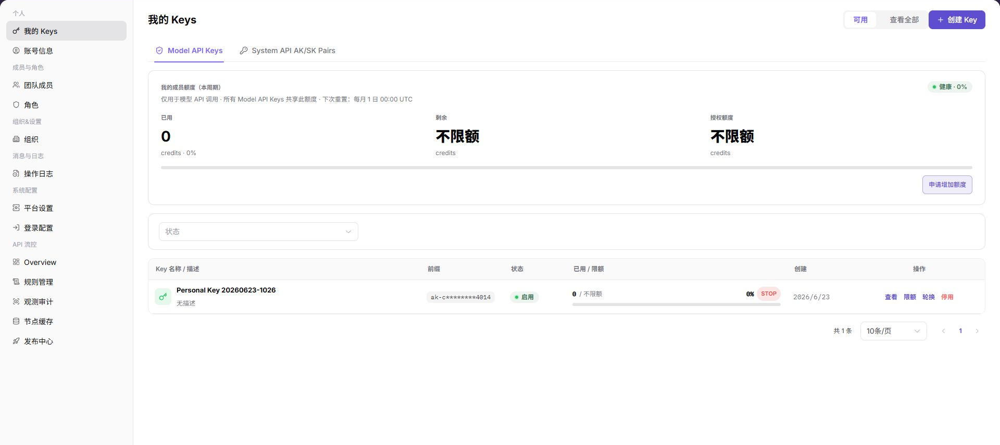

# 我的 Keys

::: info 文档信息
版本：v1.0
更新日期：2026-07-10
:::

## 功能概述

`我的 Keys` 用于查看和管理当前账号的模型调用 Key 与系统 AK/SK，包括额度概览、Key 状态、创建时间和行内操作入口。

| 项目 | 内容 |
| --- | --- |
| 适用角色 | 运营方账号 |
| 导航路径 | 个人 > 我的 Keys |
| 页面路由 | /operator/personal/my-keys |
| 管理对象 | 模型调用 Key、系统 AK/SK、额度和 Key 状态 |
| 典型用途 | 查看 Key 额度、创建或禁用 Key、查看行内操作入口 |

### 新手理解

运营 Keys 像平台管理员调用后台接口的通行证，用于受控访问管理类能力。它比普通用户 Key 权限更敏感，重点是范围、有效期、审计和停用。
### 术语速查

| 术语 | 含义 | 处理建议 |
| --- | --- | --- |
| 运营 Key | 运营侧接口或后台任务使用的访问凭据。 | 按最小权限创建。 |
| 权限范围 | Key 可访问的管理对象和接口范围。 | 创建前确认用途。 |
| 有效期 | Key 自动失效的时间边界。 | 长期任务要提前轮换。 |
| 调用审计 | Key 使用后留下的请求和操作记录。 | 异常时先查审计日志。 |
## 前提条件

1. 当前账号具备查看个人 Key 的权限。
2. 已进入 `个人 > 我的 Keys`。
3. 操作 Key 前已确认调用方、用途和替换计划。

## 页面说明

下图展示我的 Keys 页面，Key 前缀和额度信息已做脱敏处理。

| 区域 | 说明 |
| --- | --- |
| 可用 / 查看全部 | 按可用范围查看 Key。 |
| Model API Keys | 查看模型调用 Key。 |
| System API AK/SK Pairs | 查看系统 API AK/SK 对。 |
| 我的成员额度 | 展示当前周期已用、剩余和授权额度。 |
| 状态 | 按 Key 状态筛选列表。 |
| Key 列表 | 展示 Key 名称、前缀、状态、用量、创建时间和操作。 |

## 主要操作

### 管理我的 Keys

1. 进入 `个人 > 我的 Keys`。
2. 在 `可用` 和 `查看全部` 间切换，查看不同范围的 Key。
3. 在页签中切换 `Model API Keys` 或 `System API AK/SK Pairs`。
4. 使用 `状态` 筛选目标 Key。
5. 点击 `查看` 或 `限额` 查看详情信息。
6. 对 `创建 Key`、`轮换`、`停用` 等操作，仅在确认影响范围后继续。

## 参数说明

| 字段名称 | 是否必填 | 字段类型 | 示例 | 说明 |
| --- | --- | --- | --- | --- |
| Key 名称 | 是 | 文本 | 运维巡检 Key | 用于识别运营 Key 用途。 |
| 权限范围 | 是 | 多选 | 只读审计 | 控制 Key 可访问的管理能力。 |
| 有效期 | 是 | 日期 | 2026-12-31 | 控制 Key 失效时间。 |
| 状态 | 否 | 枚举 | 启用 | 判断 Key 是否可继续调用。 |
| 最近使用 | 否 | 时间 | 2026-07-13 10:00 | 用于审计 Key 活跃情况。 |
## 踩坑提示

- 运营 Key 不应复用为普通业务调用 Key，权限范围和审计要求不同。
- 创建 Key 后只在受控渠道保存一次，不要写入文档、截图或工单。
- 停用前确认是否有巡检、同步或自动化任务仍在使用该 Key。
## 结果校验

| 检查项 | 成功表现 | 异常处理 |
| --- | --- | --- |
| Key 列表 | 可看到 Key 名称、状态和操作入口。 | 检查筛选条件或账号权限。 |
| 页签切换 | 不同 Key 类型可正常切换。 | 刷新页面后重新进入。 |
| 额度展示 | 已用、剩余、授权额度正常显示。 | 联系管理员核对额度授权。 |

## 常见问题

### Key 无法继续使用

**问题现象：**

调用方反馈接口鉴权失败。

**可能原因：**

Key 被停用、轮换后调用方仍使用旧凭据，或额度已受限。

**处理方式：**

查看 Key 状态和限额；如发生轮换，应通知调用方切换到新凭据。

### 创建或轮换前需要注意什么

**问题现象：**

页面提供 `创建 Key` 或 `轮换` 入口。

**可能原因：**

Key 属于敏感凭据，变更会影响调用方。

**处理方式：**

确认用途、调用方和替换窗口，不要在文档或截图中记录完整 Key。

### 运营 Keys 为什么没有目标 Key？

**问题现象：**

运营侧我的 Keys 页面没有显示用于管理接口或后台任务的 Key。

**可能原因：**

Key 创建在用户侧入口，已停用或过期，或当前账号没有运营 Key 管理权限。

**处理方式：**

确认当前入口和 Key 类型；检查 Key 状态、有效期和创建记录；仍缺失时由平台管理员重新生成并记录用途。
## 后续操作

1. 需要查看账号基础信息时，进入 [账号信息](../profile/)。
2. 需要调整成员权限时，进入 [团队成员](../../members-roles/team-members/)。

## 注意事项

- 不要复制、粘贴或截图完整 Key、AK/SK、token 或 Secret。
- 轮换和停用 Key 前应确认业务方已完成切换。
- Key 的前缀只能用于识别，不等同于完整凭据。
