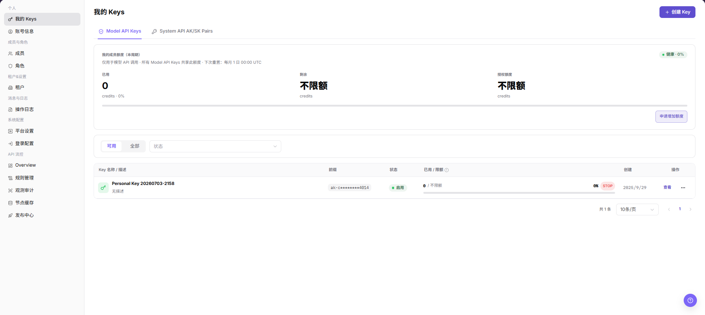
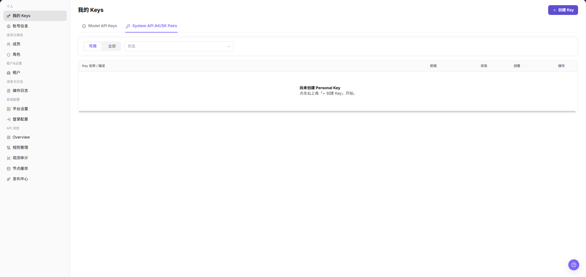
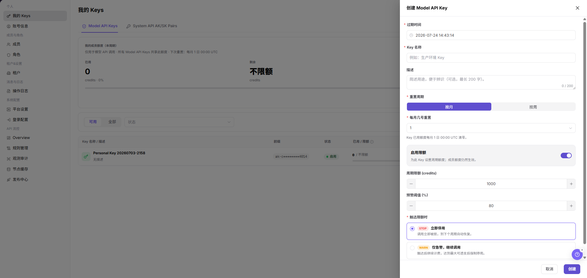
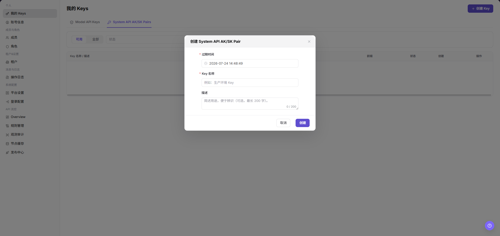

# 我的 Keys

::: info 文档信息
版本：v1.0
更新日期：2026-07-10
:::

## 功能概述

`我的 Keys` 用于查看和管理当前账号的模型调用 Key 与系统 AK/SK，包括额度概览、Key 状态、创建时间和行内操作入口。

| 项目 | 内容 |
| --- | --- |
| 适用角色 | 运营方账号 |
| 导航路径 | 设置 > 个人 > 我的 Keys |
| 页面路由 | `/user/user-space/my-keys` |
| 管理对象 | 模型调用 Key、系统 AK/SK、额度和 Key 状态 |
| 典型途径 | 查看 Key 额度、创建或禁用 Key、查看行内操作入口 |

#### 新手理解

运营 Keys 像平台管理员调用后台接口的通行证，用于受控访问管理类能力。它比普通用户 Key 权限更敏感，重点是范围、有效期、审计和停用。

#### 术语速查

| 术语 | 含义 | 处理建议 |
| --- | --- | --- |
| 运营 Key | 运营侧接口或后台任务使用的访问凭据。 | 按最小权限创建。 |
| 权限范围 | Key 可访问的管理对象和接口范围。 | 创建前确认用途。 |
| 有效期 | Key 自动失效的时间边界。 | 长期任务要提前轮换。 |
| 调用审计 | Key 使用后留下的请求和操作记录。 | 异常时先查审计日志。 |
## 前提条件

1. 当前账号具备查看个人 Key 的权限。
2. 已进入 `个人 > 我的 Keys`。
3. 操作 Key 前已确认调用方、用途和替换计划。

## 页面说明

下图展示我的 Keys 页面，Key 前缀和额度信息已做脱敏处理。

| 区域 | 说明 |
| --- | --- |
| 可用 / 查看全部 | 按可用范围查看 Key。 |
| Model API Keys | 查看模型调用 Key。 |
| System API AK/SK Pairs | 查看系统 API AK/SK 对。 |
| 我的成员额度 | 展示当前周期已用、剩余和授权额度。 |
| 状态 | 按 Key 状态筛选列表。 |
| Key 列表 | 展示 Key 名称、前缀、状态、用量、创建时间和操作。 |

## 主要操作

### 创建 Model API Key

1. 进入 `个人 > 我的 Keys`。
2. 点击页面右上角的 `创建 Key`。
3. 在 `创建 Model API Key` 弹窗中填写 `过期时间`、`Key 名称` 和 `描述`。
4. 在 `重置周期` 中选择 `按月` 或 `按周`。选择 `按月` 时，核对 `每月几号重置`。
5. 如需单独限制该 Key 的调用额度，开启 `启用限额`，填写 `周期限额 (credits)` 和 `预警阈值 (%)`。
6. 在 `触达限额时` 中选择处理策略：`立即停用` 会在额度触达后拒绝调用；`仅告警，继续调用` 会继续调用并保留告警。
7. 点击最终 `创建` 前，再次核对用途、额度、重置周期和触达限额策略。
8. 如仅学习或截图，查看字段后点击 `取消`，不要创建真实 Key。

### 创建 System API AK/SK Pair

1. 进入 `个人 > 我的 Keys`。
2. 切换到 `System API AK/SK Pairs` 页签。
3. 点击 `创建 System API AK/SK Pair` 或页面真实创建入口。
4. 在弹出的创建窗口中查看字段。

5. 按页面字段填写名称、描述、过期时间、权限或限额相关配置。
6. 点击最终 `创建` 或 `确定` 前，确认 AK/SK 用途、权限范围、有效期和调用方保存方式。
7. 如仅学习或截图，只查看字段并点击 `取消` 关闭窗口，不提交真实配置。

## 参数说明

| 字段名称 | 是否必填 | 字段类型 | 示例 | 说明 |
| --- | --- | --- | --- | --- |
| 过期时间 | 否 | 日期时间 | 2026-12-31 23:59 | 控制 Model API Key 或 System API AK/SK Pair 的失效时间。 |
| Key 名称 | 是 | 文本 | 生产环境 Key | 用于识别 Key 用途。 |
| 名称 | 是 | 文本 | 后台任务调用凭据 | 用于识别 System API AK/SK Pair 用途。 |
| 描述 | 否 | 文本 | 模型服务调用 | 简述 Key 用途，便于后续识别。 |
| 重置周期 | 是 | 枚举 | 按月 | 控制 Key 已用额度的清零周期。 |
| 每月几号重置 | 条件必填 | 数字 | 1 | `重置周期` 为 `按月` 时配置。 |
| 启用限额 | 否 | 开关 | 启用 | 为单个 Key 设置周期额度。 |
| 周期限额 (credits) | 条件必填 | 数字 | 1000 | 启用限额后填写的周期额度。 |
| 预警阈值 (%) | 否 | 数字 | 80 | 达到阈值时触发预警。 |
| 触达限额时 | 是 | 枚举 | 立即停用 | 控制额度触达后的处理策略。 |
| AK | 系统生成 | 文本 | AK 示例前缀 | System API 的访问标识，只能按平台安全流程保存。 |
| SK | 系统生成 | 密钥 | 仅创建后展示 | System API 的访问密钥，不应写入文档、截图或工单。 |
| 权限范围 | 是 | 枚举 / 多选 | 只读接口 | 控制 AK/SK 可调用的系统接口范围。 |
| 状态 | 系统生成 | 枚举 | 启用 | 判断 Key 是否可继续调用。 |
| 操作 | 系统生成 | 按钮 | 查看 | 查看详情或执行后续操作。 |

## 踩坑提示

- 创建 Model API Key 会生成可调用模型服务的真实凭据，影响真实调用链路。
- System API AK/SK Pair 会生成系统接口调用凭据，权限范围通常比普通调用 Key 更敏感。
- `创建`、`确定` 属于最终高风险动作，学习、截图或验证页面时不要点击。
- `立即停用` 会在额度触达后拒绝调用；`仅告警，继续调用` 会继续放行调用并保留告警。
- 完整 Key、AK/SK 只允许在受控渠道保存一次，不能写入文档、截图、工单或示例。
- 不写真实 Key、AK/SK、Token、账号、Endpoint、客户名或内部测试参数。

## 结果校验

| 检查项 | 成功表现 | 异常处理 |
| --- | --- | --- |
| Key 列表 | 可看到 Key 名称、状态和操作入口。 | 检查筛选条件或账号权限。 |
| 页签切换 | 不同 Key 类型可正常切换。 | 刷新页面后重新进入。 |
| 额度展示 | 已用、剩余、授权额度正常显示。 | 联系管理员核对额度授权。 |
| 创建弹窗 | 点击 `创建 Key` 后可打开 `创建 Model API Key` 弹窗。 | 检查当前账号是否具备创建 Key 权限。 |
| AK/SK 创建窗口 | 切换到 `System API AK/SK Pairs` 后可打开创建窗口。 | 检查当前账号是否具备 System API 凭据创建权限。 |

## 常见问题

#### Key 无法继续使用

**问题现象：**

调用方反馈接口鉴权失败。

**可能原因：**

Key 被停用、轮换后调用方仍使用旧凭据，或额度已受限。

**处理方式：**

查看 Key 状态和限额；如发生轮换，应通知调用方切换到新凭据。

#### 创建或轮换前需要注意什么

**问题现象：**

页面提供 `创建 Key` 或 `轮换` 入口。

**可能原因：**

Key 属于敏感凭据，变更会影响调用方。

**处理方式：**

确认用途、调用方和替换窗口，不要在文档或截图中记录完整 Key。

#### 运营 Keys 为什么没有目标 Key？

**问题现象：**

运营侧我的 Keys 页面没有显示用于管理接口或后台任务的 Key。

**可能原因：**

Key 创建在用户侧入口，已停用或过期，或当前账号没有运营 Key 管理权限。

**处理方式：**

确认当前入口和 Key 类型；检查 Key 状态、有效期和创建记录；仍缺失时由平台管理员重新生成并记录用途。
## 后续操作

1. 需要查看账号基础信息时，进入 [账号信息](../profile/)。
2. 需要调整成员权限时，进入 [成员](../../members-roles/members/)。

## 注意事项

- 不要复制、粘贴或截图完整 Key、AK/SK、token 或 Secret。
- 不要在文档、截图、工单或示例中写真实 Key、AK/SK、Token、账号、Endpoint、客户名或内部测试参数。
- System API AK/SK Pair 会生成系统接口调用凭据，AK/SK 只允许在受控渠道保存一次。
- `创建`、`确定` 属于最终高风险动作。
- 轮换和停用 Key 前应确认业务方已完成切换。
- Key 的前缀只能用于识别，不等同于完整凭据。
