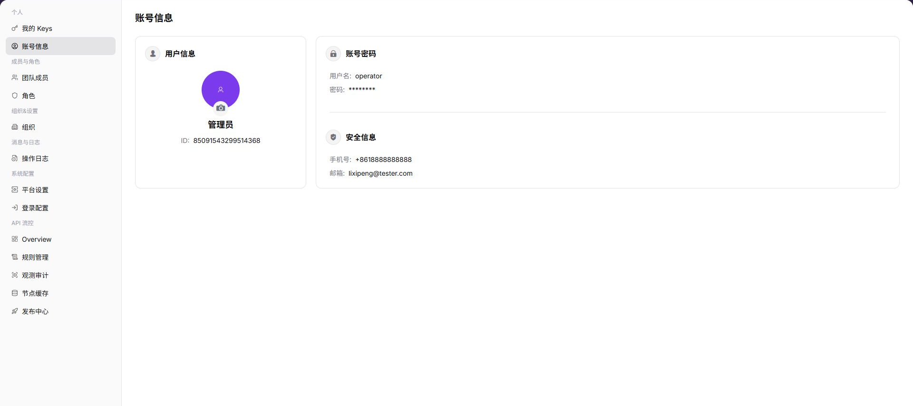

# 账号信息

::: info 文档信息
版本：v1.0
更新日期：2026-07-10
:::

## 功能概述

`账号信息` 用于查看当前账号的用户信息、账号密码状态、安全信息、手机号和邮箱等基础资料。

| 项目 | 内容 |
| --- | --- |
| 适用角色 | 运营方账号 |
| 导航路径 | 个人 > 账号信息 |
| 页面路由 | /operator/personal/profile |
| 管理对象 | 用户信息、账号密码状态、安全信息、手机号和邮箱 |
| 典型用途 | 查看账号资料、核对安全状态和联系方式 |

### 新手理解

运营账号信息像平台管理员身份卡，用来确认当前管理员的身份来源、登录方式、安全状态和可审计信息。它关注的是平台管理身份，不是普通用户的组织资料。
### 术语速查

| 术语 | 含义 | 处理建议 |
| --- | --- | --- |
| 运营账号 | 可进入平台运营侧的管理员身份。 | 变更前确认管理范围。 |
| 身份来源 | 账号来自本地创建或统一身份源同步。 | 字段不可编辑时先看身份源。 |
| 登录方式 | 密码、单点登录或其他认证方式。 | 异常时核对登录属性配置。 |
| 安全信息 | MFA、密码状态、最近登录等安全线索。 | 排障时不要外露完整账号信息。 |
## 前提条件

1. 当前账号已登录平台。
2. 已进入 `个人 > 账号信息`。
3. 查看或传播页面信息前，应先确认是否包含个人联系方式或账号标识。

## 页面说明

下图展示账号信息页面，账号标识、手机号、邮箱等敏感信息已做脱敏处理。

| 区域 | 说明 |
| --- | --- |
| 用户信息 | 展示账号名称、账号标识等基础信息。 |
| 账号密码 | 展示密码状态或密码相关信息。 |
| 安全 | 展示手机号、邮箱等安全联系方式。 |

## 主要操作

### 查看账号信息

1. 进入 `个人 > 账号信息`。
2. 查看用户信息，确认当前账号是否为目标账号。
3. 查看账号密码和安全联系方式。
4. 如需修改账号资料或重置密码，按平台提供的安全流程处理。

## 参数说明

| 字段名称 | 是否必填 | 字段类型 | 示例 | 说明 |
| --- | --- | --- | --- | --- |
| 管理员账号 | 否 | 文本 | admin@example.com | 当前运营管理员的登录账号。 |
| 身份来源 | 否 | 枚举 | 统一身份源 | 判断资料是否可在本页修改。 |
| 登录方式 | 否 | 枚举 | SSO | 展示运营账号使用的认证方式。 |
| 安全状态 | 否 | 枚举 | 已启用 MFA | 用于确认账号安全配置。 |
| 最近登录 | 否 | 时间 | 2026-07-13 10:00 | 用于审计账号活跃情况。 |
## 踩坑提示

- 运营账号字段可能由统一身份源同步，本页不可编辑不代表页面异常。
- 排查登录问题时要同时看登录属性、身份源和账号状态。
- 截图不要暴露管理员邮箱、手机号、登录 IP 或安全状态细节。
## 结果校验

| 检查项 | 成功表现 | 异常处理 |
| --- | --- | --- |
| 信息展示 | 用户信息、安全信息正常展示。 | 刷新页面或重新登录。 |
| 账号一致 | 页面账号与当前操作人一致。 | 退出后重新确认登录账号。 |

## 常见问题

### 安全联系方式不正确

**问题现象：**

页面展示的手机号或邮箱与预期不一致。

**可能原因：**

账号资料未更新，或当前登录账号不是目标账号。

**处理方式：**

先确认登录账号，再按组织流程更新安全联系方式。

### 运营账号信息为什么没有显示完整资料？

**问题现象：**

运营侧账号信息页缺少安全信息、登录方式或联系信息。

**可能原因：**

运营账号资料由统一身份源同步，敏感字段被权限隐藏，或账号信息尚未完成初始化。

**处理方式：**

确认账号来源和同步状态；可编辑字段按平台账号流程补齐；敏感字段缺失时联系平台管理员核查。
### 为什么运营账号资料不能编辑？

**问题现象：**

运营账号信息可见，但联系方式、安全信息或登录方式无法修改。

**可能原因：**

运营账号由统一身份源管理，敏感字段需要管理员审批，或当前登录方式不支持自助修改。

**处理方式：**

按平台账号管理流程申请变更；身份源字段到统一身份平台维护，修改后重新登录确认同步。
## 后续操作

1. 需要管理个人 Key，进入 [我的 Keys](../my-keys/)。
2. 需要管理团队成员，进入 [团队成员](../../members-roles/team-members/)。

## 注意事项

- 账号信息中可能包含手机号、邮箱、账号标识等敏感信息。
- 不要将完整账号信息截图直接发送到外部沟通渠道。
