# 平台设置

::: info 文档信息
版本：v1.0
更新日期：2026-07-10
:::

## 功能概述

`平台设置` 用于维护平台级配置，包括通用配置、服务商关系、币种设置、支付通道、账户与结算、邮件设置和 UI 配置。

| 项目 | 内容 |
| --- | --- |
| 适用角色 | 运营方管理员 |
| 导航路径 | 设置 > 系统配置 > 平台设置 |
| 页面路由 | `/user/system/platform-settings/config` |
| 管理对象 | 通用配置、服务商关系、币种设置、支付通道、账户与结算、邮件和 UI 配置 |
| 典型途径 | 查看和维护平台级配置 |

#### 新手理解

平台设置页像全局参数面板，用来维护平台基础配置、服务商关系、币种、支付、结算、邮件和 UI 展示规则。任何变更都可能影响多个模块。

#### 术语速查

| 术语 | 含义 | 处理建议 |
| --- | --- | --- |
| 平台配置 | 影响全局行为的系统参数。 | 变更前确认范围。 |
| 服务商关系 | 平台和服务商之间的配置关系。 | 调整前确认业务归属。 |
| 币种设置 | 金额展示和结算相关币种规则。 | 账务变更前核对。 |
| 邮件配置 | 通知和验证码发送相关配置。 | 异常时结合登录配置排查。 |

## 前提条件

1. 当前账号具备系统配置管理权限。
2. 已进入 `系统设置 > 平台设置`。
3. 编辑配置前已确认影响范围、变更窗口和审批要求。

## 页面说明

下图展示平台设置页面，配置值已做脱敏处理。

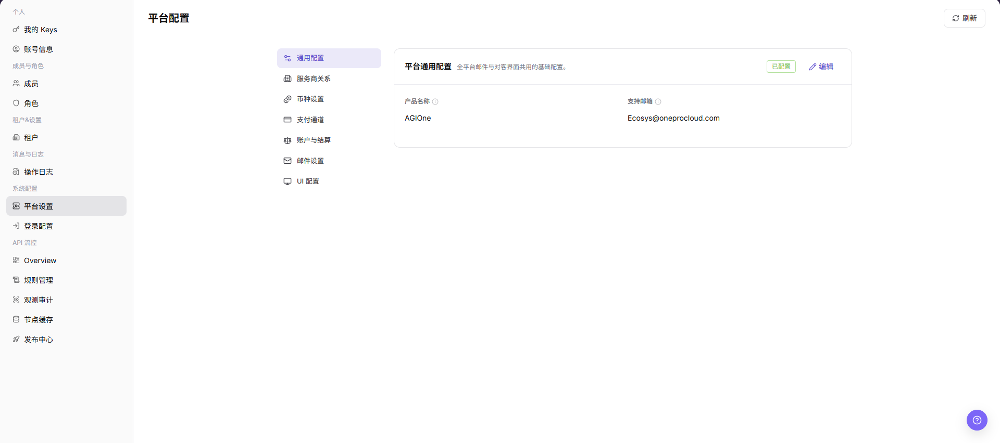

| 区域 | 说明 |
| --- | --- |
| 刷新 | 重新加载平台配置。 |
| 通用配置 | 维护平台通用显示和共享配置。 |
| 服务商关系 | 维护服务商关系配置。 |
| 币种设置 | 维护平台币种展示与使用配置。 |
| 支付通道 | 维护支付通道配置。 |
| 账户与结算 | 维护账户和结算相关配置。 |
| 邮件设置 | 维护邮件发送相关配置。 |
| UI 配置 | 维护界面展示相关配置。 |
| 编辑 | 修改对应配置项。 |

## 主要操作

### 通用配置

1. 进入 `系统设置 > 平台设置`。
2. 点击 `通用配置`。
3. 查看平台名称、默认展示、全局参数等通用项。

### 服务商关系配置

1. 进入 `系统设置 > 平台设置`。
2. 点击 `服务商关系`。
3. 查看服务商、关联关系、启用状态或结算归属等配置。

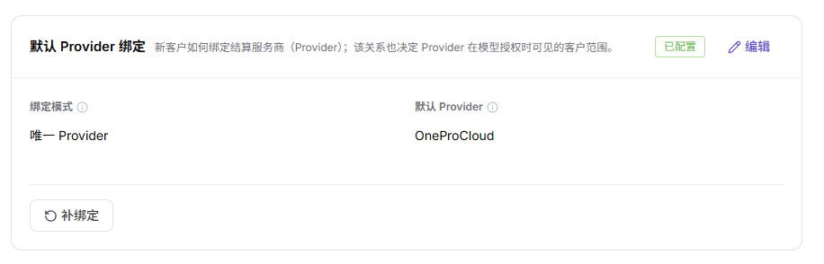

::: details 补充截图文件

:::

### 币种设置

1. 进入 `系统设置 > 平台设置`。
2. 点击 `币种设置`。
3. 查看默认币种、币种展示、精度或换算相关配置。

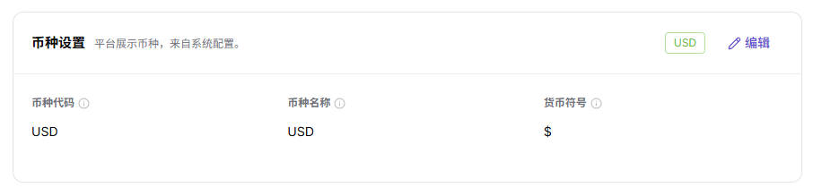

### 支付通道配置

1. 进入 `系统设置 > 平台设置`。
2. 点击 `支付通道`。
3. 查看支付通道列表、启用状态和可维护入口。

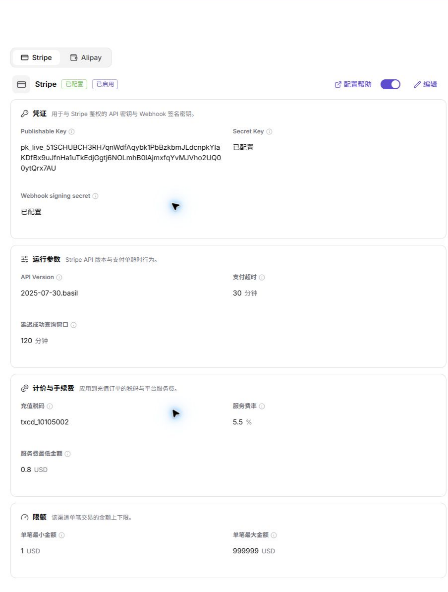

::: details 补充截图文件

:::

4. 在 Stripe 区域点击 `配置帮助`，查看所需字段和对接说明。

5. 点击 Stripe 的 `编辑`，使用占位符填写或核对 `<stripe_publishable_key>`、`<stripe_secret_key>`、`<stripe_webhook_signing_secret>` 等字段。

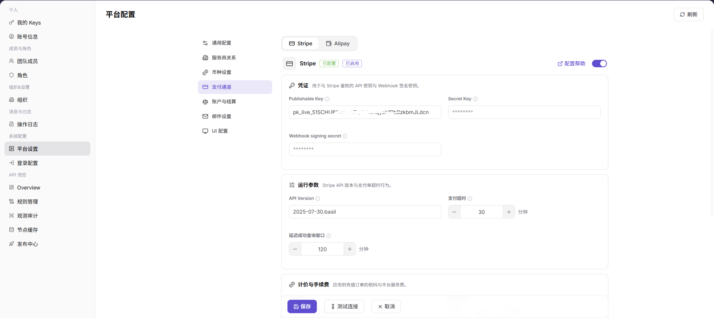

6. 如需验证 Stripe 连通性，点击 `测试连接` 前确认不会触发真实交易或生产回调。

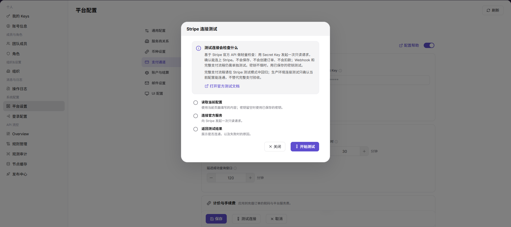

7. 在 Alipay 区域点击 `配置帮助`，查看应用、私钥和公钥等接入要求。

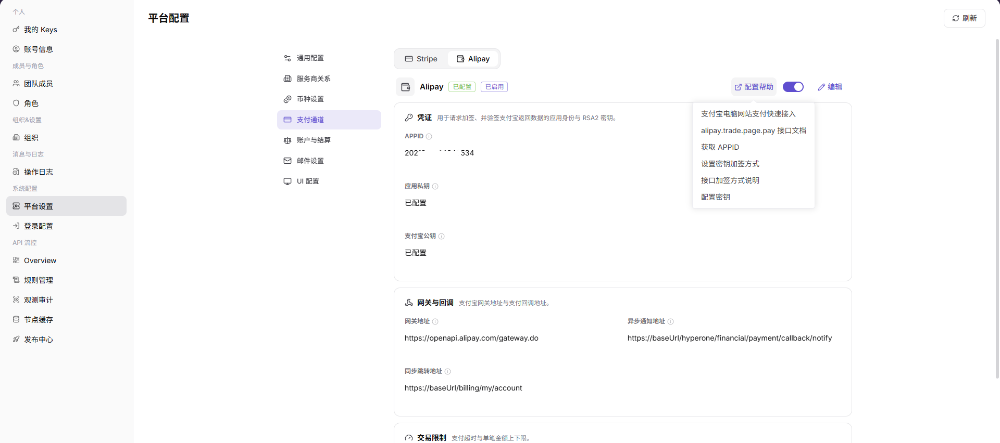

8. 点击 Alipay 的 `编辑`，使用占位符填写或核对 `<alipay_app_id>`、`<alipay_app_private_key>`、`<alipay_public_key>` 等字段。

9. 如需验证 Alipay 连通性，点击 `测试连接` 前确认不会触发真实支付或生产回调。

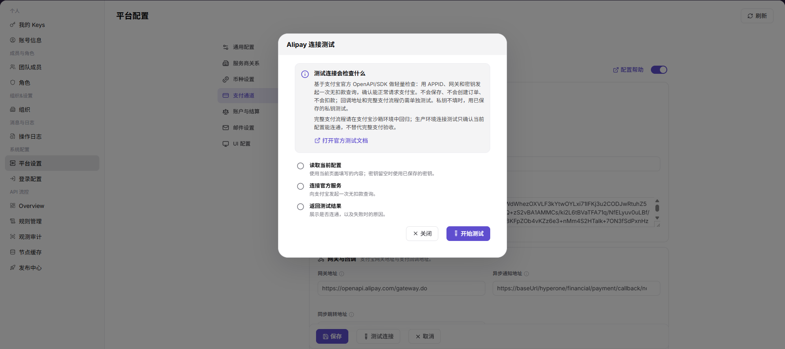

10. 点击 `保存` 前确认密钥来源、权限范围、回调地址、结算影响和回滚方案。
11. 如仅学习或截图，只查看配置帮助、编辑页面和测试连接入口，不提交真实支付通道配置。

### 账户与结算配置

1. 进入 `系统设置 > 平台设置`。
2. 点击 `账户与结算`。
3. 查看账户、结算周期、充值或 credits 相关参数。

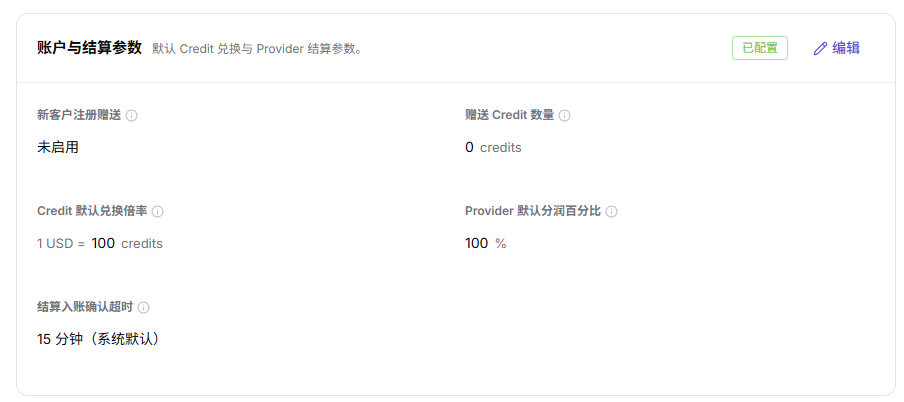

### 邮件设置

1. 进入 `系统设置 > 平台设置`。
2. 点击 `邮件设置`。
3. 查看邮件服务、发件配置、通知模板或验证邮件相关配置。

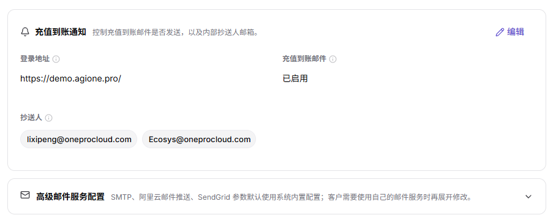

### UI 配置

1. 进入 `系统设置 > 平台设置`。
2. 点击 `UI 配置`。
3. 查看登录页、平台标识、主题或展示相关配置。

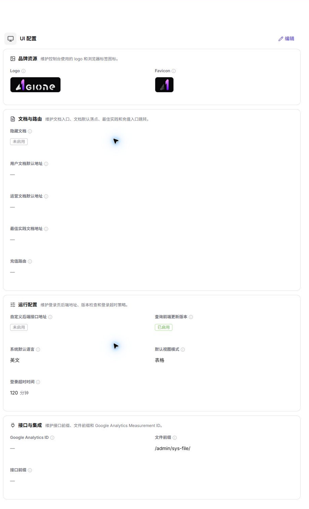

## 参数说明

| 字段名称 | 是否必填 | 字段类型 | 示例 | 说明 |
| --- | --- | --- | --- | --- |
| 配置分类 | 系统展示 | 文本 | 通用配置 | 平台设置中的配置分组。 |
| 配置项 | 系统展示 | 文本 | 默认币种 | 需要查看或维护的系统参数。 |
| 默认值 | 系统展示 | 文本 | CNY | 配置项的默认值或系统预置值。 |
| 当前值 | 系统展示 / 可编辑 | 文本 | CNY | 当前生效的配置值。 |
| 启用状态 | 系统展示 / 可编辑 | 枚举 | 启用 | 判断配置项或能力是否启用。 |
| 测试连接 | 操作按钮 | 按钮 | 测试连接 | 验证邮件、支付或外部服务配置连通性。 |
| 保存 | 操作按钮 | 按钮 | 保存 | 保存当前配置变更。 |
| 重置 | 操作按钮 | 按钮 | 重置 | 将配置恢复为默认值或上次保存状态。 |
| 操作 | 系统生成 | 按钮 | 编辑 / 启用 / 禁用 | 提供配置查看或维护入口。 |

## 踩坑提示

- 平台设置影响范围大，不要在不明确业务归属时直接修改。
- 支付、结算、邮件和 UI 配置变更后，应回到相关业务模块验证。
- 配置值异常时先确认是否有近期操作日志或发布记录。
- 平台设置会影响登录、展示、服务商关系、币种、支付、账务、结算、邮件通知和用户可见 UI。
- `保存`、`重置`、`启用`、`禁用`、`测试连接` 是高风险动作。
- 学习或截图时只查看配置项，不提交真实配置变更。
- Stripe / Alipay 密钥、私钥、Webhook secret、SMTP 密码、内部地址、账号、Token、客户名、结算参数不能写入文档、截图、工单或聊天。

## 结果校验

| 检查项 | 成功表现 | 异常处理 |
| --- | --- | --- |
| 分类展示 | 配置分类正常显示。 | 刷新页面后重新进入。 |
| 配置可读 | 配置项和值正常展示。 | 检查系统配置权限。 |
| 编辑入口 | 编辑按钮按权限展示。 | 没有权限时联系管理员处理。 |
| 截图引用 | 通用配置、服务商关系、币种设置、支付通道、账户与结算、邮件设置和 UI 配置截图正常展示。 | 检查图片路径是否存在。 |

## 常见问题

#### 修改配置后影响哪些模块

**问题现象：**

平台设置中存在多个配置分类。

**可能原因：**

不同配置可能影响登录、账务、邮件、页面展示或服务商关系。

**处理方式：**

先确认配置分类和业务影响，再选择合适窗口执行变更。

#### 平台设置项为什么没有显示？

**问题现象：**

平台设置页没有目标配置项，或配置项区域为空。

**可能原因：**

当前账号缺少系统设置权限，配置项按部署版本或租户范围裁剪，或配置中心同步异常。

**处理方式：**

确认运营管理员权限和当前租户范围；核对配置项是否适用于当前版本；仍为空时联系平台管理员检查配置中心状态。
#### 为什么平台配置保存按钮不可用？

**问题现象：**

平台设置项可见，但保存、启用或重置按钮不可点击。

**可能原因：**

当前账号缺少系统配置写权限，配置项被版本锁定，或该配置需要审批后才能变更。

**处理方式：**

核对系统管理员权限和配置项说明；需要调整时先走审批，再由具备权限的管理员保存。
## 后续操作

1. 需要维护登录安全，进入 [登录配置](../login-properties/)。
2. 需要维护 API 流控，进入 [Overview](../../api-rate-control/overview/)。

## 注意事项

- 平台配置可能影响全局行为，不要在业务高峰期随意修改。
- 支付、结算、邮件相关配置应经过复核后再保存。
- `保存`、`重置`、`启用`、`禁用`、`测试连接` 是高风险动作。
- 学习或截图时只查看配置项，不提交真实配置变更。
- Stripe / Alipay 密钥、私钥、Webhook secret、SMTP 密码、内部地址、账号、Token、客户名、结算参数不能写入文档、截图、工单或聊天。
