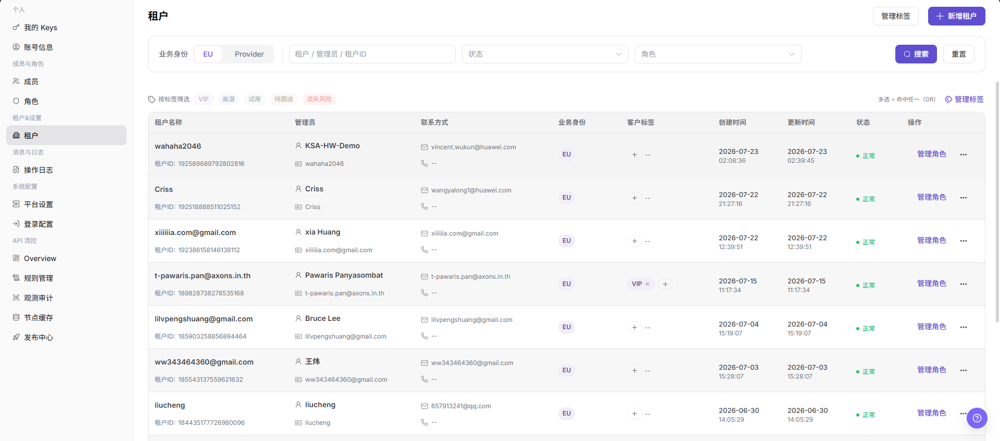
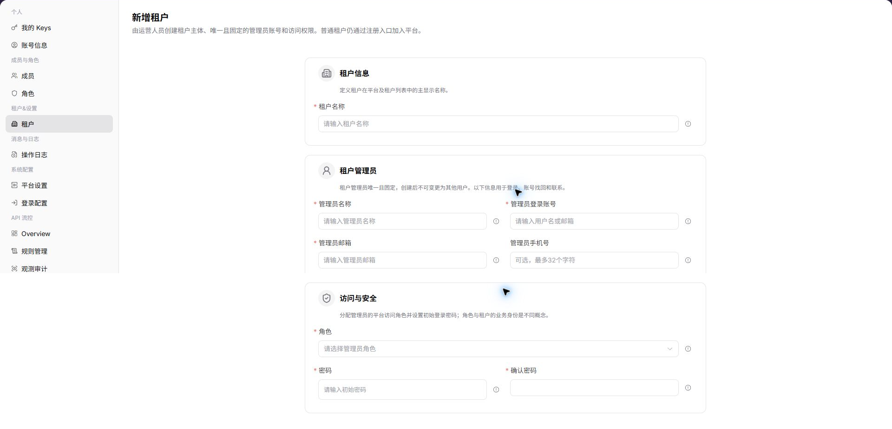

# 租户

::: info 文档信息
版本：v1.0
更新日期：2026-07-10
:::

## 功能概述

`租户` 用于管理平台中的租户主体，包括按业务身份、租户关键字、状态、角色和标签筛选租户，查看管理员信息、客户标签、创建时间、更新时间、状态和操作入口。

| 项目 | 内容 |
| --- | --- |
| 适用角色 | 运营方管理员 |
| 导航路径 | 设置 > 租户&设置 > 租户 |
| 页面路由 | `/user/tenant` |
| 管理对象 | 租户主体、业务身份、状态、角色和标签 |
| 典型途径 | 查询租户、查看租户信息、管理租户状态和标签 |

#### 新手理解

租户页像平台业务主体名册，用来维护租户、管理员、角色、标签和业务归属。新增租户、调整角色或处理账务问题前，应先确认租户身份。

#### 术语速查

| 术语 | 含义 | 处理建议 |
| --- | --- | --- |
| 租户 | 平台中的业务主体。 | 操作前确认唯一身份。 |
| 租户管理员 | 负责租户管理的账号。 | 联系和授权时核对。 |
| 租户角色 | 租户可拥有的权限集合。 | 变更前确认影响。 |
| 租户标签 | 用于分类租户的标记。 | 筛选和运营时使用。 |

## 前提条件

1. 当前账号具备租户管理权限。
2. 已进入 `租户&设置 > 租户`。
3. 对租户执行新增、角色管理或标签管理前，已确认业务身份和授权边界。

## 页面说明

下图展示租户页面，租户名称、管理员信息和邮箱已做脱敏处理。

| 区域 | 说明 |
| --- | --- |
| 业务身份 | 按 EU、Provider 等身份筛选租户。 |
| 租户 / 管理员 / 租户 ID | 按租户、管理员或租户 ID 搜索。 |
| 状态 | 按租户状态筛选。 |
| 角色 | 按租户角色筛选。 |
| 标签筛选 | 通过 VIP、高潜、试用、待跟进、流失风险等标签筛选。 |
| 管理标签 | 维护租户标签。 |
| 新增租户 | 创建新的租户或租户入口。 |

## 主要操作

### 新增租户

1. 进入 `设置 > 租户&设置 > 租户`。
2. 点击页面右上角的 `新增租户`。
3. 进入 `新增租户` 页面，查看租户创建字段。

4. 在 `租户信息` 区域填写必填的 `租户名称`。
5. 在 `租户管理员` 区域填写 `管理员名称`、`管理员登录账号`、`管理员邮箱`，按需填写 `管理员手机号`。
6. 在 `访问与安全` 区域选择 `角色`，填写 `密码` 和 `确认密码`。
7. 点击最终提交前，确认租户名称、管理员账号、邮箱、角色和初始密码符合授权范围。
8. 如仅学习或截图，只查看字段，不提交真实租户配置。

## 参数说明

| 字段名称 | 是否必填 | 字段类型 | 示例 | 说明 |
| --- | --- | --- | --- | --- |
| 租户名称 | 是 | 文本 | 示例租户 A | 用于识别租户主体。 |
| 管理员名称 | 是 | 文本 | 示例管理员 | 租户管理员显示名称。 |
| 管理员登录账号 | 是 | 文本 | tenant-admin | 租户管理员登录账号。 |
| 管理员邮箱 | 是 | 文本 | admin@example.com | 租户管理员邮箱。 |
| 管理员手机号 | 否 | 文本 | 188****8888 | 租户管理员联系电话。 |
| 角色 | 是 | 下拉框 | 租户管理员 | 控制租户管理员的平台访问范围。 |
| 密码 | 是 | 密码 | ****** | 租户管理员初始密码。 |
| 确认密码 | 是 | 密码 | ****** | 再次输入密码，用于确认两次密码一致。 |
| 状态 | 系统生成 | 枚举 | 启用 | 判断租户是否可用。 |
| 操作 | 系统生成 | 按钮 | 管理角色 / 管理标签 | 提供租户后续维护入口。 |

## 踩坑提示

- 租户名称相似时不要只凭名称操作，应结合租户 ID 和管理员确认。
- 调整租户角色可能影响成员权限和业务访问。
- 租户标签用于分类，不应替代真实租户身份核验。
- 新增租户会创建真实租户主体和固定管理员账号。
- 初始密码、管理员邮箱、手机号属于敏感信息，不写入文档或截图。
- 角色选择会影响租户管理员的平台访问范围。
- 最终提交属于高风险动作；学习或截图时不提交真实配置。

## 结果校验

| 检查项 | 成功表现 | 异常时处理 |
| --- | --- | --- |
| 筛选生效 | 租户列表按条件刷新。 | 点击重置后重新查询。 |
| 标签可用 | 标签筛选后列表范围变化。 | 检查是否存在对应标签租户。 |
| 租户操作 | 管理角色、标签等入口按权限展示。 | 检查当前账号租户管理权限。 |
| 新增页面 | 点击 `新增租户` 后进入同名创建页面。 | 检查当前账号是否具备租户创建权限。 |
| 学习退出 | 仅查看字段时未提交真实租户配置。 | 刷新列表并确认未新增测试租户。 |

## 常见问题

#### 查询不到目标租户

**问题现象：**

输入租户名称或 租户 ID 后列表为空。

**可能原因：**

筛选条件过窄，或业务身份、状态、角色条件不匹配。

**处理方式：**

先点击 `重置`，再使用更少筛选条件查询。

#### 租户角色变更前需要检查什么

**问题现象：**

页面提供 `管理角色` 入口。

**可能原因：**

租户角色会影响租户可使用的功能范围。

**处理方式：**

先确认租户身份、管理员和业务范围，再按权限变更流程处理。

#### 租户列表为什么没有目标租户？

**问题现象：**

运营侧租户管理页没有显示目标租户或租户。

**可能原因：**

租户尚未创建，租户状态被停用，或当前运营账号只被授权查看部分租户。

**处理方式：**

清空租户名称、状态和地域筛选；确认租户创建记录和状态；仍不可见时由平台管理员检查租户授权范围。
## 后续操作

1. 需要管理成员权限，进入 [成员](../../members-roles/members/)。
2. 需要查看租户变更记录，进入 [操作日志](../../activity-notifications/operation-logs/)。

## 注意事项

- 租户页面包含管理员、邮箱和租户 ID 等敏感信息，截图前应脱敏。
- 新增租户和管理角色可能影响租户可见功能，应先确认授权边界。
- 新增租户会创建真实租户主体和固定管理员账号。
- 初始密码、管理员邮箱、手机号属于敏感信息，不写入文档或截图。
- 最终提交属于高风险动作；学习或截图时不提交真实配置。
