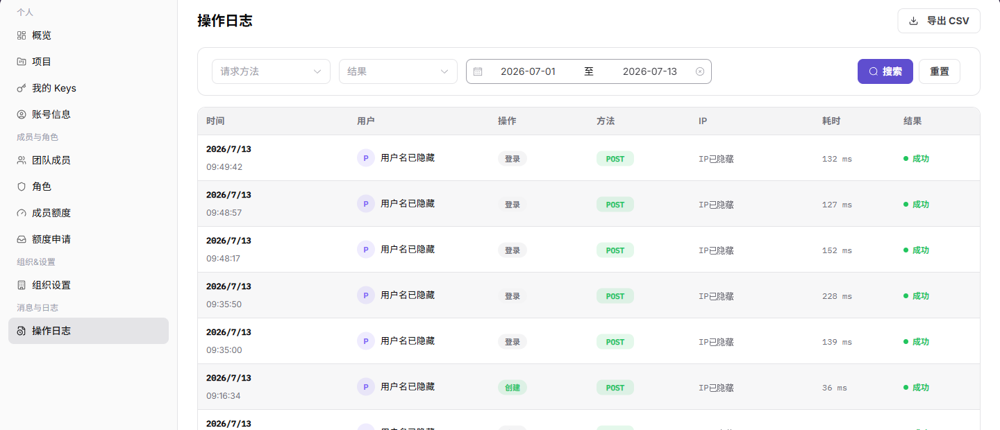

# 操作日志

::: info 文档信息
版本：v1.0
更新日期：2026-07-13
:::

## 功能概述

操作日志页用于查询组织内用户操作记录，支持按请求方法、结果和时间范围筛选，并查看时间、用户、操作、方法、IP、耗时和结果。

| 项目 | 内容 |
| --- | --- |
| 适用角色 | 服务商管理员 |
| 导航路径 | 消息与日志 > 操作日志 |
| 页面路由 | /user/activity-notifications/operation-logs |
| 管理对象 | 组织内用户操作记录、请求方法、结果、时间范围和操作详情 |
| 典型用途 | 查询组织操作记录、排查异常操作和审计关键行为 |

### 新手理解

操作日志页像设置模块的审计流水，用来追踪谁在什么时间做了什么操作，以及结果是否成功。排查配置变更和权限问题时，应先按时间、操作者和对象过滤。

### 术语速查

| 术语 | 含义 | 处理建议 |
| --- | --- | --- |
| 操作日志 | 记录用户操作和系统处理结果的审计信息。 | 排障时保留脱敏线索。 |
| 操作者 | 执行操作的账号。 | 核对是否为预期人员。 |
| 操作对象 | 被变更或查看的配置、成员或规则。 | 定位影响范围。 |
| 操作结果 | 成功、失败或处理中等结果。 | 失败时继续查原因。 |

## 前提条件

1. 当前账号具备操作日志查看权限。
2. 查询前已确定时间范围、请求方法或结果筛选条件。
3. 导出日志前已确认数据管理要求。

## 页面说明

| 区域 | 说明 |
| --- | --- |
| 顶部按钮 | 导出 CSV |
| 筛选项 | 请求方法、结果、开始时间、结束时间 |
| 表格列 | 时间、用户、操作、方法、IP、耗时、结果 |
| 操作按钮 | 搜索、重置 |
| 高风险操作 | 导出 CSV |

## 主要操作

### 查看操作日志

1. 进入 `消息与日志 > 操作日志`。
2. 选择请求方法、结果或时间范围。
3. 单击 `搜索` 查看匹配日志。
4. 如需清空条件，单击 `重置`。

下图展示操作日志列表，用户和 IP 信息已隐藏。

## 参数说明

| 字段名称 | 是否必填 | 字段类型 | 示例 | 说明 |
| --- | --- | --- | --- | --- |
| 时间范围 | 否 | 时间范围 | 2026-07-13 00:00 至 23:59 | 筛选日志时间。 |
| 操作者 | 否 | 文本 | 示例用户 | 按执行人过滤。 |
| 操作类型 | 否 | 枚举 | 编辑 | 按操作动作过滤。 |
| 操作对象 | 否 | 文本 | 角色 | 定位被操作对象。 |
| 结果 | 否 | 枚举 | 成功 | 筛选操作结果。 |

## 踩坑提示

- 查不到日志时，先扩大时间范围并清空过窄筛选条件。
- 日志能证明操作发生，不一定能解释业务结果，需要结合目标页面状态。
- 导出日志前要确认是否包含账号、IP、Key 或内部地址。

## 结果校验

| 检查项 | 成功表现 | 异常时处理 |
| --- | --- | --- |
| 搜索准确 | 搜索后列表只显示符合条件的日志 | 检查操作人、时间范围和操作类型 |
| 重置有效 | 重置后筛选条件恢复默认 | 手动清空筛选后重新查询 |
| 状态一致 | 操作成功或失败状态与结果列一致 | 打开日志详情核对错误信息或操作结果 |

## 常见问题

### 找不到目标操作记录

**问题现象：**

按时间或用户筛选后列表为空。

**可能原因：**

- 时间范围不包含目标操作。
- 请求方法或结果筛选过窄。
- 操作记录尚未刷新到列表。

**处理方式：**

1. 扩大时间范围后重新搜索。
2. 清空请求方法和结果筛选条件。
3. 等待日志刷新后再次查询。

### 为什么查不到目标操作日志？

**问题现象：**

按操作人、时间或对象搜索后，没有找到目标操作记录。

**可能原因：**

查询时间范围不包含操作发生时间，日志保留周期已过，或当前账号无权查看该组织、项目或成员的日志。

**处理方式：**

扩大时间范围并清空操作类型筛选；确认操作发生的组织和对象；仍查不到时让管理员核对日志采集和保留策略。
### 为什么日志导出或详情按钮不可用？

**问题现象：**

操作日志可查询，但导出、查看详情等按钮不可点击。

**可能原因：**

当前账号没有审计导出权限，日志记录已超过可查看范围，或导出能力被组织安全策略关闭。

**处理方式：**

确认审计权限和日志保留范围；如需外发日志，先按脱敏要求申请导出权限。
## 后续操作

1. 对关键操作保留审计记录。
2. 结合成员、角色、额度页面核对变更来源。

## 注意事项

- 导出 CSV 可能包含用户、IP 和操作审计信息，应按组织数据安全要求处理。
- 不要将导出的日志文件随意外发。
