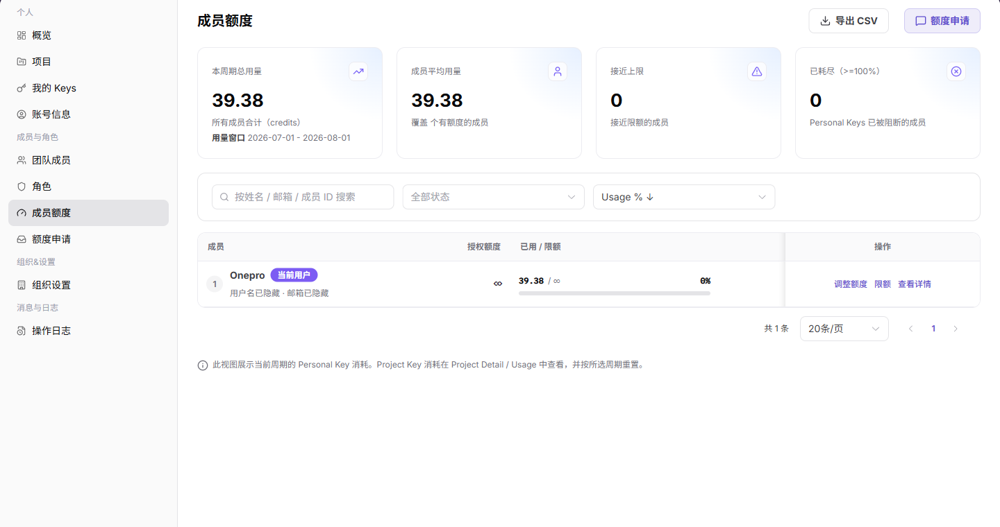
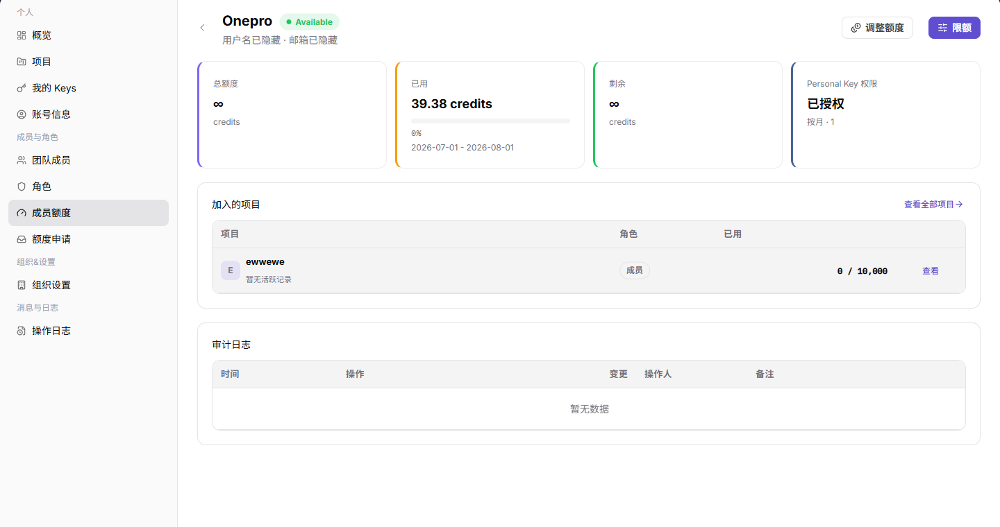
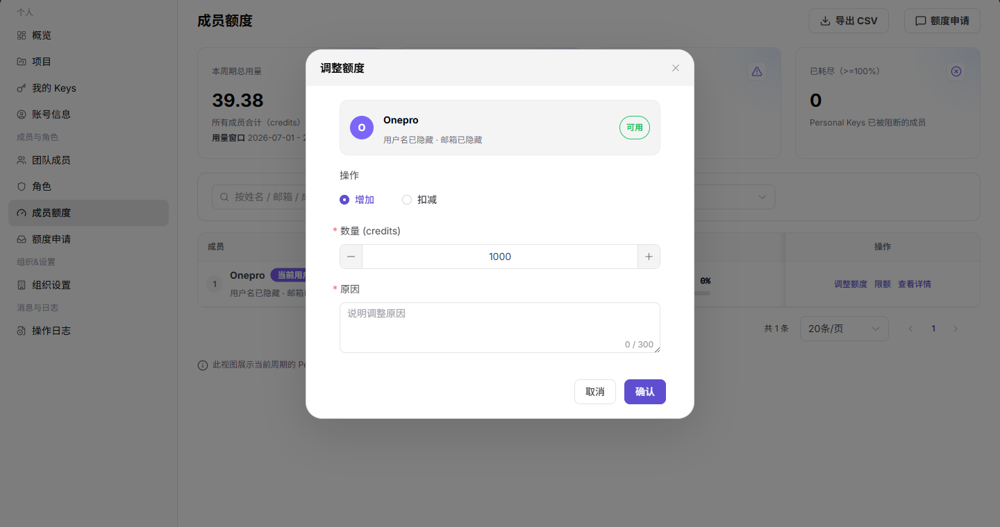
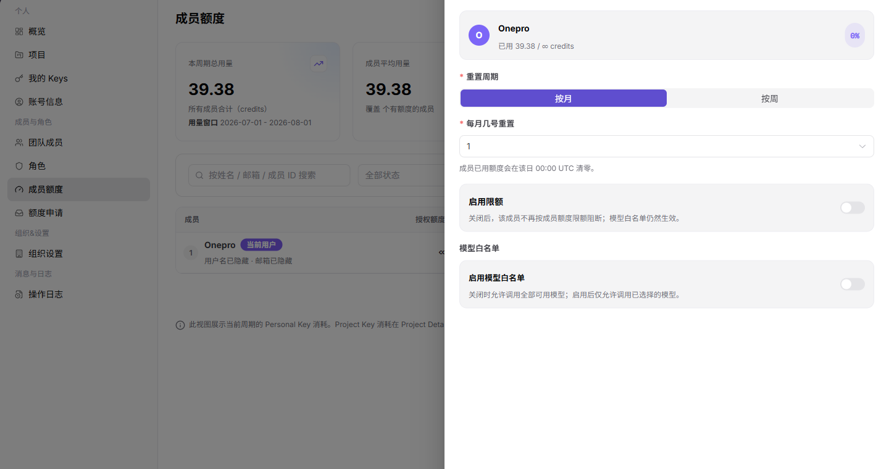

# 成员额度

::: info 文档信息
版本：v1.0
更新日期：2026-07-13
:::

## 功能概述

成员额度页用于查看组织成员的 Personal Key 用量和授权额度，支持按成员搜索、查看状态、调整额度、设置成员限额和进入成员额度详情。

| 项目 | 内容 |
| --- | --- |
| 适用角色 | 服务商管理员 |
| 导航路径 | 成员与角色 > 成员额度 |
| 页面路由 | /user/members-roles/member-quotas |
| 管理对象 | 成员 Personal Key 用量、授权额度和额度详情 |
| 典型用途 | 查看成员额度、调整成员额度、核对用量 |

### 新手理解

成员额度页像团队额度分配表，用来查看每个成员可用额度、已用额度和限制策略，帮助判断调用失败是否与个人额度有关。

### 术语速查

| 术语 | 含义 | 处理建议 |
| --- | --- | --- |
| 成员额度 | 分配给成员的可用额度。 | 调用失败时核对。 |
| 已用额度 | 成员已经消耗的额度。 | 接近上限时调整。 |
| 额度上限 | 成员可消耗的最大额度。 | 变更前确认影响范围。 |
| 额度申请 | 成员请求增加额度的流程。 | 不足时引导申请。 |

## 前提条件

1. 当前账号具备成员额度查看权限。
2. 调整额度前已确认成员身份、调整数量和原因。
3. 设置限额前已确认重置周期、触限策略和模型白名单范围。

## 页面说明

| 区域 | 说明 |
| --- | --- |
| 顶部按钮 | 导出 CSV、额度申请 |
| 筛选项 | 按姓名 / 邮箱 / 成员 ID 搜索、全部状态、Usage 排序 |
| 表格列 | 成员、授权额度、已用 / 限额、剩余、模型、状态、操作 |
| 行内按钮 | 调整额度、限额、查看详情 |
| 详情页 | 成员额度、Personal Key 权限、加入的项目、审计日志 |
| 高风险操作 | 调整额度、保存成员限额、导出 CSV |

## 主要操作

### 查看成员额度

1. 进入 `成员与角色 > 成员额度`。
2. 使用搜索框定位成员。
3. 查看授权额度、已用 / 限额、剩余、模型和状态。

下图展示成员额度列表，成员标识已隐藏。

4. 单击 `查看详情` 进入成员额度详情。
5. 查看总额度、已用额度、剩余额度、Personal Key 权限、加入项目和审计日志。

下图展示成员额度详情。

6. 单击 `调整额度` 打开调整额度弹窗。
7. 选择增加或扣减，填写数量和原因。
8. 确认影响后再单击 `确认`。

下图展示调整额度弹窗。

9. 单击 `限额` 打开设置成员限额弹窗。
10. 设置重置周期、是否启用限额和模型白名单。
11. 确认后再保存。

下图展示成员限额弹窗。

## 参数说明

| 字段名称 | 是否必填 | 字段类型 | 示例 | 说明 |
| --- | --- | --- | --- | --- |
| 成员 | 否 | 文本 | 示例成员 A | 用于定位额度对象。 |
| 总额度 | 否 | 额度 | 10,000 Credits | 成员可用额度上限。 |
| 已用额度 | 否 | 额度 | 3,000 Credits | 成员已消耗额度。 |
| 剩余额度 | 否 | 额度 | 7,000 Credits | 成员剩余可用额度。 |
| 状态 | 否 | 枚举 | 正常 | 判断额度是否可继续使用。 |

## 踩坑提示

- 成员额度充足但调用失败时，还要检查 Key、项目预算和模型权限。
- 不要把组织额度和成员额度混用，二者可能分别限制调用。
- 调整成员额度前，先确认申请原因和业务归属。

## 结果校验

| 检查项 | 成功表现 | 异常时处理 |
| --- | --- | --- |
| 额度已更新 | 调整后成员授权额度或剩余额度发生变化 | 核对成员身份、额度类型和审批状态 |
| 审计可查 | 成员详情的审计日志记录额度调整 | 到操作日志按成员和时间筛选 |
| 限额正确 | 设置限额后，成员列表中已用 / 限额显示符合预期 | 重新打开成员额度详情核对配置 |

## 常见问题

### 成员额度充足但调用仍失败

**问题现象：**

成员剩余额度正常，但调用被拒绝。

**可能原因：**

- Key 自身限额已触达。
- 项目预算已触达。
- 模型白名单未包含目标模型。

**处理方式：**

1. 检查我的 Keys 或项目 Key 限额。
2. 查看项目预算和模型白名单。
3. 在成员限额中确认模型范围。

### 成员额度列表为什么没有目标成员？

**问题现象：**

成员额度页没有显示某个成员，或成员额度信息为空。

**可能原因：**

成员未加入当前组织，成员账号未启用，或当前账号无权查看该成员的额度信息。

**处理方式：**

先到团队成员页确认成员状态；再检查成员额度授权；仍为空时由组织管理员补充分配或恢复成员。
### 为什么成员额度调整按钮不可用？

**问题现象：**

成员额度可见，但调整授权额度、设置限额或查看调整入口不可点击。

**可能原因：**

当前账号没有额度管理员权限，成员状态不可调整，或该额度类型需要审批后才能修改。

**处理方式：**

确认成员状态和额度管理权限；需要审批的额度先提交申请，审批通过后再回到成员额度页核对。
## 后续操作

1. 在额度申请页查看成员申请记录。
2. 在组织设置中调整新成员默认额度规则。
3. 在操作日志中核对额度调整操作。

## 注意事项

- 调整额度会影响成员调用能力，执行前需确认成员和数量。
- 导出 CSV 可能包含成员用量数据，应按组织数据管理要求处理。
