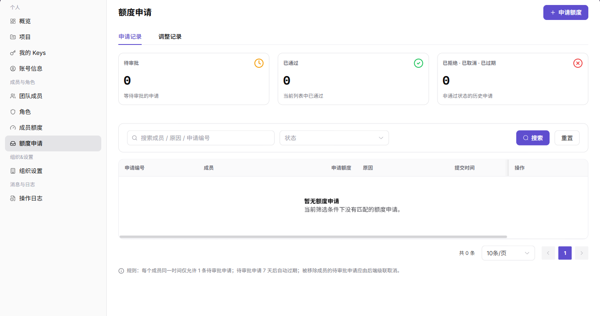
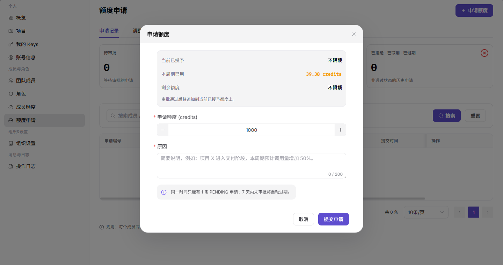

# 额度申请

::: info 文档信息
版本：v1.0
更新日期：2026-07-13
:::

## 功能概述

额度申请页用于发起额度申请、查看申请记录和调整记录，支持按状态、成员、原因或申请编号筛选。

| 项目 | 内容 |
| --- | --- |
| 适用角色 | 服务商管理员 |
| 导航路径 | 成员与角色 > 额度申请 |
| 页面路由 | /user/members-roles/quota-requests |
| 管理对象 | 额度申请、申请记录、调整记录、状态和申请原因 |
| 典型用途 | 发起额度申请、查看申请进度和调整记录 |

### 新手理解

额度申请页像成员额度的工单入口，用来提交、查看和跟踪额度增加请求。提交前要写清用途、目标成员和需要的额度。

### 术语速查

| 术语 | 含义 | 处理建议 |
| --- | --- | --- |
| 额度申请 | 请求增加成员或项目额度的记录。 | 提交前说明用途。 |
| 申请状态 | 申请当前处理阶段。 | 长期未变化时联系审批人。 |
| 申请额度 | 本次请求增加的额度数量。 | 避免超过业务需要。 |
| 审批意见 | 审批人给出的处理说明。 | 被驳回时按意见调整。 |

## 前提条件

1. 当前账号具备额度申请页面访问权限。
2. 发起申请前已确认需要追加的 credits 数量和业务原因。
3. 同一成员同一时间通常只保留一条待审批申请。

## 页面说明

| 区域 | 说明 |
| --- | --- |
| 顶部按钮 | `申请额度` |
| 页签 | 申请记录、调整记录 |
| 筛选项 | 状态、搜索成员 / 原因 / 申请编号、事件类型 |
| 申请记录列 | 申请编号、成员、申请额度、原因、提交时间、状态、审批人、操作 |
| 调整记录列 | 时间、成员、事件类型、变更、操作人、备注 |
| 高风险操作 | 提交额度申请 |

## 主要操作

### 管理额度申请

1. 进入 `成员与角色 > 额度申请`。
2. 在 `申请记录` 页签查看待审批、已通过、已拒绝、已取消、已过期记录。
3. 使用状态和搜索框筛选申请。

下图展示额度申请列表。

4. 单击 `申请额度` 打开申请弹窗。
5. 填写申请额度和原因。
6. 确认没有重复待审批申请后再提交。

下图展示申请额度弹窗。

## 参数说明

| 字段名称 | 是否必填 | 字段类型 | 示例 | 说明 |
| --- | --- | --- | --- | --- |
| 申请人 | 必填 | 成员 | 示例成员 A | 提交额度申请的账号。 |
| 申请额度 | 必填 | 额度 | 1,000 Credits | 本次希望增加的额度。 |
| 用途说明 | 必填 | 文本 | 模型测试 | 说明额度使用场景。 |
| 状态 | 否 | 枚举 | 审批中 | 展示申请处理状态。 |
| 审批意见 | 否 | 文本 | 请补充用途 | 展示审批处理说明。 |

## 踩坑提示

- 无法提交额度申请时，先确认是否已有未完成申请。
- 用途说明过于笼统可能导致审批退回。
- 申请通过不代表调用立即恢复，还要确认额度同步和 Key 状态。

## 结果校验

| 检查项 | 成功表现 | 异常时处理 |
| --- | --- | --- |
| 申请已记录 | 提交申请后，申请记录页签中出现新记录 | 检查申请类型、时间范围和提交结果 |
| 统计一致 | 待审批、已通过、已拒绝等统计值与列表一致 | 清空筛选后重新统计 |
| 调整可追踪 | 额度调整后，调整记录页签可查看变更记录 | 核对成员、额度类型和调整时间 |

## 常见问题

### 无法提交新的额度申请

**问题现象：**

提交按钮不可用或提示已有待审批申请。

**可能原因：**

- 当前成员已有待审批申请。
- 申请额度或原因未填写。
- 组织关闭或限制额度申请。

**处理方式：**

1. 在申请记录中查看待审批申请。
2. 补充申请额度和原因。
3. 如需加急，联系审批人处理已有申请。

### 额度申请记录为什么为空？

**问题现象：**

额度申请页没有申请记录、审批记录或调整记录。

**可能原因：**

当前成员尚未提交申请，筛选状态限制了记录，或申请属于其他组织、项目或成员。

**处理方式：**

清空状态和时间筛选；确认申请所属组织、项目和成员；仍为空时从概览页重新发起申请并记录提交结果。
### 为什么额度申请或审批按钮不可用？

**问题现象：**

额度申请记录可见，但新增申请、撤回、审批或调整按钮不可点击。

**可能原因：**

当前账号没有申请或审批权限，已有待审批申请未结束，或申请状态不允许再次操作。

**处理方式：**

先检查是否存在待审批记录；确认当前账号角色和申请状态；审批类操作由具备权限的审批人处理。
## 后续操作

1. 审批完成后回到概览或成员额度页核对额度。
2. 在操作日志中查看申请相关操作。

## 注意事项

- 申请原因不要包含客户敏感数据、Key、token 或密码。
- 不要重复提交相同用途的额度申请。
