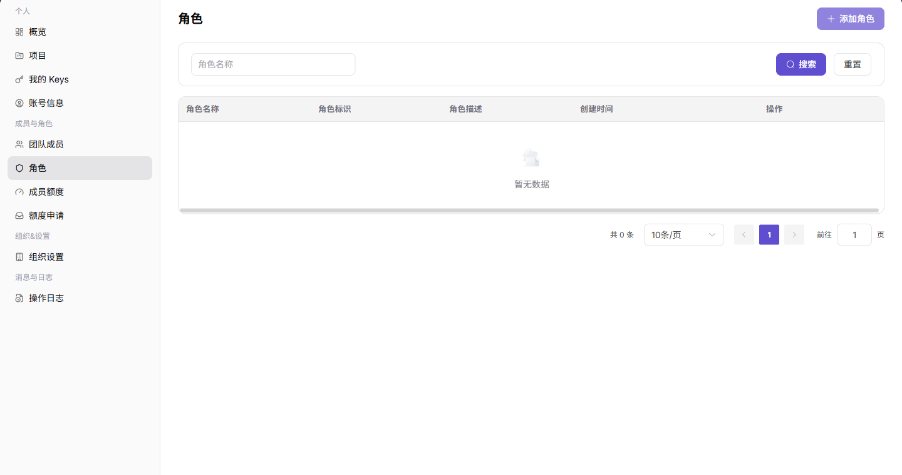
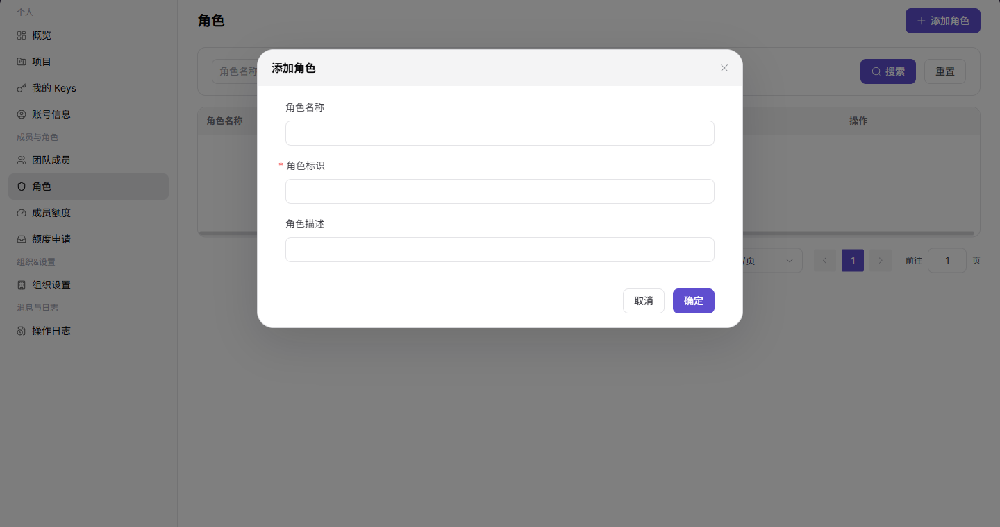

# 角色

::: info 文档信息
版本：v1.0
更新日期：2026-07-13
:::

## 功能概述

角色页用于管理组织角色，支持按角色名称搜索，查看角色名称、角色标识、角色描述、创建时间，并通过添加角色表单创建新角色。

| 项目 | 内容 |
| --- | --- |
| 适用角色 | 服务商管理员 |
| 导航路径 | 设置 > 成员与角色 > 角色 |
| 页面路由 | `/user/user-space/roles` |
| 管理对象 | 组织角色、角色标识、角色描述和权限范围 |
| 典型途径 | 查询角色、查看角色权限、维护组织角色 |

#### 新手理解

角色页像权限模板库，先把菜单和操作权限组合成角色，再分配给成员，避免逐个成员重复授权。

#### 术语速查

| 术语 | 含义 | 处理建议 |
| --- | --- | --- |
| 角色 | 一组菜单和操作权限的集合。 | 先定义角色再分配成员。 |
| 授权范围 | 角色可访问的菜单和动作边界。 | 成员看不到菜单时核对。 |
| 系统角色 | 平台预置或受保护的角色。 | 不要随意删除。 |
| 成员绑定 | 哪些成员正在使用该角色。 | 删除前必须确认。 |

## 前提条件

1. 当前账号具备角色查看权限。
2. 添加角色前已明确角色名称、角色标识和角色描述。
3. 角色标识应保持稳定，不建议随意修改。

## 页面说明

| 区域 | 说明 |
| --- | --- |
| 顶部按钮 | `添加角色` |
| 筛选项 | 角色名称 |
| 表格列 | 角色名称、角色标识、角色描述、创建时间、操作 |
| 表单字段 | 角色名称、角色标识、角色描述 |
| 高风险操作 | 创建或调整具有高权限的角色 |

## 主要操作

### 管理角色

1. 进入 `成员与角色 > 角色`。
2. 使用角色名称筛选目标角色。
3. 查看角色标识、描述和创建时间。

下图展示角色列表。

4. 单击 `添加角色` 打开表单。
5. 填写角色名称、角色标识和角色描述。
6. 确认角色用途后再单击 `确定`。

下图展示添加角色表单。

## 参数说明

| 字段名称 | 是否必填 | 字段类型 | 示例 | 说明 |
| --- | --- | --- | --- | --- |
| 角色名称 | 必填 | 文本 | 运维管理员 | 用于识别角色。 |
| 权限范围 | 必填 | 权限集合 | 设置 / 账务 | 决定角色可访问页面。 |
| 成员数量 | 否 | 数值 | 3 | 展示绑定成员数量。 |
| 状态 | 否 | 枚举 | 启用 | 判断角色是否可用。 |
| 操作 | 否 | 按钮 | 授权 | 进入角色授权或编辑入口。 |

## 踩坑提示

- 新增角色后成员仍无权限时，先确认角色是否已分配给成员。
- 删除角色前必须确认没有成员仍在使用该角色。
- 不要把临时排障权限长期保留在高权限角色中。

## 结果校验

| 检查项 | 成功表现 | 异常时处理 |
| --- | --- | --- |
| 角色已创建 | 新角色出现在角色列表中 | 刷新列表并检查角色标识是否重复 |
| 信息一致 | 角色名称、标识、描述与预期一致 | 打开角色详情重新核对字段 |
| 可被分配 | 成员页可以选择对应角色 | 检查角色状态和成员管理权限 |

## 常见问题

#### 新增角色后成员仍无权限

**问题现象：**

成员被分配角色后仍无法访问目标功能。

**可能原因：**

- 角色没有包含对应权限。
- 成员尚未绑定该角色。
- 页面缓存未刷新。

**处理方式：**

1. 检查角色配置和成员绑定关系。
2. 重新登录或刷新页面。
3. 联系组织管理员核对权限范围。

#### 角色列表为什么没有目标角色？

**问题现象：**

角色页没有显示预期角色，或成员分配时选不到该角色。

**可能原因：**

角色创建在其他组织，角色被停用，或当前账号只有成员查看权限、没有角色管理权限。

**处理方式：**

确认组织范围和角色状态；检查当前账号是否具备角色查看权限；需要分配时由角色管理员处理。
#### 为什么角色新增或编辑按钮不可用？

**问题现象：**

角色列表可见，但新增角色、编辑权限或删除角色按钮不可点击。

**可能原因：**

当前账号不是角色管理员，目标角色是系统内置角色，或角色仍绑定成员不允许删除。

**处理方式：**

确认角色管理权限；系统内置角色只查看不修改；删除前先解除成员绑定并完成审批要求。
## 后续操作

1. 在成员页将角色分配给成员。
2. 结合成员额度控制成员资源使用范围。

## 注意事项

- 高权限角色应限制分配范围。
- 角色名称和描述不要包含账号、密码或客户敏感信息。
