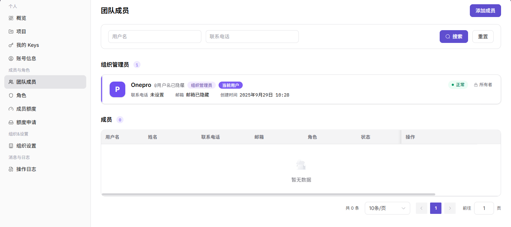
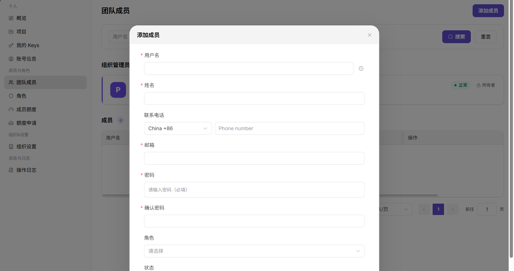

# 团队成员

::: info 文档信息
版本：v1.0
更新日期：2026-07-13
:::

## 功能概述

团队成员页用于查看组织管理员和成员列表，支持按用户名、联系电话筛选成员，并通过添加成员表单新增组织成员。

| 项目 | 内容 |
| --- | --- |
| 适用角色 | 服务商管理员 |
| 导航路径 | 成员与角色 > 团队成员 |
| 页面路由 | /user/members-roles/team-members |
| 管理对象 | 组织管理员、成员、角色和联系方式 |
| 典型用途 | 查看成员列表、添加成员、管理成员状态 |

### 新手理解

团队成员页像组织通讯录和权限入口，用来查看成员是否已加入、能否登录、当前状态和角色归属。成员无法访问平台时，先从成员状态和角色绑定排查。

### 术语速查

| 术语 | 含义 | 处理建议 |
| --- | --- | --- |
| 团队成员 | 组织中可登录或协作的账号。 | 先确认状态和归属。 |
| 成员状态 | 成员是否启用、禁用或待处理。 | 无法登录时优先核对。 |
| 角色绑定 | 成员拥有的权限集合。 | 看不到菜单时检查。 |
| 重置密码 | 为成员恢复登录的管理入口。 | 操作前确认身份。 |

## 前提条件

1. 当前账号具备成员查看权限。
2. 添加成员前已确认成员身份、联系方式、邮箱、角色和初始状态。
3. 不在截图或文档中保留完整联系电话、邮箱或密码。

## 页面说明

| 区域 | 说明 |
| --- | --- |
| 顶部按钮 | `添加成员` |
| 筛选项 | 用户名、联系电话 |
| 表格列 | 用户名、姓名、联系电话、邮箱、角色、状态、创建时间、操作 |
| 表单字段 | 用户名、姓名、联系电话、邮箱、密码、确认密码、角色、状态 |
| 高风险操作 | 添加成员并启用账号 |

## 主要操作

### 管理团队成员

1. 进入 `成员与角色 > 团队成员`。
2. 使用用户名或联系电话筛选成员。
3. 查看组织管理员信息和成员列表。

下图展示团队成员页面，账号和联系方式已隐藏。

4. 单击 `添加成员` 打开表单。
5. 填写用户名、姓名、联系电话、邮箱、密码、确认密码。
6. 选择角色和状态。
7. 确认成员身份和权限后再单击 `确定`。

下图展示添加成员表单。

## 参数说明

| 字段名称 | 是否必填 | 字段类型 | 示例 | 说明 |
| --- | --- | --- | --- | --- |
| 成员名称 | 否 | 文本 | 示例成员 A | 用于识别成员。 |
| 邮箱 | 否 | 文本 | member@example.com | 成员联系和登录信息。 |
| 角色 | 否 | 枚举 | 管理员 | 决定成员可见菜单和操作范围。 |
| 状态 | 否 | 枚举 | 启用 | 判断成员是否可登录。 |
| 操作 | 否 | 按钮 | 重置密码 | 进入成员管理动作。 |

## 踩坑提示

- 成员无法登录不一定是密码问题，也可能是状态禁用或角色缺失。
- 删除或禁用成员前，先确认是否仍持有项目、Key 或审批任务。
- 成员信息外发前要脱敏邮箱、手机号和账号 ID。

## 结果校验

| 检查项 | 成功表现 | 异常时处理 |
| --- | --- | --- |
| 成员已添加 | 添加成功后，成员出现在列表中 | 检查邮箱、组织范围和邀请状态 |
| 状态正确 | 成员状态与表单选择一致 | 打开成员详情核对启停状态 |
| 角色正确 | 成员角色显示正确 | 到角色页确认角色是否仍有效 |

## 常见问题

### 成员无法登录

**问题现象：**

成员收到账号后无法进入平台。

**可能原因：**

- 成员状态为禁用。
- 初始密码或账号信息错误。
- 角色权限不足。

**处理方式：**

1. 在团队成员页检查成员状态。
2. 核对角色配置。
3. 按组织账号流程重置或重新发放登录信息。

### 团队成员列表为什么没有目标成员？

**问题现象：**

团队成员页没有目标成员，或邀请后的成员未出现在列表中。

**可能原因：**

成员加入的是其他组织，邀请仍未接受，成员已被停用，或当前账号无权查看全部成员。

**处理方式：**

确认组织范围和成员邮箱；检查邀请状态、成员状态和角色权限；必要时由组织管理员重新邀请或恢复成员。
### 为什么成员邀请或编辑按钮不可用？

**问题现象：**

团队成员页能看到成员，但添加、停用、修改角色等按钮不可点击。

**可能原因：**

当前账号不是成员管理员，目标成员是组织所有者，或成员状态不允许执行该操作。

**处理方式：**

确认成员管理权限和目标成员角色；涉及所有者或管理员变更时按组织流程由更高权限账号处理。
## 后续操作

1. 在角色页确认成员角色权限。
2. 在成员额度页设置成员可用额度。
3. 在操作日志中查看添加成员记录。

## 注意事项

- 添加成员会产生组织访问权限，执行前必须确认成员身份。
- 不要将成员密码写入文档、截图或沟通记录。
