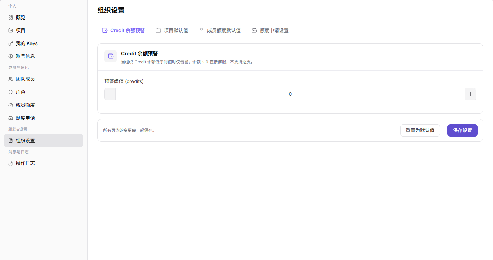
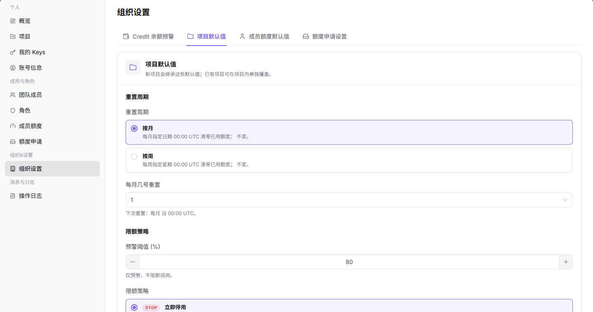
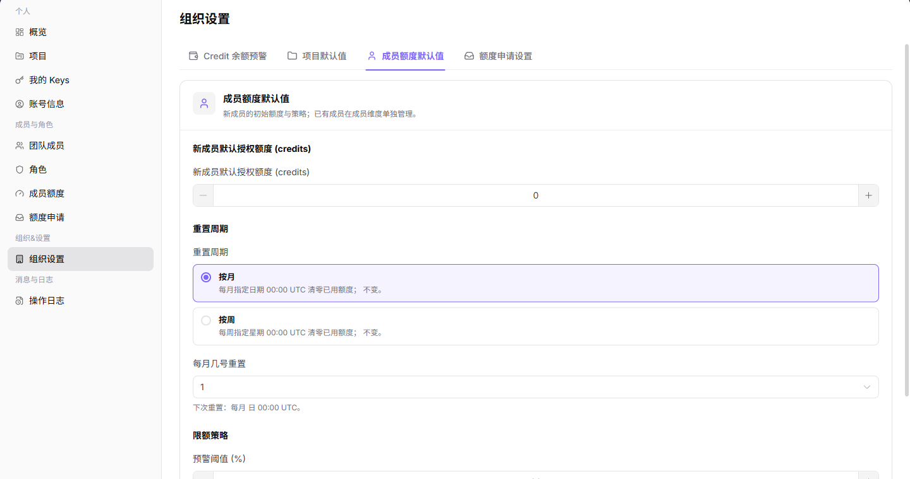
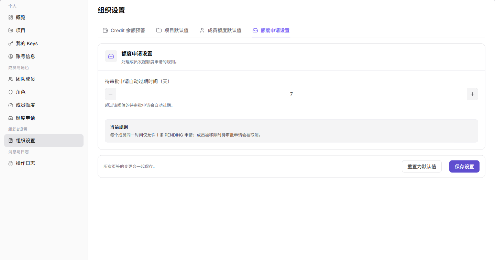

# 租户设置

::: info 文档信息
版本：v1.0
更新日期：2026-07-13
:::

## 功能概述

租户设置页用于维护服务商租户的全局默认规则，包括 Credit 余额预警、项目默认值、成员额度默认值和额度申请设置。

| 项目 | 内容 |
| --- | --- |
| 适用角色 | 服务商管理员 |
| 导航路径 | 设置 > 租户&设置 > 组织设置 |
| 页面路由 | `/user/user-space/settings` |
| 管理对象 | Credit 余额预警、项目默认值、成员额度策略和组织级默认规则 |
| 典型途径 | 维护组织默认规则和额度预警配置 |

#### 新手理解

租户设置页像租户默认规则面板，用来设置新项目、新成员或额度申请的默认策略。改动后通常影响后续创建对象，已有对象仍需在各自页面单独核对。

#### 术语速查

| 术语 | 含义 | 处理建议 |
| --- | --- | --- |
| 租户设置 | 租户级默认配置入口。 | 改动前确认适用范围。 |
| 默认规则 | 新对象创建时继承的规则。 | 不一定影响已有对象。 |
| 组织上下文 | 当前设置所属组织。 | 跨组织前先确认。 |
| 成员默认策略 | 新成员加入后的初始规则。 | 变更后验证新成员。 |

## 前提条件

1. 当前账号具备租户设置查看和维护权限。
2. 保存设置前已确认对项目、成员额度和额度申请流程的影响。
3. 重置默认值前已确认当前配置可以被覆盖。

## 页面说明

| 页签 | 说明 |
| --- | --- |
| Credit 余额预警 | 配置组织余额低于阈值时的告警规则 |
| 项目默认值 | 配置新项目默认重置周期、预警阈值和限额策略 |
| 成员额度默认值 | 配置新成员初始额度、重置周期和限额策略 |
| 额度申请设置 | 配置待审批申请自动过期时间和申请规则 |
| 底部按钮 | 重置为默认值、保存设置 |

## 主要操作

### 管理租户设置

1. 进入 `租户&设置 > 租户设置`。
2. 在 `Credit 余额预警` 页签设置预警阈值。

下图展示租户设置的余额预警页签。

3. 切换到 `项目默认值`，设置新项目的重置周期、预警阈值和限额策略。

下图展示项目默认值页签。

4. 切换到 `成员额度默认值`，设置新成员默认授权额度、重置周期和限额策略。

下图展示成员额度默认值页签。

5. 切换到 `额度申请设置`，设置待审批申请自动过期时间。

下图展示额度申请设置页签。

6. 确认所有页签配置后，再单击 `保存设置`。

## 参数说明

| 字段名称 | 是否必填 | 字段类型 | 示例 | 说明 |
| --- | --- | --- | --- | --- |
| 组织名称 | 否 | 文本 | 示例组织 A | 当前配置所属组织。 |
| 默认项目规则 | 否 | 配置 | 启用 | 影响后续创建项目。 |
| 成员默认策略 | 否 | 配置 | 普通成员 | 影响后续新增成员。 |
| 额度规则 | 否 | 配置 | 默认额度 | 影响额度申请或分配。 |
| 保存 | 否 | 按钮 | 保存 | 提交租户设置变更。 |

## 踩坑提示

- 租户设置变更通常影响后续对象，不要默认已有项目和成员会同步变化。
- 保存前确认当前组织上下文，避免改到其他组织。
- 默认额度或成员策略变更后，应创建测试对象验证效果。

## 结果校验

| 检查项 | 成功表现 | 异常时处理 |
| --- | --- | --- |
| 配置已保存 | 保存后页面配置保持为新值 | 重新进入页面确认是否有保存失败提示 |
| 默认规则生效 | 新项目或新成员创建时继承组织默认规则 | 检查组织范围和创建时选择的默认配置 |
| 申请流转正确 | 额度申请按设置的过期时间流转 | 到额度申请页面核对申请状态和时间 |

## 常见问题

#### 保存设置后已有项目未变化

**问题现象：**

租户设置保存后，已有项目或成员仍显示旧配置。

**可能原因：**

- 租户设置主要作为默认值影响后续新建对象。
- 已有项目或成员在详情页有独立配置。

**处理方式：**

1. 进入项目详情或成员额度页单独调整。
2. 新建对象时确认是否继承了最新默认值。

#### 租户设置为什么没有加载配置？

**问题现象：**

租户设置页没有默认额度、申请过期时间或项目默认规则。

**可能原因：**

当前账号不是组织管理员，组织未初始化默认设置，或页面仍展示其他组织的数据。

**处理方式：**

先确认当前租户；再检查租户设置权限；如配置确实为空，由租户管理员按默认规则补齐后保存。
#### 为什么租户设置保存按钮不可用？

**问题现象：**

租户设置项可见，但保存、重置或修改默认规则的按钮不可点击。

**可能原因：**

当前账号不是组织管理员，组织策略由上级平台托管，或配置项正在审批中。

**处理方式：**

确认组织管理员权限和配置来源；托管配置由平台管理员调整，审批中的配置等待流程结束后再修改。
## 后续操作

1. 创建新项目验证项目默认值。
2. 添加新成员验证成员额度默认值。
3. 在额度申请页查看申请规则是否符合预期。

## 注意事项

- 保存设置会影响后续组织管理流程，执行前应确认配置含义。
- `重置为默认值` 会覆盖当前页面配置，执行前应确认是否需要保留原值。
