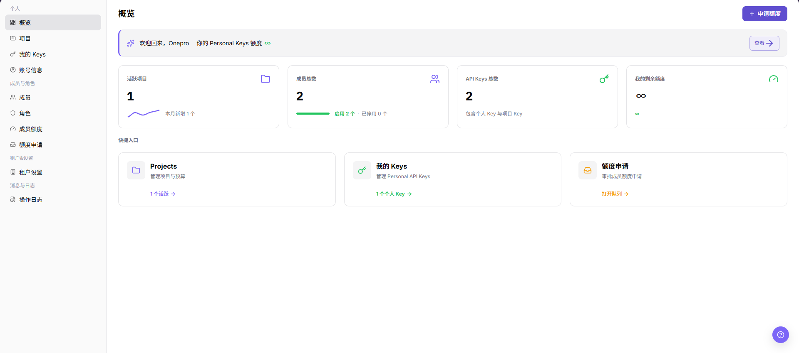
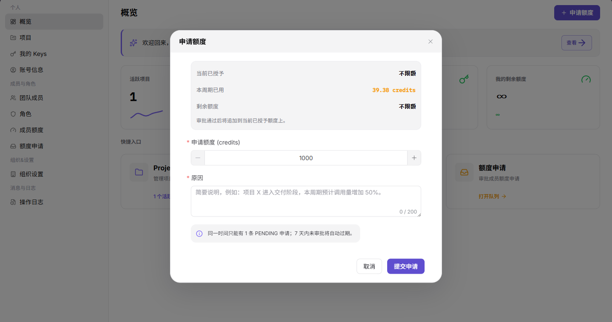

# 概览

::: info 文档信息
版本：v1.0
更新日期：2026-07-13
:::

## 功能概述

概览页展示个人空间摘要，包括 Personal Keys 额度、活跃项目数、成员总数、API Keys 总数、剩余额度和常用快捷入口。

| 项目 | 内容 |
| --- | --- |
| 适用角色 | 服务商账号 |
| 导航路径 | 设置 > 个人 > 概览 |
| 页面路由 | `/user/user-space/workspace/overview` |
| 管理对象 | Personal Keys 额度、活跃项目数、成员总数、API 调用量和操作入口 |
| 典型途径 | 查看个人空间摘要和常用入口 |

#### 新手理解

概览页像设置模块的仪表盘，用来先判断当前服务商账号有没有可用额度、项目和 Key，再从快捷入口进入项目、我的 Keys 或额度申请页面。

#### 术语速查

| 术语 | 含义 | 处理建议 |
| --- | --- | --- |
| 服务商账号 | 当前登录并查看设置概览的账号。 | 先确认是否处于正确组织。 |
| 可用额度 | 当前账号或组织可继续使用的额度。 | 额度不足时进入额度申请。 |
| 快捷入口 | 跳转到项目、Key 或额度申请的入口。 | 按问题类型选择下一步。 |
| 项目数量 | 当前账号可见的项目统计。 | 异常时进入项目页核对。 |

## 前提条件

1. 当前账号已进入服务商侧设置模块。
2. 页面语言为中文。
3. 需要申请额度时，已准备申请额度数值和原因说明。

## 页面说明

| 区域 | 说明 |
| --- | --- |
| 顶部按钮 | `申请额度` |
| 摘要卡片 | 活跃项目、成员总数、API Keys 总数、我的剩余额度 |
| 快捷入口 | Projects、我的 Keys、额度申请 |
| 弹窗入口 | 申请额度弹窗 |

## 主要操作

### 查看个人概览

1. 进入 `设置 > 个人 > 概览`。
2. 查看 Personal Keys 额度、活跃项目、成员总数、API Keys 总数和剩余额度。

下图展示概览页，左侧为设置菜单，右侧为额度与快捷入口区域。

3. 如需增加额度，单击 `申请额度`。
4. 在弹窗中填写申请额度和原因。
5. 确认信息无误后再提交申请。

下图展示申请额度弹窗，包含申请额度和原因字段。

## 参数说明

| 字段名称 | 是否必填 | 字段类型 | 示例 | 说明 |
| --- | --- | --- | --- | --- |
| 可用额度 | 否 | 数值 | 10,000 Credits | 展示当前可使用额度。 |
| 项目 | 否 | 统计 | 3 个 | 展示当前可见项目数量。 |
| 我的 Keys | 否 | 入口 | 我的 Keys | 跳转到 Key 管理页面。 |
| 最近活动 | 否 | 列表 | 最近 7 天 | 展示近期项目、Key 或额度相关变化。 |
| 额度申请 | 否 | 入口 | 申请额度 | 进入额度申请页面。 |

## 踩坑提示

- 概览页只做入口判断，不替代项目、Key 或额度申请详情。
- 额度看起来充足但调用失败时，还要检查 Key、项目预算和成员权限。
- 快捷入口不可用时，先确认当前账号是否具备对应菜单权限。

## 结果校验

| 检查项 | 成功表现 | 异常时处理 |
| --- | --- | --- |
| 申请可查 | 申请提交后，可到 `额度申请` 页面查看记录 | 检查提交提示和申请筛选条件 |
| 额度更新 | 额度通过后，概览页的剩余额度或授权额度随规则更新 | 对比额度申请记录和成员额度页面 |
| 入口可跳转 | 快捷入口可正常跳转到对应页面 | 检查菜单权限和目标页面是否可访问 |

## 常见问题

#### 申请额度按钮不可用

**问题现象：**

无法发起额度申请。

**可能原因：**

- 当前账号没有额度申请权限。
- 已存在待审批额度申请。
- 组织关闭了额度申请入口。

**处理方式：**

1. 先到额度申请页面查看是否已有待审批记录。
2. 联系组织管理员确认额度申请规则。
3. 补充申请原因后重新提交。

#### 概览页为什么没有额度或快捷入口数据？

**问题现象：**

个人概览页没有显示额度、申请入口、项目或 Key 相关数据。

**可能原因：**

当前账号未加入项目，成员额度尚未分配，或组织未开放用户侧快捷入口。

**处理方式：**

先检查成员和成员额度配置；确认是否已加入项目；仍为空时让租户管理员补充分配额度或项目权限。
#### 为什么概览快捷操作不可用？

**问题现象：**

概览页显示快捷入口，但申请额度、创建 Key 或进入项目的按钮不可点击。

**可能原因：**

当前成员没有对应功能权限，组织关闭了自助申请，或快捷入口依赖的项目、Key 尚未初始化。

**处理方式：**

按入口类型分别检查成员额度、项目权限和 Key 管理权限；缺少权限时联系组织管理员补充授权。
## 后续操作

1. 进入 `我的 Keys` 查看 Key 使用情况。
2. 进入 `项目` 管理项目预算。
3. 进入 `额度申请` 查看申请状态。

## 注意事项

- 额度申请会进入审批流程，不要重复提交相同原因的申请。
- 申请原因中不要填写密码、Key、token 或客户敏感信息。
