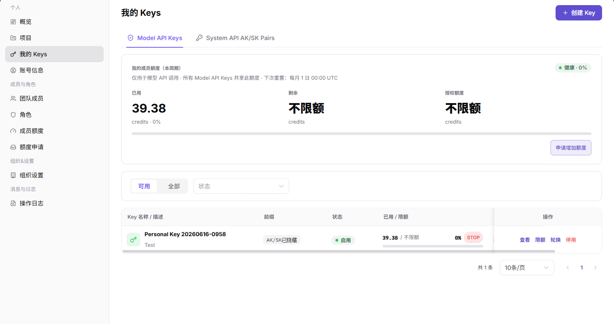
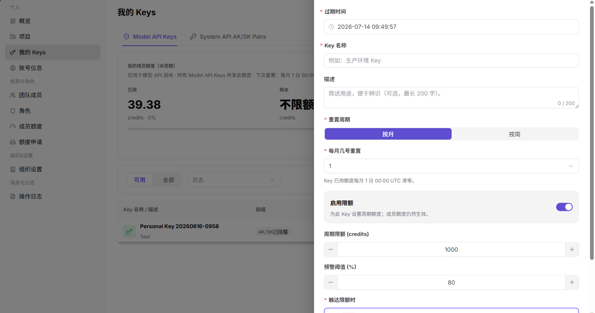
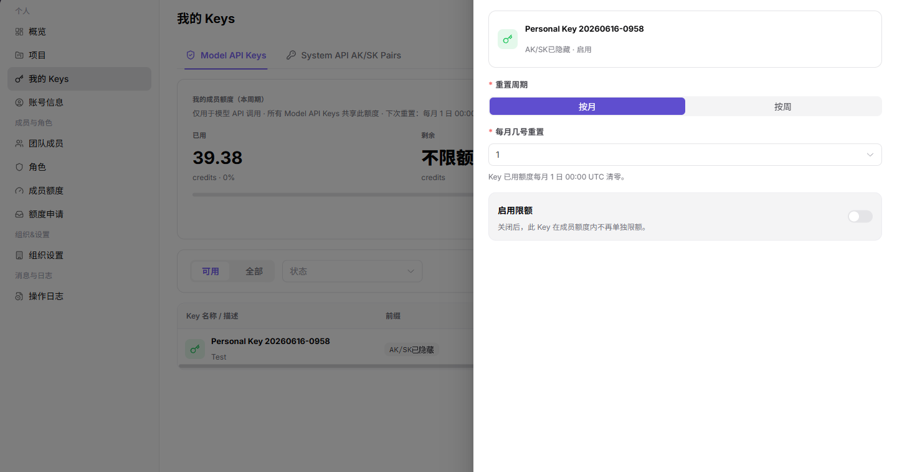

# 我的 Keys

::: info 文档信息
版本：v1.0
更新日期：2026-07-13
:::

## 功能概述

我的 Keys 页面用于管理个人 Model API Keys 和 System API AK/SK Pairs，支持创建 Key、查看 Key 信息、设置 Key 限额、轮换和停用。

| 项目 | 内容 |
| --- | --- |
| 适用角色 | 服务商账号 |
| 导航路径 | 设置 > 个人 > 我的 Keys |
| 页面路由 | `/user/user-space/my-keys` |
| 管理对象 | Model API Keys、System API AK/SK、额度和状态 |
| 典型途径 | 创建、查看、禁用 Key，核对额度和调用凭证状态 |

#### 新手理解

我的 Keys 像个人调用凭证柜，用来分别管理模型 API Key 和系统 API AK/SK。每个 Key 都应有明确用途、有效期和额度限制，避免一个 Key 混用所有场景。

#### 术语速查

| 术语 | 含义 | 处理建议 |
| --- | --- | --- |
| Model API Key | 用于模型 API 调用的访问凭证。 | 按应用或项目拆分使用。 |
| System API AK/SK | 用于系统接口调用的一组访问凭证。 | 不要在前端或文档中暴露。 |
| 过期时间 | Key 到期后无法继续使用的时间。 | 轮换前通知调用方。 |
| 额度限制 | Key 可使用的额度上限。 | 调用失败时核对额度。 |

## 前提条件

1. 当前账号具备 Key 管理权限。
2. 创建 Key 前已明确用途、过期时间和限额策略。
3. 查看、复制、轮换或停用 Key 前已确认业务依赖。

## 页面说明

| 区域 | 说明 |
| --- | --- |
| 顶部按钮 | `创建 Key` |
| 页签 | Model API Keys、System API AK/SK Pairs |
| 摘要区 | 本周期成员额度、已用、剩余、授权额度 |
| 表格列 | Key 名称 / 描述、前缀、状态、已用 / 限额、创建、操作 |
| 行内按钮 | 查看、限额、轮换、停用 |

## 主要操作

### 管理我的 Keys

1. 进入 `设置 > 个人 > 我的 Keys`。
2. 在页签中选择 `Model API Keys` 或 `System API AK/SK Pairs`。
3. 查看 Key 名称、前缀、状态、已用 / 限额和创建时间。

下图展示我的 Keys 列表。

4. 单击 `创建 Key` 打开创建表单。
5. 选择过期时间，填写 Key 名称和描述。
6. 按需启用限额并设置重置周期、周期限额、预警阈值和触限策略。
7. 确认用途和权限范围后再创建。

下图展示创建 Model API Key 表单。

8. 在 Key 行内单击 `限额`，查看或调整 Key 的限额规则。
9. 确认不会影响线上调用后再保存限额。

下图展示 Key 限额弹窗。

## 参数说明

| 字段名称 | 是否必填 | 字段类型 | 示例 | 说明 |
| --- | --- | --- | --- | --- |
| Key 名称 | 必填 | 文本 | 示例 Key A | 用于区分不同调用用途。 |
| Key 类型 | 必填 | 枚举 | Model API Key | 区分模型调用或系统接口调用。 |
| 过期时间 | 否 | 时间 | 2026-12-31 | 控制 Key 可用周期。 |
| 额度限制 | 否 | 额度 | 1,000 Credits | 限制 Key 可消耗额度。 |
| 状态 | 否 | 枚举 | 启用 | 判断 Key 是否可继续使用。 |

## 踩坑提示

- 不要把同一个 Key 同时用于测试、生产和多人共享场景。
- 创建或轮换 Key 前，先确认调用方已经准备替换配置。
- Key 只展示一次或局部展示时，不要依赖截图保存完整凭证。

## 结果校验

| 检查项 | 成功表现 | 异常时处理 |
| --- | --- | --- |
| Key 已生成 | 新 Key 出现在当前页签列表中 | 刷新列表并确认当前页签是否正确 |
| 状态正确 | Key 状态为启用时才可用于调用 | 检查 Key 状态、有效期和项目授权 |
| 限额更新 | 限额保存后，列表中的已用 / 限额信息更新 | 重新打开限额弹窗并核对保存结果 |

## 常见问题

#### Key 调用失败

**问题现象：**

接口调用返回认证失败或额度不足。

**可能原因：**

- Key 已停用、过期或被轮换。
- Key 达到周期限额。
- 成员额度或项目额度已不足。

**处理方式：**

1. 检查 Key 状态和过期时间。
2. 查看 Key 限额和成员额度。
3. 如需轮换 Key，先通知依赖该 Key 的业务方。

#### 我的 Keys 为什么没有目标 Key？

**问题现象：**

我的 Keys 页面没有显示刚创建或正在使用的 Key。

**可能原因：**

当前页签只展示个人 Key 或项目 Key 的一类，Key 已被停用、删除，或创建在其他项目下。

**处理方式：**

切换个人 Key、项目 Key 页签并清空筛选；核对 Key 归属项目和状态；仍缺失时查看操作日志确认是否被删除。
#### 为什么 Key 创建或停用按钮不可用？

**问题现象：**

我的 Keys 页面能看到列表，但创建、停用、设置限额等按钮不可点击。

**可能原因：**

组织关闭了个人 Key 自助创建，当前 Key 已停用或过期，或项目 Key 需要项目管理员维护。

**处理方式：**

确认 Key 类型和组织安全策略；个人 Key 受限时联系管理员授权，项目 Key 由项目管理员处理。
## 后续操作

1. 定期停用不再使用的 Key。
2. 对生产、测试和临时用途分别创建不同 Key。
3. 在操作日志中核对轮换、停用等高风险操作。

## 注意事项

- 不要在文档、截图或聊天中暴露完整 Key、AK/SK、token 或私钥。
- `轮换`、`停用` 会影响现有调用，执行前必须确认业务影响。
