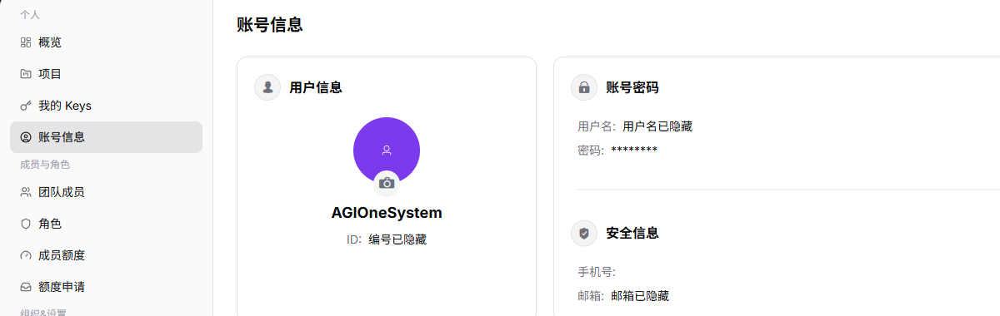

# 账号信息

::: info 文档信息
版本：v1.0
更新日期：2026-07-13
:::

## 功能概述

账号信息页用于查看当前账号的基础信息、账号密码状态和安全信息。

| 项目 | 内容 |
| --- | --- |
| 适用角色 | 服务商账号 |
| 导航路径 | 设置 > 个人 > 账号信息 |
| 页面路由 | `/user/user-space/profile` |
| 管理对象 | 账号基础信息、密码状态、安全信息、手机号和邮箱 |
| 典型途径 | 查看账号资料和安全状态 |

#### 新手理解

账号信息页像当前登录身份卡片，用来确认自己是谁、属于哪个账号上下文，以及安全联系方式是否正确。进入关键操作页前，可以先在这里核对身份。

#### 术语速查

| 术语 | 含义 | 处理建议 |
| --- | --- | --- |
| 用户信息 | 当前账号的基础展示信息。 | 截图前先脱敏。 |
| 用户名 | 登录或识别账号的名称。 | 排查身份问题时核对。 |
| 安全信息 | 手机号、邮箱等安全联系方式。 | 为空时联系管理员补充。 |
| 账号上下文 | 当前账号所处组织或身份范围。 | 跨组织操作前先确认。 |

## 前提条件

1. 当前账号已登录设置模块。
2. 查看账号信息时避免截取或传播完整账号、邮箱、密码、ID 等敏感信息。

## 页面说明

| 区域 | 说明 |
| --- | --- |
| 用户信息 | 显示用户头像、昵称或系统标识 |
| 账号密码 | 显示用户名和密码状态 |
| 安全信息 | 显示手机号、邮箱等安全联系方式 |
| 顶部按钮 | 当前页面未显示新增或保存按钮 |

## 主要操作

### 查看账号信息

1. 进入 `个人 > 账号信息`。
2. 查看用户信息、账号密码和安全信息。
3. 如信息异常，联系组织管理员或按平台账号流程处理。

下图展示账号信息页的结构，敏感账号信息已隐藏。

## 参数说明

| 字段名称 | 是否必填 | 字段类型 | 示例 | 说明 |
| --- | --- | --- | --- | --- |
| 用户信息 | 否 | 文本 | 示例用户 | 当前账号的基础展示信息。 |
| 用户名 | 否 | 文本 | user_example | 登录或识别账号的名称。 |
| 密码 | 否 | 状态 | 已设置 | 页面不展示明文密码。 |
| 手机号 | 否 | 文本 | 138****0000 | 绑定的安全手机号。 |
| 邮箱 | 否 | 文本 | user@example.com | 绑定的安全邮箱。 |

## 踩坑提示

- 账号信息页只确认当前登录身份，不用于批量管理其他成员。
- 手机号或邮箱为空时，不要直接判断账号异常，先确认组织是否统一维护。
- 截图中不要保留完整账号、邮箱、手机号、ID 或密码状态细节。

## 结果校验

| 检查项 | 成功表现 | 异常时处理 |
| --- | --- | --- |
| 页面正确 | 页面标题为 `账号信息` | 返回个人设置入口重新进入 |
| 信息完整 | 用户信息、账号密码、安全信息三个区域正常显示 | 检查账号权限和页面加载状态 |
| 密码安全 | 页面不展示明文密码 | 如发现敏感信息外露，停止截图并联系管理员核查 |

## 常见问题

#### 安全信息为空

**问题现象：**

手机号或邮箱未显示。

**可能原因：**

- 当前账号尚未绑定安全信息。
- 账号信息由组织统一维护。

**处理方式：**

1. 按组织账号管理流程补充安全信息。
2. 联系管理员确认是否允许自行修改。

#### 账号信息为什么没有显示完整资料？

**问题现象：**

账号信息页缺少手机号、邮箱、安全信息或登录方式。

**可能原因：**

账号资料未完善，部分字段由身份源统一管理，或当前账号无权查看敏感安全信息。

**处理方式：**

先确认字段是否由企业身份源维护；可编辑字段按组织流程补齐；敏感字段缺失时联系管理员核查账号同步状态。
#### 为什么账号信息不能编辑？

**问题现象：**

账号信息可见，但头像、邮箱、手机号或安全信息无法修改。

**可能原因：**

账号资料由企业身份源统一同步，敏感字段不允许自助修改，或修改需要二次验证。

**处理方式：**

优先到企业身份源修改基础资料；安全字段按账号管理流程申请变更，修改后重新登录确认同步结果。
## 后续操作

1. 回到概览页继续查看额度和快捷入口。
2. 进入我的 Keys 页面管理调用凭证。

## 注意事项

- 不要在截图或文档中保留完整账号、邮箱、手机号、ID 或密码信息。
