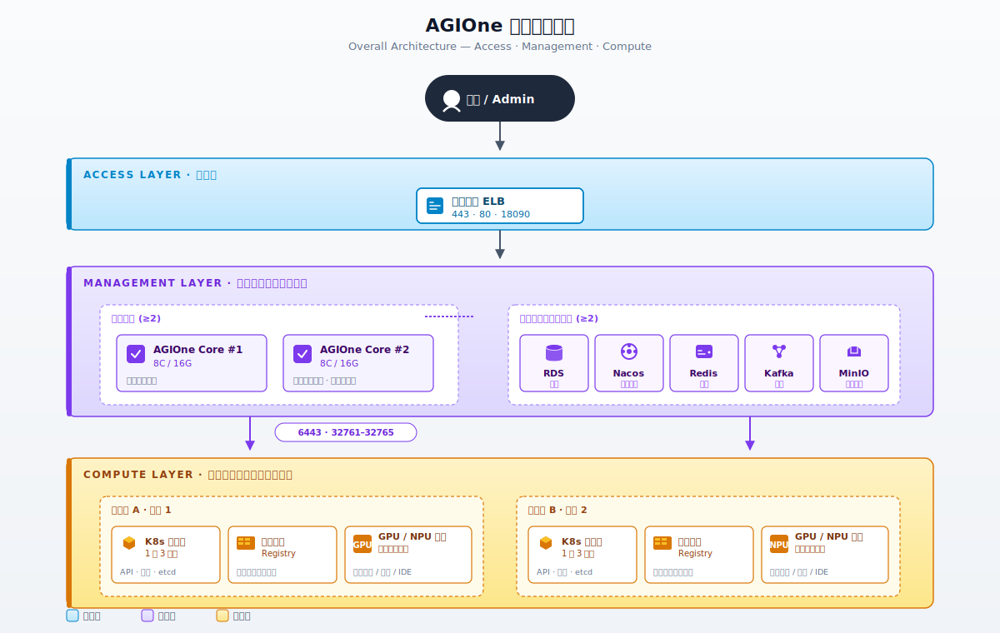
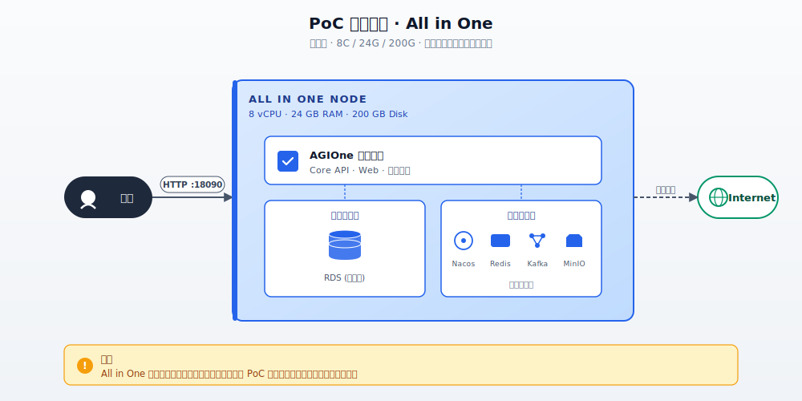
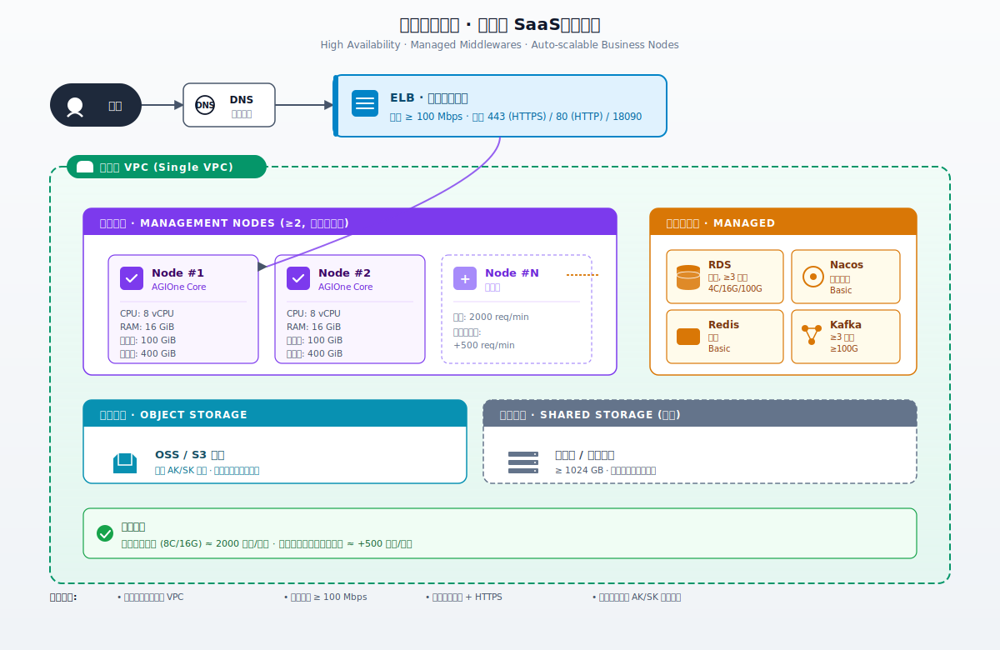
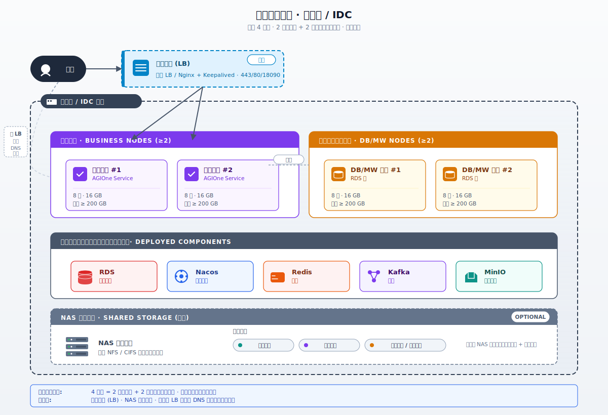
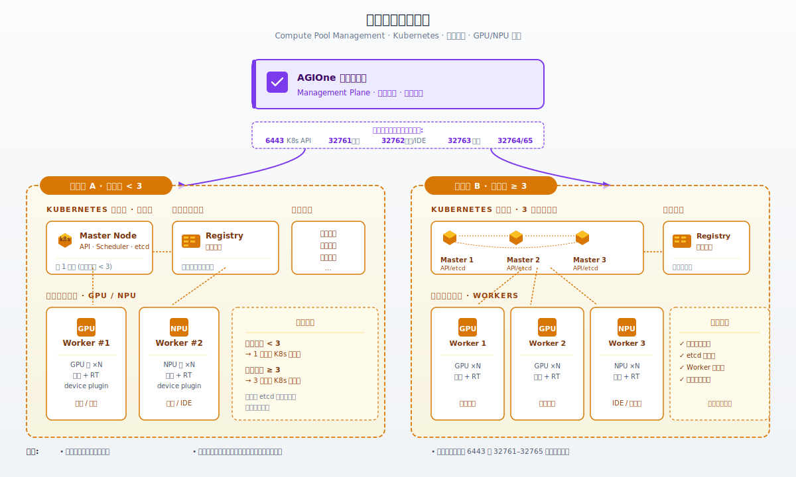
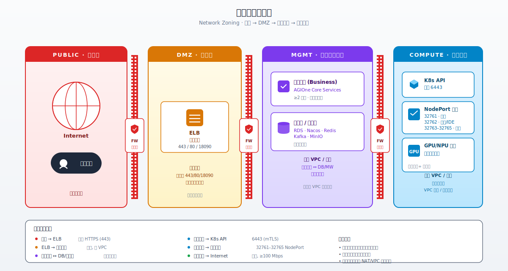

# 部署综述

## 1. 概述

AGIOne 平台部署在逻辑上分为两个相对独立的部分：

- **平台管理**：承载 AGIOne 控制面、业务服务、数据库与中间件，是用户与平台的入口。
- **算力节点纳管**：负责将 GPU / NPU 等加速卡节点纳入统一调度，承载训练、推理、IDE 等算力负载。

两个部分通过内部网络互通，平台管理侧通过 Kubernetes API 与监控接口对算力集群进行管理与可观测性采集。

## 2. 整体架构

下图展示了 AGIOne 平台的整体逻辑架构，包括用户访问入口、平台管理层与算力节点纳管层之间的关系。



**架构要点：**

- 接入层通过 ELB 对外暴露平台管理服务，生产环境推荐配置域名 + HTTPS（443）。
- 平台管理层至少由 2 个业务节点 + 2 个数据库中间件节点组成，业务节点可水平扩展。
- 算力集群以"地域算力池"为单位独立部署，每个地域近端部署镜像服务以提升镜像拉取速度。
- 平台管理层通过 Kubernetes API（6443）与扩展端口（32761–32765）调度并访问算力集群。

---

## 3. 部署模式选择

<div class="table-scroll" style="overflow-x:auto;">

| 部署模式 | 适用场景 | 节点数 | 高可用 | 推荐环境 |
|---|---|---|---|---|
| PoC 部署（All in One） | 概念验证、功能演示、内部测试 | 1 | 否 | 单台虚拟机 |
| 生产部署 — 公有云 SaaS | 正式生产、对外提供服务 | 多节点 | 是 | 公有云（**推荐**） |
| 生产部署 — 私有云 / IDC | 数据合规、内网隔离 | ≥4 | 是 | 用户自有私有云或 IDC |

</div>

> **选型建议**：若无强制的数据合规或内网隔离要求，**优先选择公有云 SaaS 部署**，可获得更稳定的中间件托管能力与运维便利性。

---

## 4. 平台管理 — PoC 部署（All in One）

### 4.1 资源要求

| 项 | 最低要求 |
|---|---|
| 节点数 | 1 |
| CPU | ≥ 8 核 |
| 内存 | ≥ 24 GB |
| 磁盘 | ≥ 200 GB |
| 网络 | 可连接互联网 |
| 操作系统 | Linux（推荐 Ubuntu 22.04 / CentOS 7+） |

### 4.2 架构示意



| 项目   | 说明                                                                                                                                                                                                                             |
| ---- | ------------------------------------------------------------------------------------------------------------------------------------------------------------------------------------------------------------------------------ |
| 适用范围 | AGIOne 全栈部署方案设计、售前支持、PoC 评估、生产交付                                                                                                                                                                                               |
| 约束级别 | 本文档为规划参考，正式交付应以 `agione-release-v1.0-20260514.tar.gz` 配套的 Release Note 与兼容矩阵为准                                                                                                                                                  |

- 业务服务、数据库、中间件全部部署在同一节点上。
- 默认通过 HTTP 端口 `18090` 对外提供服务。
- 由于需要拉取镜像与依赖，部署节点必须能访问互联网。
- **不建议**用于生产，无高可用、无数据冗余。

---

## 5. 平台管理 — 生产部署（公有云 SaaS）

公有云 SaaS 部署为推荐的生产部署模式，充分利用云厂商提供的托管能力（RDS、ELB、对象存储等）。

### 5.1 资源要求

#### 5.1.1 管理节点（业务节点）

| 项   | 要求                   |
|-----|----------------------|
| 节点数 | **≥ 2**              |
| CPU | ≥ 8 vCPU             |
| 内存  | ≥ 16 GiB             |
| 磁盘  | ≥ 200 GiB            |
| 内网  | 所有管理节点位于同一 VPC       |
| 公网  | 可访问互联网，带宽 ≥ 100 Mbps |

> **可选**：可挂载共享存储（块存储等）≥ 1024 GB 供管理节点共享使用。

#### 5.1.2 数据库与中间件

<div class="table-scroll" style="overflow-x:auto;">

| 组件 | 用途 | CPU | 内存 | 磁盘 | 节点数 | 网络要求 |
|---|---|---|---|---|---|---|
| **RDS（关系型数据库）** | 存储 AGIOne 平台主数据 | ≥ 4 vCPU | ≥ 16 GiB | ≥ 100 GiB | ≥ 3 | 与管理节点同 VPC |
| **Nacos** | 服务注册与发现 | Basic 规格 | — | — | 1 | 与管理节点同 VPC |
| **Redis（缓存）** | 缓存数据 | Basic 规格 | — | — | 1 | 与管理节点同 VPC |
| **Kafka（消息）** | 核心服务消息总线 | 集群节点规格 | — | ≥ 100 GiB | ≥ 3 | 与管理节点同 VPC |
| **对象存储** | 存储图片等静态资源 | — | — | — | — | 通过 AK/SK 网络访问 |
| **ELB（负载均衡）** | AGIOne API 负载均衡 | — | — | ≥ 100 GiB | 1 | 内网同 VPC；公网可访问，≥ 100 Mbps |

</div>

#### 5.1.3 容量与扩展性

- AGIOne 管理节点可水平扩展。
- 每个节点（8 vCPU / 16 GB RAM）基准容量约 **2000 请求/分钟**。
- 长连接或耗时请求较多时，每新增 1 个节点可增加约 **500 请求/分钟**（实际数值随业务场景而变）。

### 5.2 架构示意



### 5.3 部署说明

- 强烈建议使用云厂商**托管 RDS、Redis、Kafka、对象存储**，降低运维复杂度。
- 业务节点通过 ELB 暴露服务，配置域名后使用 443（HTTPS）与 80（HTTP 跳转）。
- 所有内部组件位于同一 VPC，禁止跨 VPC 暴露内部端口。
- 公网带宽建议 ≥ 100 Mbps，按业务量调整。

---

## 6. 平台管理 — 生产部署（私有云 / IDC）

适用于无法使用公有云、需要数据完全自持的场景。

### 6.1 资源要求

#### 6.1.1 必选资源（节点）

<div class="table-scroll" style="overflow-x:auto;">

| 角色 | 节点数 | CPU | 内存 | 磁盘        | 网络                    | 说明 |
|---|---|---|---|-----------|-----------------------|---|
| 业务节点 | ≥ 2 | ≥ 8 核 | ≥ 16 GB | ≥ 200 GB  | 内网; 可访问外部网络, 带宽>=100G | 部署 AGIOne 业务服务                     |
| 数据库 / 中间件节点 | ≥ 2 | ≥ 8 核 | ≥ 16 GB | ≥ 200 GB | 内网                    | 部署 RDS（主从）、Nacos、Redis、Kafka、MinIO |
| **合计** | **≥ 4** | — | — | —      | -                     | —                   |

</div>

#### 6.1.2 可选资源

<div class="table-scroll" style="overflow-x:auto;">

| 资源 | 必选 / 可选 | 推荐配置 | 用途说明 |
|---|---|---|---|
| **负载均衡 (LB)** | 可选 | 硬件 LB（F5 等）或软件 LB（Nginx / HAProxy + Keepalived） | 统一入口、流量分发、健康检查。**未部署时**可使用 DNS 轮询直连业务节点，但缺少健康检查与故障自动剔除能力。 |
| **NAS 共享存储** | 可选 | 容量 ≥ 1024 GB；通过 NFS / CIFS 挂载到所有节点 | 存放公共日志、服务配置、共享文件 / 临时数据等需要跨节点访问的内容。**未部署时**可使用本地磁盘 + 日志收集（如 Filebeat / Fluent Bit）方案替代。 |

</div>

### 6.2 架构示意



### 6.3 部署说明

- 最少 4 节点起步：2 业务节点 + 2 数据库中间件节点。
- 数据库采用主从模式，建议数据库与中间件分别独立部署，根据业务规模可拆分为更多节点。
- MinIO 提供对象存储能力，替代公有云 OSS。
- **负载均衡（LB）为可选项**：推荐部署以获得统一入口与高可用；未部署时可使用 DNS 轮询直连业务节点。
- **NAS 共享存储为可选项**：用于存放公共日志、服务配置等跨节点共享内容；未部署时使用本地磁盘 + 日志收集方案。

---

## 7. 算力节点纳管

### 7.1 设计原则

- 每个独立的**地域算力池**作为一个逻辑单元独立部署，避免跨地域调度带来的网络抖动。
- 每个地域算力池在算力节点近端部署**镜像服务**，可复用已纳管的节点资源。
- 部署 Kubernetes 集群以及配套调度、监控等插件。

### 7.2 Kubernetes 控制面规模

| 算力池节点总数 | Kubernetes 控制面节点数 | 说明 |
|---|---|---|
| < 3 节点 | **1 节点** | 单点控制面，适用于小规模算力池 |
| ≥ 3 节点 | **3 节点** | 高可用控制面，etcd 集群多副本 |

### 7.3 架构示意



### 7.4 端口对外暴露

每个算力集群通过 NodePort 形式暴露以下端口给平台管理层调用：

| 端口 | 用途 |
|---|---|
| 6443 | Kubernetes API Server |
| 32761 | 监控接口 |
| 32762 | 模型及 IDE 调用端口 |
| 32763 | 拓展备用端口 |
| 32764 | 拓展备用端口 |
| 32765 | 拓展备用端口 |

### 7.5 部署说明

- 算力节点应预先安装并校验 GPU / NPU 驱动、容器运行时（containerd 等）及对应的 device plugin。
- 镜像服务建议与算力节点位于同一二层或低延迟网络中，加速大体积模型镜像的拉取。
- 多地域部署时，建议每个地域独立维护一套近端镜像，避免跨地域拉取镜像。

---

## 8. 网络规划

### 8.1 网络分区



### 8.2 网络要求总览

<div class="table-scroll" style="overflow-x:auto;">

| 网络方向 | 要求 |
|---|---|
| 用户 → ELB | 公网；生产建议 443/HTTPS，由 DNS 解析域名 |
| ELB → 业务节点 | 内网，同 VPC |
| 业务节点 ↔ DB / 中间件 | 内网，同 VPC，低延迟 |
| 业务节点 → 对象存储 | AK/SK 鉴权，可走 VPC 内网 endpoint |
| 业务节点 → 算力集群 | 通过 6443 与 32761–32765 端口 |
| 算力节点 → 近端镜像 | 算力池近端局域网，建议 ≥ 千兆 |
| 管理节点 → Internet | PoC 必须；生产建议保留出站能力用于拉取镜像与升级，带宽 ≥ 100 Mbps |

</div>

### 8.3 VPC / 子网建议

- **平台管理 VPC**：所有管理节点、RDS、Nacos、Redis、Kafka、MinIO 位于同一 VPC，可按业务节点子网、数据节点子网划分。
- **算力 VPC**：每个地域算力池独立 VPC 或子网，与平台管理 VPC 通过 VPC 对等连接或专线打通。
- **安全组**：默认拒绝，仅放行下文"端口清单"中的端口。

---

## 9. 端口清单

### 9.1 平台管理端口

<div class="table-scroll" style="overflow-x:auto;">

| 端口 | 协议 | 来源 | 用途 |
|---|---|---|---|
| 18090 | TCP / HTTP | 用户 / 内部 | 默认 HTTP 服务端口（PoC 默认使用） |
| 80 | TCP / HTTP | 公网用户 | 生产环境（配置域名后）HTTP，通常 301 跳转至 443 |
| 443 | TCP / HTTPS | 公网用户 | 生产环境（配置域名后）HTTPS |

</div>

### 9.2 算力集群端口

<div class="table-scroll" style="overflow-x:auto;">

| 端口 | 协议 | 来源 | 用途 |
|---|---|---|---|
| 6443 | TCP | 平台管理层 | Kubernetes API Server |
| 32761 | TCP | 平台管理层 | 监控接口 |
| 32762 | TCP | 平台管理层 | 模型及 IDE 调用 |
| 32763 | TCP | 平台管理层 | 拓展备用端口 |
| 32764 | TCP | 平台管理层 | 拓展备用端口 |
| 32765 | TCP | 平台管理层 | 拓展备用端口 |

</div>

### 9.3 内部中间件端口（参考）

数据库与中间件均建议仅在 VPC 内部开放，不对外暴露：

| 组件 | 默认端口（参考） |
|---|---|
| RDS（MySQL 系） | 3306 |
| Nacos | 8848 / 9848 / 9849 |
| Redis | 6379 |
| Kafka | 9092 |
| MinIO | 9000 / 9001 |

> 实际端口以部署时使用的版本与配置为准。

---

## 10. 部署前检查清单

部署前请逐项确认，确保部署顺利：

**基础环境**

- [ ] 已根据场景确定部署模式（PoC / 公有云 SaaS / 私有云 IDC）
- [ ] 节点数量与规格满足资源要求
- [ ] 操作系统、内核版本符合要求
- [ ] 时钟已同步（NTP），各节点时区一致

**网络**

- [ ] 平台管理节点位于同一 VPC
- [ ] 管理节点可访问互联网（或已准备离线镜像）
- [ ] 安全组 / 防火墙规则已开放端口清单中的端口
- [ ] 算力集群与平台管理层网络互通

**域名与证书（生产）**

- [ ] 已申请并解析域名
- [ ] 已准备 HTTPS 证书
- [ ] 已规划 ELB 监听 443 / 80

**算力集群**

- [ ] 已确认每地域算力池节点数量，决定 K8s 控制面规模（1 或 3）
- [ ] GPU / NPU 驱动已安装并通过校验
- [ ] 已规划近端镜像服务节点
- [ ] NodePort 端口 6443、32761–32765 已对平台管理层放行

---

**下载地址：** [https://onepro-agione.oss-ap-southeast-1.aliyuncs.com/modelone/release/agione-release-v1.0-20260514.tar.gz](https://onepro-agione.oss-ap-southeast-1.aliyuncs.com/modelone/release/agione-release-v1.0-20260514.tar.gz)

```bash
# 1. 下载并解压 bundle
ssh root@<target>
mkdir -p /opt/hyperone && \
cd /opt/hyperone && \
curl -fL -O https://onepro-agione.oss-ap-southeast-1.aliyuncs.com/modelone/release/agione-release-v1.0-20260514.tar.gz && \
tar -zxvf agione-release-v1.0-20260514.tar.gz && \
cd /opt/hyperone/agione-release-v1.0-20260514
```

---
## 11. 附录

### 11.1 资源规格速查

<div class="table-scroll" style="overflow-x:auto;">

| 部署模式 | 最少节点 | 单节点最低规格         | 总资源参考 |
|---|---|-----------------|---|
| PoC All in One | 1 | 8C / 24G / 200G | 8C / 24G / 200G |
| 公有云 SaaS（业务节点） | 2 | 8C / 16G / 400G | 16C / 32G / 1 TB+ |
| 私有云 IDC | 4 | 8C / 16G / 200G | 32C / 64G / 800G+ |

</div>

### 11.2 容量评估参考

- 基准：每个业务节点（8C / 16G）≈ **2000 请求/分钟**
- 扩展：每新增 1 个业务节点 ≈ **+500 请求/分钟**（长连接 / 复杂请求场景）
- 实际容量需结合：请求复杂度、模型推理时长、并发会话数等综合评估。

### 11.3 名词解释

| 术语 | 说明 |
|---|---|
| AGIOne | 本平台名称 |
| All in One | 单节点部署所有组件的简化模式 |
| VPC | Virtual Private Cloud，虚拟私有云 |
| ELB | Elastic Load Balancer，弹性负载均衡 |
| RDS | Relational Database Service，关系型数据库服务 |
| AK/SK | Access Key / Secret Key，访问密钥对 |
| NodePort | Kubernetes 暴露服务的端口方式之一 |
| 地域算力池 | 物理上位于同一地理区域、网络互通的一组算力节点 |
